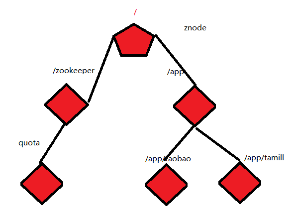

#  上周回顾

```
1. Linux
1.1 虚拟机Vmware
1.2 安装了Centos7
1.3 虚拟机克隆
1.4 快照
1.5 Linux命令
1.6 免密登陆
1.7 安装各种：二进制、rpm、yum、源码安装
1.8 定时器：crontab
1.9 shell脚本
```

# Hadoop第一天回顾

```
1. 介绍了大数据常用的体系和工具
2. Hadoop进行了介绍：common、hdfs、yarn、mapreduce
3. Hadoop生态
4. Hadoop安装：
4.1 Standalone
4.2 伪分布式
4.3 全分布式
```

# Hadoop第二天回顾

```sh
##1. 介绍了组件的基本作用
##2. 读写流程
##3. secondary namenode
##4. 安全模式
##5. shell
hadoop fs -mkdir/-rm/-rmdir/-chmod...
hdfs dfs -mkdir/-rm/...

hdfs dfsadmin -safemode leave/forceExit/enter/get

hadoop jar ...
yarn jar ...
##5. api
##5.1 搭建了环境：maven
##5.2 上传文件：本地文件系统
```

# Hadoop第三天回顾

```sh
1. HDFS API
Configuration config = new Configuration()
config.set(name, value)
config.addResource("core-site.xml")
fs = FileSystem.get(Configuration)
fs.copyFromLocal
fs copytoLocal
fs.mkdirs
fs.remove
...
fs.listFiles
fs.listStatus

HDFSUtils

2. YARN执行流程
ResourceManager : 管理协调集群
NodeManager：
ApplicationMastter ： 
Container
```

# Hadoop第四天回顾

```
1. zookeeper
2. ha
```

# Hadoop第五天回顾

```
1. map : 分开干，各干各的，互不影响
2. reduce ： 将map阶段的结果进行聚合
1 1 2 2 3 4 5
默认设计读取一个文本内容：<Longwritable， Text, Text, IntWritable>
Mapper<KEYIN, VALUEIN, KEYOUT, VALUEOUT>
每读取一行文本调用一次
- map(KEYIN line, VALUEINT content, Context context){
    context.write(KEYOUT,VALUEOUT) : (1, 1), (1, 1), (2, 1), (2, 1), (3, 1),(4, 1), (5, 1)
}

<Text, IntWritable, Text, IntWritable>
Reducer<KEYIN, VALUEIN, KEYOUT, VALUEOUT>
相同的key值，形成一组，会调用一次reduce
- reduce(KEYIN, Iterable<VALUEIN>, Context) {[1, (1,1)], [2, (1,1)], [3, (1)], [4, (1)], [5,(1)]
    context.write(KEYOUT,VALUEOUT)
}

Driver:驱动程序
Job job = Job.getInstance(config)
job.MapperClass
job.REduceClass
job.setMapperOutputKeyClass
job.setMapperOutputValue
job.setOUtputKey
job.setOuputValue

FileInputFormat.setInputPaths(job, xxxx)
FileOuputFormat.setOutputPaths(job, xxxx)

job.setJarClass(Driver)

job.waitForCompetion(true)
```

# Hadoop上周回顾

```
1. 安装
单机模式-->伪分布式-->全分布式-->HA

2. hadoop shell
hadoop fs
hdfs dfs

3. hdfs api

4. secnodary namenode/namenode/hdfs 读写/yarn/mapreduce shuffle

5. mapreduce
```

# 一 Hadoop：第一代分析工具

## 1 什么是大数据？

> 对海量数据进行数据挖掘。
>
> 电商平台推荐系统
>
> 精准广告投放系统

## 2 学习大数据的什么？

> - 存储
>
> HDFS/HBase/Kafka/Clickhouse
>
> - 计算
>
> Mapreduce/Spark/Flink/Storm/Tez
>
> - 辅助工具
>
> Flume/Sqoop/Datax/Canal
>
> - 数据仓库
>
> Hive/Pig/...

# 二 Hadoop快速入门

## 1 什么是Hadoop

### 1.1 hadoop模块——狭义

> - **Hadoop Common**: hadoop底层API模块，它为其他的模块提供了API。
> - **Hadoop Distributed File System (HDFS™)**: 分布式文件系统，可以帮助我们分布式的存储、读取数据集。
> - **Hadoop YARN**: 分布式的资源管理、作业调度的框架
> - **Hadoop MapReduce**: 基于yarn的分布式并行的计算框架

### 1.2 hadoop生态——广义

- hadoop1.0


- hadoop2.0


### 1.3 作用

## 2 Hadoop的安装


### 2.1 单机

#### 2.1.1 安装

```sh
##1. 解压
[root@hadoop software]# tar -zxvf hadoop-2.8.1.tar.gz -C /opt/apps/

##2. 配置环境变量
export JAVA_HOME=/opt/apps/jdk1.8.0_45
export TOMCAT_HOME=/opt/apps/tomcat-7.0.47
export HADOOP_HOME=/opt/apps/hadoop-2.8.1
export CLASS_PATH=.:$JAVA_HOME/lib
export PATH=$PATH:$JAVA_HOME/bin:$TOMCAT_HOME/bin:$HADOOP_HOME/bin:$HADOOP_HOME/sbin

[root@hadoop hadoop-2.8.1]# hadoop version
Hadoop 2.8.1
Subversion https://git-wip-us.apache.org/repos/asf/hadoop.git -r 20fe5304904fc2f5a18053c389e43cd26f7a70fe
Compiled by vinodkv on 2017-06-02T06:14Z
Compiled with protoc 2.5.0
From source with checksum 60125541c2b3e266cbf3becc5bda666
This command was run using /opt/apps/hadoop-2.8.1/share/hadoop/common/hadoop-common-2.8.1.jar

##3. hadoop-env.sh : 这个文件在hadoop启动的时候会自动的加载
[root@hadoop hadoop-2.8.1]# cd etc/hadoop/
[root@hadoop hadoop]# vi hadoop-env.sh
# The java implementation to use.
export JAVA_HOME=/opt/apps/jdk1.8.0_45

##4. /etc/hosts
10.206.0.4 hadoop

##5. /etc/hostname
hadoop
```

#### 2.1.2 测试_wordcount


```sh
## wordcount
/opt/apps/hadoop-2.8.1/bin/hadoop jar /opt/apps/hadoop-2.8.1/share/hadoop/mapreduce/hadoop-mapreduce-examples-2.8.1.jar wordcount /home/date.txt /home/output
```

#### 2.1.3 测试

- 数据

```
8 5 ? 3 9 ? ? ? ?
? ? 2 ? ? ? ? ? ?
? ? 6 ? 1 ? ? ? 2
? ? 4 ? ? 3 ? 5 9
? ? 8 9 ? 1 4 ? ?
3 2 ? 4 ? ? 8 ? ?
9 ? ? ? 8 ? 5 ? ?
? ? ? ? ? ? 2 ? ?
? ? ? ? 4 5 ? 7 8
```

- 测试

```sh
/opt/apps/hadoop-2.8.1/bin/hadoop jar /opt/apps/hadoop-2.8.1/share/hadoop/mapreduce/hadoop-mapreduce-examples-2.8.1.jar sudoku /home/sudo.txt

[root@hadoop home]# /opt/apps/hadoop-2.8.1/bin/hadoop jar /opt/apps/hadoop-2.8.1/share/hadoop/mapreduce/hadoop-mapreduce-examples-2.8.1.jar sudoku /home/sudo.txt
Solving /home/sudo.txt
8 5 1 3 9 2 6 4 7
4 3 2 6 7 8 1 9 5
7 9 6 5 1 4 3 8 2
6 1 4 8 2 3 7 5 9
5 7 8 9 6 1 4 2 3
3 2 9 4 5 7 8 1 6
9 4 7 2 8 6 5 3 1
1 8 5 7 3 9 2 6 4
2 6 3 1 4 5 9 7 8
```

### 2.2 伪分布式

#### 2.2.1 core-site.xml

```xml
[root@hadoop hadoop-2.8.1]# vi etc/hadoop/core-site.xml

<?xml version="1.0" encoding="UTF-8"?>
<?xml-stylesheet type="text/xsl" href="configuration.xsl"?>
<!--
  Licensed under the Apache License, Version 2.0 (the "License");
  you may not use this file except in compliance with the License.
  You may obtain a copy of the License at

    http://www.apache.org/licenses/LICENSE-2.0

  Unless required by applicable law or agreed to in writing, software
  distributed under the License is distributed on an "AS IS" BASIS,
  WITHOUT WARRANTIES OR CONDITIONS OF ANY KIND, either express or implied.
  See the License for the specific language governing permissions and
  limitations under the License. See accompanying LICENSE file.
-->

<!-- Put site-specific property overrides in this file. -->
<configuration>
    <!-- 其实就是hdfs的主节点(namenode)的通信端口 -->
    <property>
        <name>fs.defaultFS</name>
        <value>hdfs://10.206.0.4:9000</value>
    </property>
	
    <!-- 是hadoop中的数据和元数据的保存路径 -->
    <!-- 元数据：管理数据的数据 -->
    <property>
        <name>hadoop.tmp.dir</name>
        <value>/opt/apps/hadoop-2.8.1/hdpdata</value>
    </property>
</configuration>
```

#### 2.2.2 hdfs-site.xml

```xml
<?xml version="1.0" encoding="UTF-8"?>
<?xml-stylesheet type="text/xsl" href="configuration.xsl"?>
<!--
  Licensed under the Apache License, Version 2.0 (the "License");
  you may not use this file except in compliance with the License.
  You may obtain a copy of the License at

    http://www.apache.org/licenses/LICENSE-2.0

  Unless required by applicable law or agreed to in writing, software
  distributed under the License is distributed on an "AS IS" BASIS,
  WITHOUT WARRANTIES OR CONDITIONS OF ANY KIND, either express or implied.
  See the License for the specific language governing permissions and
  limitations under the License. See accompanying LICENSE file.
-->

<!-- Put site-specific property overrides in this file. -->
<!-- 是HDFS中的副本数 -->
<configuration>
    <property>
        <name>dfs.replication</name>
        <value>1</value>
    </property>
</configuration>
```

#### 2.2.3 yarn-site.xml

```xml
<?xml version="1.0"?>
<!--
  Licensed under the Apache License, Version 2.0 (the "License");
  you may not use this file except in compliance with the License.
  You may obtain a copy of the License at

    http://www.apache.org/licenses/LICENSE-2.0

  Unless required by applicable law or agreed to in writing, software
  distributed under the License is distributed on an "AS IS" BASIS,
  WITHOUT WARRANTIES OR CONDITIONS OF ANY KIND, either express or implied.
  See the License for the specific language governing permissions and
  limitations under the License. See accompanying LICENSE file.
-->

<configuration>
    <!-- 配置resourcemanager的地址 -->
    <property>
        <name>yarn.resourcemanager.hostname</name>
        <value>10.206.0.4</value>
    </property>
	
    <!-- 配置nodemanager使用mapreduce的使用的shuffle算法 -->
    <property>
        <name>yarn.nodemanager.aux-services</name>
        <value>mapreduce_shuffle</value>
    </property>
</configuration>
```

#### 2.2.4 mapred-site.xml

```xml
[root@hadoop hadoop-2.8.1]# mv etc/hadoop/mapred-site.xml.template etc/hadoop/mapred-site.xml
[root@hadoop hadoop-2.8.1]# vi etc/hadoop/mapred-site.xml

<?xml version="1.0"?>
<?xml-stylesheet type="text/xsl" href="configuration.xsl"?>
<!--
  Licensed under the Apache License, Version 2.0 (the "License");
  you may not use this file except in compliance with the License.
  You may obtain a copy of the License at

    http://www.apache.org/licenses/LICENSE-2.0

  Unless required by applicable law or agreed to in writing, software
  distributed under the License is distributed on an "AS IS" BASIS,
  WITHOUT WARRANTIES OR CONDITIONS OF ANY KIND, either express or implied.
  See the License for the specific language governing permissions and
  limitations under the License. See accompanying LICENSE file.
-->

<!-- Put site-specific property overrides in this file. -->

<configuration>
    <!-- mapreduce在什么平台上运行 -->
    <!-- 
		local:使用本地模式运行mapreduce
		classic:hadoop1.0的时候模式
		yarn:mapreduce运行在yarn上（hadoop2.0）。
    -->
    <property>
        <name>mapreduce.framework.name</name>
        <value>yarn</value>
    </property>
</configuration>
```

#### 2.2.5 slaves

```sh
[root@hadoop hadoop-2.8.1]# vi etc/hadoop/slaves
hadoop
```

#### 2.2.6 免密登陆

```sh
ssh-keygen
ssh-copy-id
```

#### 2.2.7 格式化namenode（HDFS的主节点）

```sh
[root@hadoop hadoop-2.8.1]# hdfs namenode -format
##tip: 格式化必须一次性成功，如果格式化失败，必须将生成hdpdata目录删除之后重新格式化
```

#### 2.2.8 启动

```sh
##1. 启动hdfs
##1.1 启动
[root@hadoop hadoop-2.8.1]# start-dfs.sh
[root@hadoop hadoop-2.8.1]# jps
10432 DataNode
10707 SecondaryNameNode
10953 Jps
10301 NameNode

##1.2 关闭
[root@hadoop hadoop-2.8.1]# stop-dfs.sh

##1.3 确保完全没有问题
##1.3.1 查看日志
[root@hadoop hadoop-2.8.1]# cd logs/

##1.3.2 查看WebUI
http://146.56.208.76:50070/dfshealth.html#tab-overview
##2. 启动yarn
```


#### 2.2.9 测试Yarn

```sh
[root@hadoop logs]# start-yarn.sh
[root@hadoop logs]# stop-yarn.sh
## 查看WEBUI
http://146.56.208.76:8088/cluster/nodes
```


### 2.3 全分布式

#### 2.3.1 确定集群规模

| 节点名称 | 作用                                        |      |
| -------- | ------------------------------------------- | ---- |
| hadoop1  | namenode/resourcemanager/secondary namenode |      |
| hadoop2  | datanode/nodemanager                        |      |
| hadoop3  | datanode/nodemanager                        |      |

#### 2.3.2 现在一台机器上将所有配置配置完成

```sh
##1. core-site.xml -- 和伪分布式一模一样即可
##2. hdfs-site.xml -- 和伪分布式一模一样即可
##3. yarn-site.xml -- 和伪分布式一模一样即可
##4. mapred-site.xml -- 和伪分布式一模一样即可
##5. slaves :
hadoop2
hadoop3
##6. vi /etc/hosts
192.168.49.100 hadoop1
192.168.49.101 hadoop2
192.168.49.102 hadoop3
##7. 免密登陆做好 -- 和伪分布式一样
##8. 格式化 -- 和伪分布式一样

##9. 虚拟机克隆到hadoop2和hadoop3
##10. 启动/关闭
start-dfs.sh
```

### 2.4 高可用（后面讲）

## 3 Hadoop组件

### 3.1 HDFS

#### 3.1.1 namenode

> Namenode是HDFS中的主节点，它的作用是负责管理整个文件系统的元数据。
>
> 元数据：管理数据的数据即为元数据。

#### 3.1.2 datanode

> Datanode是HDFS中的从节点，它的作用是负责管理用户的文件的数据块（block）。在hadoop2中，一个文件会被切成若干的block，每个快的大小为128M。hadoop3.0的时候快的256M。每一个块会有多个副本，这些被存放在不同datanode节点之中。datanode会定期的向namenode汇报自己的block的信息，而namenode会负责保持副本的数量。

#### 3.1.3 secondary namenode

> 作用：就是将namenode的edits日志合并到fsimage中。
>
> 说白了secondary namenode的作用就是为namenode提供了checkpoint的作用。

- namenode的元数据管理机制


```
通过以上，我们明白了edits日志保存的都是修改的信息，fsimage保存的就是namenode启动的时候的快照信息。然后在namenode重启或者启动的时候edits会合并到fsimage中形成一个新的快照信息。但是在实际的情况之中，我们的namenode一般 很少重启，所以edist日志文件会变得异常的巨大，在这种情况下就会有以下几种问题：
1. edit日志变得越来越大之后，管理这个文件变成了一个问题。
2.namdenode重启的时候，edits和fsimage需要合并，所以namenode重启需要花费很长的时间。
3. 如果namenode挂掉了，因为fsimage的日志太旧了，内存的数据还有一部分没有写入到edits日志中。
为了克服以上的问题：我们需要一个机制来帮助我们减小edits文件的大小和帮助我们得到最新的fsimage。同时它也能减小namenode的压力。
```

- secondary namenode工作机制


#### 3.1.4 HDFS写数据流程


#### 3.1.5 HDFS读数据流程


#### 3.1.6 HDFS Shell命令

- hadoop

```sh
[root@hadoop bin]# hadoop --help
Usage: hadoop [--config confdir] [COMMAND | CLASSNAME]
  CLASSNAME            run the class named CLASSNAME
 or
  where COMMAND is one of:
  fs                   运行文件系统相关的命令（重点）
  jar <jar>            运行一个jar包
                       note: please use "yarn jar" to launch
                             YARN applications, not this command.


Most commands print help when invoked w/o parameters.
```

- hadoop fs

```sh
Usage: hadoop fs [generic options]
        [-appendToFile <localsrc> ... <dst>]
        [-cat [-ignoreCrc] <src> ...]
        [-checksum <src> ...]
        [-chgrp [-R] GROUP PATH...]
        [-chmod [-R] <MODE[,MODE]... | OCTALMODE> PATH...]
        [-chown [-R] [OWNER][:[GROUP]] PATH...]
        [-copyFromLocal [-f] [-p] [-l] [-d] <localsrc> ... <dst>]
        [-copyToLocal [-f] [-p] [-ignoreCrc] [-crc] <src> ... <localdst>]
        [-count [-q] [-h] [-v] [-t [<storage type>]] [-u] [-x] <path> ...]
        [-cp [-f] [-p | -p[topax]] [-d] <src> ... <dst>]
        [-createSnapshot <snapshotDir> [<snapshotName>]]
        [-deleteSnapshot <snapshotDir> <snapshotName>]
        [-df [-h] [<path> ...]]
        [-du [-s] [-h] [-x] <path> ...]
        [-expunge]
        [-find <path> ... <expression> ...]
        [-get [-f] [-p] [-ignoreCrc] [-crc] <src> ... <localdst>]
        [-getfacl [-R] <path>]
        [-getfattr [-R] {-n name | -d} [-e en] <path>]
        [-getmerge [-nl] [-skip-empty-file] <src> <localdst>]
        [-help [cmd ...]]
        [-ls [-C] [-d] [-h] [-q] [-R] [-t] [-S] [-r] [-u] [<path> ...]]
        [-mkdir [-p] <path> ...]
        [-moveFromLocal <localsrc> ... <dst>]
        [-moveToLocal <src> <localdst>]
        [-mv <src> ... <dst>]
        [-put [-f] [-p] [-l] [-d] <localsrc> ... <dst>]
        [-renameSnapshot <snapshotDir> <oldName> <newName>]
        [-rm [-f] [-r|-R] [-skipTrash] [-safely] <src> ...]
        [-rmdir [--ignore-fail-on-non-empty] <dir> ...]
        [-setfacl [-R] [{-b|-k} {-m|-x <acl_spec>} <path>]|[--set <acl_spec> <path>]]
        [-setfattr {-n name [-v value] | -x name} <path>]
        [-setrep [-R] [-w] <rep> <path> ...]
        [-stat [format] <path> ...]
        [-tail [-f] <file>]
        [-test -[defsz] <path>]
        [-text [-ignoreCrc] <src> ...]
        [-touchz <path> ...]
        [-truncate [-w] <length> <path> ...]
        [-usage [cmd ...]]

e.g.
[root@hadoop bin]# hadoop fs -ls / ## 查看hdfs文件系统的根目录
[root@hadoop bin]# hadoop fs -mkdir /test ## 在hdfs文件系统上创建一个test的目录
[root@hadoop home]# hadoop fs -put 1.txt /test ##将当前目录的1.txt上传hdfs的/test目录下
[root@hadoop home]# hadoop fs -get /test/1.txt 2.txt ##将hdfs/test/1.txt 下载到当前目录，并改名为2.txt
```

- hdfs

```sh
Usage: hdfs [--config confdir] [--loglevel loglevel] COMMAND
       where COMMAND is one of:
  dfs                  就和hadoop fs等价。 ******
  namenode -format     格式化namenode ******
  secondarynamenode    启动secondary namenode
  namenode             启动namenode
  journalnode          启动journalnode
  zkfc                 启动ZK Failover Controller daemon
  datanode             启动datanode
  dfsadmin             运行admin client的权限功能（全分布式/伪分布式） ******
  haadmin              运行HA admin client
```

#### 3.1.7 HDFS的安全模式

```sh
## 安全模式是什么：
主要用于保证HDFS整个的集群（数据）安全。所以一旦HDFS进入到安全模式，那么HDFS将是只读的。

## 如何才能进入到安全模式：
## 1. 通过命令行的方式进入/退出安全模式
hdfs dfsadmin -safemode <enter | leave>
## 2. 当你的集群中的datanode节点的比例低于%99.9它就会自动的进入到安全模式
hdfs-site.xml
dfs.namenode.safemode.threshold-pct=0.999f
## 3. 当你开启集群的时候，会有那么几秒自动进入安全模式（因为在开启集群的时候datanode没有被namenode所完全识别）

## 如何退出安全模式
##1. 立刻修复你的服务器（推荐）
##2. 使用命令hdfs dfsadmin -safemode leave|forceExit
##3. 修改hdfs-site.xml中的dfs.namenode.safemode.threshold-pct=0.999f
```

#### 3.1.8 配置文件

```sh
## core-site.xml/hdfs-site.xml/yarn-site.xml/mared-site.xml : 站点文件，自定义
## core-default.xml/hdfs-default.xml/yarn-default.xml/mapred-default.xml : 默认文件，预定义
## 查询到默认配置文件所在目录
[root@hadoop sbin]# find /opt/apps/hadoop-2.8.1/ -name *-default.xml
/opt/apps/hadoop-2.8.1/share/hadoop/httpfs/tomcat/webapps/webhdfs/WEB-INF/classes/httpfs-default.xml
/opt/apps/hadoop-2.8.1/share/doc/hadoop/hadoop-yarn/hadoop-yarn-common/yarn-default.xml
/opt/apps/hadoop-2.8.1/share/doc/hadoop/hadoop-project-dist/hadoop-hdfs/hdfs-default.xml
/opt/apps/hadoop-2.8.1/share/doc/hadoop/hadoop-project-dist/hadoop-common/core-default.xml
/opt/apps/hadoop-2.8.1/share/doc/hadoop/hadoop-mapreduce-client/hadoop-mapreduce-client-core/mapred-default.xml

## 在hadoop集群中加载配置文件的优先级
1. 从代码中加载配置：如果你的代码中对这个属性进行了配置，以代码设置的为主
2. 如果代码中没有这个属性的配置，集群会去加载站点文件，以站点文件为主
3. 如果站点文件也没有，就会加载default的配置文件
```

#### 3.1.9 HDFS API

##### 3.1.9.1 环境搭建

```sh
##1. 把windows版的hadoop安装好（配置好环境变量）
##2. 安装好maven并配置好环境变量
##3. 配置依赖-pom.xml
```

- pom.xml

```xml
<?xml version="1.0" encoding="UTF-8"?>
<project xmlns="http://maven.apache.org/POM/4.0.0"
         xmlns:xsi="http://www.w3.org/2001/XMLSchema-instance"
         xsi:schemaLocation="http://maven.apache.org/POM/4.0.0 http://maven.apache.org/xsd/maven-4.0.0.xsd">
    <modelVersion>4.0.0</modelVersion>

    <groupId>com.qf.bigdata</groupId>
    <artifactId>hdfs</artifactId>
    <version>1.0</version>

    <properties>
        <maven.compiler.source>8</maven.compiler.source>
        <maven.compiler.target>8</maven.compiler.target>
    </properties>

    <dependencies>
        <dependency>
            <groupId>org.apache.hadoop</groupId>
            <artifactId>hadoop-client</artifactId>
            <version>2.8.1</version>
        </dependency>
    </dependencies>

</project>
```

##### 3.1.9.2 快速测试——上传文件到本地文件系统

```java
package com.qf.bigdata.hdfs.day1;

import org.apache.hadoop.conf.Configuration;
import org.apache.hadoop.fs.FileSystem;
import org.apache.hadoop.fs.Path;

import java.io.IOException;

/**
 * 第一个HDFS的程序
 */
public class Demo1_QuickStart {
    public static void main(String[] args) throws IOException {
        //1. 获取到核心类：FileSystem，这个类类似于jdbc的connection
        //1.1 创建配置对象:
        Configuration configuration = new Configuration();
        //1.2 获取到文件系统对象
        FileSystem fs = FileSystem.get(configuration);
        //2. 上传一个文件
        Path src = new Path("C:\\teach\\hzbigdata2102\\code\\hzbigdata2102\\hdfs\\src\\main\\resources\\sb.2b");
        Path des = new Path("c:\\ftp\\sb.sb");
        fs.copyFromLocalFile(src, des);
        //3. 释放资源
        fs.close();
    }
}
```

> ​	因为你的idea安装在windows环境，那么你的hdfs代码默认去调用的是windows的hadoop工具。默认回去系统变量中查找HADOOP_HOME这个变量。而这个变量必须得是无空格，无特殊符号的路径。HADOOP_HOME下的的工具hadoop-env默认获取找JAVA_HOME。所以JAVA_HOME也必须是一个无特殊符号无空格的路径。
>
> ​	所以我们需要windows的hadoop工具，这个windows的hadoop工具是经过特殊编译的。

##### 3.1.9.3 上传文件到HDFS

```java
package com.qf.bigdata.hdfs.day2;

import org.apache.hadoop.conf.Configuration;
import org.apache.hadoop.fs.FileSystem;
import org.apache.hadoop.fs.Path;
import org.junit.After;
import org.junit.Before;
import org.junit.Test;

import java.io.IOException;

public class Demo1_CRUD {

    private FileSystem fs;
    /**
     * 这个注解申明在方法的前面的时候表示，这个方法会在所有的@Test注解执行之前执行
     */
    @Before
    public void init() throws IOException {
        System.out.println("init----------------------");
        //1. 获取到FileSystem
        //2. 设置用户
        System.setProperty("HADOOP_USER_NAME", "root");
        Configuration configuration = new Configuration();
        configuration.set("fs.defaultFS", "hdfs://hadoop:9000"); // 开放防火墙9000端口
        configuration.set("dfs.client.use.datanode.hostname", "true");
        fs = FileSystem.get(configuration);
    }

    @Test
     public void testUpload2HDFS() throws IOException {
        System.out.println("upload--------------------");
        //2. 上传
        fs.copyFromLocalFile(
                new Path("C:\\teach\\hzbigdata2102\\code\\hzbigdata2102\\hdfs\\src\\main\\resources\\sb.2b"),
                new Path("/test/sb.2b"));
    }

    /**
     * 这个注解申明在方法的前面的时候表示，这个方法会在所有的@Test注解执行之后执行
     */
    @After
    public void close() throws IOException {
        System.out.println("close----------------------");
        //3. 释放资源
        fs.close();
    }
}
```

- 异常一


```properties
	这个异常的原因：是因为hadoop在执行的时候默认会以当前操作系统的用户名来操作HDFS，但是服务器端的HDFS中的文件权限是root，所以产生了这个异常：
解决方案1：
System.setProperty("HADOOP_USER_NAME", "root");
解决方案2：
Configuration configuration = new Configuration();
configuration.set("dfs.client.use.datanode.hostname", "true");
fs = FileSystem.get(new URI("hdfs://hadoop:9000"), configuration, "root");
```

- 异常二（此异常只有使用云的宝宝才会遇到）


```properties
	这个异常原因：
	原因一：是因为我们通过远程ip开放9000端口去访问了云端的服务器，9000端口是namenode组件的，namenode链接了之后如果没有问题会将你需要请求的datanode地址返回给客户端，客户端需要自行的去访问datanode，而我们只开放了9000端口，没有开放datanode的50010端口。
	原因二：由于我们是云端，所以我们客户端是通过公网ip访问的namenode，但是namenode的主机名是一个内网ip，它返回给用户去访问的datanode给的也是内网ip。所以客户端在得到了这个内网ip的时候无法寻找到指定的真正的datanode位置。
解决方案：
1. 开放50010端口即可
2. 第二个处理方式：但凡修改了服务器的配置，都需要重启服务器
2.1 hdfs-site.xml
<!-- 使用datanode所在的服务器的主机名称 -->
<property>
    <name>dfs.client.use.datanode.hostname</name>
    <value>true</value>
</property>

2.2 修改vi /etc/hosts
10.206.0.4 hadoop

2.3 修改core-site.xml : namenode的这个配置就不能使用ip了，得直接使用主机名称，所有设计到ip的地方都用主机名称替代
<property>
	<name>fs.defaultFS</name>
	<value>hdfs://hadoop:9000</value>
</property>

2.4 windows端配置主机名
C:\Windows\System32\drivers\etc\hosts

146.56.208.76 hadoop
```

##### 3.1.9.4 ls命令

```java
/**
     * ls : 可以递归的查询子文件
     */
    @Test
    public void list() throws IOException {
        //1. 列举处第一个参数的目录下的所有的子目录，第二个参数决定了是否递归查询
        RemoteIterator<LocatedFileStatus> iterator = fs.listFiles(new Path("/"), true);
        //2. 迭代
        while (iterator.hasNext()) {
            //2.1 获取每次迭代的文件的状态的对象
            LocatedFileStatus status = iterator.next();
            //2.2 获取到文件信息
            System.out.println(status.getPath());
            System.out.println(status.getLen());
            System.out.println(status.getGroup());
            System.out.println(status.getOwner());
            System.out.println(status.getBlockLocations());
            System.out.println(status.getBlockSize());
            System.out.println(status.getPermission());
            System.out.println("------------------------------");
        }
    }

    /**
     * ls ： 查询子目录，不能递归
     */
    @Test
    public void list2() throws IOException {
        //1. 列举处第一个参数的目录下的所有的子目录，第二个参数决定了是否递归查询
        FileStatus[] fileStatuses = fs.listStatus(new Path("/"));
        //2. 遍历
        for (FileStatus status : fileStatuses) {
            System.out.println(status.getPath());
            System.out.println(status.getOwner());
            System.out.println(status.getLen());
            System.out.println(status.getGroup());
            System.out.println(status.getBlockSize());
        }

    }
```

##### 3.1.9.5 mkdir

```java
/**
     * mkdir
     * @throws IOException
     */
@Test
public void mkdir() throws IOException {
    boolean flag = fs.mkdirs(new Path("/test3"));
    System.out.println(flag);
}
```

##### 3.1.9.6 删除

```java
/**
     * 删除 ： rm -r -f
     */
@Test
public void testDelete() throws IOException {
    //1. 删除
    boolean flag = fs.delete(new Path("/test"), true);
    System.out.println(flag);
}
```

##### 3.1.9.7 HDFSUtils(理解——尽量掌握)

```java
package com.qf.bigdata.hdfs.utils;

import org.apache.hadoop.conf.Configuration;
import org.apache.hadoop.fs.FileSystem;

import java.net.URI;
import java.util.Map;

/**
 * HDFS的工具类
 */
public class HDFSUtils {
    private static FileSystem fs;
    private static Configuration configuration;

    static {
        try {
            configuration = new Configuration();
            configuration.set("dfs.client.use.datanode.hostname", "true");
            fs = FileSystem.get(new URI("hdfs://hadoop:9000"), configuration, "root");
        }catch (Exception e) {
            e.printStackTrace();
        }
    }

    /**
     * 返回默认的链接到hadoop：9000的HDFS的文件系统对象
     */
    public static FileSystem getDefaultFileSystem() {
        return fs;
    }

    /**
     * 链接到指定的URI的HDFS
     */
    public static FileSystem getFileSystem(URI uri) {
        try {
            configuration.set("dfs.client.use.datanode.hostname", "true");
            fs = FileSystem.get(uri, configuration, "root");
            return fs;
        }catch (Exception e) {
            e.printStackTrace();
            return null;
        }
    }

    /**
     * 链接到指定的String的URI的HDFS
     */
    public static FileSystem getFileSystem(String uri) {
        try {
            return getFileSystem(new URI(uri));
        }catch (Exception e) {
            e.printStackTrace();
            return null;
        }
    }

    /**
     * 链接到指定的String的URI的HDFS
     */
    public static FileSystem getFileSystem(String uri, Map<String, String> params) {
        try {
            //1. 将参数都设置到configuration中
            for (Map.Entry<String, String> entry : params.entrySet()) {
                //1.1 map的key就是参数的名称，map的value就是参数的值
                configuration.set(entry.getKey(), entry.getValue());
            }
            return getFileSystem(new URI(uri));
        }catch (Exception e) {
            e.printStackTrace();
            return null;
        }
    }

    /**
     * 释放资源 : 当前程序中不能关
     * @param fs
     */
    public static void close(FileSystem fs) {
        try {
            if (null != fs) fs.close();
        }catch (Exception e) {
            e.printStackTrace();
        }
    }
}
```

- 测试代码

```java
package com.qf.bigdata.hdfs.day2;

import com.qf.bigdata.hdfs.utils.HDFSUtils;
import org.apache.hadoop.fs.*;
import org.junit.Test;

import java.io.IOException;
import java.util.HashMap;
import java.util.Map;

public class Demo1_CRUD {

    /**
     * 上传
     */
    @Test
     public void testUpload2HDFS() throws IOException {
        System.out.println("upload--------------------");
        //2. 上传
        FileSystem fs = HDFSUtils.getDefaultFileSystem();
        fs.copyFromLocalFile(
                new Path("C:\\teach\\hzbigdata2102\\code\\hzbigdata2102\\hdfs\\src\\main\\resources\\sb.2b"),
                new Path("/test2/sb.2b"));
    }

    /**
     * ls : 可以递归的查询子文件
     */
    @Test
    public void list() throws IOException {
        FileSystem fs = HDFSUtils.getFileSystem("hdfs://hadoop:9000");
        //1. 列举处第一个参数的目录下的所有的子目录，第二个参数决定了是否递归查询
        RemoteIterator<LocatedFileStatus> iterator = fs.listFiles(new Path("/"), true);
        //2. 迭代
        while (iterator.hasNext()) {
            //2.1 获取每次迭代的文件的状态的对象
            LocatedFileStatus status = iterator.next();
            //2.2 获取到文件信息
            System.out.println(status.getPath());
            System.out.println(status.getLen());
            System.out.println(status.getGroup());
            System.out.println(status.getOwner());
            System.out.println(status.getBlockLocations());
            System.out.println(status.getBlockSize());
            System.out.println(status.getPermission());
            System.out.println("------------------------------");
        }
    }

    /**
     * ls ： 查询子目录，不能递归
     */
    @Test
    public void list2() throws IOException {
        Map<String, String> params = new HashMap<>();
        params.put("dfs.client.use.datanode.hostname", "true");
        FileSystem fs = HDFSUtils.getFileSystem("hdfs://hadoop:9000", params);
        //1. 列举处第一个参数的目录下的所有的子目录，第二个参数决定了是否递归查询
        FileStatus[] fileStatuses = fs.listStatus(new Path("/"));
        //2. 遍历
        for (FileStatus status : fileStatuses) {
            System.out.println(status.getPath());
            System.out.println(status.getOwner());
            System.out.println(status.getLen());
            System.out.println(status.getGroup());
            System.out.println(status.getBlockSize());
        }
    }

    /**
     * mkdir
     * @throws IOException
     */
    @Test
    public void mkdir() throws IOException {
        FileSystem fs = HDFSUtils.getDefaultFileSystem();
        boolean flag = fs.mkdirs(new Path("/test3"));
        System.out.println(flag);
    }

    /**
     * 删除 ： rm -r -f
     */
    @Test
    public void testDelete() throws IOException {
        //1. 删除
        FileSystem fs = HDFSUtils.getDefaultFileSystem();
        boolean flag = fs.delete(new Path("/test"), true);
        System.out.println(flag);
    }

    /**
     * 下载
     */
    @Test
    public void testDownload() throws IOException {
        FileSystem fs = HDFSUtils.getDefaultFileSystem();
        fs.copyToLocalFile(new Path("/test/sb.2b"), new Path("c:\\ftp\\2b"));
    }
}
```

##### 3.1.9.8 另一种加载配置文件的方式

- 先创建hdfs-site.xml存放到resource是的目录下

```xml
<?xml version="1.0" encoding="UTF-8"?>
<?xml-stylesheet type="text/xsl" href="configuration.xsl"?>

<configuration>
    <property>
        <name>dfs.client.use.datanode.hostname</name>
        <value>true</value>
    </property>
</configuration>
```

- HDFSUtils

```java
/**
     * 链接到指定的String的URI的HDF
     * @param uri : hdfs uri
     * @param config : config path
     */
public static FileSystem getFileSystem(String uri, String config) {
    try {
        // 相对路径的起始点在classpath的根路径
        // 优先级：代码 --> .site.xml --> .default.xml
        configuration.addResource(HDFSUtils.class.getClassLoader().getResourceAsStream(config));
        return getFileSystem(new URI(uri));
    }catch (Exception e) {
        e.printStackTrace();
        return null;
    }
}
```

##### 3.1.9.9 其他命令 API

```java
/**
     * 重命名
     */
@Test
public void rename() throws IOException {
    FileSystem fs = HDFSUtils.getDefaultFileSystem();
    boolean flag = fs.rename(new Path("/test"), new Path("/test4"));
    System.out.println(flag);
}

/**
     * 创建文件
     */
@Test
public void touch() throws IOException {
    //1. 获取文件系统对象
    FileSystem fs = HDFSUtils.getDefaultFileSystem();
    //2. 获取到向HDFS进行写操作的输出流
    FSDataOutputStream outputStream = fs.create(new Path("/test4/123.456"), true);
    //3. 包装原始流进行包装为一个字符流
    BufferedWriter bw = new BufferedWriter(new OutputStreamWriter(outputStream));
    bw.write("I am apple");
    bw.close();
}

/**
     * 查看文件系统的资源情况
     */
@Test
public void getSource() throws IOException {
    //1. 获取文件系统对象
    FileSystem fs = HDFSUtils.getDefaultFileSystem();
    //2. 获取到文件系统的状态对象
    FsStatus status = fs.getStatus();
    System.out.println(status.getCapacity() / 1024 / 1024 / 1024.0);
    System.out.println(status.getRemaining() / 1024 / 1024 / 1024.0);
    System.out.println(status.getUsed() / 1024 / 1024 / 1024.0);
}

/**
     * 获取集群信息
     */
@Test
public void getClusterInfo() throws IOException {
    //1. 获取文件系统对象
    FileSystem fs = HDFSUtils.getDefaultFileSystem(); // hdfs dfs
    //2. 将父类对象转换为子类对象
    DistributedFileSystem hdfs = (DistributedFileSystem) fs; //hdfs dfsadmin
    //3. 遍历你所有的datanode
    DatanodeInfo[] dataNodeStats = hdfs.getDataNodeStats();
    for (DatanodeInfo datanodeInfo : dataNodeStats) {
        System.out.println(datanodeInfo.getName() + "-->" + datanodeInfo.getHostName());
    }
}
```

### 3.2 Yarn

#### 3.2.1 ResourceManager

> 管理整个yarn集群的主节点。
>
> 作用：1. 接受客户端的任务请求；2. 接收和监控Nodemanager的资源汇报情况；3.负责资源的分配和调整；4.启动ApplicationMaster。
>
> 它是全局的资源管理器，整个集群中只有“一个”，负责集群资源的统一管理和分配

#### 3.2.2 Nodemanager

> 整个yarn集群的从节点。
>
> 作用：1. 启动Container运行task。2. 上报资源（container的情况、task处理情况）；
>
> 整个集群中有多个，负责对单个节点资源管理和使用。而container是一个可以让我们运行job的平台

#### 3.2.3 ApplicationMaster

> 主要的作用是对单个Application(Job)的task的管理和调度。
>
> 作用：1. 负责RM申请资源；2. 向NM发出启动Container的指令；3. 接受task处理的状态信息

#### 3.2.4 Container

> Yarn中的对资源的抽象。如：内存、带宽、CPU核数都分配给了指定的容器来使用。当AM向RM申请了资源的时候，RM向AM返回的资源就是启动Container的资源情况。我们指定的job的执行资源是从container中获取的。

#### 3.2. Hadoop1.0时期mapreduce的计算框架


#### 3.2. Hadoop2.0时期 —— Yarn


## 4 HA ： High Available

### 4.1 Zookeeper

#### 4.1.1 介绍

> 分布式协调服务。说得直白一点，它就是为其他分布式程序服务的。

#### 4.1.2 应用场景

- 动态的感知服务器的上下线情况
- 分布式锁

#### 4.1.3 zookeeper集群机制

> - 最小安装： 3台以及以上
> - 在整个zk集群中，它能够保证集群中半数以上的节点存活，这个集群就存活
> - 安装zk集群一般都是使用奇数台节点

#### 4.1.4 安装

```sh
##1. 解压配置环境变量
## 自定义配置
## Java
export JAVA_HOME=/opt/apps/jdk1.8.0_45
export HADOOP_HOME=/opt/apps/hadoop-2.8.1
export ZK_HOME=/opt/apps/zookeeper-3.4.5
export CLASS_PATH=.:$JAVA_HOME/lib
export PATH=$PATH:$JAVA_HOME/bin:$HADOOP_HOME/bin:$HADOOP_HOME/sbin:$ZK_HOME/bin

##2. 删除无用的目录和文件
[root@hadoop zookeeper-3.4.5]# rm -rf src/ *.xml *.txt docs/ dist-maven/

##3. 修改配置文件
[root@hadoop conf]# mv zoo_sample.cfg zoo.cfg
[root@hadoop conf]# vi zoo.cfg

# 心跳周期
tickTime=2000
# 初始化的心跳的数量
initLimit=10
# 发送请求到获取响应的最大时间差
syncLimit=5
# 快照目录：数据保存目录
dataDir=/opt/apps/zookeeper-3.4.5/zkdata
# zookeeper启动的时候默认的端口号
clientPort=2181
#
# Be sure to read the maintenance section of the
# administrator guide before turning on autopurge.
#
# http://zookeeper.apache.org/doc/current/zookeeperAdmin.html#sc_maintenance
#
# The number of snapshots to retain in dataDir
#autopurge.snapRetainCount=3
# Purge task interval in hours
# Set to "0" to disable auto purge feature
#autopurge.purgeInterval=1

##server.1中的1表示每个zookeeper的myid的值，这个值在集群中是唯一的
##10.206.0.4|10.206.0.5|10.206.0.6 都是不同的zookeeper的ip地址
##2888：他是zookeeper中的leader和follower的通信端口
##3888：zookeeper的选举端口
server.1=10.206.0.4:2888:3888
server.2=10.206.0.5:2888:3888
server.3=10.206.0.6:2888:3888

##4. 需要到zkdata创建myid ： 每台zookeeper都要设置
[root@hadoop zookeeper-3.4.5]# mkdir zkdata
[root@hadoop zookeeper-3.4.5]# echo "1" > zkdata/myid

##5. 启动关闭查询
[root@hadoop bin]# zkServer.sh start|stop|status

##6. 可以通过zkCli.sh链接到服务
[zk: localhost:2181(CONNECTED) 0] ls /
[zookeeper]
[zk: localhost:2181(CONNECTED) 1] ls /zookeeper
[quota]
[zk: localhost:2181(CONNECTED) 2] ls /zookeeper/quota
[]
[zk: localhost:2181(CONNECTED) 3]

```

#### 4.1.5 zookeeper的目录结构说明：底层实际上是由一个树形的数据结构组成



#### 4.1.6 zk的命令行操作

```sh
##1. 查询帮助文档
[zk: localhost:2181(CONNECTED) 4] help
ZooKeeper -server host:port cmd args
        stat path [watch]
        set path data [version]
        ls path [watch]
        delquota [-n|-b] path
        ls2 path [watch]
        setAcl path acl
        setquota -n|-b val path
        history
        redo cmdno
        printwatches on|off
        delete path [version]
        sync path
        listquota path
        rmr path
        get path [watch]
        create [-s] [-e] path data acl
        addauth scheme auth
        quit
        getAcl path
        close
        connect host:port

##2. ls：列举指定目录的子目录
##语法：ls path [watch]
[zk: localhost:2181(CONNECTED) 6] ls /
[app, zookeeper]


##3. create ： 创建znode
##语法：create [-s] [-e] path data acl ： -s:序列节点  -e:短暂节点
[zk: localhost:2181(CONNECTED) 5] create /app "123"
Created /app

##4. stat ： 查看指定znode的详细信息
##语法：stat path [watch]
[zk: localhost:2181(CONNECTED) 2] stat /app
cZxid = 0x100000002
ctime = Thu Sep 16 11:10:36 CST 2021
mZxid = 0x100000002
mtime = Thu Sep 16 11:10:36 CST 2021
pZxid = 0x100000006
cversion = 4
dataVersion = 0
aclVersion = 0
ephemeralOwner = 0x0
dataLength = 5
numChildren = 2

## 5.get : 查询详情以及数据
##语法：get path [watch]
[zk: localhost:2181(CONNECTED) 3] get /app
"123"
cZxid = 0x100000002
ctime = Thu Sep 16 11:10:36 CST 2021
mZxid = 0x100000002
mtime = Thu Sep 16 11:10:36 CST 2021
pZxid = 0x100000006
cversion = 4
dataVersion = 0
aclVersion = 0
ephemeralOwner = 0x0
dataLength = 5
numChildren = 2

##6. ls2 : 查看指定znode的子节点以及当前的详细信息
##语法：get path [watch]
[zk: localhost:2181(CONNECTED) 4] ls2 /app
[taobao, tmall]
cZxid = 0x100000002
ctime = Thu Sep 16 11:10:36 CST 2021
mZxid = 0x100000002
mtime = Thu Sep 16 11:10:36 CST 2021
pZxid = 0x100000006
cversion = 4
dataVersion = 0
aclVersion = 0
ephemeralOwner = 0x0
dataLength = 5
numChildren = 2

##7. set : 给指定的znode设置新的data
##语法：[zk: localhost:2181(CONNECTED) 4] set /app
[zk: localhost:2181(CONNECTED) 7] set /app 456
cZxid = 0x100000002
ctime = Thu Sep 16 11:10:36 CST 2021
mZxid = 0x100000008
mtime = Thu Sep 16 11:16:51 CST 2021
pZxid = 0x100000006
cversion = 4
dataVersion = 1
aclVersion = 0
ephemeralOwner = 0x0
dataLength = 3
numChildren = 2

##8. rmr : 删除指定znode以及其子节点
##语法：rmr path
[zk: localhost:2181(CONNECTED) 9] delete /app
Node not empty: /app
[zk: localhost:2181(CONNECTED) 10] rmr /app
[zk: localhost:2181(CONNECTED) 11] ls /
[zookeeper]
```

#### 4.1.7 zookeeper的特点

> 1. 我们的服务是需要分别在三台服务器启动：zkServer.sh需要在3台机器分别实行
> 2. zookeeper是分为一个leader对应多个follower
> 3. 最然我们通过zkCli.sh连接到zkServer集群中的任意的一个服务，但是他们的数据其实全局**同步**的。意思就是我在一个zkServer添加一个znode，其他的zkServer都有。
> 4. 主从复制，读写分离。所有的写操作都是交给主节点完成，所有的读操作都是由从节点；当主节点有新的znode的时候，从节点会和主节点进行数据同步。
> 5. 事务的原子性：要么都成功，要么都失败。

#### 4.1.8 Zookeeper API

##### 4.1.8.1 搭建环境

- 导入依赖

```xml
<?xml version="1.0" encoding="UTF-8"?>
<project xmlns="http://maven.apache.org/POM/4.0.0"
         xmlns:xsi="http://www.w3.org/2001/XMLSchema-instance"
         xsi:schemaLocation="http://maven.apache.org/POM/4.0.0 http://maven.apache.org/xsd/maven-4.0.0.xsd">
    <modelVersion>4.0.0</modelVersion>

    <groupId>com.qf.bigdata</groupId>
    <artifactId>zookeeper</artifactId>
    <version>1.0</version>

    <dependencies>
        <dependency>
            <groupId>org.apache.zookeeper</groupId>
            <artifactId>zookeeper</artifactId>
            <version>3.4.5</version>
            <exclusions>
                <exclusion>
                    <groupId>log4j</groupId>
                    <artifactId>log4j</artifactId>
                </exclusion>
            </exclusions>
        </dependency>

        <dependency>
            <groupId>log4j</groupId>
            <artifactId>log4j</artifactId>
            <version>1.2.16</version>
        </dependency>

    </dependencies>
</project>
```

- 配置主机名映射:windows的hosts文件之中

```
192.168.157.100 hadoop1
192.168.157.101 hadoop2
192.168.157.102 hadoop3
192.168.157.103 hadoop4
192.168.157.104 hadoop5
192.168.157.105 hadoop6
```

##### 4.1.8.2 快速入门

```java
package com.qf.bigdata.zookeeper.day1;

import org.apache.zookeeper.*;

import java.io.IOException;

public class Demo1_QuickStart {

    private static String connectString = "hadoop4:2181,hadoop5:2181,hadoop6:2181";
    private static int sessionTimeout = 5000;

    public static void main(String[] args) throws IOException, KeeperException, InterruptedException {
        //1. 核心类 : zookeeper的核心类
        ZooKeeper zclient = new ZooKeeper(connectString, sessionTimeout, new Watcher() {
            //这个方法，不需要我们调用，只需要我们补全即可。
            //这个方法，会在zookeeper发生事件的自动调用
            public void process(WatchedEvent event) {
                System.out.println("---------------");
            }
        });


        //2. 创建节点
        /**
         *  OPEN_ACL_UNSAFE:开放所有权限
         *  CREATOR_ALL_ACL:创建者拥有所有权限
         *  READ_ACL_UNSAFE:只读权限
         */
        String path = zclient.create("/app", "123".getBytes(), ZooDefs.Ids.OPEN_ACL_UNSAFE, CreateMode.PERSISTENT);
        //3. 验证
        System.out.println(path);
        //4. 释放资源
        zclient.close();
    }
}
```

##### 4.1.8.3 API操作

```java
package com.qf.bigdata.zookeeper.day1;

import org.apache.zookeeper.KeeperException;
import org.apache.zookeeper.WatchedEvent;
import org.apache.zookeeper.Watcher;
import org.apache.zookeeper.ZooKeeper;
import org.apache.zookeeper.data.Stat;

import java.io.IOException;
import java.util.List;

public class Demo2_CRUD {

    private static String ConnectString = "hadoop4:2181,hadoop5:2181,hadoop6:2181";
    private static int sessionTimeout = 5000;

    public static void main(String[] args) throws IOException, KeeperException, InterruptedException {
        //1. 核心类 : zookeeper的核心类
        ZooKeeper zclient = new ZooKeeper(ConnectString, sessionTimeout, new Watcher() {
            //这个方法，不需要我们调用，只需要我们补全即可。
            //这个方法，会在zookeeper发生事件的自动调用
            public void process(WatchedEvent event) {
                System.out.println("---------------");
            }
        });

        //2. 查询节点的子目录名称: ls /
        List<String> children = zclient.getChildren("/", false);
        for (String child : children) {
            System.out.println(child);
        }

        //判断此znode是否存在,相当于stat /
        Stat stat = zclient.exists("/abc", false);
        System.out.println(stat);
        Stat stat1 = new Stat(); // 全新

        // get /app
        byte[] data = zclient.getData("/app", new Watcher() {
            public void process(WatchedEvent event) {
                System.out.println("getData");
            }
        }, stat1);

        System.out.println(new String(data) + "-->" + stat1);

        // delete: api中没有专门递归删除
        zclient.delete("/app", 0);

        //3. 释放
        zclient.close();
    }
}

```

### 4.2 规划

#### 4.2.1 高可用执行原理


#### 4.2.2 分配

| 服务器名称 | 节点名称                      | 描述       |
| ---------- | ----------------------------- | ---------- |
| hadoop1    | active namenode,zkfc          | 激活主节点 |
| hadoop2    | standy namenode,zkfc          | 备份主节点 |
| hadoop3    | datanode                      | 从节点     |
| hadoop4    | datanode、zookeeper、qjournal | 从节点，zk |
| hadoop5    | datanode、zookeeper、qjournal | 从节点，zk |
| hadoop6    | datanode、zookeeper、qjournal | 从节点，zk |

#### 4.2.3 安装实施

- core-site.xml

```xml
<configuration>
    <!-- 其实就是hdfs的主节点(namenode)的通信端口 -->
    <property>
        <name>fs.defaultFS</name>
        <value>hdfs://qphone</value>
    </property>

    <!-- edit日志保存的实际的存储路径 -->
    <property>
        <name>dfs.journalnode.edits.dir</name>
        <value>/opt/apps/hadoop-2.8.1/qjournalData</value>
    </property>

    <!-- zk的路径 -->
    <property>
        <name>ha.zookeeper.quorum</name>
        <value>hadoop4:2181,hadoop5:2181,hadoop6:2181</value>
    </property>

    <!-- 是hadoop中的数据和元数据的保存路径 -->
    <!-- 元数据：管理数据的数据 -->
    <property>
        <name>hadoop.tmp.dir</name>
        <value>/opt/apps/hadoop-2.8.1/hdpdata</value>
    </property>
</configuration>

```

- hdfs-site.xml

```xml
<configuration>
    <!-- 副本数 -->
	<property>
        <name>dfs.replication</name>
        <value>1</value>
    </property>
    
    <!-- 配置的hdfs的ha的service ID -->
    <property>
      	<name>dfs.nameservices</name>
      	<value>qphone</value>
    </property>
    
    <!-- 表示在qphone这个hdfs服务中有两个namenode，分别叫做nn1，nn2 -->
    <property>
          <name>dfs.ha.namenodes.qphone</name>
          <value>nn1,nn2</value>
    </property>
    
    <!-- 将nn1和nn2与active与standby的namenode的具体ip和port进行绑定 -->
    <property>
          <name>dfs.namenode.rpc-address.qphone.nn1</name>
          <value>hadoop1:9000</value>
    </property>
    <property>
          <name>dfs.namenode.rpc-address.qphone.nn2</name>
          <value>hadoop2:9000</value>
    </property>
 	
    <!-- 将nn1和nn2与active与standby的namenode的具体ip和http port进行绑定 -->
    <property>
          <name>dfs.namenode.http-address.qphone.nn1</name>
          <value>hadoop1:50070</value>
    </property>
    <property>
          <name>dfs.namenode.http-address.qphone.nn2</name>
          <value>hadoop2:50070</value>
    </property>
    
    <!-- edit日志的共享地址 -->
    <property>
      <name>dfs.namenode.shared.edits.dir</name>
      <value>qjournal://hadoop4:8485;hadoop5:8485;hadoop6:8485/qphone</value>
    </property>
    
    <!-- 配置ha的自动关注转移的底层的业务类 -->
    <property>
          <name>dfs.client.failover.proxy.provider.qphone</name>
          <value>org.apache.hadoop.hdfs.server.namenode.ha.ConfiguredFailoverProxyProvider</value>
    </property>
    
    <!-- 配置补刀的方案 -->
    <property>
          <name>dfs.ha.fencing.methods</name>
          <value>
                sshfence
                shell(/bin/true)
          </value>
    </property>
	
    
    <!-- 配置补刀的超时时间 -->
    <property>
        <name>dfs.ha.fencing.ssh.connect-timeout</name>
        <value>30000</value>
    </property>
    
    <!-- 查找私钥位置-->
    <property>
      <name>dfs.ha.fencing.ssh.private-key-files</name>
      <value>/root/.ssh/id_rsa</value>
    </property>
    
    <!-- 开启自动故障转移 -->
    <property>
           <name>dfs.ha.automatic-failover.enabled</name>
           <value>true</value>
     </property>
</configuration>
```

- 分发

```sh
##1. 配置slaves：hadoop3、4、5、6
##2. 配置hadoop-env.sh： JAVA_HOME
##3. 分发 ： 只需要分发修改过的即可
[root@hadoop1 hadoop-2.8.1]# scp -r etc/ hadoop2、3、4、5、6:/opt/apps/hadoop-2.8.1/

##4. 启动zookeeper：hadoop4，hadoop5，hadoo6上启动
zkServer.sh start
zkServer.sh status

##5. 启动分布式日志系统:hadoop4，hadoop5，hadoo6上启动
[root@hadoop4 hadoop]# hadoop-daemon.sh start journalnode
[root@hadoop5 hadoop]# hadoop-daemon.sh start journalnode
[root@hadoop6 hadoop]# hadoop-daemon.sh start journalnode

##6. 格式话 hadoop1:namenode
[root@hadoop1 hadoop-2.8.1]# hdfs namenode -format

##7. 将hadoop1的hdpdata目录拷贝到hadoop2
[root@hadoop1 hadoop-2.8.1]# scp -r hdpdata/ hadoop2:/opt/apps/hadoop-2.8.1/

##8. 格式化zkfc
[root@hadoop1 hadoop-2.8.1]# hdfs zkfc -formatZK

##9. 启动hdfs
[root@hadoop1 hadoop-2.8.1]# start-dfs.sh
```

##  5 Mapreduce

### 5.1 什么是Mapreduce

> 它其实是一个分布式的计算程序的编程框架。它是用户开发hadoop的数据分析的应用程序的核心框架。

### 5.2 Mapreduce的好处

> ​	对于海量的数据在单机模式下，处理的能力是有限的，及时mysql这样的数据库虽然也可以构建集群，但是他是**纵向的扩展**（提升单节点性能），在本质并没有提升全局的数据处理能力，只有分布式的，**横向扩展**（增加节点数）的计算框架能够胜任。

### 5.3 Mapreduce的关键术语

> Job : 用户的每一个计算请求都是一个作业。Job是运行在Yarn上（严格上来说是yarn分配的container）
>
> task：每个job会被拆分为多个task。交给多个服务器的节点来完成(Nodemanager).task分为3种：
>
> - maptask ：负责map阶段整个数据处理
> - reducetask ：负责reduce阶段的数据处理，一般来说这个阶段需要聚合map的阶段的计算结果
> - AppMaster ： 负责整个程序的过程的调度以及协调

### 5.4 Mapreduce快速入门——Wordcount

#### 5.4.1 WordcountMapper

```java
package com.qf.bigdata.mr.day1;

import org.apache.hadoop.io.IntWritable;
import org.apache.hadoop.io.LongWritable;
import org.apache.hadoop.io.Text;
import org.apache.hadoop.mapreduce.Mapper;

import java.io.IOException;

/**
 * KEYIN, : map阶段读取到的数据的key的类型
 * VALUEIN,: map阶段读取到的数据的value的类型
 * KEYOUT, : map阶段输出到的数据的key的类型
 * VALUEOUT : map阶段输出到的数据的value的类型
 *
 * 读取的是什么？是一个文本：key：行号， value：文本的内容
 * 输出的是什么？key是一个本文， value应该这个文本出现的次数
 *
 * LongWritable, Text, Text, IntWritable 分别都是显现了基于HDFS的序列化的接口的数据类型
 */
public class WordCountMapper extends Mapper<LongWritable, Text, Text, IntWritable> {

    /**
     * 这个方法会在每次map阶段读取一行文本的时候被调用一次
     * @param key 读取的key
     * @param value 读取的value
     * @param context 上下文对象
     *
     *
     *  I Love Gongxudong
     *  Beacuse ta hen shuai shuai
     *
     *  (I,1)(Love,1)(Gongxudong,1)(Beacuse,1)...(shuai,1),(shuai,1)
     */
    @Override
    protected void map(LongWritable key, Text value, Context context) throws IOException, InterruptedException {
        //1. 获取到读取到的内容，然后转换为String
        String line = value.toString();
        //2. 切割
        String[] words = line.split("\\s+");
        //3. 遍历
        for (String word : words) {
            context.write(new Text(word), new IntWritable(1));
        }
    }
}

```

#### 5.4.2 WordCountReducer

```java
package com.qf.bigdata.mr.day1;

import org.apache.hadoop.io.IntWritable;
import org.apache.hadoop.io.Text;
import org.apache.hadoop.mapreduce.Reducer;

import java.io.IOException;
import java.util.Iterator;

/**
 * KEYIN,Text
 * VALUEIN,IntWritable
 * KEYOUT,Text
 * VALUEOUT,IntWritable
 */
public class WordCountReducer extends Reducer<Text, IntWritable, Text, IntWritable> {

    /**
     * 在map阶段我们将数据以kv的方式存入了context对象，然后再context中，每一组相同的key会调用一次reduce方法,
     * 它将这组key对应的所有的value传递过来
     * shuai, (1,1,1,1,1,1,1,1)
     */
    @Override
    protected void reduce(Text key, Iterable<IntWritable> values, Context context) throws IOException, InterruptedException {
        //1. 获取到迭代器
        Iterator<IntWritable> iterator = values.iterator();
        //2. 迭代
        int count = 0;
        while (iterator.hasNext()) {
            int value = iterator.next().get();
            count += value;
        }
        //3. 输出
        context.write(key, new IntWritable(count));
    }
}
```

#### 5.4.3 WordCountDriver

```java
package com.qf.bigdata.mr.day1;

import org.apache.hadoop.conf.Configuration;
import org.apache.hadoop.fs.Path;
import org.apache.hadoop.io.IntWritable;
import org.apache.hadoop.io.Text;
import org.apache.hadoop.mapreduce.Job;
import org.apache.hadoop.mapreduce.lib.input.FileInputFormat;
import org.apache.hadoop.mapreduce.lib.output.FileOutputFormat;

import java.io.IOException;

public class WordCountDriver {
    public static void main(String[] args) throws IOException, ClassNotFoundException, InterruptedException {
        //1. 设置配置对象
        Configuration configuration = new Configuration();
        configuration.set("mapreduce.framework.name", "yarn");
        configuration.set("yarn.resourcemanager.hostname", "hadoop");

        //2. 获取到Job实例
        Job job = Job.getInstance(configuration, "wordcount");

        //3. 通过这个job实例将我们的map和reduce结合起来
        job.setMapperClass(WordCountMapper.class); // 使用我自己定义的Mapper作为map阶段的实现
        job.setReducerClass(WordCountReducer.class); // 使用我自己定义的Reducer作为reduce阶段的实现

        job.setMapOutputKeyClass(Text.class); // map阶段的输出的key的类型
        job.setMapOutputValueClass(IntWritable.class); // map阶段的输出的value的类型

        job.setOutputKeyClass(Text.class); // reduce阶段的输出的key的类型
        job.setOutputValueClass(IntWritable.class); // reduce阶段的输出的value的类型

        //4. 设置输入和输出的路径: hadoop jar wc.jar wordcount input output
        FileInputFormat.setInputPaths(job, new Path(args[0]));
        FileOutputFormat.setOutputPath(job, new Path(args[1]));

        //5. 设置jar class
        job.setJarByClass(WordCountDriver.class);

        //6. 提交给yarn
        boolean isok = job.waitForCompletion(true);

        System.out.println(isok ? "submit ok":"submit error");
    }
}
```

#### 5.4.4 执行测试

```sh
##1. 在maven中对代码打包然后上传到服务器指定路径：/data/jars
##2. 准备输入文件（HDFS）
[root@hadoop jars]# hdfs dfs -mkdir -p /wordcount/input
[root@hadoop jars]# echo "1213 4563 lixi3 lixi2 1223 1311 222 333" >> wc.txt
[root@hadoop jars]# echo "123 456 lixi lixi 123 111 222 333" >> wc.txt
[root@hadoop jars]# hdfs dfs -put wc.txt /wordcount/input

##3. 执行代码统计单词
[root@hadoop jars]# yarn jar wc.jar com.qf.bigdata.mr.day1.WordCountDriver /wordcount/input /wordcount/output

##4. 查看执行结果
[root@hadoop jars]# hdfs dfs -cat /wordcount/output/*
111     2
1213    1
1223    1
123     4
1311    1
222     3
333     3
456     2
4563    1
lixi    4
lixi2   1
lixi3   1

```

### 5.5 课堂作业

#### 5.5.1 数据

```properties
2021091732.6
2021091733.1
2021091730.2
2021091636.6
2021091622.6
2021091542.2
2021091512.1
2021091422.0
2021091432.6
```

#### 5.5.2 需求

> 统计每一天的最高气温和平均气温

#### 5.5.3 代码

```java
package com.qf.bigdata.mr.day2;

import com.qf.bigdata.mr.day1.WordCountDriver;
import com.qf.bigdata.mr.day1.WordCountMapper;
import com.qf.bigdata.mr.day1.WordCountReducer;
import org.apache.hadoop.conf.Configuration;
import org.apache.hadoop.fs.Path;
import org.apache.hadoop.io.DoubleWritable;
import org.apache.hadoop.io.IntWritable;
import org.apache.hadoop.io.LongWritable;
import org.apache.hadoop.io.Text;
import org.apache.hadoop.mapreduce.Job;
import org.apache.hadoop.mapreduce.Mapper;
import org.apache.hadoop.mapreduce.Reducer;
import org.apache.hadoop.mapreduce.lib.input.FileInputFormat;
import org.apache.hadoop.mapreduce.lib.output.FileOutputFormat;

import java.io.IOException;
import java.util.Iterator;

public class HighTem {
    /**
     * map
     */
    public static class TemMapper extends Mapper<LongWritable, Text, Text, DoubleWritable> {
        /**
         * 2021091732.6
         * 2021091733.1
         * 2021091730.2
         * 2021091636.6
         * 2021091622.6
         * 2021091542.2
         * 2021091512.1
         * 2021091422.0
         * 2021091432.6
         */
        @Override
        protected void map(LongWritable key, Text value, Context context) throws IOException, InterruptedException {
            //1. 获取文本行
            String line = value.toString();
            //2. 切 : 20210914
            String date = line.substring(0, 8); // 获取到日期
            double tem = Double.parseDouble(line.substring(8)); // 获取到温度并转换为double类型
            //3. 输出
            context.write(new Text(date), new DoubleWritable(tem));
        }
    }

    public static class TemReducer extends Reducer<Text, DoubleWritable, Text, Text> {
        /**
         * 相同的key聚合起来
         */
        @Override
        protected void reduce(Text key, Iterable<DoubleWritable> values, Context context) throws IOException, InterruptedException {
            //1. 获取迭代器
            Iterator<DoubleWritable> iterator = values.iterator();
            //2. 迭代
            double sum = 0.0;
            double max = 0.0;
            int count = 0;
            while (iterator.hasNext()) {
                double tem = iterator.next().get();
                //2.1 获取到最大值
                max = max >= tem ? max : tem; // 如果max比tem大，那么就使用max，否则就使用tem，再把tem赋值给max
                sum += tem;
                count++;
            }
            //2.2 获取到平均值
            double avg = sum / count;
            String res = max + "_" + avg;

            //3. 输出
            context.write(key, new Text(res));
        }
    }

    public static void main(String[] args) throws IOException, ClassNotFoundException, InterruptedException {
        //1. 设置配置对象
        Configuration configuration = new Configuration();
        configuration.set("mapreduce.framework.name", "yarn");
        configuration.set("yarn.resourcemanager.hostname", "hadoop");

        //2. 获取到Job实例
        Job job = Job.getInstance(configuration, "hightem");

        //3. 通过这个job实例将我们的map和reduce结合起来
        job.setMapperClass(TemMapper.class); // 使用我自己定义的Mapper作为map阶段的实现
        job.setReducerClass(TemReducer.class); // 使用我自己定义的Reducer作为reduce阶段的实现

        job.setMapOutputKeyClass(Text.class); // map阶段的输出的key的类型
        job.setMapOutputValueClass(DoubleWritable.class); // map阶段的输出的value的类型

        job.setOutputKeyClass(Text.class); // reduce阶段的输出的key的类型
        job.setOutputValueClass(Text.class); // reduce阶段的输出的value的类型

        //4. 设置输入和输出的路径: hadoop jar wc.jar wordcount input output
        FileInputFormat.setInputPaths(job, new Path(args[0]));
        FileOutputFormat.setOutputPath(job, new Path(args[1]));

        //5. 设置jar class
        job.setJarByClass(HighTem.class);

        //6. 提交给yarn
        boolean isok = job.waitForCompletion(true);

        System.out.println(isok ? "submit ok":"submit error");
    }
}
```

#### 5.5.4 测试

```sh
hadoop jar tem.jar com.qf.bigdata.mr.day2.HighTem /tem/tem.txt /output/tem
```

### 5.6 统计下下行流量

#### 5.6.1 FlowBean

```java
/**
     * 流量类型，用于我输出用的
     * Writable : 实现了这个接口，可以序列化，但是这个序列化类型不能作为key，只能作为value
     * WritableComparable : 实现了这个接口，可以序列化，但是这个序列化类型既能作为key又能作为value
     */
public static class FlowBean implements Writable {
    private long upFlow; // 上行流量
    private long downFlow; // 下行流量
    private long totalFlow; // 总流量

    public FlowBean() {
    }

    public FlowBean(long upFlow, long downFlow) {
        this.upFlow = upFlow;
        this.downFlow = downFlow;
        this.totalFlow = upFlow + downFlow;
    }

    public long getUpFlow() {
        return upFlow;
    }

    public void setUpFlow(long upFlow) {
        this.upFlow = upFlow;
        this.totalFlow = this.upFlow + this.downFlow;
    }

    public long getDownFlow() {
        return downFlow;
    }

    public void setDownFlow(long downFlow) {
        this.downFlow = downFlow;
        this.totalFlow = this.upFlow + this.downFlow;
    }

    public long getTotalFlow() {
        return totalFlow;
    }

    /**
         * 序列化
         */
    @Override
    public void write(DataOutput out) throws IOException {
        out.writeLong(upFlow);
        out.writeLong(downFlow);
        out.writeLong(totalFlow);
    }

    /**
         * 反序列化
         */
    @Override
    public void readFields(DataInput in) throws IOException {
        upFlow = in.readLong();
        downFlow = in.readLong();
        totalFlow = in.readLong();
    }
    
    // 123 11 134
    @Override
    public String toString() {
        return upFlow + "" + downFlow + "" + totalFlow;
    }
}
```

#### 5.6.2 FlowMapper

```java
/**
     * map
     */
public static class FlowMapper extends Mapper<LongWritable, Text, Text, FlowBean> {
    @Override
    protected void map(LongWritable key, Text value, Context context) throws IOException, InterruptedException {
        //1. 转换为string
        String line = value.toString();
        //2. 切
        String[] fields = line.split("\t");
        String phone = fields[1];
        long upFlow = Long.parseLong(fields[fields.length - 3]);
        long downFlow = Long.parseLong(fields[fields.length - 2]);
        //3. 写出
        context.write(new Text(phone), new FlowBean(upFlow, downFlow));
    }
}
```

#### 5.6.3 FlowReducer

```java
/**
     * reduce
     */
public static class FlowReducer extends Reducer<Text, FlowBean, Text, FlowBean> {
    @Override
    protected void reduce(Text key, Iterable<FlowBean> values, Context context) throws IOException, InterruptedException {
        //1. 申明计数器
        long sum_upFlow = 0L;
        long sum_downFlow = 0L;

        //2. 迭代
        Iterator<FlowBean> iterator = values.iterator();
        FlowBean flowBean = null;
        while (iterator.hasNext()) {
            flowBean = iterator.next(); // 获取到封装的流对象，里面包含了单次的上下和总流量
            sum_upFlow += flowBean.getUpFlow(); // 对上行流量累计求和
            sum_downFlow += flowBean.getDownFlow(); // 对下行流量累计求和
        }

        flowBean = new FlowBean(sum_upFlow, sum_downFlow); // 将累计的上下行流量创建新的对象从而获取到总量和

        //3. 输出
        context.write(key, flowBean);
    }
}
```

#### 5.6.4 FlowDriver

```java
//wc.jar /input /output
public static void main(String[] args) throws IOException, ClassNotFoundException, InterruptedException { // 当你输入参数传递进来的时候，会自动丢入这个数组中
    //1. 设置配置对象
    Configuration configuration = new Configuration();
    configuration.set("mapreduce.framework.name", "yarn");
    configuration.set("yarn.resourcemanager.hostname", "hadoop");

    //2. 获取到Job实例
    Job job = Job.getInstance(configuration, "flow job");

    //3. 通过这个job实例将我们的map和reduce结合起来
    job.setMapperClass(FlowMapper.class); // 使用我自己定义的Mapper作为map阶段的实现
    job.setReducerClass(FlowReducer.class); // 使用我自己定义的Reducer作为reduce阶段的实现

    job.setOutputKeyClass(Text.class); // reduce阶段的输出的key的类型
    job.setOutputValueClass(FlowBean.class); // reduce阶段的输出的value的类型

    //4. 设置输入和输出的路径: hadoop jar wc.jar wordcount input output
    FileInputFormat.setInputPaths(job, new Path(args[0]));
    FileOutputFormat.setOutputPath(job, new Path(args[1]));

    //5. 设置jar class
    job.setJarByClass(FlowDriver.class);

    //6. 提交给yarn
    boolean isok = job.waitForCompletion(true);

    System.out.println(isok ? "submit ok":"submit error");
}
```

### 5.7 WordCount案例执行

#### 5.7.1 wc执行的注意事项


#### 5.7.2 Yarn + Mapreduce


#### 5.7.3 Mapreduce Shuffle


### 5.8 MR案例一：具体题干参考文档

#### 5.8.1 BeanInfo

```java
package com.qf.bigdata.mr.day3;

import org.apache.hadoop.io.WritableComparable;

import java.io.DataInput;
import java.io.DataOutput;
import java.io.IOException;

/**
 * 存放最终结果的javabean
 */
public class BeanInfo implements WritableComparable<BeanInfo> {

    private int orderId; // 订单id
    private String date; // 订单时间
    private String pid; // 商品id
    private int amount; // 购买数量
    private String pname; // 商品名称
    private int category_id; // 商品分类id
    private double price; // 商品价格

    public void set(int orderId, String date, String pid, int amount, String pname, int category_id, double price) {
        this.orderId = orderId;
        this.date = date;
        this.pid = pid;
        this.amount = amount;
        this.pname = pname;
        this.category_id = category_id;
        this.price = price;
    }

    public int getOrderId() {
        return orderId;
    }

    public void setOrderId(int orderId) {
        this.orderId = orderId;
    }

    public String getDate() {
        return date;
    }

    public void setDate(String date) {
        this.date = date;
    }

    public String getPid() {
        return pid;
    }

    public void setPid(String pid) {
        this.pid = pid;
    }

    public int getAmount() {
        return amount;
    }

    public void setAmount(int amount) {
        this.amount = amount;
    }

    public String getPname() {
        return pname;
    }

    public void setPname(String pname) {
        this.pname = pname;
    }

    public int getCategory_id() {
        return category_id;
    }

    public void setCategory_id(int category_id) {
        this.category_id = category_id;
    }

    public double getPrice() {
        return price;
    }

    public void setPrice(double price) {
        this.price = price;
    }

    @Override
    public int compareTo(BeanInfo that) {
        return this.orderId - that.orderId;
    }

    @Override
    public void write(DataOutput out) throws IOException {
        out.writeInt(this.orderId);
        out.writeUTF(this.date);
        out.writeUTF(this.pid);
        out.writeInt(this.amount);
        out.writeUTF(this.pname);
        out.writeInt(this.category_id);
        out.writeDouble(this.price);
    }

    @Override
    public void readFields(DataInput in) throws IOException {
        this.orderId = in.readInt();
        this.date = in.readUTF();
        this.pid = in.readUTF();
        this.amount = in.readInt();
        this.pname = in.readUTF();
        this.category_id = in.readInt();
        this.price = in.readDouble();
    }

    @Override
    public String toString() {
        return orderId + " " + date + ' ' + pid + ' ' + amount +
                " " + pname + ' ' + category_id + " " + price;
    }
}

```

#### 5.8.2 JoinMapper

```java
package com.qf.bigdata.mr.day3;

import org.apache.hadoop.io.LongWritable;
import org.apache.hadoop.io.NullWritable;
import org.apache.hadoop.io.Text;
import org.apache.hadoop.mapreduce.Mapper;

import java.io.BufferedReader;
import java.io.IOException;
import java.io.InputStreamReader;
import java.util.ArrayList;
import java.util.Iterator;
import java.util.List;

public class JoinMapper extends Mapper<LongWritable, Text, Text, NullWritable> {

    private List<BeanInfo> beanInfoList = new ArrayList<>();
    private Text k = new Text();

    /**
     * 在map方法执行之前调用一次
     */
    @Override
    protected void setup(Context context) throws IOException, InterruptedException {
        //1. 控制读取数据(product)
        BufferedReader br = new BufferedReader(new InputStreamReader(this.getClass().getClassLoader().getResourceAsStream("product.txt")));
        //2. 遍历
        String line = null;
        while ((line = br.readLine()) != null) {
            BeanInfo beanInfo = new BeanInfo();
            String[] fields = line.split(",");
            beanInfo.set(0, "", fields[0], 0, fields[1], Integer.parseInt(fields[2]), Double.parseDouble(fields[3]));
            beanInfoList.add(beanInfo); // 将product.txt中的两行关于product的数据封装到集合中
        }
        //3. 释放
        br.close();
    }

    @Override
    protected void map(LongWritable key, Text value, Context context) throws IOException, InterruptedException {
        //1. 读取order信息
        String line = value.toString();
        String[] fields = line.split(",");
        int orderId = Integer.parseInt(fields[0]);
        String date = fields[1];
        String pid = fields[2];
        int amount = Integer.parseInt(fields[3]);
        //2. 迭代product集合，用于比较集合中的pid和order中的pid
        Iterator<BeanInfo> iterator = beanInfoList.iterator();
        while (iterator.hasNext()) {
            BeanInfo next = iterator.next();
            String pid1 = next.getPid();
            if (pid1.equals(pid)) {
                next.setOrderId(orderId);
                next.setDate(date);
                next.setAmount(amount);
                k.set(next.toString());
                context.write(k, NullWritable.get());
            }
        }

    }
}

```

#### 5.8.3 JoinDriver

```java
public static void main(String[] args) throws InterruptedException, IOException, ClassNotFoundException {
    //1. 设置配置对象
    Configuration configuration = new Configuration();
    configuration.set("mapreduce.framework.name", "yarn");
    configuration.set("yarn.resourcemanager.hostname", "hadoop");

    //2. 获取到Job实例
    Job job = Job.getInstance(configuration, "join driver");

    //3. 通过这个job实例将我们的map和reduce结合起来
    job.setMapperClass(JoinMapper.class); // 使用我自己定义的Mapper作为map阶段的实现

    job.setOutputKeyClass(Text.class); // reduce阶段的输出的key的类型
    job.setOutputValueClass(NullWritable.class); // reduce阶段的输出的value的类型

    //4. 设置输入和输出的路径: hadoop jar wc.jar wordcount input output
    FileInputFormat.setInputPaths(job, new Path(args[0]));
    FileOutputFormat.setOutputPath(job, new Path(args[1]));

    //5. 设置jar class
    job.setJarByClass(JoinDriver.class);

    //6. 提交给yarn
    boolean isok = job.waitForCompletion(true);

    System.out.println(isok ? "submit ok":"submit error");
}
```

### 5.9 MR案例二：分文件统计

```java
package com.qf.bigdata.mr.day3;

import org.apache.hadoop.conf.Configuration;
import org.apache.hadoop.fs.Path;
import org.apache.hadoop.io.IntWritable;
import org.apache.hadoop.io.LongWritable;
import org.apache.hadoop.io.Text;

import org.apache.hadoop.mapreduce.Job;
import org.apache.hadoop.mapreduce.Mapper;
import org.apache.hadoop.mapreduce.Reducer;
import org.apache.hadoop.mapreduce.lib.input.FileInputFormat;
import org.apache.hadoop.mapreduce.lib.input.FileSplit;
import org.apache.hadoop.mapreduce.lib.output.FileOutputFormat;

import java.io.IOException;
import java.util.Iterator;

public class IndexDriver {
	
    /**
     * mapper
     * /
    public static class IndexMapper extends Mapper<LongWritable, Text, Text, IntWritable> {

        private Text k = new Text();
        private IntWritable v = new IntWritable();

        @Override
        protected void map(LongWritable key, Text value, Context context) throws IOException, InterruptedException {
            String line = value.toString();
            String[] words = line.split(",");
            // 获取文件名称
            FileSplit fileSplit = (FileSplit) context.getInputSplit();
            String filename = fileSplit.getPath().getName();
            // 输出
            for (String word : words) {
                k.set(filename + "_" + word);
                v.set(1);
                context.write(k, v);
            }
        }
    }
	
	 /**
     * reducer
     * /
    public static class IndexReducer extends Reducer<Text, IntWritable, Text, IntWritable> {

        private IntWritable v = new IntWritable();

        @Override
        protected void reduce(Text key, Iterable<IntWritable> values, Context context) throws IOException, InterruptedException {
            //1. 获取到迭代器
            Iterator<IntWritable> iterator = values.iterator();
            //2. 迭代
            int count = 0;
            while (iterator.hasNext()) {
                int value = iterator.next().get();
                count += value;
            }
            //3. 输出
            v.set(count);
            context.write(key, v);
        }
    }
	
	// dirver main
    public static void main(String[] args) throws IOException, ClassNotFoundException, InterruptedException {
//1. 设置配置对象
        Configuration configuration = new Configuration();
        configuration.set("mapreduce.framework.name", "yarn");
        configuration.set("yarn.resourcemanager.hostname", "hadoop");

        //2. 获取到Job实例
        Job job = Job.getInstance(configuration, "index job");

        //3. 通过这个job实例将我们的map和reduce结合起来
        job.setMapperClass(IndexMapper.class); // 使用我自己定义的Mapper作为map阶段的实现
        job.setReducerClass(IndexReducer.class); // 使用我自己定义的Reducer作为reduce阶段的实现

        job.setOutputKeyClass(Text.class); // reduce阶段的输出的key的类型
        job.setOutputValueClass(IntWritable.class); // reduce阶段的输出的value的类型

        //4. 设置输入和输出的路径: hadoop jar wc.jar wordcount input output
        FileInputFormat.setInputPaths(job, new Path(args[0]));
        FileOutputFormat.setOutputPath(job, new Path(args[1]));

        //5. 设置jar class
        job.setJarByClass(IndexDriver.class);

        //6. 提交给yarn
        boolean isok = job.waitForCompletion(true);

        System.out.println(isok ? "submit ok":"submit error");
    }
}
```

### 5.10 MR案例三——web日志处理

#### 5.10.1 WebLogBeanInfo

```java
/**
     * 数据对象
     */
private static class WebLogBeanInfo {

    private String remote_ip; // 记录客户端的ip地址
    private String remote_user; // 记录客户端的用户名称，忽略使用-
    private String time_zone; // 访问时间与时区
    private String request_url; // 请求的url
    private String status; // 请求的状态码
    private String http_body_sent; // 请求体大小

    private boolean isValid = true; // 表示数据是否有效

    public void set(String remote_ip, String remote_user, String time_zone, String request_url, String status, String http_body_sent) {
        this.remote_ip = remote_ip;
        this.remote_user = remote_user;
        this.time_zone = time_zone;
        this.request_url = request_url;
        this.status = status;
        this.http_body_sent = http_body_sent;
    }

    public boolean isValid() {
        return isValid;
    }

    public void setValid(boolean valid) {
        isValid = valid;
    }

    public String getRemote_ip() {
        return remote_ip;
    }

    public void setRemote_ip(String remote_ip) {
        this.remote_ip = remote_ip;
    }

    public String getRemote_user() {
        return remote_user;
    }

    public void setRemote_user(String remote_user) {
        this.remote_user = remote_user;
    }

    public String getTime_zone() {
        return time_zone;
    }

    public void setTime_zone(String time_zone) {
        this.time_zone = time_zone;
    }

    public String getRequest_url() {
        return request_url;
    }

    public void setRequest_url(String request_url) {
        this.request_url = request_url;
    }

    public String getStatus() {
        return status;
    }

    public void setStatus(String status) {
        this.status = status;
    }

    public String getHttp_body_sent() {
        return http_body_sent;
    }

    public void setHttp_body_sent(String http_body_sent) {
        this.http_body_sent = http_body_sent;
    }

    @Override
    public String toString() {
        return remote_ip + ' ' + remote_user + ' ' + time_zone + ' ' + request_url + ' ' +
            status + ' ' + http_body_sent;
    }
}
```

#### 5.10.2 WebLogParser

```java
/**
     * 127.0.0.1 - - [20/Aug/2018:10:44:15 +0800] "GET / HTTP/1.1" 200 11452
     * |
     * V
     * 127.0.0.1 2018-08-20 /
     */
public static class WebLogParser {
    public static WebLogBeanInfo parse(String line) {
        //1. 最终结果存放
        WebLogBeanInfo webLogBeanInfo = new WebLogBeanInfo();
        //2. 切割
        String[] fields = line.split(" ");
        //3. 基本判断
        if (fields.length == 10) {
            //[20/Aug/2018:10:44:15 +0800]
            String date = (fields[3] + " " + fields[4]).replace("[", "").replace("]","");
            date = WebLogParser.parseDate(date);
            webLogBeanInfo.set(fields[0], fields[1], date, fields[6], fields[8], fields[9]);
        }

        // 200 | 405 | 404 | 500 | 302 | ...
        if (webLogBeanInfo.getStatus().charAt(0) == '4' || webLogBeanInfo.getStatus().charAt(0) == '5') {
            webLogBeanInfo.setValid(false);
        } else {
            webLogBeanInfo.setValid(true);
        }

        return webLogBeanInfo;
    }

    /**
         * 将[20/Aug/2018:10:44:15 +0800] -> 2018-08-20
         */
    public static String parseDate(String dateStr) {
        SimpleDateFormat fmt = new SimpleDateFormat("dd/MMM/yyyy:HH:mm:ss", Locale.US);
        try {
            Date date = fmt.parse(dateStr);
            fmt = new SimpleDateFormat("yyyy-MM-dd", Locale.CHINA);
            return fmt.format(date);
        }catch (Exception e) {
            e.printStackTrace();
            return null;
        }
    }
}
```

#### 5.10.3 WebMapper

```java
/**
     * mapper
     */
public static class WebMapper extends Mapper<LongWritable, Text, Text, NullWritable> {

    private Text k = new Text();

    @Override
    protected void map(LongWritable key, Text value, Context context) throws IOException, InterruptedException {
        //1. 读取一行
        String line = value.toString();
        //2. 转换
        WebLogBeanInfo info = WebLogParser.parse(line);
        //3. 判断
        if (StringUtils.isEmpty(info.toString()) || !info.isValid) return;
        //4. 写出
        k.set(info.toString());
        context.write(k, NullWritable.get());
    }
}
```

#### 5.10.4 WebDriver

```java
public static void main(String[] args) throws IOException, ClassNotFoundException, InterruptedException {
    //1. 设置配置对象
    Configuration configuration = new Configuration();
    configuration.set("mapreduce.framework.name", "yarn");
    configuration.set("yarn.resourcemanager.hostname", "hadoop");

    //2. 获取到Job实例
    Job job = Job.getInstance(configuration, "web driver");

    //3. 通过这个job实例将我们的map和reduce结合起来
    job.setMapperClass(WebMapper.class); // 使用我自己定义的Mapper作为map阶段的实现

    job.setOutputKeyClass(Text.class); // reduce阶段的输出的key的类型
    job.setOutputValueClass(NullWritable.class); // reduce阶段的输出的value的类型

    //4. 设置输入和输出的路径: hadoop jar wc.jar wordcount input output
    FileInputFormat.setInputPaths(job, new Path(args[0]));
    FileOutputFormat.setOutputPath(job, new Path(args[1]));

    //5. 设置jar class
    job.setJarByClass(WebDriver.class);

    //6. 提交给yarn
    boolean isok = job.waitForCompletion(true);

    System.out.println(isok ? "submit ok":"submit error");
}
```

### 5.11 Mapreduce中可以被干预的组件——可以自定义

#### 5.11.1 TextInputFormat

> ​	我们现在使用mr的时候，都是从文本文件当中读取源数据。那么将来我们有没有可能读取数据库中的文件呢，这个时候需要我们自定义InputFormat，实现InputFormat的接口。

#### 5.11.2 Partitioner

> 分区能决定reducetask的个数，reducetask能决定产生的结果文件名的个数。比如做单词统计的时候就可以将a-i的单词放进第一个分区，其余的单词放到另一个分区。这个功能就需要使用到分区器（自定义），默认使用HashPartitioner.

#### 5.11.3 排序

> 默认使用的升序排序，可以改成降序

#### 5.11.4 局部排序——Combiner（在map阶段排序）

> 在map阶段排序

#### 5.11.5 TextOutputFormat

> 与TextInputFormat一样，我们也可以自定义数据的保存方式。

### 5.12 Mapreduce的运行模式

#### 5.12.1 服务器中打包运行——最正统（工作中就这么用）

> 1. 先编写号代码
> 2. 打成jar包
> 3. 上传到服务器
> 4. yarn/hadoop jar xxx.jar main class input output

#### 5.12.2 本地模式 —— 测试Mapreduce代码

> 1. 本地模式的mr的程序提交给自己内部LocalRunner去执行，而提交到Yarn上的时候，他是用的hadoop的内部的一个类：YarnRunner。LocalRunner只支持在本地单进程的运行。
> 2. 必须得先安装好本地的hadoop环境（环境变量）。
> 3. 需要处理的数据交给本地系统提供
> 4. 你的代码classpath路径下不能修改fs.defaultFS类似的配置。
> 5. 本地最大的好处是支持debug模式运行
> 6. 修改Driver的jar的设置
>
> ```java
> job.setJar("C:\\teach\\hzbigdata2102\\code\\hzbigdata2102\\hdfs\\target\\hdfs-1.0.jar");
> ```
>
> 7. 设置参数


```
8. 将hadoop自带的log4j.properties这个文件拷贝到本地工程中
```

### 5.13 TopN分析

#### 5.13.1 需求

> 统计一个文件中的所有的单词的个数，但是只将排名前三的结果输出

####  5.13.2数据

```
hello 1000phone hello lixi hello lee hello rock rock rock li lee lee hi 1000phone ni hao hao hao hao rocklee lee rock lixi hello 1000phone
```

#### 5.13.3 代码实现

- 关于Driver的生产开发方式——TopDriver

```java
package com.qf.bigdata.mr.day4;

import org.apache.hadoop.conf.Configuration;
import org.apache.hadoop.fs.Path;
import org.apache.hadoop.io.IntWritable;
import org.apache.hadoop.io.LongWritable;
import org.apache.hadoop.io.Text;
import org.apache.hadoop.mapreduce.Job;
import org.apache.hadoop.mapreduce.Mapper;
import org.apache.hadoop.mapreduce.Reducer;
import org.apache.hadoop.mapreduce.lib.input.FileInputFormat;
import org.apache.hadoop.mapreduce.lib.output.FileOutputFormat;
import org.apache.hadoop.util.Tool;
import org.apache.hadoop.util.ToolRunner;

import java.io.IOException;
import java.util.ArrayList;
import java.util.List;

public class TopDriver extends ToolRunner implements Tool {

    private Configuration conf;

    public static class TopMapper extends Mapper<LongWritable, Text, Text, IntWritable> {

        private Text k = new Text();
        private IntWritable v = new IntWritable(1);

        @Override
        protected void map(LongWritable key, Text value, Context context) throws IOException, InterruptedException {
            String line = value.toString();
            String[] words = line.split(" ");
            for (String word : words) {
                k.set(word);
                context.write(k, v);
            }
        }
    }

    public static class TopReducer extends Reducer<Text, IntWritable, Text, IntWritable> {

        private Text k = new Text();
        private IntWritable v = new IntWritable();

        private List<String> list = new ArrayList<>();
        private static int TOPN = 3;

        /**
         * 此方法会在reduce之前调用
         */
        @Override
        protected void setup(Context context) throws IOException, InterruptedException {
            //1. 获取我想要求tonn的数值
            TOPN = Integer.parseInt(context.getConfiguration().get("topN"));
        }

        @Override
        protected void reduce(Text key, Iterable<IntWritable> values, Context context) throws IOException, InterruptedException {
             int count = 0;
             for (IntWritable v : values) {
                 count += v.get();
             }
             list.add(key.toString() + "_" + count);
        }

        /**
         * 当reduce方法被调用完成之后最终会调用一次cleanup方法
         */
        @Override
        protected void cleanup(Context context) throws IOException, InterruptedException {
            //1. 冒牌排序
            for (int i = 0;i < list.size();i++) { // 遍历每个元素
                for (int j = i + 1;j < list.size();j++) { // 比较i之后的元素
                    int icnt = Integer.parseInt(list.get(i).split("_")[1]); // i位置的元素的个数
                    int jcnt = Integer.parseInt(list.get(j).split("_")[1]); // j位置的元素的个数
                    if (icnt < jcnt) {
                        // 交互list集合中的i和j对应的位置的值
                        String tmp = "";
                        tmp = list.get(i);
                        list.set(i, list.get(j));
                        list.set(j, tmp);
                    }
                }
            }

            //2. 取前三个值
            for (int i = 0;i < TOPN;i++) {
                //2.1 获取到每一行的值
                String[] field = list.get(i).split("_");
                //2.2 取kv值
                String key = field[0];
                int value = Integer.parseInt(field[1]);
                k.set(key);
                v.set(value);
                //2.3 输出
                context.write(k, v);
            }
        }
    }

    /**
     * 运行方法，你的driver运行起来需要调用run方法
     */
    @Override
    public int run(String[] args) throws Exception {
        //1. 获取到对象
        Configuration configuration = this.getConf();
        configuration.set("topN", args[2]);
        //2. 获取到Job实例
        Job job = Job.getInstance(configuration, "top3 job");

        //3. 通过这个job实例将我们的map和reduce结合起来
        job.setMapperClass(TopMapper.class); // 使用我自己定义的Mapper作为map阶段的实现
        job.setReducerClass(TopReducer.class); // 使用我自己定义的Reducer作为reduce阶段的实现

        job.setOutputKeyClass(Text.class); // reduce阶段的输出的key的类型
        job.setOutputValueClass(IntWritable.class); // reduce阶段的输出的value的类型

        //4. 设置输入和输出的路径: hadoop jar wc.jar wordcount input output
        FileInputFormat.setInputPaths(job, new Path(args[0]));
        FileOutputFormat.setOutputPath(job, new Path(args[1]));

        //5. 设置jar class
        job.setJar("C:\\teach\\hzbigdata2102\\code\\hzbigdata2102\\hdfs\\target\\hdfs-1.0.jar");

        //6. 提交给yarn
        boolean isok = job.waitForCompletion(true);

        System.out.println(isok ? "submit ok":"submit error");
        return isok ? 0 : -1;
    }

    /**
     * 设置配置信息
     */
    @Override
    public void setConf(Configuration conf) {
        conf.set("mapreduce.framework.name", "local");
        conf.set("fs.defaultFS", "file:///");
        this.conf = conf;
    }

    /**
     * 获取配置对象
     */
    @Override
    public Configuration getConf() {
        return conf;
    }

    /**
     * 入口
     */
    public static void main(String[] args) throws Exception {
        ToolRunner.run(new Configuration() , new TopDriver(), args);
    }
}
```

### 5.14 Cominber

#### 5.14.1 介绍

> 其实就是专门为map阶段做局部排序使用的，它继承了Reducer。它和reducer的区别主要在于运行位置。
>
> reducer是接收全局的所有的maptask的结果进行处理。而combiner只在maptask上运行。

#### 5.14.2 不能使用combiner的场景


#### 5.14.3 代码

- WordCountCombiner —— 和Reducer代码一模一样

```java
public class WordCountReducer extends Reducer<Text, IntWritable, Text, IntWritable> {

    /**
     * 在map阶段我们将数据以kv的方式存入了context对象，然后再context中，每一组相同的key会调用一次reduce方法,
     * 它将这组key对应的所有的value传递过来
     * shuai, (1,1,1,1,1,1,1,1)
     */
    @Override
    protected void reduce(Text key, Iterable<IntWritable> values, Context context) throws IOException, InterruptedException {
        //1. 获取到迭代器
        Iterator<IntWritable> iterator = values.iterator();
        //2. 迭代
        int count = 0;
        while (iterator.hasNext()) {
            int value = iterator.next().get();
            count += value;
        }
        //3. 输出
        context.write(key, new IntWritable(count));
    }
}
```

- WordCountDriver

```java
job.setCombinerClass(WordCountReducer.class); // 设置自定义的Combiner作为map阶段的局部聚合
```

### 5.15 Partitioner

#### 5.15.1 案例：多文件输出

```
单词首字母a-z输出到一个文件中
单词首字母A-Z输出到一个文件中
单词首字母0-9输出到一个文件中
单词首字母非以上输出到一个文件中
```

#### 5.15.2 数据

```
hello world
Hello World
123inhao
QQ
163.com
qq.com
(_)
(123)
$123
&000
hi every one
Ni hao Ma
```

#### 5.15.3 代码

```java
package com.qf.bigdata.mr.day4;

import org.apache.hadoop.conf.Configuration;
import org.apache.hadoop.fs.Path;
import org.apache.hadoop.io.IntWritable;
import org.apache.hadoop.io.LongWritable;
import org.apache.hadoop.io.Text;
import org.apache.hadoop.mapreduce.Job;
import org.apache.hadoop.mapreduce.Mapper;
import org.apache.hadoop.mapreduce.Partitioner;
import org.apache.hadoop.mapreduce.Reducer;
import org.apache.hadoop.mapreduce.lib.input.FileInputFormat;
import org.apache.hadoop.mapreduce.lib.output.FileOutputFormat;
import org.apache.hadoop.util.Tool;
import org.apache.hadoop.util.ToolRunner;

import java.io.IOException;

public class PartitionerDriver extends ToolRunner implements Tool {

    private Configuration configuration;

    @Override
    public int run(String[] args) throws Exception {
        Configuration configuration = getConf();
        //2. 获取到Job实例
        Job job = Job.getInstance(configuration, "partitioner job");

        //3. 通过这个job实例将我们的map和reduce结合起来
        job.setMapperClass(PartitionerMapper.class); // 使用我自己定义的Mapper作为map阶段的实现
        job.setReducerClass(PartitionerReducer.class); // 使用我自己定义的Reducer作为reduce阶段的实现

        job.setPartitionerClass(MyPartitioner.class); // 设置自定义的分区器进行数据分区
        job.setNumReduceTasks(4); // 设置4个reduce task的个数 --》 分区数 --》 决定了结果文件的个数

        job.setOutputKeyClass(Text.class); // reduce阶段的输出的key的类型
        job.setOutputValueClass(IntWritable.class); // reduce阶段的输出的value的类型

        //4. 设置输入和输出的路径: hadoop jar wc.jar wordcount input output
        FileInputFormat.setInputPaths(job, new Path(args[0]));
        FileOutputFormat.setOutputPath(job, new Path(args[1]));

        //5. 设置jar class
        job.setJar("C:\\teach\\hzbigdata2102\\code\\hzbigdata2102\\hdfs\\target\\hdfs-1.0.jar");

        //6. 提交给yarn
        boolean isok = job.waitForCompletion(true);

        System.out.println(isok ? "submit ok":"submit error");
        return isok ? 0 : 1;
    }

    @Override
    public void setConf(Configuration configuration) {
        this.configuration = configuration;
    }

    @Override
    public Configuration getConf() {
        return configuration;
    }

    public static class PartitionerMapper extends Mapper<LongWritable, Text, Text, IntWritable> {

        private Text k = new Text();
        private IntWritable v = new IntWritable(1);

        @Override
        protected void map(LongWritable key, Text value, Context context) throws IOException, InterruptedException {
            String line = value.toString();
            String[] words = line.split(" ");
            for (String word : words) {
                k.set(word);
                 context.write(k, v);
            }
        }
    }

    public static class PartitionerReducer extends Reducer<Text, IntWritable, Text, IntWritable> {

        private IntWritable v = new IntWritable();

        @Override
        protected void reduce(Text key, Iterable<IntWritable> values, Context context) throws IOException, InterruptedException {
            int count = 0;
            for (IntWritable value : values) {
                count += value.get();
            }
            v.set(count);
            context.write(key, v);
        }
    }

    /**
     * 自定义的分区器
     */
    public static class MyPartitioner extends Partitioner<Text, IntWritable> {
        /**
         * 获取分区号的方法，他会自己被mr调用
         * 返回值就是要去的分区号
         * Text key : 数据的key值
         * IntWritable value : 数据的value值
         * int numPartitions : 总的分区数
         */
        @Override
        public int getPartition(Text key, IntWritable value, int numPartitions) {
            //1. 获取到首字母
            String firstChar = key.toString().substring(0, 1);
            //2. 根据字母判断数据写入到哪个分区
            if (firstChar.matches("[a-z]")) {
                return 1 % numPartitions;
            } else if (firstChar.matches("[A-Z]")) {
                return 2 % numPartitions;
            } else if (firstChar.matches("[0-9]")) {
                return 3 % numPartitions;
            } else {
               return 4 % numPartitions;
            }
        }
    }

    public static void main(String[] args) throws Exception {
        ToolRunner.run(new Configuration(), new PartitionerDriver(), args);
    }
}
```

### 5.16 TextOutputFormat

#### 5.16.1 需求

> 读取原始日志数据中的URL，根据URL在数据库中查询是否存在，如果有就存储到HDFS的/满足规则的没记录下，否则就存储到一个 不满足规则的目录下

#### 5.16.2 代码

- LogMapper

```java
/**
     * mapper
     */
public static class LogMapper extends Mapper<LongWritable, Text, Text, NullWritable> {

    private Map<String, String> ruleMap = new HashMap<>(); // 规则map集合
    private Text k = new Text();

    /**
         * 初始化规则的map
         */
    @Override
    protected void setup(Context context) throws IOException, InterruptedException {
        DBLoader.dbloader(ruleMap);
    }

    @Override
    protected void map(LongWritable key, Text value, Context context) throws IOException, InterruptedException {
        //1. 获取到url
        String line = value.toString();
        String[] fields = line.split("\t");
        String url = fields[4];

        //2. 规矩url作为key，查询rulemap当中是否存储指定的url
        String content_tag = ruleMap.get(url);
        if (content_tag == null) {
            k.set(url + "\t" + "[unkown] \n");
        } else {
            k.set(line + "\t" + "[" + content_tag + "] \n");
        }
        context.write(k, NullWritable.get());
    }
}
```

- DBLoader

```java
/**
     * 数据库类，初始化数据库
     * map才是我们的数据库
     */
public static class DBLoader {
    public static void dbloader(Map<String, String> ruleMap) {
        ruleMap.put("i02.c.aliimg.com", "content");
        ruleMap.put("iface.qiyi.com", "content");
        ruleMap.put("t3.baidu.com", "content");
    }
}
```

- LogOutputFormat

```java
/**
     * 重写outputformat：可以修改输出的策略
     */
public static class LogOutputFormat extends FileOutputFormat<Text, NullWritable> {

    /**
         * map task或者reduce task在调用context.write方法的时候就会优先调用outputformat中的getRecordWriter
         */
    @Override
    public RecordWriter<Text, NullWritable> getRecordWriter(TaskAttemptContext job) throws IOException, InterruptedException {
        //1. 获取到FileSystem对象
        FileSystem fileSystem = FileSystem.get(job.getConfiguration());
        //2. 需要两个路径
        Path contentPath = new Path("file:///c:/ftp/content/log.dat");
        Path unknowPath = new Path("file:///c:/ftp/unknow/log.dat");
        //3. 写出
        FSDataOutputStream contentStream = fileSystem.create(contentPath);
        FSDataOutputStream unknowStream = fileSystem.create(unknowPath);

        return new LogRecordWriter<>(contentStream, unknowStream);
    }
}
```

- LogRecordWriter

```java
/**
     * 实际中Mapreduce向外输出调用的对象
     */
public static class LogRecordWriter<Text, NullWritable> extends RecordWriter<Text, NullWritable> {

    private FSDataOutputStream contentStream;
    private FSDataOutputStream unknowStream;

    public LogRecordWriter(FSDataOutputStream contentStream, FSDataOutputStream unknowStream) {
        this.contentStream = contentStream;
        this.unknowStream = unknowStream;
    }

    @Override
    public void write(Text key, NullWritable value) throws IOException, InterruptedException {
        if (key.toString().contains("unknow")) { // 说明map没有找到url
            unknowStream.write(key.toString().getBytes());
        } else {
            contentStream.write(key.toString().getBytes());
        }
    }

    @Override
    public void close(TaskAttemptContext context) throws IOException, InterruptedException {
        if (unknowStream != null) unknowStream.close();
        if (contentStream != null) contentStream.close();
    }
}
```

- LogDriver

```java
public class LogDriver extends ToolRunner implements Tool {

    private Configuration configuration;

    @Override
    public int run(String[] args) throws Exception {
        Configuration configuration = getConf();
        //2. 获取到Job实例
        Job job = Job.getInstance(configuration, "log job");

        //3. 通过这个job实例将我们的map和reduce结合起来
        job.setMapperClass(LogMapper.class); // 使用我自己定义的Mapper作为map阶段的实现

        job.setOutputKeyClass(Text.class); // reduce阶段的输出的key的类型
        job.setOutputValueClass(NullWritable.class); // reduce阶段的输出的value的类型

        job.setOutputFormatClass(LogOutputFormat.class); // 设置自定义的outputformat

        //4. 设置输入和输出的路径: hadoop jar wc.jar wordcount input output
        FileInputFormat.setInputPaths(job, new Path(args[0])); // 输入
        FileOutputFormat.setOutputPath(job, new Path(args[1])); // 输出

        //5. 设置jar class
        job.setJar("C:\\teach\\hzbigdata2102\\code\\hzbigdata2102\\hdfs\\target\\hdfs-1.0.jar");

        //6. 提交给yarn
        boolean isok = job.waitForCompletion(true);

        System.out.println(isok ? "submit ok":"submit error");
        return isok ? 0 : 1;
    }

    @Override
    public void setConf(Configuration configuration) {
        this.configuration = configuration;
    }

    @Override
    public Configuration getConf() {
        return configuration;
    }

    public static void main(String[] args) throws Exception {
        ToolRunner.run(new Configuration(), new LogDriver(), args);
    }
}
```

