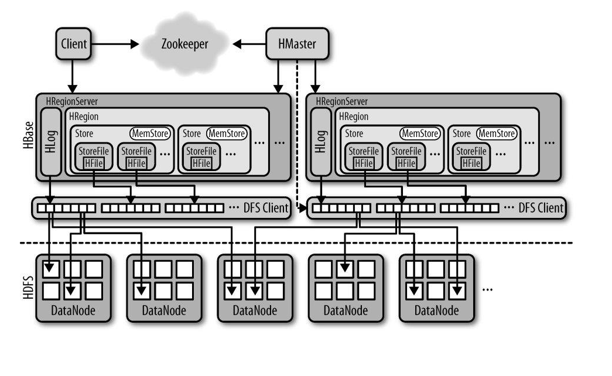
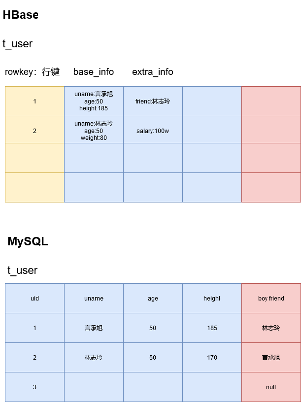
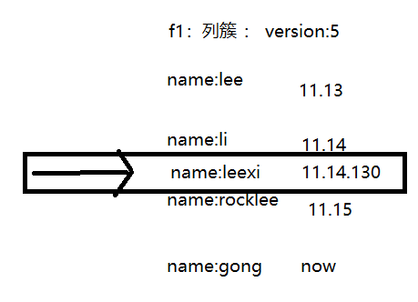
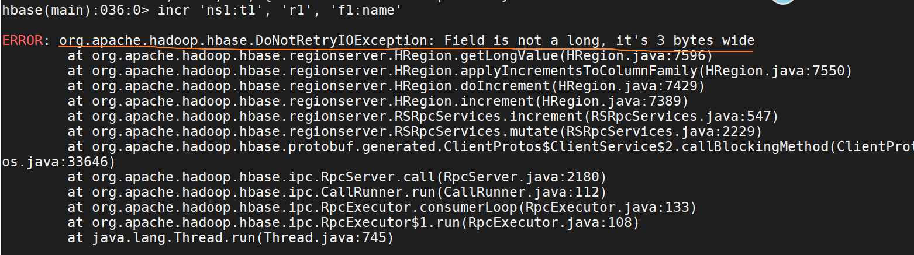
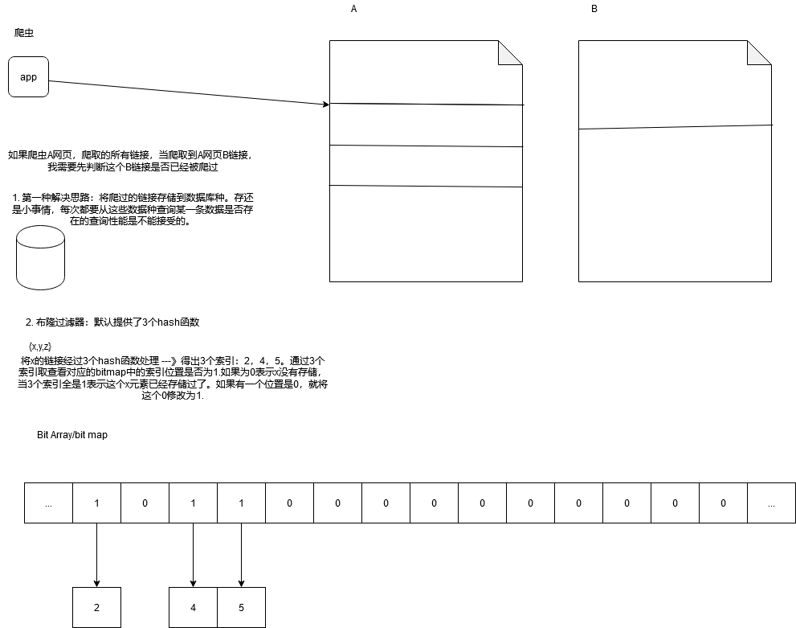
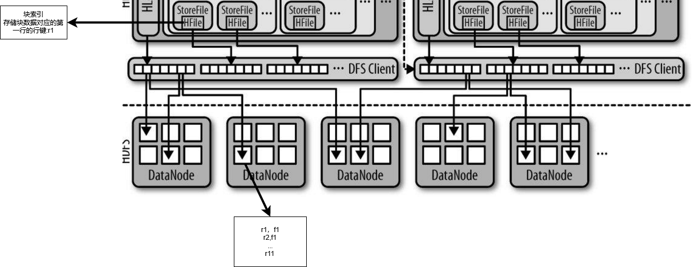
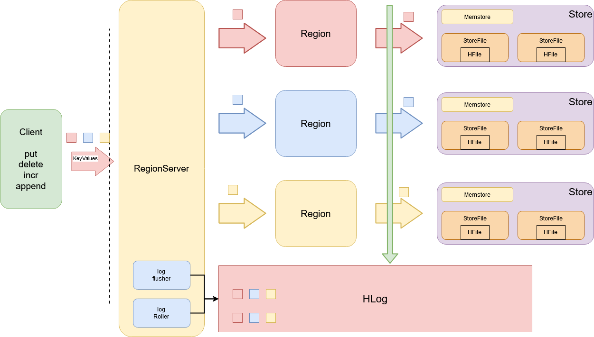
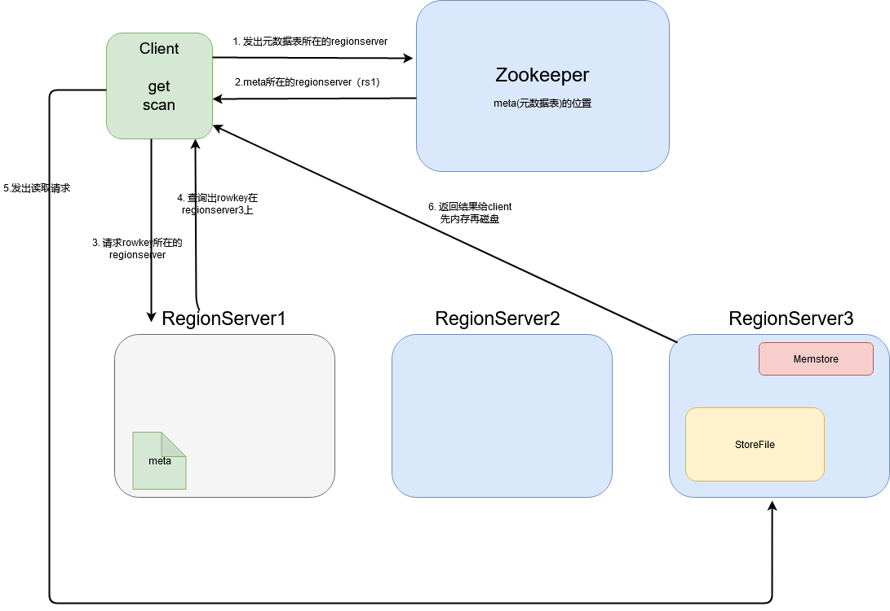

# Hive回顾

```
1. hive认识
2. hive的安装：derby，mysql：远程授权：grant命令
3. hive的原理：HDFS、Mapreduce。将sql语句转换可执行的Mapreduce
4. 基本语法：DDL、DML、SQL
5. 分桶分区
6. hive函数 
7. 数据类型：array、map、struct
8. serde
```

# 上周回顾

```
1. HBase介绍
2. HBase组件
3. HBase安装
4. HBase shell：namespace、ddl、dml
5. HBase API ： namespace、ddl、dml：put
```

# 昨日回顾

```
1. HBase API ： DML：Get/Scan/Append/Delete
2. HBase API ： Filter
3. Bloom Filter
```

# HBase

# 1 HBase是什么

## 1.1 HBase介绍

> ​	HBase就是一个开源的、可扩展、分布式、非关系型（Nosql）的数据库。
>
> ​	HBase其实是BigTable的java开源实现。建立在HDFS基础之上。他是一个典型的列式存储的数据库。随着数据量增大，传统的RDBMS不能满足海量数据的查询与存储需求。所以需要一种可以解决海量数据的存储与查询的方案。Hive虽然能够解决存储和查询，但是hive的底层是MR，所以查询的性能受到了制约，所以就出现HBase。

# 2 什么是Nosql

> ​	一般都是泛指非关系型数据库。Not only sql。web2.0开始开发的都是动态的网站。随着数据量的激增，动态网站的后台的数据库（RDBMS）已经不能完全胜任海量数据并发、并行、的查询。Nosql数据库的诞生就是为了解决海量数据的查询性能的瓶颈。

## 2.1 RDBMS

```
Mysql
Oracle
DB2
Sql Server
Sql Lite
MarriaDB
...
```

## 2.2 Nosql

### 2.2.1 KV键值对数据库

```
Redis
```

### 2.2.2 文档数据库

```
MongoDB : Bson/Json
```

### 2.2.3 图数据库

> 图数据库是存储关系的。

```
Neo4J
```

### 2.2.4 列式存储数据库——大数据

```
HBase、ClickHouse
```

### 2.2.5 全文检索

```
Solr、ElasticSearch
```

# 3 HBase的基本知识点

## 3.1 HBase的基本原理



> - Client : HBase客户端，可以是HBase shell也可以是HBase API。他除了向HBase发出请求之外，还会维护HBase的缓存来加速查询。
> - Zookeeper : 1. 监控HMaster的状态，以保证高可用。2. 保存所有的region的寻址入口。3. 实时的监控RegionServer的状态，感知regionserver的上下线。4. 保存了一部分的HBase的元数据
> - HMaster ：1. 为RegionServer分配Region。2. 负责RegionServer的负载均衡。3. 负责Region的重新分配。4. HDFS上的垃圾回收。
> - HRegionServer ： 1. 维护HMaster交给他的Region。2. 负责处理Client的读写请求。3. 负责具体的切分Region。
> - HLog ： 1. HBase的写操作进行记录。方式数据丢失，即使丢失也能回滚。
> - HRegion ： 他是表或者表达的一部分
> - Store ： 1. 列簇（comlun family）
> - MemStore : 内存缓冲区
> - HStore File : HBase种的数据实际上是以HFile的形式存储在HDFS中。

## 3.2 组件

```
Active HMaster : 1
Backup HMaster : 1
HRegionServer:HMaster : * vs 1
HRegionServer:HRegion : 1 vs *
HRegionServer:HLog : 1 vs 1
HRegion : Store : 1 vs *
Store ：MemStore ： 1 vs 1
Store ：StoreFile ： 1 vs *
Store ：HFile ： 1 vs 1
```

## 3.3 HBase的安装

### 3.3.1 伪分布式

```sh
##1. 解压
[root@hadoop software]# tar -zxvf hbase-1.2.1-bin.tar.gz -C /opt/apps/


## 2. 配置环境变量
## Java
export JAVA_HOME=/opt/apps/jdk1.8.0_45
export HADOOP_HOME=/opt/apps/hadoop-2.8.1
export HIVE_HOME=/opt/apps/hive-1.2.1
export HBASE_HOME=/opt/apps/hbase-1.2.1

export CLASS_PATH=.:$JAVA_HOME/lib
export PATH=$PATH:$JAVA_HOME/bin:$HADOOP_HOME/bin:$HADOOP_HOME/sbin:$HIVE_HOME/bin:$HBASE_HOME=/bin

##3. 配置hbase-env.sh
# The java implementation to use.  Java 1.7+ required.
export JAVA_HOME=/opt/apps/jdk1.8.0_45
# Tell HBase whether it should manage it's own instance of Zookeeper or not.
export HBASE_MANAGES_ZK=true

##4. hbase-site.xml
<!-- 配置开启hbase的分布式模式  -->
<property>
  <name>hbase.cluster.distributed</name>
  <value>true</value>
</property>

<!-- 配置HBase的数据保存HDFS的指定目录  -->
<property>
  <name>hbase.rootdir</name>
  <value>hdfs://hadoop:9000/hbase</value>
</property>

<!-- 配置HBase的自带的zk的数据目录  -->
<property>
  <name>hbase.zookeeper.property.datadir</name>
  <value>/opt/apps/hbase-1.2.1/zkdata</value>
</property>

<!-- 配置HBase的zk的访问地址-->
<property>
  <name>hbase.zookeeper.quorum</name>
  <value>hadoop:2181</value>
</property>

##5. regionserver2
hadoop

##6. backup-master ： 必须在hbase/conf目录下，创建backup-master的文件
hadoop1

##7. 启动
[root@hadoop bin]# ./start-hbase.sh

##8. 客户端链接hbase服务
[root@hadoop logs]# hbase shell
hbase(main):001:0> list_namespace
NAMESPACE
default
hbase
2 row(s) in 0.1640 seconds

##9. 测试Web UI
http://146.56.208.76:16010/master-status
```

### 3.3.2 HBase的Table



## 3.4 HBase Shell

### 3.4.1 帮助命令

- 总览

```sh
hbase(main):001:0> help
COMMAND GROUPS:
  Group name: 通用命令
  Commands: status, table_help, version, whoami

  Group name: 数据库定义语言
  Commands: alter, alter_async, alter_status, create, describe, disable, disable_all, drop, drop_all, enable, enable_all, exists, get_table, is_disabled, is_enabled, list, locate_region, show_filters

  Group name: 数据库命令【命令空间】
  Commands: alter_namespace, create_namespace, describe_namespace, drop_namespace, list_namespace, list_namespace_tables

  Group name: 数据库内容操作
  Commands: append, count, delete, deleteall, get, get_counter, get_splits, incr, put, scan, truncate, truncate_preserve
```

- help命令

```sh
hbase(main):002:0> help 'status'
Show cluster status. Can be 'summary', 'simple', 'detailed', or 'replication'. The
default is 'summary'. Examples:

  hbase> status
  hbase> status 'simple'
  hbase> status 'summary'
  hbase> status 'detailed'
  hbase> status 'replication'
  hbase> status 'replication', 'source'
  hbase> status 'replication', 'sink'
```

### 3.4.2 通用命令

- status

```sh
hbase(main):003:0> status
1 active master, 0 backup masters, 1 servers, 0 dead, 2.0000 average load

hbase(main):004:0> status 'summary'
1 active master, 0 backup masters, 1 servers, 0 dead, 2.0000 average load
```

- version

```sh
hbase(main):008:0> version
1.2.1, r8d8a7107dc4ccbf36a92f64675dc60392f85c015, Wed Mar 30 11:19:21 CDT 2016
```

- whoami

```sh
hbase(main):009:0> whoami
root (auth:SIMPLE)
    groups: root
```

### 3.4.3 Namespace

- create_namespace ： 创建namesapce

```sh
hbase(main):011:0> help 'create_namespace'
通过指定的namespace的名称来创建namespace;也可以手动的给namespace指定一个kv的配置
Examples:

  hbase> create_namespace 'ns1'
  hbase> create_namespace 'ns1', {'PROPERTY_NAME'=>'PROPERTY_VALUE'}

e.g.

hbase(main):013:0> create_namespace 'ns1'
0 row(s) in 0.0220 seconds

hbase(main):014:0> list_namespace
NAMESPACE
default
hbase
ns1

hbase(main):015:0> create_namespace 'ns2', {'CLASSNAME'=>'BIGDATA'}
0 row(s) in 0.0230 seconds

hbase(main):016:0> list_namespace
NAMESPACE
default
hbase
ns1
ns2
```

- describe_namespace ：查看指定的namespace的详情

```sh
hbase(main):018:0> help 'describe_namespace'
查看指定的namespace的详情
e.g.

hbase(main):001:0> describe_namespace 'ns1'
DESCRIPTION
{NAME => 'ns1'}
1 row(s) in 0.1880 seconds

hbase(main):002:0> describe_namespace 'ns2'
DESCRIPTION
{NAME => 'ns2', CLASSNAME => 'BIGDATA'}
1 row(s) in 0.0060 seconds
```

- alter_namespace : 修改namespace的configuration

```sh
hbase(main):003:0> help 'alter_namespace'
修改namespace的properties.

To 添加/修改 a property:

hbase(main):003:0> alter_namespace 'ns2', {METHOD => 'set', 'TYPE' => 'BIGDATA'}
0 row(s) in 0.0250 seconds

hbase(main):004:0> describe_namespace 'ns2'
DESCRIPTION
{NAME => 'ns2', CLASSNAME => 'JAVA', TYPE => 'BIGDATA'}
1 row(s) in 0.0050 seconds

To 删除 a property:

hbase(main):005:0> alter_namespace 'ns2', {METHOD => 'unset', NAME=>'TYPE'}
0 row(s) in 0.0280 seconds

hbase(main):006:0> describe_namespace 'ns2'
DESCRIPTION
{NAME => 'ns2', CLASSNAME => 'JAVA'}
1 row(s) in 0.0070 seconds
```

- drop_namespace

```
hbase(main):009:0> help 'drop_namespace'
Drop the named namespace. The namespace must be empty.

e.g.
hbase(main):002:0> drop_namespace 'ns2'

```

- list_namespace ： 罗列在hbase中的所有的namespace

```sh
hbase(main):003:0> help 'list_namespace'
List all namespaces in hbase. Optional regular expression parameter could
be used to filter the output. Examples:

e.g.
hbase(main):001:0> list_namespace 'ns*'
NAMESPACE
ns1
ns2
```

- list_namespace_tables

```

e.g.

hbase(main):008:0> list_namespace_tables 'hbase'
TABLE
meta
namespace
```

### 3.4.4 DDL

- create : 建表

```sh
create 't1', 'f1', 'f2', 'f3' ## 在deafult的namespace下创建t1表，列簇分别为f1、f2、f3

e.g.
hbase(main):003:0> create 'ns1:t1', 'f1'
0 row(s) in 2.4020 seconds

=> Hbase::Table - ns1:t1

## tip: 数据的真实目录
hdfs dfs -ls /hbase/data/ns1/t1/b30214f4a7de37f749712f1dae42f48d/f1
```

- alter ：修改表的列簇和配置选项信息

```sh
hbase(main):017:0> alter 'ns1:t1', NAME => 'f1', VERSIONS => 5 ## 修改f1列簇中的数据版本为5
hbase(main):017:0> alter 'ns1:t1', {NAME=>'lixi_info'} ## 给ns1:t1表中添加一个列簇，lixi_info
```

- disable : 令指定表失效

```
hbase(main):024:0> disable 'ns1:t1'
0 row(s) in 2.2710 seconds

hbase(main):025:0> is_disabled 'ns1:t1'
true
0 row(s) in 0.0050 seconds
```

- disable_all
- is_disabled : 判断是否失效

```sh
hbase(main):020:0> is_disabled 'ns1:t1'
false
```

- enable
- enable_all
- is_enabled ：判断是否生效

```sh
hbase(main):021:0> is_enabled 'ns1:t1'
true
```

- drop

```sh
hbase(main):023:0> drop 'ns1:t1'

ERROR: Table ns1:t1 is enabled. Disable it first.

Here is some help for this command:
Drop the named table. Table must first be disabled:
  hbase> drop 't1'
  hbase> drop 'ns1:t1'
  

hbase(main):026:0> drop 'ns1:t1'
0 row(s) in 1.2370 seconds

hbase(main):027:0> list
TABLE
0 row(s) in 0.0050 seconds

=> []  
```

- drop_all
- exists : 查看表是否存在

```sh

hbase(main):009:0> exists 'xxx'
Table xxx does not exist
0 row(s) in 0.0060 seconds

hbase(main):010:0> exists 't1'
Table t1 does not exist
0 row(s) in 0.0080 seconds

hbase(main):011:0> exists 'ns1:t1'
Table ns1:t1 does exist
0 row(s) in 0.0070 seconds

```

- list ： 查看所有的用户表

```sh
e.g.
hbase(main):014:0> list
TABLE
ns1:t1
```

- locate_region : 查看你的数据是在哪个regionserver中的region中

```sh
hbase(main):036:0> locate_region 'ns1:t1', 'r1'
HOST                              REGION
 hadoop:16020                     {ENCODED => 6344de68c846e447e87a3f3b18a0663b, NAME => 'ns1:t1,,1633681686482.6344de68c846e447e87a
                                  3f3b18a0663b.', STARTKEY => '', ENDKEY => ''}
```

- describe : 查看表详情

```sh
hbase(main):004:0> describe 'ns1:t1'
Table ns1:t1 is ENABLED
ns1:t1
COLUMN FAMILIES DESCRIPTION
{NAME => 'f1', BLOOMFILTER => 'ROW', VERSIONS => '1', IN_MEMORY => 'false', KEEP_DELETED_CELLS => 'FALSE', DATA_BLOCK_ENCODING => '
NONE', TTL => 'FOREVER', COMPRESSION => 'NONE', MIN_VERSIONS => '0', BLOCKCACHE => 'true', BLOCKSIZE => '65536', REPLICATION_SCOPE
=> '0'}
1 row(s) in 0.0770 seconds
```

### 3.4.5 DML

- put ： 插入数据，可以插入不同的版本



```sh
## e.g. 向ns1的namespace中的t1表中插入条数据，数据的rowkey是r1， 列簇和列名：c1， 列值：value
put 'ns1:t1', 'r1', 'c1', 'value'

e.g.
hbase(main):016:0> put 'ns1:t1', 'r1', 'f1:name', 'lixi'
0 row(s) in 0.1180 seconds

hbase(main):007:0> scan 'ns1:t1'
ROW                           COLUMN+CELL
 r1                           column=f1:name, timestamp=1633681743048, value=lixi  -- version2
 
 hbase(main):003:0> put 'ns1:t1', 'r1', 'f1:name', 'lee'
0 row(s) in 0.0400 seconds

hbase(main):004:0> scan 'ns1:t1'
ROW                           COLUMN+CELL
 r1                           column=f1:name, timestamp=1633744226334, value=lee  -- version3
1 row(s) in 0.0080 seconds

hbase(main):005:0> put 'ns1:t1', 'r1', 'f1:name', 'rock', 1633681743010 -- version1
0 row(s) in 0.0070 seconds

hbase(main):006:0> scan 'ns1:t1'
ROW                           COLUMN+CELL
 r1                           column=f1:name, timestamp=1633744226334, value=lee 
1 row(s) in 0.0070 seconds

```

- scan : 扫描表数据

```sh
##1. 扫描指定表的最新版本数据
hbase(main):009:0> scan 'ns1:t1'
ROW                           COLUMN+CELL
 r1                           column=f1:name, timestamp=1633744226334, value=lee

##2.  扫描指定表的时间戳范围数据
hbase(main):010:0> scan 'ns1:t1', {COLUMNS => ['f1'], TIMERANGE => [1633681743010, 1633681743011]}
ROW                           COLUMN+CELL
 r1                           column=f1:name, timestamp=1633681743010, value=rock

##3. 扫描的2行,从哪个行间开始
hbase(main):019:0> scan 'ns1:t1', {COLUMNS => ['f1'], LIMIT => 2, STARTROW => 'r2', REVERSED => true}
ROW                           COLUMN+CELL
 r2                           column=f1:name, timestamp=1633681743010, value=rock
 r3                           column=f1:name, timestamp=1633681743010, value=rocklee
 
 hbase(main):020:0> scan 'ns1:t1', {COLUMNS => ['f1'], LIMIT => 2, STARTROW => 'r2', REVERSED => true}
ROW                           COLUMN+CELL
 r2                           column=f1:name, timestamp=1633681743010, value=rock
 r1                           column=f1:name, timestamp=1633744226334, value=lee
```

- get ： 查询指定行的数据

```sh
##1. 获取到指定表的行的最新版本数
hbase(main):023:0> get 'ns1:t1','r1'
COLUMN                        CELL
 f1:name                      timestamp=1633744226334, value=lee
 
##2. 获取指定时间范围内的数据
hbase(main):024:0>  get 'ns1:t1', 'r1', {TIMERANGE => [1633681743010, 1633681743011]}
COLUMN                        CELL
 f1:name                      timestamp=1633681743010, value=rock
 
 ##3.获取到指定时间戳的创建的数据
 get 'ns1:t1', 'r1', {TIMESTAMP => 1633681743010}
 
 ##4. 查询指定行键的指定列簇
 hbase(main):028:0> get 'ns1:t1','r1', 'f1'
COLUMN                        CELL
 f1:name                      timestamp=1633744226334, value=lee
```

- append : 追加数据，追击的数据一定是最新版本

```sh
hbase(main):030:0> append 'ns1:t1', 'r5', 'f1:sex', 'man'
0 row(s) in 0.0220 seconds

hbase(main):031:0> scan 'ns1:t1'
ROW                           COLUMN+CELL
 r1                           column=f1:name, timestamp=1633744226334, value=lee
 r2                           column=f1:name, timestamp=1633681743010, value=rock
 r3                           column=f1:name, timestamp=1633681743010, value=rocklee
 r4                           column=f1:name, timestamp=1633681743010, value=sb
 r5                           column=f1:sex, timestamp=1633746784101, value=man
5 row(s) in 0.0120 seconds

hbase(main):032:0> append 'ns1:t1', 'r5', 'f1:name', 'gao'
0 row(s) in 0.0040 seconds

hbase(main):033:0> scan 'ns1:t1'
ROW                           COLUMN+CELL
 r1                           column=f1:name, timestamp=1633744226334, value=lee
 r2                           column=f1:name, timestamp=1633681743010, value=rock
 r3                           column=f1:name, timestamp=1633681743010, value=rocklee
 r4                           column=f1:name, timestamp=1633681743010, value=sb
 r5                           column=f1:name, timestamp=1633746823341, value=gao
 r5                           column=f1:sex, timestamp=1633746784101, value=man
```

- count
- delete : 删除一个cell

```sh
hbase(main):056:0> scan 'ns1:t1'
ROW                          COLUMN+CELL
 r1                          column=f1:name, timestamp=1633744226334, value=lee
 r2                          column=f1:name, timestamp=1633681743010, value=rock
 r3                          column=f1:name, timestamp=1633681743010, value=rocklee
 r4                          column=f1:name, timestamp=1633681743010, value=sb
 r5                          column=f1:name, timestamp=1633746823341, value=gao
 r5                          column=f1:sex, timestamp=1633746784101, value=man
5 row(s) in 0.0100 seconds

hbase(main):057:0> delete 'ns1:t1', 'r1', 'f1:name'
0 row(s) in 0.0060 seconds

hbase(main):058:0> scan 'ns1:t1'
ROW                          COLUMN+CELL
 r2                          column=f1:name, timestamp=1633681743010, value=rock
 r3                          column=f1:name, timestamp=1633681743010, value=rocklee
 r4                          column=f1:name, timestamp=1633681743010, value=sb
 r5                          column=f1:name, timestamp=1633746823341, value=gao
 r5                          column=f1:sex, timestamp=1633746784101, value=man
4 row(s) in 0.0070 seconds
```

- deleteall
- get_counter : 获取计数器

```sh
hbase(main):009:0> get_counter 'ns1:t1', 'r1', 'f1:age'
COUNTER VALUE = 1
```

- incr:自增

```sh
##1. 错误的示范 : 因为name对应value是一个字符串
incr 'ns1:t1', 'r1', 'f1:name'

##2. 只有数字才能incr
hbase(main):037:0> incr 'ns1:t1', 'r1', 'f1:age'
COUNTER VALUE = 1
0 row(s) in 0.0080 seconds

hbase(main):038:0> incr 'ns1:t1', 'r1', 'f1:age'
COUNTER VALUE = 2
0 row(s) in 0.0080 seconds

hbase(main):039:0> incr 'ns1:t1', 'r1', 'f1:age'
COUNTER VALUE = 3
0 row(s) in 0.0060 seconds

hbase(main):040:0> get 'ns1:t1', 'r1'
COLUMN                        CELL
 f1:age                       timestamp=1633747372463, value=\x00\x00\x00\x00\x00\x00\x00\x03
 f1:name                      timestamp=1633744226334, value=lee
```



- truncate

```sh
hbase(main):010:0> help 'truncate'
  Disables, drops and recreates the specified table.
hbase(main):011:0> truncate 'ns1:t1'
Truncating 'ns1:t1' table (it may take a while):
 - Disabling table...
 - Truncating table...
0 row(s) in 4.2070 seconds

hbase(main):012:0> scan 'ns1:t1'
ROW                          COLUMN+CELL
0 row(s) in 0.3160 seconds
```

## 3.5 HBase API

### 3.5.1 导入依赖

```xml
<!-- hbase -->
<dependency>
    <groupId>org.apache.hbase</groupId>
    <artifactId>hbase-client</artifactId>
    <version>1.2.1</version>
</dependency>
```

### 3.5.2 etc/hosts

```
146.56.208.76 hadoop
```

### 3.5.3 链接到HBase

> 如果是云服务器：必须开放2181、16020、16000端口

```java
package com.qf.bigdata.hbase.day1;

import org.apache.hadoop.conf.Configuration;
import org.apache.hadoop.hbase.client.HBaseAdmin;

import java.io.IOException;

public class Demo1_QuickStart {

    public static void main(String[] args) throws IOException {
        //1. 获取到配置对象
        Configuration configuration = new Configuration();
        configuration.set("hbase.zookeeper.quorum", "hadoop:2181");

        //2. 获取admin对象
        HBaseAdmin admin = new HBaseAdmin(configuration);

        //3. 测试表是否存在
        boolean isExists = admin.tableExists("ns1:t1");
        System.out.println(isExists);

        //4. 释放资源
        admin.close();
    }
}
```

### 3.5.4 HBaseUtils —— Version1.0

```java
package com.qf.bigdata.hbase.utils;

import org.apache.hadoop.conf.Configuration;
import org.apache.hadoop.hbase.client.Admin;
import org.apache.hadoop.hbase.client.Connection;
import org.apache.hadoop.hbase.client.ConnectionFactory;
import org.apache.log4j.Logger;

import java.io.IOException;

/**
 * HBase的工具类
 */
public class HBaseUtils {
    // 创建Log4j的工具类，这个类的作用是帮助我们记录日志
    private static final Logger logger = Logger.getLogger(HBaseUtils.class);
    private static final String DEFAULT_ZK_NAME = "hbase.zookeeper.quorum";
    private static final String DEFAULT_ZK_VALUE = "hadoop:2181";


    /**
     * 获取到默认的Admin对象
     */
    public static Admin getDefaultAdmin() {
        //2. 获取admin对象
        Admin admin = getAdmin(DEFAULT_ZK_VALUE);
        return admin;
    }

    /**
     * 获取到链接到指定hbase的Admin对象
     */
    public static Admin getAdmin(String zk_uri) {
        //1. 获取到配置对象
        Configuration configuration = new Configuration();
        configuration.set(DEFAULT_ZK_NAME, zk_uri);
        //2. 获取admin对象
        try {
            Connection connection = ConnectionFactory.createConnection(configuration);
            Admin admin = connection.getAdmin();
            return admin;
        } catch (IOException e) {
            logger.warn(HBaseUtils.class.getName() + "：产生了链接HBase的IO异常！！！", e);
            return null;
        }
    }

    /**
     * 释放资源
     */
    public static void close(Admin admin) {
        if (admin != null) {
            try {
                admin.close();
            } catch (IOException e) {
                logger.warn(HBaseUtils.class.getName() + "：关闭HBase的Admin对象的IO异常！！！", e);
            }
        }
    }

    public static void close(Connection connection) {
        if (connection != null && !connection.isClosed()) {
            try {
                connection.close();
            } catch (IOException e) {
                logger.warn(HBaseUtils.class.getName() + "：关闭HBase的Connection对象的IO异常！！！", e);
            }
        }
    }

    public static void close(Connection connection, Admin admin) {
        close(admin);
        close(connection);
    }
}
```

### 3.5.5 Namespace API

```java
package com.qf.bigdata.hbase.day1;

import com.qf.bigdata.hbase.utils.HBaseUtils;
import org.apache.hadoop.hbase.NamespaceDescriptor;
import org.apache.hadoop.hbase.TableName;
import org.apache.hadoop.hbase.client.Admin;
import org.apache.hadoop.hbase.client.HBaseAdmin;
import org.junit.Test;

import java.io.IOException;

public class Demo2_Namespace {

    /**
     * 创建namespace
     */
    @Test
    public void createNamespace() throws IOException {
        //1. 获取到admin对象
        HBaseAdmin admin = (HBaseAdmin) HBaseUtils.getDefaultAdmin();
        //2. 创建namespace
        //2.1 创建NamespaceDescriber
        NamespaceDescriptor ns2 = NamespaceDescriptor.create("ns2").build();
        //2.2 通过admin对象将ns2提交
        admin.createNamespace(ns2);
        //3. 释放资源
        HBaseUtils.close(admin);
    }

    @Test
    public void listNamespace() throws IOException {
        //1. 获取到admin对象
        HBaseAdmin admin = (HBaseAdmin) HBaseUtils.getDefaultAdmin();
        //2. 列举
        NamespaceDescriptor[] namespaceDescriptors = admin.listNamespaceDescriptors();
        //3. 遍历
        for (NamespaceDescriptor descriptor : namespaceDescriptors) {
            System.out.println(descriptor.getName());
        }
        //4. 释放资源
        HBaseUtils.close(admin);
    }

    @Test
    public void listNamespaceTables() throws IOException {
        //1. 获取到admin对象
        HBaseAdmin admin = (HBaseAdmin) HBaseUtils.getDefaultAdmin();
        //2. 获取到ns1的namespace中的所有的表的表名
        TableName[] ns1s = admin.listTableNamesByNamespace("ns1");
        //3. 遍历
        for (TableName tableName : ns1s) {
            System.out.println(tableName.getNameAsString());
            System.out.println(tableName.getNamespaceAsString());
        }

        //4. 释放资源
        HBaseUtils.close(admin);
    }

    @Test
    public void dropNamesapce() throws IOException {
        //1. 获取到admin对象
        HBaseAdmin admin = (HBaseAdmin) HBaseUtils.getDefaultAdmin();

        //2.
        admin.deleteNamespace("ns1");

        //4. 释放资源
        HBaseUtils.close(admin);
    }
}
```

### 3.5.6 DDL

```java
package com.qf.bigdata.hbase.day1;

import com.qf.bigdata.hbase.utils.HBaseUtils;
import org.apache.hadoop.hbase.HColumnDescriptor;
import org.apache.hadoop.hbase.HTableDescriptor;
import org.apache.hadoop.hbase.TableName;
import org.apache.hadoop.hbase.client.HBaseAdmin;
import org.apache.hadoop.hbase.regionserver.BloomType;
import org.apache.hadoop.hbase.util.Bytes;
import org.junit.After;
import org.junit.Before;
import org.junit.Test;

import java.io.IOException;

public class Demo3_DDL {

    private HBaseAdmin admin;

    @Before
    public void before() {
        admin = (HBaseAdmin) HBaseUtils.getDefaultAdmin();
    }

    /**
     * 建表
     * @throws IOException
     */
    @Test
    public void createTable() throws IOException {
        //1. 创建表的描述器对象
        HTableDescriptor tableDescriptor = new HTableDescriptor(TableName.valueOf("ns1:t2"));
        //2. 指定一些参数
        //2.1 添加列簇到表中
        HColumnDescriptor columnDescriptor = new HColumnDescriptor("f1");
        columnDescriptor.setTimeToLive(60); // TTL
        columnDescriptor.setVersions(1, 5); // Version
        columnDescriptor.setBloomFilterType(BloomType.ROW); // BloomFilter
        tableDescriptor.addFamily(columnDescriptor); // 将一个列簇添加到表中

        //2.2 添加其他
//        tableDescriptor.addCoprocessor() 协处理器

        //3. 提交
        admin.createTable(tableDescriptor);
    }

    /**
     * replace column family
     */
    @Test
    public void alterTable1() throws IOException {
        //1. 创建表的描述器对象
        TableName tableName = TableName.valueOf("ns1:t2");

        HTableDescriptor tableDescriptor = new HTableDescriptor(tableName); // 新建
        HColumnDescriptor columnDescriptor = new HColumnDescriptor("f2");
        columnDescriptor.setTimeToLive(60); // TTL
        columnDescriptor.setVersions(1, 5); // Version
        columnDescriptor.setBloomFilterType(BloomType.ROW); // BloomFilter
        tableDescriptor.addFamily(columnDescriptor); // 将一个列簇添加到表中

        //2. 提交修改
        admin.modifyTable(tableName, tableDescriptor);
    }

    /**
     * add column family
     */
    @Test
    public void alterTable2() throws IOException {
        //1. 创建表的描述器对象
        TableName tableName = TableName.valueOf("ns1:t2");

        HTableDescriptor tableDescriptor = admin.getTableDescriptor(tableName); // 从hbase中获取到t2表
        HColumnDescriptor columnDescriptor = new HColumnDescriptor("f1");
        columnDescriptor.setTimeToLive(60); // TTL
        columnDescriptor.setVersions(1, 5); // Version
        columnDescriptor.setBloomFilterType(BloomType.ROW); // BloomFilter
        tableDescriptor.addFamily(columnDescriptor); // 将一个列簇添加到表中

        //2. 提交修改
        admin.modifyTable(tableName, tableDescriptor);
    }

    /**
     * 删除一个表中的指定的列簇
     * @throws IOException
     */
    @Test
    public void deleteColumnFamily() throws IOException {
        //1. 创建表的描述器对象
        TableName tableName = TableName.valueOf("ns1:t2");

        //2. 提交删除
//        admin.deleteColumn(tableName, "f2".getBytes()); //通用
        admin.deleteColumn(tableName, Bytes.toBytes("f2")); // hbase建议
    }

    @Test
    public void deleteColumnFamily2() throws IOException {
        //1. 创建表的描述器对象
        TableName tableName = TableName.valueOf("ns1:t2");
        HTableDescriptor tableDescriptor = admin.getTableDescriptor(tableName); // 先获取到表信息
        tableDescriptor.removeFamily(Bytes.toBytes("f1")); // 删除列簇

        //2. alter
        admin.modifyTable(tableName, tableDescriptor);
    }

    /**
     * 查询一个表中的所有的列簇
     * @throws IOException
     */
    @Test
    public void descTable() throws IOException {
        //1. 创建表的描述器对象
        TableName tableName = TableName.valueOf("ns1:t2");
        HTableDescriptor tableDescriptor = admin.getTableDescriptor(tableName); // 先获取到表信息
        //2. 获取到所有的列簇信息
        HColumnDescriptor[] columnFamilies = tableDescriptor.getColumnFamilies();
        //3. 遍历
        for (HColumnDescriptor descriptor : columnFamilies) {
            System.out.println(descriptor.getNameAsString());
            System.out.println(descriptor.getBlocksize());
            System.out.println(descriptor.getBloomFilterType());
        }
    }

    /**
     * 删除表
     * @throws IOException
     */
    @Test
    public void dropTable() throws IOException {
        TableName tableName = TableName.valueOf("ns1:t2");
        if (admin.tableExists(tableName)) { // 如果表存在
            if (!admin.isTableDisabled(tableName)) { // 如果表没有失效
                admin.disableTable(tableName); // 设置表失效
            }
            admin.deleteTable(tableName); // 删除表
        }
    }

    @After
    public void after() {
        HBaseUtils.close(admin);
    }
}

```

### 3.5.7 DML

- HBaseUtils —— version2.0

```java
package com.qf.bigdata.hbase.utils;

import org.apache.hadoop.conf.Configuration;
import org.apache.hadoop.hbase.TableName;
import org.apache.hadoop.hbase.client.Admin;
import org.apache.hadoop.hbase.client.Connection;
import org.apache.hadoop.hbase.client.ConnectionFactory;
import org.apache.hadoop.hbase.client.Table;
import org.apache.log4j.Logger;

import java.io.IOException;

/**
 * HBase的工具类
 */
public class HBaseUtils {
    // 创建Log4j的工具类，这个类的作用是帮助我们记录日志
    private static final Logger logger = Logger.getLogger(HBaseUtils.class);
    private static final String DEFAULT_ZK_NAME = "hbase.zookeeper.quorum";
    private static final String DEFAULT_ZK_VALUE = "hadoop:2181";
    private static final String TABLE_NAME = "ns1:t1";

    /**
     * 获取到链接对象
     * @param zk_uri
     * @return
     */
    public static Connection getConnection(String zk_uri) {
        //1. 获取到配置对象
        Configuration configuration = new Configuration();
        configuration.set(DEFAULT_ZK_NAME, zk_uri);
        try {
            Connection connection = ConnectionFactory.createConnection(configuration);
            return connection;
        } catch (IOException e) {
            logger.warn(HBaseUtils.class.getName() + "：产生了链接HBase的Connection的IO异常！！！", e);
            return null;
        }
    }

    /**
     * 获取到默认的Table对象
     */
    public static Table getDefaultTable() {
        return getTable(DEFAULT_ZK_VALUE, TABLE_NAME);
    }

    /**
     * 获取到指定的hbase中的指定的表的Table对象
     */
    public static Table getTable(String zk_uri, String tableName) {
        //1. 获取到connection对象
        Connection connection = getConnection(zk_uri);
        //2. 判断
        if (connection == null) {
            logger.warn("在获取Table对象的时候异常，可能是connection获取为空：" + connection);
            return null;
        }
        //3. 获取到Table
        try {
            Table table = connection.getTable(TableName.valueOf(tableName));
            return table;
        } catch (IOException e) {
            logger.warn(HBaseUtils.class.getName() + "：产生了链接HBase的Table的IO异常！！！", e);
            return null;
        }
    }
    /**
     * 获取到默认的Admin对象
     */
    public static Admin getDefaultAdmin() {
        return getAdmin(DEFAULT_ZK_VALUE);
    }

    /**
     * 获取到链接到指定hbase的Admin对象
     */
    public static Admin getAdmin(String zk_uri) {
        //1. 获取到connection对象
        Connection connection = getConnection(zk_uri);
        //2. 判断
        if (connection == null) {
            logger.warn("在获取Admin对象的时候异常，可能是connection获取为空：" + connection);
            return null;
        }
        //3. 说明没有异常
        try {
            Admin admin = connection.getAdmin();
            return admin;
        } catch (IOException e) {
            logger.warn(HBaseUtils.class.getName() + "：产生了链接HBase的Admin的IO异常！！！", e);
            return null;
        }
    }

    /**
     * 释放资源
     */
    public static void close(Admin admin) {
        if (admin != null) {
            try {
                admin.close();
            } catch (IOException e) {
                logger.warn(HBaseUtils.class.getName() + "：关闭HBase的Admin对象的IO异常！！！", e);
            }
        }
    }

    public static void close(Table table) {
        if (table != null) {
            try {
                table.close();
            } catch (IOException e) {
                logger.warn(HBaseUtils.class.getName() + "：关闭HBase的Table对象的IO异常！！！", e);
            }
        }
    }

    public static void close(Connection connection) {
        if (connection != null && !connection.isClosed()) {
            try {
                connection.close();
            } catch (IOException e) {
                logger.warn(HBaseUtils.class.getName() + "：关闭HBase的Connection对象的IO异常！！！", e);
            }
        }
    }

    public static void close(Connection connection, Admin admin, Table table) {
        close(admin);
        close(table);
        close(connection);
    }
}
```

- HBaseUtils——Version3.0

```java
package com.qf.bigdata.hbase.utils;

import org.apache.hadoop.conf.Configuration;
import org.apache.hadoop.hbase.Cell;
import org.apache.hadoop.hbase.CellScanner;
import org.apache.hadoop.hbase.CellUtil;
import org.apache.hadoop.hbase.TableName;
import org.apache.hadoop.hbase.client.*;
import org.apache.log4j.Logger;

import java.io.IOException;
import java.util.Iterator;

/**
 * HBase的工具类
 */
public class HBaseUtils {
    // 创建Log4j的工具类，这个类的作用是帮助我们记录日志
    private static final Logger logger = Logger.getLogger(HBaseUtils.class);
    private static final String DEFAULT_ZK_NAME = "hbase.zookeeper.quorum";
    private static final String DEFAULT_ZK_VALUE = "hadoop:2181";
    private static final String TABLE_NAME = "ns1:t1";

    /**
     * 获取到链接对象
     * @param zk_uri
     * @return
     */
    private static Connection getConnection(String zk_uri) {
        //1. 获取到配置对象
        Configuration configuration = new Configuration();
        configuration.set(DEFAULT_ZK_NAME, zk_uri);
        try {
            Connection connection = ConnectionFactory.createConnection(configuration);
            return connection;
        } catch (IOException e) {
            logger.warn(HBaseUtils.class.getName() + "：产生了链接HBase的Connection的IO异常！！！", e);
            return null;
        }
    }

    /**
     * 获取到默认的Table对象
     */
    public static Table getDefaultTable() {
        return getTable(DEFAULT_ZK_VALUE, TABLE_NAME);
    }

    /**
     * 获取到指定的hbase中的指定的表的Table对象
     */
    public static Table getTable(String zk_uri, String tableName) {
        //1. 获取到connection对象
        Connection connection = getConnection(zk_uri);
        //2. 判断
        if (connection == null) {
            logger.warn("在获取Table对象的时候异常，可能是connection获取为空：" + connection);
            return null;
        }
        //3. 获取到Table
        try {
            Table table = connection.getTable(TableName.valueOf(tableName));
            return table;
        } catch (IOException e) {
            logger.warn(HBaseUtils.class.getName() + "：产生了链接HBase的Table的IO异常！！！", e);
            return null;
        }
    }

    /**
     * 打印result的所有信息
     */
    public static void println(Result result) {
        //3.1 获取到cell的扫描器
        CellScanner cellScanner = result.cellScanner();
        //3.2 推进扫描
        try {
            while (cellScanner.advance()) {
                //3.3 获取当前的表格
                Cell cell = cellScanner.current();
                //3.4 获取到我们想要的数据
                String row = new String(CellUtil.cloneRow(cell));
                String family = new String(CellUtil.cloneFamily(cell));
                String column = new String(CellUtil.cloneQualifier(cell));
                String value = new String(CellUtil.cloneValue(cell));

                System.out.println(row);
                System.out.println(family);
                System.out.println(column);
                System.out.println(value);
                System.out.println("--------------------------------------");
            }
        }catch (IOException e) {
            logger.warn("打印result的IO异常！！！", e);
        }
    }

    /**
     * 打印表中的所有信息
     * @param table
     */
    public static void println(Table table) {
        try {
            //1. 创建scan对象
            Scan scan = new Scan();
            //2. 获取扫描器
            ResultScanner scanner = table.getScanner(scan);
            //3. 获取扫描result的迭代器
            Iterator<Result> iterator = scanner.iterator();
            //4. 迭代
            while (iterator.hasNext()) {
                Result result = iterator.next();
                HBaseUtils.println(result);
            }
        }catch (IOException e) {
            logger.warn("打印表的异常！！！", e);
        }
    }


    /**
     * 获取到默认的Admin对象
     */
    public static Admin getDefaultAdmin() {
        return getAdmin(DEFAULT_ZK_VALUE);
    }

    /**
     * 获取到链接到指定hbase的Admin对象
     */
    public static Admin getAdmin(String zk_uri) {
        //1. 获取到connection对象
        Connection connection = getConnection(zk_uri);
        //2. 判断
        if (connection == null) {
            logger.warn("在获取Admin对象的时候异常，可能是connection获取为空：" + connection);
            return null;
        }
        //3. 说明没有异常
        try {
            Admin admin = connection.getAdmin();
            return admin;
        } catch (IOException e) {
            logger.warn(HBaseUtils.class.getName() + "：产生了链接HBase的Admin的IO异常！！！", e);
            return null;
        }
    }

    /**
     * 释放资源
     */
    public static void close(Admin admin) {
        if (admin != null) {
            try {
                admin.close();
            } catch (IOException e) {
                logger.warn(HBaseUtils.class.getName() + "：关闭HBase的Admin对象的IO异常！！！", e);
            }
        }
    }

    public static void close(Table table) {
        if (table != null) {
            try {
                table.close();
            } catch (IOException e) {
                logger.warn(HBaseUtils.class.getName() + "：关闭HBase的Table对象的IO异常！！！", e);
            }
        }
    }

    public static void close(Connection connection) {
        if (connection != null && !connection.isClosed()) {
            try {
                connection.close();
            } catch (IOException e) {
                logger.warn(HBaseUtils.class.getName() + "：关闭HBase的Connection对象的IO异常！！！", e);
            }
        }
    }

    public static void close(Connection connection, Admin admin, Table table) {
        close(admin);
        close(table);
        close(connection);
    }
}
```

- Demo4_DML

```java
package com.qf.bigdata.hbase.day1;

import com.qf.bigdata.hbase.utils.HBaseUtils;
import org.apache.hadoop.hbase.Cell;
import org.apache.hadoop.hbase.CellScanner;
import org.apache.hadoop.hbase.CellUtil;
import org.apache.hadoop.hbase.client.*;
import org.apache.hadoop.hbase.util.Bytes;
import org.junit.After;
import org.junit.Before;
import org.junit.Test;

import java.io.IOException;
import java.util.Iterator;

public class Demo4_DML {

    private Table table;

    @Before
    public void before() {
        table = HBaseUtils.getDefaultTable();
    }

    /**
     * 插入操作
     * @throws IOException
     */
    @Test
    public void put() throws IOException {
        //1. 创建put对象
        Put put = new Put(Bytes.toBytes("r11"));

        //2. 指定列簇，列名，列值
        put.addColumn(Bytes.toBytes("f1"), Bytes.toBytes("classname"), Bytes.toBytes("bigdata"));
        put.addColumn(Bytes.toBytes("f1"), Bytes.toBytes("username"), Bytes.toBytes("lixi"));

        //3. 提交插入一条数据到hbase
        table.put(put);
    }

    @Test
    public void get() throws IOException {
        //1. 创建get对象
        Get get = new Get(Bytes.toBytes("r11"));
        //2. 查询
        Result result = table.get(get);
        //3. 查询出结果
//        result.getFamilyMap(byte[] familyName) // 单独获取列簇：列
        HBaseUtils.println(result);
    }

    @Test
    public void scan() throws IOException {
        //1. 创建scan对象
        HBaseUtils.println(table);
    }

    @Test
    public void delete() throws IOException {
        Delete delete = new Delete(Bytes.toBytes("r1"));
        table.delete(delete);
    }

    @Test
    public void append() throws IOException {
        Append append = new Append(Bytes.toBytes("r1"));
        append.add(Bytes.toBytes("f1"), Bytes.toBytes("name"), Bytes.toBytes("lee"));
        table.append(append);
    }

    @Test
    public void incr() {

    }

    @After
    public void after() {
        HBaseUtils.close(table);
    }

}
```

### 3.5.8 Filter

- 数据

```sh
hbase(main):011:0> scan 'ns1:t1'
ROW                                 COLUMN+CELL
 r1                                 column=f1:name, timestamp=1633920266285, value=lee
 r11                                column=f1:classname, timestamp=1633769927603, value=bigdata
 r11                                column=f1:name, timestamp=1633920831414, value=rkl
 r11                                column=f1:username, timestamp=1633769927603, value=lixi
 r2                                 column=f1:name, timestamp=1633920806448, value=rock
 r3                                 column=f1:name, timestamp=1633920813368, value=rocklee
 r4                                 column=f1:name, timestamp=1633920825345, value=rkl
```

- HBaseUtils

```java
package com.qf.bigdata.hbase.utils;

import org.apache.hadoop.conf.Configuration;
import org.apache.hadoop.hbase.Cell;
import org.apache.hadoop.hbase.CellScanner;
import org.apache.hadoop.hbase.CellUtil;
import org.apache.hadoop.hbase.TableName;
import org.apache.hadoop.hbase.client.*;
import org.apache.log4j.Logger;
import org.junit.Test;

import java.io.IOException;
import java.util.Iterator;

/**
 * HBase的工具类
 */
public class HBaseUtils {
    // 创建Log4j的工具类，这个类的作用是帮助我们记录日志
    private static final Logger logger = Logger.getLogger(HBaseUtils.class);
    private static final String DEFAULT_ZK_NAME = "hbase.zookeeper.quorum";
    private static final String DEFAULT_ZK_VALUE = "hadoop:2181";
    private static final String TABLE_NAME = "ns1:t1";

    /**
     * 获取到链接对象
     * @param zk_uri
     * @return
     */
    private static Connection getConnection(String zk_uri) {
        //1. 获取到配置对象
        Configuration configuration = new Configuration();
        configuration.set(DEFAULT_ZK_NAME, zk_uri);
        try {
            Connection connection = ConnectionFactory.createConnection(configuration);
            return connection;
        } catch (IOException e) {
            logger.warn(HBaseUtils.class.getName() + "：产生了链接HBase的Connection的IO异常！！！", e);
            return null;
        }
    }

    /**
     * 获取到默认的Table对象
     */
    public static Table getDefaultTable() {
        return getTable(DEFAULT_ZK_VALUE, TABLE_NAME);
    }

    /**
     * 获取到指定的hbase中的指定的表的Table对象
     */
    public static Table getTable(String zk_uri, String tableName) {
        //1. 获取到connection对象
        Connection connection = getConnection(zk_uri);
        //2. 判断
        if (connection == null) {
            logger.warn("在获取Table对象的时候异常，可能是connection获取为空：" + connection);
            return null;
        }
        //3. 获取到Table
        try {
            Table table = connection.getTable(TableName.valueOf(tableName));
            return table;
        } catch (IOException e) {
            logger.warn(HBaseUtils.class.getName() + "：产生了链接HBase的Table的IO异常！！！", e);
            return null;
        }
    }

    /**
     * 打印result的所有信息
     */
    public static void println(Result result) {
        //3.1 获取到cell的扫描器
        CellScanner cellScanner = result.cellScanner();
        //3.2 推进扫描
        try {
            while (cellScanner.advance()) {
                //3.3 获取当前的表格
                Cell cell = cellScanner.current();
                //3.4 获取到我们想要的数据
                String row = new String(CellUtil.cloneRow(cell));
                String family = new String(CellUtil.cloneFamily(cell));
                String column = new String(CellUtil.cloneQualifier(cell));
                String value = new String(CellUtil.cloneValue(cell));

                System.out.println(row);
                System.out.println(family);
                System.out.println(column);
                System.out.println(value);
                System.out.println("--------------------------------------");
            }
        }catch (IOException e) {
            logger.warn("打印result的IO异常！！！", e);
        }
    }

    @Test
    public static void println(Table table, Scan scan) {
        try {
            //1. 创建scan对象
            if (scan == null) scan = new Scan();
            //2. 获取扫描器
            ResultScanner scanner = table.getScanner(scan);
            //3. 获取扫描result的迭代器
            Iterator<Result> iterator = scanner.iterator();
            //4. 迭代
            while (iterator.hasNext()) {
                Result result = iterator.next();
                HBaseUtils.println(result);
            }
        }catch (IOException e) {
            logger.warn("打印表的异常！！！", e);
        }
    }

    /**
     * 打印表中的所有信息
     * @param table
     */
    public static void println(Table table) {
        println(table, null);
    }


    /**
     * 获取到默认的Admin对象
     */
    public static Admin getDefaultAdmin() {
        return getAdmin(DEFAULT_ZK_VALUE);
    }

    /**
     * 获取到链接到指定hbase的Admin对象
     */
    public static Admin getAdmin(String zk_uri) {
        //1. 获取到connection对象
        Connection connection = getConnection(zk_uri);
        //2. 判断
        if (connection == null) {
            logger.warn("在获取Admin对象的时候异常，可能是connection获取为空：" + connection);
            return null;
        }
        //3. 说明没有异常
        try {
            Admin admin = connection.getAdmin();
            return admin;
        } catch (IOException e) {
            logger.warn(HBaseUtils.class.getName() + "：产生了链接HBase的Admin的IO异常！！！", e);
            return null;
        }
    }

    /**
     * 释放资源
     */
    public static void close(Admin admin) {
        if (admin != null) {
            try {
                admin.close();
            } catch (IOException e) {
                logger.warn(HBaseUtils.class.getName() + "：关闭HBase的Admin对象的IO异常！！！", e);
            }
        }
    }

    public static void close(Table table) {
        if (table != null) {
            try {
                table.close();
            } catch (IOException e) {
                logger.warn(HBaseUtils.class.getName() + "：关闭HBase的Table对象的IO异常！！！", e);
            }
        }
    }

    public static void close(Connection connection) {
        if (connection != null && !connection.isClosed()) {
            try {
                connection.close();
            } catch (IOException e) {
                logger.warn(HBaseUtils.class.getName() + "：关闭HBase的Connection对象的IO异常！！！", e);
            }
        }
    }

    public static void close(Connection connection, Admin admin, Table table) {
        close(admin);
        close(table);
        close(connection);
    }
}
```

- SingleColumnValueFilter

> 需求：
>
> select * from t1 where name = rkl

```java
/**
     * select * from t1 where name = rkl
     */
@Test
public void SingleColumnValueFilter() {
    //1. 创建单列值过滤器：过滤f1:name=rkl的值（保留）
    SingleColumnValueFilter singleColumnValueFilter = new SingleColumnValueFilter(
        Bytes.toBytes("f1"),
        Bytes.toBytes("name"),
        CompareFilter.CompareOp.EQUAL,
        Bytes.toBytes("rkl")
    );

    singleColumnValueFilter.setFilterIfMissing(true); // 移除没有name属性的行

    //2. 创建scan对象
    Scan scan = new Scan();
    //3. 将过滤器设置给scan
    scan.setFilter(singleColumnValueFilter);
    //4. 输出
    HBaseUtils.println(table, scan);
}
```

- FilterList

> select * from t1 where name = rkl and username = lixi
>
> MUST_PASS_ALL, and
>
> MUST_PASS_ONE, or

```java
/**
     * select * from t1 where name = rkl and username = lixi
     */
@Test
public void filterList() {
    //1. 创建单列值过滤器：过滤f1:name=rkl的值（保留）
    SingleColumnValueFilter nameFilter = new SingleColumnValueFilter(
        Bytes.toBytes("f1"),
        Bytes.toBytes("name"),
        CompareFilter.CompareOp.EQUAL,
        Bytes.toBytes("rkl")
    );

    SingleColumnValueFilter userNameFilter = new SingleColumnValueFilter(
        Bytes.toBytes("f1"),
        Bytes.toBytes("username"),
        CompareFilter.CompareOp.EQUAL,
        Bytes.toBytes("lixi")
    );

    //2. 移除无用列
    nameFilter.setFilterIfMissing(true); // 移除没有name属性的行
    userNameFilter.setFilterIfMissing(true);

    //3. 将nameFilter和userNameFilter合并
    //3.1 创建filterlist : name = rkl and username = lixi
    FilterList filterList = new FilterList(FilterList.Operator.MUST_PASS_ALL);
    //3.2 添加条件
    filterList.addFilter(nameFilter);
    filterList.addFilter(userNameFilter);

    //4. 创建scan对象
    Scan scan = new Scan();
    //5. 将过滤器设置给scan
    scan.setFilter(filterList);
    //6. 输出
    HBaseUtils.println(table, scan);
}
```

- regexStringComparator

> select * from t1 where name like %k%

```java
/**
     * 正则比较器
     * select * from t1 where name like %k%
     */
@Test
public void regexStringComparator() {
    //1. 创建正则字符串的比较器
    RegexStringComparator regexStringComparator = new RegexStringComparator("[$a-z]k[$a-z]");

    //2. 创建单列值过滤器：过滤f1:name=rkl的值（保留）
    SingleColumnValueFilter nameFilter = new SingleColumnValueFilter(
        Bytes.toBytes("f1"),
        Bytes.toBytes("name"),
        CompareFilter.CompareOp.EQUAL,
        regexStringComparator
    );
    //3. 移除无用列
    nameFilter.setFilterIfMissing(true); // 移除没有name属性的行
    //4. 创建scan对象
    Scan scan = new Scan();
    //5. 将过滤器设置给scan
    scan.setFilter(nameFilter);
    //6. 输出
    HBaseUtils.println(table, scan);
}
```

- SubStringComparator

> select * from t1 where name like %k%

```java
/**
     * 字符串子串比较器
     */
@Test
public void substringComparator() {
    //1. 创建正则字符串的比较器
    SubstringComparator substringComparator = new SubstringComparator("k");

    //2. 创建单列值过滤器：过滤f1:name=rkl的值（保留）
    SingleColumnValueFilter nameFilter = new SingleColumnValueFilter(
        Bytes.toBytes("f1"),
        Bytes.toBytes("name"),
        CompareFilter.CompareOp.EQUAL,
        substringComparator
    );
    //3. 移除无用列
    nameFilter.setFilterIfMissing(true); // 移除没有name属性的行
    //4. 创建scan对象
    Scan scan = new Scan();
    //5. 将过滤器设置给scan
    scan.setFilter(nameFilter);
    //6. 输出
    HBaseUtils.println(table, scan);
}
```

- BinaryComparator

```java
/**
     * 二进制比较器
     * 默认的单值过滤器就是默认使用二进制比较器
     */
@Test
public void binaryComparator() {
    //1. 创建正则字符串的比较器
    BinaryComparator binaryComparator = new BinaryComparator(Bytes.toBytes("rkl"));

    //2. 创建单列值过滤器：过滤f1:name=rkl的值（保留）
    SingleColumnValueFilter nameFilter = new SingleColumnValueFilter(
        Bytes.toBytes("f1"),
        Bytes.toBytes("name"),
        CompareFilter.CompareOp.EQUAL,
        binaryComparator
    );
    //3. 移除无用列
    nameFilter.setFilterIfMissing(true); // 移除没有name属性的行
    //4. 创建scan对象
    Scan scan = new Scan();
    //5. 将过滤器设置给scan
    scan.setFilter(nameFilter);
    //6. 输出
    HBaseUtils.println(table, scan);
}
```

- binaryPrefixComparator

```java
/**
     * 二进制前缀比较器
     * 默认的单值过滤器就是默认使用二进制比较器
     * select * from t1 where name like 'r%'
     */
@Test
public void binaryPrefixComparator() {
    //1. 创建正则字符串的比较器
    BinaryPrefixComparator binaryPrefixComparator = new BinaryPrefixComparator(Bytes.toBytes("r"));

    //2. 创建单列值过滤器：过滤f1:name=rkl的值（保留）
    SingleColumnValueFilter nameFilter = new SingleColumnValueFilter(
        Bytes.toBytes("f1"),
        Bytes.toBytes("name"),
        CompareFilter.CompareOp.EQUAL,
        binaryPrefixComparator
    );
    //3. 移除无用列
    nameFilter.setFilterIfMissing(true); // 移除没有name属性的行
    //4. 创建scan对象
    Scan scan = new Scan();
    //5. 将过滤器设置给scan
    scan.setFilter(nameFilter);
    //6. 输出
    HBaseUtils.println(table, scan);
}
```

- FamilyFilter

```java
/**
     * 列簇过滤器
     * 作用：过滤列簇
     */
@Test
public void familyFilter() {
    //1. 创建比较器
    BinaryComparator binaryComparator = new BinaryComparator(Bytes.toBytes("f1"));
    //2. 创建列簇过滤器
    FamilyFilter familyFilter = new FamilyFilter(CompareFilter.CompareOp.EQUAL, binaryComparator);
    //3. 扫描
    //4. 创建scan对象
    Scan scan = new Scan();
    //5. 将过滤器设置给scan
    scan.setFilter(familyFilter);
    //6. 输出
    HBaseUtils.println(table, scan);
}
```

- QualifierFilter

```java
/**
     * 列过滤器
     * 过滤列名
     */
@Test
public void qualifierFilter() {
    //1. 创建比较器
    BinaryPrefixComparator binaryPrefixComparator = new BinaryPrefixComparator(Bytes.toBytes("na"));
    //2. 创建列簇过滤器
    QualifierFilter qualifierFilter = new QualifierFilter(CompareFilter.CompareOp.EQUAL, binaryPrefixComparator);
    //3. 扫描
    //4. 创建scan对象
    Scan scan = new Scan();
    //5. 将过滤器设置给scan
    scan.setFilter(qualifierFilter);
    //6. 输出
    HBaseUtils.println(table, scan);
}
```

- ColumnPrefixFilter

```java
/**
     * 列前缀过滤器
     */
@Test
public void columnPrefixFilter() {
    //1. 列前缀比较器
    ColumnPrefixFilter columnPrefixFilter = new ColumnPrefixFilter(Bytes.toBytes("na"));
    //4. 创建scan对象
    Scan scan = new Scan();
    //5. 将过滤器设置给scan
    scan.setFilter(columnPrefixFilter);
    //6. 输出
    HBaseUtils.println(table, scan);
}
```

- multiColumnPrefixFilter

```java
/**
     * 多列前缀过滤器
     */
@Test
public void multiColumnPrefixFilter() {
    //1. 创建过滤器
    byte[][] prefixes = {Bytes.toBytes("na"), Bytes.toBytes("se")};
    MultipleColumnPrefixFilter multipleColumnPrefixFilter = new MultipleColumnPrefixFilter(prefixes);

    //4. 创建scan对象
    Scan scan = new Scan();
    //5. 将过滤器设置给scan
    scan.setFilter(multipleColumnPrefixFilter);
    //6. 输出
    HBaseUtils.println(table, scan);
}
```

- ColumnRangeFilter

```java
/**
     * 列范围过滤器
     * n - z
     */
@Test
public void columnRangeFilter() {
    //1. 列范围过滤器
    ColumnRangeFilter columnRangeFilter = new ColumnRangeFilter(
        Bytes.toBytes("classname"), true,
        Bytes.toBytes("salary"), true);
    //4. 创建scan对象
    Scan scan = new Scan();
    //5. 将过滤器设置给scan
    scan.setFilter(columnRangeFilter);
    //6. 输出
    HBaseUtils.println(table, scan);
}
```

- RowFilter

```java
/**
     * 行键过滤器
     */
@Test
public void rowFilter() {
    BinaryComparator binaryComparator = new BinaryComparator(Bytes.toBytes("r1"));
    RowFilter rowFilter = new RowFilter(CompareFilter.CompareOp.EQUAL, binaryComparator);
    //4. 创建scan对象
    Scan scan = new Scan();
    //5. 将过滤器设置给scan
    scan.setFilter(rowFilter);
    //6. 输出
    HBaseUtils.println(table, scan);
}
```

- FirstKeyOnlyFilter

```java
/**
     * 查询出所有行键的第一个列簇中的所有信息
     */
@Test
public void firstKeyOnlyFilter() {
    FirstKeyOnlyFilter firstKeyOnlyFilter = new FirstKeyOnlyFilter();
    HBaseUtils.println(table, firstKeyOnlyFilter);
}
```

- pageFilter

```java
@Test
public void pageFilter() {
    PageFilter pageFilter = new PageFilter(1);
    HBaseUtils.println(table,pageFilter);
}
```

## 3.6 BloomFilter —— 布隆过滤器

### 3.6.1 布隆过滤器介绍

> 作用：判断一个东西到底有没有



### 3.6.2 布隆过滤器在HBase中的作用

> 在HBase的布隆过滤器分为3个级别：
> ROW（默认）
>
> ROWCOL
>
> NONE
>
> 作用：减少scan/get查询的时间。



> ​	要理解HBase中的布隆过滤器的作用，首先就要理解hbase的块索引机制。
>
> ​	快索引机制是帮助我们查询数据的机制：在HBase中实际存储数据的结果HFile。Hfile有一个索引块和数据库块组成。数据块就是存放的数据；索引快存储的就是数据的索引（存储的对应的数据块第一行的行键）。当HBase打开一个HFile的时候，会优先将快索引加载到内存，通过快索引去找数据的块的位置。

# 4 Hive和HBase进行整合

## 4.1 整合目的

> 1. hbase的作用是数据的存储
> 2. hive的作用是做数据分析
> 3. 整合的目的：存储+分析
> 4. hbase中建表，在hive中可以直接使用（看到）；在hive中建表，在hbase中也能看到

## 4.2 在hive中建表（通过hive整合hbase）

```sql
create database hive2hbase;
use hive2hbase;

CREATE TABLE hive2hbase(
    uid int,
    uname string,
    age int,
    gender string
) 
STORED BY 'org.apache.hadoop.hive.hbase.HBaseStorageHandler'
WITH SERDEPROPERTIES ("hbase.columns.mapping" = ":key,f1:uname,f1:age,f1:gender")
TBLPROPERTIES ("hbase.table.name" = "hive2hbase");

-- 2. 这个表格一旦建立成功，那么你在hive中插入数据，在hbase中也可以看到。在hbase中插入数据，在hive中也能查询。
-- 3. 不能使用load data导入数据
```

## 4.3 通过hbase整合hive

```sh
##1. 在hbase中建表
hbase(main):002:0> create 'hbase2hive', 'f1'

##2. 建立hive表 ： 如果现有HBase表，再建立Hive表，那么Hive表必须是一张外部表
CREATE EXTERNAL TABLE hbase2hive(
    uid int,
    uname string,
    age int,
    gender string
) 
STORED BY 'org.apache.hadoop.hive.hbase.HBaseStorageHandler'
WITH SERDEPROPERTIES ("hbase.columns.mapping" = ":key,f1:uname,f1:age,f1:gender")
TBLPROPERTIES ("hbase.table.name" = "hbase2hive");

##3. 互通数据
```

# 5 HBase协处理器——Coprocessors

## 5.1 介绍

> 协处理器允许用户在regionserver上运行自己自定义的代码。类似于RDMBS中的Trigger（触发器）
>
> Observer
>
> Endpoint

### 5.1.1 observer

> 他就相当于RDMBS中的触发器

### 5.1.2 endpoint

> 用户自定义的操作

### 5.1.3 二级索引模拟一个拉链表

```sh
##1. 在hbase中建表
hbase(main):001:0> create 'guanzhu', 'cf'
0 row(s) in 2.3790 seconds

=> Hbase::Table - guanzhu
hbase(main):002:0> create 'fans', 'cf'
0 row(s) in 2.2240 seconds

=> Hbase::Table - fans

##2. 创建HBaseCoprocessor
```

```java
package com.qf.bigdata.hbase.day2;

import com.qf.bigdata.hbase.utils.HBaseUtils;
import org.apache.hadoop.hbase.Cell;
import org.apache.hadoop.hbase.CellUtil;
import org.apache.hadoop.hbase.client.Durability;
import org.apache.hadoop.hbase.client.Put;
import org.apache.hadoop.hbase.client.Table;
import org.apache.hadoop.hbase.coprocessor.BaseRegionObserver;
import org.apache.hadoop.hbase.coprocessor.ObserverContext;
import org.apache.hadoop.hbase.coprocessor.RegionCoprocessorEnvironment;
import org.apache.hadoop.hbase.regionserver.wal.WALEdit;
import org.apache.hadoop.hbase.util.Bytes;

import java.io.IOException;
import java.util.List;

/**
 * 自定义Observer
 */
public class HBaseCoprocessor extends BaseRegionObserver {

    /**
     * 当你在hbase中执行put命令的时候，他会在put命令执行之前被调用
     * @param e 环境对象
     * @param put 你执行put命令的时候插入的数据
     * @param edit 预写日志
     * @param durability 时间对象
     *
     *  put 'guanzhu', 'wangbaoqiang', 'cf:name', 'ergouzi' --> 执行
     *  put 'fans', 'ergouzi', 'cf:star', 'wangbaoqiang' --》 自动插入
     */
    @Override
    public void prePut(ObserverContext<RegionCoprocessorEnvironment> e, Put put, WALEdit edit, Durability durability) throws IOException {
        //1. 获取到行键
        byte[] row = put.getRow();
        //2. 获取到列的cell:因为hbase中的一个列簇可以存多个版本的值，其中最新的版本是索引为0
        List<Cell> cells = put.get(Bytes.toBytes("cf"), Bytes.toBytes("name"));
        Cell cell = cells.get(0);
        byte[] value = CellUtil.cloneValue(cell);
        //3. 创建对象向fans表插入值了
        Put new_put = new Put(value);
        new_put.addColumn(Bytes.toBytes("cf"), Bytes.toBytes("star"), row);
        //4. 提交
        Table table = HBaseUtils.getTable(HBaseUtils.DEFAULT_ZK_VALUE, "fans");
        table.put(new_put);
        //5. 释放资源
        HBaseUtils.close(table);
    }
}
```

```sh
##3. 打包，把jar包安装到HBase中
##3.1 先上传到hdfs中
[root@hadoop ~]# hdfs dfs -mkdir /jars
[root@hadoop ~]# hdfs dfs -put /data/jars/hbase.jar /jars
[root@hadoop ~]# hdfs dfs -ls /jars
Found 1 items
-rw-r--r--   1 root supergroup      84679 2021-10-12 14:51 /jars/hbase.jar

##3.2 安装jar
hbase(main):008:0> disable 'guanzhu'
0 row(s) in 2.2550 seconds

alter 'guanzhu', METHOD => 'table_att', 'Coprocessor'=>'hdfs://hadoop:9000/jars/hbase.jar| com.qf.bigdata.hbase.day2.HBaseCoprocessor|1001|'

##3.3 使表生效

hbase(main):010:0> enable 'guanzhu'
0 row(s) in 1.2400 seconds
```

# 6 HBase读写原理

## 6.1 写数据原理



> ​	HBase使用Memstore和Storefile存储对表的更新。数据的更新首先写入到HLog和MemStore；memstore中的数据使有排序的，当累计到一定阈值，他会创建一个新的memstore,并他会将旧的memstore的内容单独通过一条线程flush到磁盘中，成为一个storefile。与此同时他还会zk做一个checkcpoint,表示这个时刻之前的变更数据已经持久化了，当系统出现意外的时候，导致memstore中的数据丢失，此时就可以通过hlog来恢复checkpoint之后的数据。
>
> ​	StoreFile使只读的，只能查询不能修改。因此HBase中的所有的更新操作实际上就是一个不断的追加文件的操作。当一个store中的storefile达到一定的阀值的时候就会合并一次，将相同的key的修改同时合并版本和提出无效数据，形成一个新的大的storefile。当storefile过大的时候，又会对storfile进行切分，分为两个storefile。

## 6.2 读数据原理

> 1. client先访问zk，从zk中读取到meta表所在的位置。通过meta表可以知道region所在的位置。
> 2. 根据namespace、表名和列簇、rowkey在meta表中找到对应的信息
> 3. 找到region所在的regionserver
> 4. 查找对那个的region
> 5. 先读取store的memstore，如果没有，其实还会读取blockcache。
> 6. 如果blockcache也没有才会读取storefile
> 7. 如果使从storefile读取的数据他不会优先写入客户端，先写入到blockcache然后在返回给client



