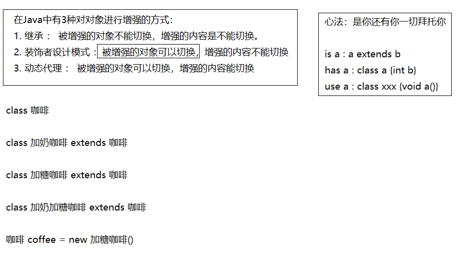
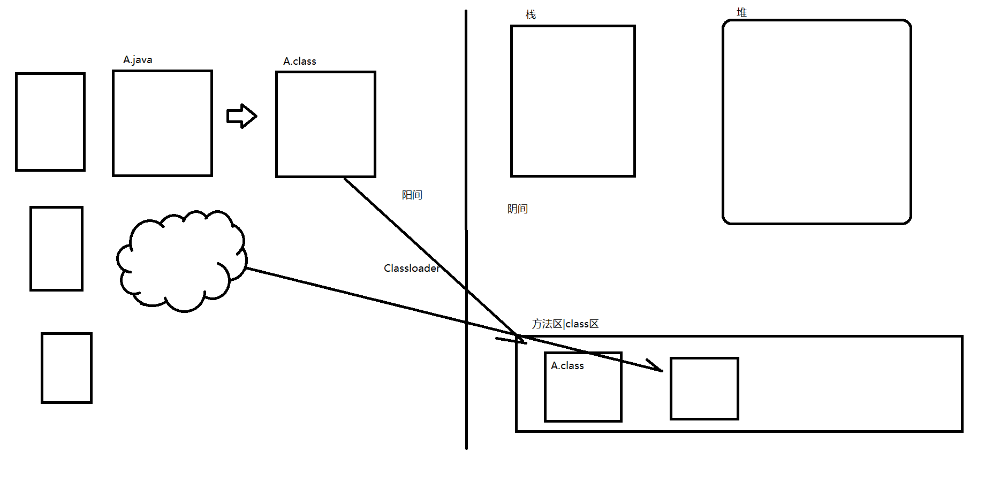
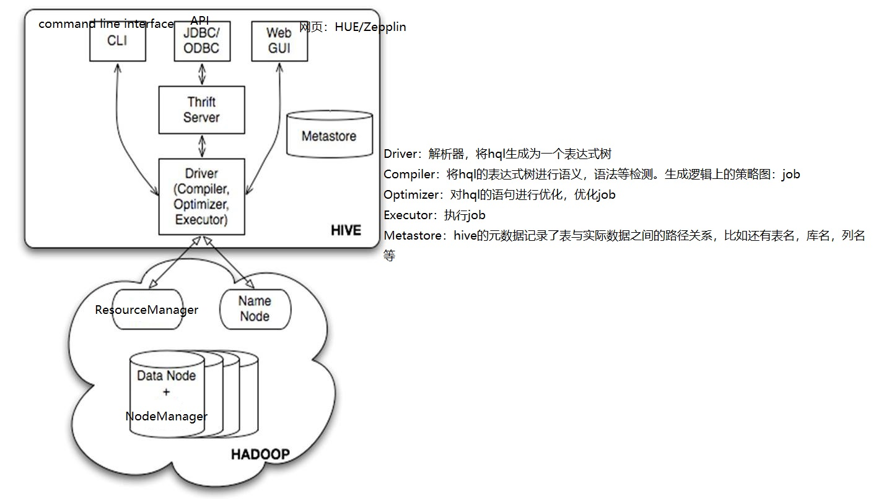
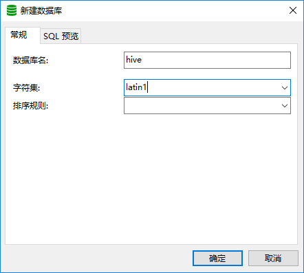
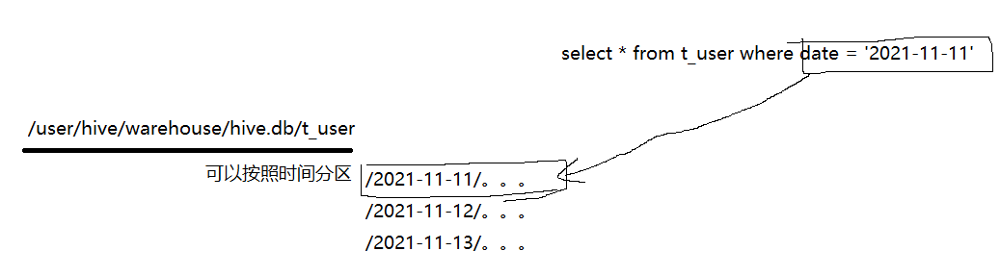
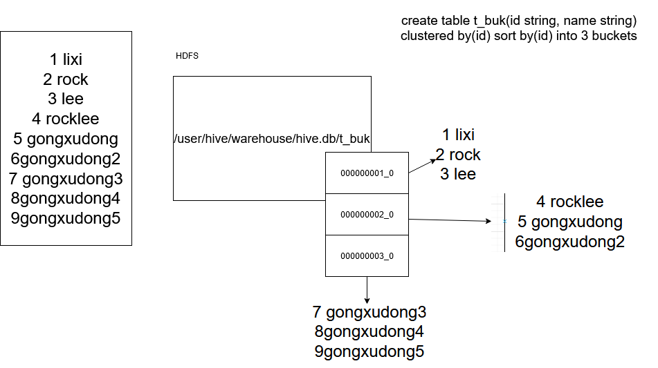
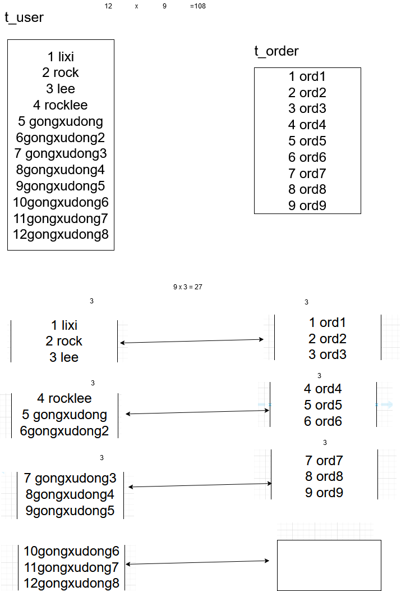
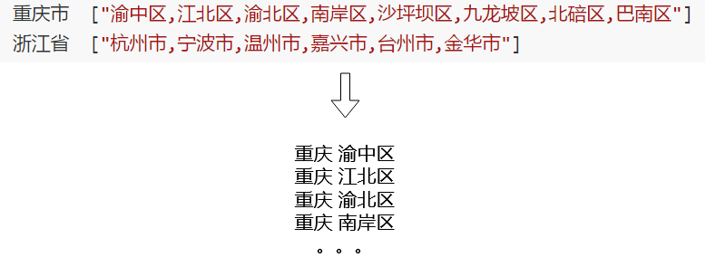
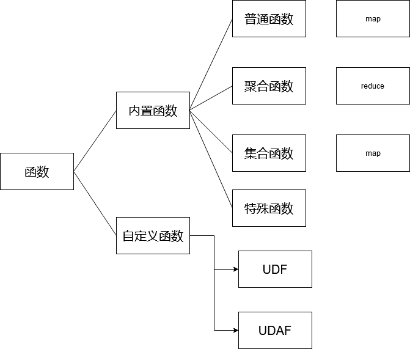

# 上周回顾

```
1. mapreudce
- combiner:其实就是reducer，因为他是做聚合。不同之处在于他是在map阶段完之后立刻当前map进行局部聚合。
- map/reduce : setup:在主方法执行前执行一次,cleanup：在主方法执行之后执行一次
- partitioner ： 分区器，定义分区规则
- TextOutputFormat : 
- 自定义Bean对象：Writable或者WritableComparable
* TOPN/WEB日志的清洗/。。。
2. hive
- 数据仓库 ： OLAP分析 ： 海量数据分析
- Hive的底层结构：Compiler。。。
- Hive的作用 ： 将sql语句解析成mr的代码执行
- Hive的安装：
	单机模式：Derby
	远程模式：Mysql
	* 元数据 ： Mysql，表名、列名、数据库名、你数据对应的在你的位置
	* 数据 ：保存在HDFS中。
- DDL
	database crud
	create table
	导入数据
	1. hdfs hdfs -put
	2. load data
	3. create like location
	4. create like
	5. create as select statement
	6. insert table select
```

# 昨日回顾

```
1. DDL
CREATE TABLE
ROW FORMAT DELIMITED FIELDS TERMINATED BY ','

内部表和外部表

ALTER TABLE xxx CHANGE old new type first|after column


2. 分区
hive 分区：在表目录下建立子目录，缩小扫描的范围
mr 分区：决定数据被输出到哪个文件的规则

静态分区
动态分区：严格模式|非严格模式
混合分区：

create table（
）
partitioned by(country string)
row format

load data  xxxx partition(country=‘’)
insert into table partition(country) 
select 
```

# 昨日回顾

```
DDL : CREATE TABLE
	分桶
DML ：Loaddata、Insert、Write data、update、delete、merge
DQL ：SELECT、JOIN、IN、WHERE、ORDER、GROUP BY
```

# 昨日回顾

```
1. 继承、装饰者设计模式、动态代理(代理工厂)
2. Hive函数 ： 通用内置函数：数值：floor、ceil、round。数学：abcs 。 日期：date_add、add_month、to_date、to_unix_time。 字符串：substr\length\concat。 聚合：sum/max/min。 窗口函数：over（），
row_numer\rank\dense_rank
```

# 装饰者设计模式



## 1 Student

```java
package com.qf.bigdata.java;

public class Student {

    public String name;

    public void study() {
        System.out.println("C");
        System.out.println("C++");
        System.out.println("C#");
        System.out.println("计算机组成原理");
        System.out.println("计算机网络");
        System.out.println("计算机基础");
    }
}
```

## 2 QphoneStudent

```java
package com.qf.bigdata.java;

public class QphoneStudent extends Student {
    private Student student;

    public QphoneStudent(Student student) {
        this.student = student;
    }

    public void study() {
        student.study();
        System.out.println("Java");
        System.out.println("Hadoop");
        System.out.println("Spark");
        System.out.println("Flink");
        System.out.println("Hive");
        System.out.println("HBase");
        System.out.println("Presto");
        System.out.println("ClickHouse");
        System.out.println("Milvus");
        System.out.println("Kylin");
        System.out.println("Flume");
        System.out.println("Hudi");
        System.out.println("Sqoop");
        System.out.println("git");
        System.out.println("...");
    }
}

```

## 3 TestDemo

```java
package com.qf.bigdata.java;

public class TestDemo {
    public static void main(String[] args) {
        Student student = new Student();
        student.name = "龚旭东";

        Student girl = new GirlStudent();
        girl.name = "杨倩";

        QphoneStudent qphoneStudent = new QphoneStudent(girl);
        qphoneStudent.study();
    }
}
```

# 动态代理

> ​	动态代理一般情况下来说，你写代码一般不会使用，但是如果你想要取阅读一下框架的底层源码，你发现导出都是动态代理设计模式。
>
> ​	动态代理我们一个类的一个方法即可：java.lang.reflect.Proxy

## 1 动态代理的基本应用

```java
package com.qf.bigdata.java;

import java.lang.reflect.InvocationHandler;
import java.lang.reflect.Method;
import java.lang.reflect.Proxy;

public class TestProxy {

    public static void main(String[] args) {
        /**
         * ClassLoader loader, 类的加载器
         * Class<?>[] interfaces, 接口类的数组
         * InvocationHandler h, 调用处理器
         */
        Class[] interfaces = {Human.class, Animal.class}; // 只要实现了这两个接口之一的对象我都能够代理

        Human proxy = (Human)Proxy.newProxyInstance(
                TestProxy.class.getClassLoader(),
                interfaces,
                new InvocationHandler() {
                    /**
                     * 调用方法:这个方法会在代理对象调用方法的时候自动被调用一次
                     */
                    @Override
                    public Object invoke(Object proxy, Method method, Object[] args) throws Throwable {
                        System.out.println("------->" + method.getName());
                        method.invoke(new SuperMan(),args);
                        System.out.println("增强");
                        return null;
                    }
                }
        );

        proxy.run();
        proxy.speak();
    }
}

interface Human {
    public void run();
    public void speak();
}

interface Animal {
    public void eat();
}

class SuperMan implements Human {

    @Override
    public void run() {
        System.out.println("飞");
    }

    @Override
    public void speak() {
        System.out.println("把内裤穿在外边说话");
    }
}
```



## 2 代理工厂

### 2.1 ProxyFactory

```java
package com.qf.bigdata.java.factory;

import java.lang.reflect.InvocationHandler;
import java.lang.reflect.Method;
import java.lang.reflect.Proxy;

/**
 * 代理工厂
 */
public class ProxyFactory {

    private Object target; // 目标对象
    private BeforeAdvice beforeAdvice; // 前置增强
    private AfterAdvice afterAdvice; // 后置增强

    public ProxyFactory(Object target) {
        this.target = target;
    }

    /**
     * 创建代理对象
     */
    public Object createProxy() {
        //1. 如果没有代理对象，就返回null
        if (target == null) return target;
        //2. 创建代理对象
        Object proxy = Proxy.newProxyInstance(
                ProxyFactory.class.getClassLoader(), // 类的加载器
                target.getClass().getInterfaces(), // 目标对象的父接口数组
                new InvocationHandler() {
                    @Override
                    public Object invoke(Object proxy, Method method, Object[] args) throws Throwable {
                        if (beforeAdvice != null) beforeAdvice.before(); // 如果有前置增强，就进行前置增强
                        method.invoke(target, args); // 调用目标对象的方法
                        if (afterAdvice != null) afterAdvice.after(); // 如果有后置增强，就进行后置增强
                        return proxy;
                    }
                }
        );
        return proxy;
    }

    public Object getTarget() {
        return target;
    }

    public void setTarget(Object target) {
        this.target = target;
    }

    public BeforeAdvice getBeforeAdvice() {
        return beforeAdvice;
    }

    public void setBeforeAdvice(BeforeAdvice beforeAdvice) {
        this.beforeAdvice = beforeAdvice;
    }

    public AfterAdvice getAfterAdvice() {
        return afterAdvice;
    }

    public void setAfterAdvice(AfterAdvice afterAdvice) {
        this.afterAdvice = afterAdvice;
    }
}
// 前置增强
interface BeforeAdvice {
    public void before();
}
// 后置增强
interface AfterAdvice {
    public void after();
}

```

### 2.2 TestDemo

```java
package com.qf.bigdata.java.factory;

public class TestDynamicProxy {
    public static void main(String[] args) {
        //1. 创建被代理对象
        Waiter manWaiter = new ManWaiter();
        //2. 使用代理工程为manWaiter创建代理对象
        ProxyFactory factory = new ProxyFactory(new WomanWaiter());
//        factory.setBeforeAdvice(new BeforeAdviceImpl());
        factory.setAfterAdvice(new AAdviceImpl());
        Waiter proxy = (Waiter) factory.createProxy();
        //3. 调用方法
        proxy.service();
    }
}

interface Waiter {
    public void service();
}

class ManWaiter implements Waiter {
    @Override
    public void service() {
        System.out.println("为您服务---------------");
    }
}

class WomanWaiter implements Waiter {

    @Override
    public void service() {
        System.out.println("志玲姐姐为你服务");
    }
}

/**
 * 具体在前置增强中做什么
 */
class BeforeAdviceImpl implements BeforeAdvice {
    @Override
    public void before() {
        System.out.println("您好 ----->");
    }
}

/**
 * 具体在后置增强中做什么
 */
class AfterAdviceImpl implements AfterAdvice {
    @Override
    public void after() {
        System.out.println("再见 --------> 欢迎下次光临");
    }
}

class AAdviceImpl implements AfterAdvice {

    @Override
    public void after() {
        System.out.println("我是后置增强2");
    }
}

```


# Hive

# 一 Hive介绍

## 1 hive是什么？

> ​	hive是数据仓库工具。它是构建在hadoop基础之上的数据仓库，它的数据实际是存储到HDFS中的；它的计算实际上默认使用的是Mapreduce/Spark/Tez。它的作用是你可以写类似sql，然后hive将sql进行转换为mapreudce的代码。
>
> ​	hive是非死不可（facebook),现在已经被贡献给apache基金会
>
> ​	数据库的应用场景OLTP的业务场景
>
> ​	数据仓库的应用场景OLAP的业务场景，面向分析决策的。为管理者决策之用。


## 2 Hive架构

### 2.1 架构



### 2.2 元数据管理

- derby ： hive自带的数据库

> 优点:不用配置，简单粗暴
>
> 缺点：只支持单session。单线程，存储容量小

- mysql

> 优点：支持多session，存储容量大
>
> 缺点：需要额外配置

## 3 Hive安装

### 3.1 安装前准备工作

> 1. 必须要保证当前机器已经安装hadoop以及jdk
> 2. 并且配置好了hadoop以及jdk环境变量

### 3.2 安装单机版的Hive——Derby

```sh
##1. 解压
[root@hadoop software]# tar -zxvf apache-hive-1.2.1-bin.tar.gz -C /opt/apps/
[root@hadoop apps]# mv apache-hive-1.2.1-bin/ hive-1.2.1

##2. 配置环境变量
[root@hadoop hive-1.2.1]# vi /etc/profile

## 自定义配置
## Java
export JAVA_HOME=/opt/apps/jdk1.8.0_45
export HADOOP_HOME=/opt/apps/hadoop-2.8.1
export HIVE_HOME=/opt/apps/hive-1.2.1
export CLASS_PATH=.:$JAVA_HOME/lib
export PATH=$PATH:$JAVA_HOME/bin:$HADOOP_HOME/bin:$HADOOP_HOME/sbin:$HIVE_HOME/bin

##3. hive-env.sh(当你的服务启动的时候，自动加载*-env.sh的脚本)
[root@hadoop conf]# mv hive-env.sh.template hive-env.sh

[root@hadoop conf]# vi hive-env.sh
# Set HADOOP_HOME to point to a specific hadoop install directory
HADOOP_HOME=/opt/apps/hadoop-2.8.1
# Hive Configuration Directory can be controlled by:
export HIVE_CONF_DIR=/opt/apps/hive-1.2.1/conf

##4. 启动测试hive
[root@hadoop conf]# start-dfs.sh
[root@hadoop conf]# start-yarn.sh
[root@hadoop bin]# `hive`
hive> create database hive;
OK
Time taken: 0.08 seconds
hive> use hive;
OK
Time taken: 0.008 seconds
hive> create table t_user(
    > id int,
    > name string,
    > sex string)
    > row format delimited fields terminated by '\t'
    > lines terminated by '\n'
    > stored as textfile;
OK
Time taken: 0.279 seconds
hive> show databases;
OK
default
hive
Time taken: 0.007 seconds, Fetched: 2 row(s)
hive> show tables;
OK
t_user
Time taken: 0.01 seconds, Fetched: 1 row(s)

##5. 退出hive客户端
##5.1 查看以下hdfs下的路径，这个路径就是t_user表对应的数据在hdfs上的存储路径
[root@hadoop bin]# hdfs dfs -ls /user/hive/warehouse/hive.db
Found 1 items
drwxr-xr-x   - root supergroup          0 2021-09-24 10:57 /user/hive/warehouse/hive.db/t_user
##5.2 自定义user.txt并上传到我们指定的目录中
[root@hadoop bin]# hdfs dfs -put user.txt /user/hive/warehouse/hive.db/t_user

##6. 连接到hive
hive> select * from t_user;
OK
1       lixi    man
2       gongxudong      man
3       wusansan        woman
```

### 3.3 安装Mysql保存元数据的hive——远程模式

```sh
##1. mysql安装好
##2. mysql启动成功
##3. 创建hive/conf/hive-site.xml
<?xml version="1.0" encoding="UTF-8" standalone="no"?>
<?xml-stylesheet type="text/xsl" href="configuration.xsl"?><!--
   Licensed to the Apache Software Foundation (ASF) under one or more
   contributor license agreements.  See the NOTICE file distributed with
   this work for additional information regarding copyright ownership.
   The ASF licenses this file to You under the Apache License, Version 2.0
   (the "License"); you may not use this file except in compliance with
   the License.  You may obtain a copy of the License at

       http://www.apache.org/licenses/LICENSE-2.0

   Unless required by applicable law or agreed to in writing, software
   distributed under the License is distributed on an "AS IS" BASIS,
   WITHOUT WARRANTIES OR CONDITIONS OF ANY KIND, either express or implied.
   See the License for the specific language governing permissions and
   limitations under the License.
-->
<configuration>

  <property>
    <name>javax.jdo.option.ConnectionUserName</name>
    <value>root</value>
    <description>Username to use against metastore database</description>
  </property>

  <property>
    <name>javax.jdo.option.ConnectionDriverName</name>
    <value>com.mysql.jdbc.Dirver</value>
    <description>Driver class name for a JDBC metastore</description>
  </property>

  <property>
    <name>javax.jdo.option.ConnectionURL</name>
    <value>jdbc:mysql://10.206.0.4:3307/hive</value>
    <description>JDBC connect string for a JDBC metastore</description>
  </property>

  <property>
    <name>javax.jdo.option.ConnectionPassword</name>
    <value>123456</value>
    <description>password to use against metastore database</description>
  </property>

</configuration>
##4. 将mysql的jdbc的驱动jar包拷贝hive的lib目录下
##5. 在mysql上提前创建hive数据库
##5.1 先在mysql中进行远程授权
mysql> grant all privileges on *.* to 'root'@'%' identified by '123456' with grant option;
mysql> flush privileges;
mysql> grant all privileges on *.* to 'root'@'hadoop' identified by '123456' with grant option;
##5.2 在建立hive数据库
```



```sh
##5.3 直接启动hive命令即可
```

## 4 Hive的基本语法

### 4.1 DDL

#### 4.1.1 修改hive的日志文件位置

```sh
[root@hadoop conf]# mv hive-log4j.properties.template hive-log4j.properties
hive.log.dir=/opt/apps/hive-1.2.1/logs
```

#### 4.1.2 Create/Drop/Alter/Use Database

> 元数据：Mysql
>
> 数据：HDFS

##### 4.1.2.1 create database

```sql
--1. 语法
CREATE DATABASE [IF NOT EXISTS] database_name
  [COMMENT database_comment]
  [LOCATION hdfs_path]
  [MANAGEDLOCATION hdfs_path]
  [WITH DBPROPERTIES (property_name=property_value, ...)];
  
--2. e.g.
hive> create database if not exists hive;
OK
Time taken: 0.575 seconds
```

##### 4.1.2.2 default库

> hive有一个默认的数据库。
>
> 默认库目录：hdfs://hadoop:9000/user/hive/warehouse/

##### 4.1.2.3 建库的本质

> hive> create database if not exists hive;
>
> 例如这句话，他的本质就是在hdfs的hdfs://hadoop:9000/user/hive/warehouse/hive.db的目录

##### 4.1.2.4 其他语法

```sql
-- 切换数据库
hive> use default;
OK

-- 删除数据库
DROP DATABASE [IF EXISTS] database_name [CASCADE];

e.g.
hive> drop database hive;
FAILED: Execution Error, return code 1 from org.apache.hadoop.hive.ql.exec.DDLTask. InvalidOperationException(message:Database hive is not empty. One or more tables exist.)
hive> drop database hive cascade; -- 级联删除
OK
Time taken: 1.272 seconds
hive> show databases;
OK
default

-- 修改库
ALTER DATABASE database_name SET DBPROPERTIES (property_name=property_value, ...);

e.g.
hive> create database if not exists hive WITH DBPROPERTIES("name"="lixi", "sex"="man");

hive> desc database extended hive;
OK
hive            hdfs://hadoop:9000/user/hive/warehouse/hive.db  root    USER    {sex=man, name=lixi}

-- 修改库的属性
hive> ALTER DATABASE hive SET DBPROPERTIES ("name"="lidong");
hive> desc database extended hive;
OK
hive            hdfs://hadoop:9000/user/hive/warehouse/hive.db  root    USER    {sex=man, name=lidong}
Time taken: 0.012 seconds, Fetched: 1 row(s)
```

#### 4.1.3 Create Table

```sql
-- 语法
CREATE [TEMPORARY] [EXTERNAL] TABLE [IF NOT EXISTS] [db_name.]table_name
  [(col_name data_type [COMMENT col_comment], ...)]
  [COMMENT table_comment]
  [PARTITIONED BY (col_name data_type [COMMENT col_comment], ...)]
  [CLUSTERED BY (col_name, col_name, ...) [SORTED BY (col_name [ASC|DESC], ...)] INTO num_buckets BUCKETS]
  [
   [ROW FORMAT row_format] 
   [STORED AS file_format]
     | STORED BY 'storage.handler.class.name' [WITH SERDEPROPERTIES (...)] 
  ]
  [LOCATION hdfs_path]
  [TBLPROPERTIES (property_name=property_value, ...)]
  [AS select_statement];
 
CREATE [TEMPORARY] [EXTERNAL] TABLE [IF NOT EXISTS] [db_name.]table_name
  LIKE existing_table_or_view_name
  [LOCATION hdfs_path];
```

##### 4.1.3.1 建表的本质

> 在hdfs://hostname:9000/user/hive/warehouse/database/tablename

##### 4.1.3.2 建表

```sql
hive> create table if not exists hive.t_user(
    > id int,
    > name string,
    > sex string
    > )
    > row format delimited
    > fields terminated by ','
    > lines terminated by '\n'
    > stored as textfile;
OK
Time taken: 0.144 seconds

-- 1. 第一个在mysql的hive库中的tbl表中产生了一条元数据
-- 2. 第二个在hdfs中的/user/hive/warehouse/hive.db/t_user
```

##### 4.1.3.3 导入数据

```sql
LOAD DATA [LOCAL] INPATH 'file_path' INTO TABLE 'table_name'

e.g.
--1. 导入数据其实有很多办法，其中就可以使用hadoop命令直接简单粗暴上传到hdfs的hive表对应的目录。但是这种方法不推荐。
--2. 我们一般使用LOAD DATA命令来将数据导入（他只支持textfile文件类型）
hive> load data local inpath '/home/user.txt' into table hive.t_user;
--tip: local字段表示从本地文件系统中拷贝数据文件到指定的表目录。如果没有加local表示从hdfs中的目录中剪切数据文件到表指定的目录。

--3. 使用insert语句导入
--3.1 可以插入数据，但是不推荐。因为1时间太长因为走mr，2.因为他会产生大量的小文件
hive> insert into t_user values(6,'lixixi',3838438);
--3.2 这种方式可以。
hive> create table if not exists hive.t_user2(
    > id int,
    > name string,
    > sex string
    > )
    > row format delimited
    > fields terminated by ','
    > lines terminated by '\n'
    > stored as textfile;
OK
Time taken: 0.061 seconds
hive> insert into table t_user2
    > select * from t_user;
    
--3.3 另一种建表方式：客隆表不带数据
hive> create table if not exists hive.t_user3 like t_user2;
OK
Time taken: 0.084 seconds

--3.4 另一种建表方式：客隆表带数据（不推荐）
hive> create table if not exists hive.t_user4 like t_user2
    > location '/user/hive/warehouse/hive.db/t_user2';
    
--3.5 克隆表带数据(推荐)
create table if not exists t_user2
as
select * from t_user;
```

##### 4.1.3.4 hive统计上下行流量

> 1. 观察数据
> 2. 根据数据建表
> 3. 导入数据
> 4. sql分析

- 建表

```sql
CREATE TABLE IF NOT EXISTS flow  (
    id STRING,
    phone STRING,
    mac STRING,
    ip STRING,
    url STRING,
    type STRING,
    u1 INT,
    u2 INT,
    upFlow INT,
    downFlow INT,
    code INT
)
ROW FORMAT DELIMITED
FIELDS TERMINATED BY '\t'
LINES TERMINATED BY '\n'
STORED AS textfile;
```

- 导入数据

```sql
LOAD DATA LOCAL INPATH '/data/tmp/flow.dat' INTO TABLE hive.flow;
```

- 分析sql

```sql
SELECT
phone,
SUM(upFlow) upFlow,
SUM(downFlow) downFlow,
SUM(upFlow + downFlow) totalFlow
FROM FLOW f
GROUP BY phone;
```

##### 4.1.3.5 外部表

> 默认建表都是建的内部表。内部表默认的数据存放路径都是：/user/hive/warehouse/数据库名/表名
>
> 外部表可以自定义数据存放的位置

- 创建外部表

```sql
create external table if not exists t_user(
    id int,
    name string
)
row format delimited
fields terminated by ','
location '/hive/user'
;

tip:
外部表与内部表不同之处：
1. 在mysql的元数据表中，外部表的类型：externel table。 内部表：managed table
2. 外部表的数据存储路径是由我们自己指定的
3. 外部表删除表的时候只删除元数据不删除数据。而内部表删除表的时候，元数据和数据都会删除。
```

#### 4.1.4 Alter Table

##### 4.1.4.1 修改表名

```sql
-- 语法
ALTER TABLE old_table RENAME TO new_table
-- 举例
e.g.
ALTER TABLE hive.flow RENAME TO hive.f;
```

##### 4.1.4.2 修改表属性

```sql
-- 语法
ALTER TABLE table_name SET TBLPROPERTIES table_properties;
-- 举例
e.g.
--1.1 建表的时候指定表属性
CREATE TABLE hive.f1(
id INT
)
TBLPROPERTIES("name"="lixi");

--1.2 查看表属性
hive> desc extended hive.f1;
OK
id                      int

Detailed Table Information      Table(tableName:f1, dbName:hive, owner:root, createTime:1632623877, lastAccessTime:0, retention:0, sd:StorageDescriptor(cols:[FieldSchema(name:id, type:int, comment:null)], location:hdfs://hadoop:9000/user/hive/warehouse/hive.db/f1, inputFormat:org.apache.hadoop.mapred.TextInputFormat, outputFormat:org.apache.hadoop.hive.ql.io.HiveIgnoreKeyTextOutputFormat, compressed:false, numBuckets:-1, serdeInfo:SerDeInfo(name:null, serializationLib:org.apache.hadoop.hive.serde2.lazy.LazySimpleSerDe, parameters:{serialization.format=1}), bucketCols:[], sortCols:[], parameters:{}, skewedInfo:SkewedInfo(skewedColNames:[], skewedColValues:[], skewedColValueLocationMaps:{}), storedAsSubDirectories:false), partitionKeys:[], parameters:{name=lixi, transient_lastDdlTime=1632623877}, viewOriginalText:null, viewExpandedText:null, tableType:MANAGED_TABLE)

--1.3 修改表属性
ALTER TABLE hive.f1 SET TBLPROPERTIES ("name" = "linan");
```

##### 4.1.4.3 修改列名

```sql
-- 语法
ALTER TABLE table_name CHANGE [COLUMN] old_column new_column new_column_type
-- 举例
e.g.
ALTER TABLE hive.f1 CHANGE COLUMN id fid STRING;
```

##### 4.1.4.4 修改列的位置

```sql
-- 语法
ALTER TABLE table_name CHANGE [COLUMN] old_column new_column new_column_type AFTER|FIRST column_name
-- 举例
e.g.
ALTER TABLE hive.f CHANGE id id string AFTER phone; -- 将一个列放在另一个列之后
tip: 这个修改列位置其实是修改的表的元数据，表对应的真实数据并不会被修改。所以这种方式慎用

ALTER TABLE hive.f CHANGE id id string FIRST; -- 将一个列放在第一列
```

##### 4.1.4.5 修改列的类型

- 新增列

```sql
-- 语法 : 修改列的类型
ALTER TABLE table_name CHANGE [COLUMN] old_column new_column new_column_type

-- 语法 ： 新增一个列
ALTER TABLE table_name ADD COLUMNS (
    new_column1 new_column1_type,
    new_column2 new_column2_type,
    ...
);
-- 举例
e.g.
ALTER TABLE hive.f1 ADD COLUMNS(fname STRING, address INT);
```

- 删除列（替换列）

```sql
-- 语法 ： 替换一个表中的所有列
ALTER TABLE table_name REPLACE COLUMNS (
    new_column1 new_column1_type,
    new_column2 new_column2_type,
    ...
);

e.g.
ALTER TABLE hive.f1 REPLACE COLUMNS(fname STRING);
tip:比如我原来的表：fname,address,sex。 我使用以上语句替换原来的表的列：fname。得到结果是f1表还剩下fname列，由于fname之前和之后同名，相当于是删除了address和sex列。
```

- 修改内部表为外部表

```sql
ALTER TABLE hive.f1 SET TBLPROPERTIES('EXTERNAL'='TRUE');
```

- 显示库名

```sh
## 是通过命令行设置，只有单次效果
set hive.cli.print.current.db=true

## 配置到hive-site.xml,永久生效
<property>
  <name>hive.cli.print.current.db</name>
  <value>true</value>
</property>
```

#### 4.1.5 删除表

```sql
DROP TABLE [IF EXISTS] table_name;
e.g
hive (hive)> drop table f1;
tip:
删除表达本质：
1. 删除元数据
2. 删除数据（外部表不删除数据）
```

### 4.2 分区分桶

#### 4.2.1 分区

##### 4.2.1.1 什么是分区？

> ​	随着系统时间增加，对应hive来说每次进行select *的时候都会进行在指定hdfs目录下的全表扫描，随着时间增加数据量直线上升，将会导致扫描的数据也跟着上升。这将影响到hive的查询性能。为了提升查询性能，我们将来会将哪些我们经常要做条件查询的字段作为分区来进行分区操作。
>
> ​	分区的作用就是避免hive进行全表扫描，提升查询效率
>
> ​	不同与mapreudce的分区，mr是将数据指定到不同的文件下，而hive的分区是提升查询效率之用。
>
> ​	hive的分区本质，将数据划分到不同的**子目录**。
>
> ​	我们分区的原则是使用经常作为条件的字段进行分区。



##### 4.2.1.2 分区语法——创建分区表

```sql
CREATE [TEMPORARY] [EXTERNAL] TABLE [IF NOT EXISTS] [db_name.]table_name
  [(col_name data_type [COMMENT col_comment], ...)]
  [COMMENT table_comment]
  [PARTITIONED BY (col_name data_type [COMMENT col_comment], ...)]
  [
      [ROW FORMAT row_format] 
      [STORED AS file_format]
      | STORED BY 'storage.handler.class.name' [WITH SERDEPROPERTIES (...)] 
  ]
  [LOCATION hdfs_path]
  [TBLPROPERTIES (property_name=property_value, ...)]
  [AS select_statement];
```

- 创建一级静态分区表

```sql
e.g.
-- 创建表
CREATE TABLE IF NOT EXISTS hive.country(
    province STRING,
    city STRING
)
PARTITIONED BY(dates STRING) -- 伪列
ROW FORMAT DELIMITED
FIELDS TERMINATED BY ',';

-- 导入数据
LOAD DATA LOCAL INPATH '/data/tmp/country.txt' INTO TABLE hive.country PARTITION(dates='2021-11-09');
```

- 创建二级分区表

```sql
-- 创建表
CREATE TABLE IF NOT EXISTS hive.country2(
    province STRING,
    city STRING
)
PARTITIONED BY(year STRING, month STRING)
ROW FORMAT DELIMITED
FIELDS TERMINATED BY ',';

-- 导入数据
LOAD DATA LOCAL INPATH '/data/tmp/country.txt' INTO TABLE hive.country2 PARTITION(year='2021', month='11');
LOAD DATA LOCAL INPATH '/data/tmp/country.txt' INTO TABLE hive.country2 PARTITION(year='2021', month='12');
```

- 显示分区

```sql
hive (hive)> show partitions country2;
OK
year=2021/month=11
year=2021/month=12
```

##### 4.2.1.3 修改分区

> ​	在我们实战开发的情况，往往都是先将数据提前采集到HDFS的指定目录下。然后才开始建立外部表，指定数据的采集目录作为外部表的数据目录。但是我们往往都是按照日期采集的数据，外部表只能关联表和数据的目录，日期的目录需要分区关联。我们以上的操作是在load data的语法中指定数据的分区目录，这和我们现在说的情况有出入，因为现在的数据是提前就已经存在了。所以现在修改表的分区。

- 分区语法——添加分区目录

```sql
ALTER TABLE table_name ADD [IF NOT EXISTS] PARTITION partition_spec [LOCATION 'location'][, PARTITION partition_spec [LOCATION 'location'], ...];

e.g.
-- 添加分区的时候无指定目录
ALTER TABLE hive.country ADD IF NOT EXISTS PARTITION(dates='2021-11-12');

-- 添加分区的时候指定目录
--第一种情况，分区目录恰好就在表目录之下
-- 1. 先直接在hdfs建立目录
[root@hadoop ~]# hdfs dfs -mkdir /user/hive/warehouse/hive.db/country/dates=2021-11-13
-- 2. 上传数据到此目录
[root@hadoop ~]# hdfs dfs -put country2.txt /user/hive/warehouse/hive.db/country/dates=2021-11-13
-- 3. 要让元数据和数据目录关联起来：指定分区目录的位置
ALTER TABLE hive.country ADD IF NOT EXISTS PARTITION(dates='2021-11-13');

-- 第二种情况，分区目录不在表目录之下(实际使用这种情况居多)
[root@hadoop ~]# hdfs dfs -mkdir /hive/counry/2021-11-14
[root@hadoop ~]# hdfs dfs -put country3.txt /hive/counry/2021-11-14
hive (hive)> ALTER TABLE hive.country ADD IF NOT EXISTS PARTITION(dates='2021-11-14') LOCATION '/hive/counry/2021-11-14';
```

- 分区语法——重命名分区目录

```sql
ALTER TABLE table_name PARTITION partition_spec RENAME TO PARTITION partition_spec

e.g.
ALTER TABLE hive.country PARTITION(dates='2021-11-09') RENAME TO PARTITION(dates='2021-11-11');
tip:只能修改分区的值，不能修改分区名称。
```

##### 4.2.1.4 删除分区

```sql
ALTER TABLE table_name DROP [IF EXISTS] PARTITION partition_spec[, PARTITION partition_spec, ...]

e.g.
ALTER TABLE hive.country DROP IF EXISTS PARTITION(dates='2021-11-14');
```

##### 4.2.1.5 动态分区

> 静态分区：加载数据的时候需要手动的指定分区值
>
> 动态分区：加载数据的时候不需要手动，他会根据分区的值自动的建立分区目录
>
> 混合分区：静态 + 动态

- 设置本地模式——hive-site.xml

```xml
<!-- 设置本地模式 -->
<property>
    <name>hive.exec.mode.local.auto</name>
    <value>true</value>
</property>
```

- 开启动态分区/关闭严格模式 —— hive-site.xml

> 为何关闭严格模式：因为在严格模式下，hive要使用动态分区必须要有一个静态分区。

```xml
<!-- 开启动态分区 -->
<property>
    <name>hive.exec.dynamic.partition</name>
    <value>true</value>
</property>

<!-- 关闭严格模式: strict or nonstrict -->
<property>
    <name>hive.exec.dynamic.partition.mode</name>
    <value>strict</value>
</property>
```

- 创建动态分区

```sql 
-- 创建原始表以及导入数据
CREATE TABLE IF NOT EXISTS hive.t_part(
    uid INT,
    uname STRING,
    sex STRING,
    age INT,
    country STRING
)
ROW FORMAT DELIMITED
FIELDS TERMINATED BY '\t';

hive (hive)> load data local inpath '/data/tmp/part.txt' into table hive.t_part;

-- 创建分区表(建表的时候不分动态分区表或静态分区表) /user/hive/warehouse/hive.db/t_part_dynamic/country=中国/
CREATE TABLE IF NOT EXISTS hive.t_part_dynamic(
    uid INT,
    uname STRING,
    sex STRING,
    age INT
)
PARTITIONED BY(country STRING) -- 伪列
ROW FORMAT DELIMITED
FIELDS TERMINATED BY '\t';


-- 导入数据
-- 静态分区的做法：
load data local inpath '' into table table_name partition(country='中国')

-- 动态分区
INSERT INTO hive.t_part_dynamic PARTITION(country)
SELECT * FROM hive.t_part;
```

##### 4.2.1.6 混合分区 ： 动态 + 静态(经常用)

```sql
--1. 将hive修改回严格模式
--2. 建混合表
CREATE TABLE IF NOT EXISTS hive.t_part_all(
    uid INT,
    uname STRING,
    sex STRING,
    age INT
)
PARTITIONED BY(year STRING, month STRING)
ROW FORMAT DELIMITED
FIELDS TERMINATED BY '\t';

--3. 原始表
-- 创建原始表以及导入数据
CREATE TABLE IF NOT EXISTS hive.t_part(
    uid INT,
    uname STRING,
    sex STRING,
    age INT,
    month STRING
)
ROW FORMAT DELIMITED
FIELDS TERMINATED BY '\t';

load data local inpath '/data/tmp/part.txt' into table hive.t_part;

--4. 导入数据
INSERT INTO hive.t_part_all PARTITION(year = '2021', month)
SELECT * FROM hive.t_part;
```

#### 4.2.2 分桶

##### 4.2.2.1 什么是分桶？为什么分桶？

> ​	即使我们使用了分区来进行查询优化，但是随着时间推移，我们分区数据还是会逐渐的增加，当分区不能更细粒度划分数据的时候就需要分桶技术对数据进行更细粒度的管理和划分了。
>
> ​	分桶就是对数据进行更细粒度的划分。

##### 4.2.2.2 分桶表的创建语法

```sql
-- 语法
CREATE [TEMPORARY] [EXTERNAL] TABLE [IF NOT EXISTS] [db_name.]table_name
  [(col_name data_type [COMMENT col_comment], ...)]
  [COMMENT table_comment]
  				-- 按照什么来进行分桶				-- 分桶之后按照什么进行排序			--分为几个桶
  [CLUSTERED BY (col_name, col_name, ...) [SORTED BY (col_name [ASC|DESC], ...)] INTO num_buckets BUCKETS]
  [
   [ROW FORMAT row_format] 
   [STORED AS file_format]
     | STORED BY 'storage.handler.class.name' [WITH SERDEPROPERTIES (...)] 
  ]
  [LOCATION hdfs_path]
  [TBLPROPERTIES (property_name=property_value, ...)]
  [AS select_statement];
```

##### 4.2.2.3 分桶的作用

> 1. 为了保证我进行分桶查询
> 2. 抽样查询

##### 4.2.2.4 分桶的本质

> 在hive中的分桶其实就类似于MR中的分区。



##### 4.2.2.5 分桶的作用

> hive中的分桶的本质其实是帮助我们在进行join查询的时候减少查询的次数



##### 4.2.2.6 分桶案例

- 数据

```
1,lixi1,man,18,java
2,lixi3,man,18,java
3,lixi5,man,18,java
4,lixi7,man,18,java
5,lixi9,man,18,java
6,lixi2,man,18,java
7,lixi4,man,18,java
8,lixi6,man,18,java
9,lixi8,man,18,java
10,lixi10,man,18,java
11,lixia,man,18,java
12,lixie,man,18,java
13,lixib,man,18,java
14,lixif,man,18,java
15,lixic,man,18,java
16,lixig,man,18,java
17,lixid,man,18,java
18,lixih,man,18,java
```

- 创建原始表

> 分桶表的数据不能使用load data的方式进行插入

```sql
-- 1. 建立原始表
CREATE TABLE IF NOT EXISTS t_student(
    sno INT,
    sname STRING,
    gender STRING,
    age INT,
    subject STRING
)
ROW FORMAT DELIMITED
FIELDS TERMINATED BY ',';

--2. 将数据导入到原始表
LOAD DATA LOCAL INPATH '/data/tmp/data.txt' INTO TABLE hive.t_student;

--3. 分桶查询
SELECT * FROM hive.t_student CLUSTER BY(sno); -- 按照sno进行分桶并且按照sno进行升序排序
SELECT * FROM hive.t_student DISTRIBUTE BY(sno) SORT BY(sno); -- 按照sno进行分桶并且按照sno进行升序排序
```

- 创建分桶表

```sql
-- 4. 建立分桶表
CREATE TABLE IF NOT EXISTS t_student_buk(
    sno INT,
    sname STRING,
    gender STRING,
    age INT,
    subject STRING
)
CLUSTERED BY(sno) SORTED BY(sname DESC) INTO 4 BUCKETS
ROW FORMAT DELIMITED
FIELDS TERMINATED BY ',';

-- 5. 设置reduce task的个数，一般情况下和分桶数一样
set mapreduce.job.reduces=4;

-- 6. 给分桶表导入数据
-- 6.1 不要使用LOAD DATA导入数据，不会报错，但是没有分桶的效果
-- 6.2 insert导入数据到分桶表
INSERT INTO t_student_buk
SELECT * FROM t_student DISTRIBUTE BY(sno) SORT BY(sname DESC);

-- 业务： 约定>配置>编码
```

> INSERT INTO [TABLE]:  追加
>
> INSERT OVERWRITE TABLE : 覆盖 ， 删除原数据，然后再插入

##### 4.2.2.7 抽样查询

- 语法

```sql
SELECT * FROM tablename TABLESAMPLE (BUCKET x OUT OF y [ON colname])
tip:
x : 从第几桶开始查询，x不能大于y的。
y : 表示查询的总的桶数（可以不和实际的桶数，可以是实际的桶数的倍数）
```

- 案例

```sql
-- 1. 准备数据
1 a
2 b
3 c
4 d
5 e
6 f
7 g
8 h
9 i
10 j
11 k
12 l

--2. 建立分桶表
CREATE TABLE IF NOT EXISTS source(
    id INT,
    name STRING
)
ROW FORMAT DELIMITED
FIELDS TERMINATED BY ' ';

LOAD DATA LOCAL INPATH '/data/tmp/source.txt' INTO TABLE hive.source;

CREATE TABLE IF NOT EXISTS source_buk(
    id INT,
    name STRING
)
CLUSTERED BY(id) SORTED BY(id DESC) INTO 4 BUCKETS
ROW FORMAT DELIMITED
FIELDS TERMINATED BY ' ';

INSERT OVERWRITE TABLE hive.source_buk
SELECT * FROM source DISTRIBUTE BY(id) SORT BY(id DESC);

--3. 抽样查询 ： 按照桶抽样
SELECT * FROM source_buk TABLESAMPLE(BUCKET 1 out of 4);
SELECT * FROM source_buk TABLESAMPLE(BUCKET 1 out of 4 ON id);

-- 3.1 压缩
SELECT * FROM source_buk TABLESAMPLE(BUCKET 1 out of 2);

-- 3.2 拉伸
SELECT * FROM source_buk TABLESAMPLE(BUCKET 1 out of 8);

--4. 按照行数抽样
SELECT * FROM source_buk LIMIT 4; -- 查询前四行
SELECT * FROM source_buk TABLESAMPLE(4 ROWS);

--5. 按照百分比抽样
SELECT * FROM source_buk TABLESAMPLE(13 PERCENT); -- 查询前13%的数据

--6. 按照文件容量抽样
SELECT * FROM source_buk TABLESAMPLE(68B); -- 查询前68个字节单位的数据

--7. 随机三行数据
SELECT * FROM source_buk ORDER BY rand() LIMIT 3; -- 提取随机的三行数据

--8. 分桶的条件查询
SELECT * FROM source_buk TABLESAMPLE(BUCKET 1 out of 2) WHERE name = 'l';
```

#### 4.2.3 分区分桶

##### 4.2.3.1 数据

> 学号 姓名 性别（1表示男，2表示女）

```
01 lixi 1
02 rock 1
03 lee 2
04 rocklee 1
05 tim 1
06 tom 2
07 narudo 1
08 seiya 2
09 marry 2
10 jack 1
11 zhangsan 1
12 lisi 2
13 wangba 1
14 zhaoliu 2
15 tianqi 1
16 zhuba 2
17 tommy 1
```

> 要求是：按照性别分区，按照学号分桶，分为4个桶

##### 4.2.3.2 实施

```sql
-- 1. 创建原始数据表并导入数据
CREATE TABLE IF NOT EXISTS part_buk_source (
    sno STRING,
    name STRING,
    gender INT
)
ROW FORMAT DELIMITED FIELDS TERMINATED BY ' ';

LOAD DATA LOCAL INPATH '/data/tmp/part_buk.txt' INTO TABLE hive.part_buk_source;

--2. 创建分区分桶表
CREATE TABLE IF NOT EXISTS part_buk (
    sno STRING,
    name STRING
)
PARTITIONED BY (gender INT)
CLUSTERED BY (sno) INTO 4 BUCKETS
ROW FORMAT DELIMITED FIELDS TERMINATED BY ' ';

--3. 导入数据
set mapreduce.job.reduces=4;
set hive.exec.dynamic.partition.mode=nonstrict;

INSERT OVERWRITE TABLE part_buk PARTITION(gender)
SELECT sno, name, gender FROM part_buk_source CLUSTER BY(sno);

--4. 进行查询
SELECT * FROM part_buk TABLESAMPLE(BUCKET 2 OUT OF 2) WHERE gender = 2;
```

##### 4.2.3.3 小结

> - 分区的分区字段是一个表外字段，分桶使用的表内字段
> - 分区的目的很明确为了缩小查询范围采取的优化策略；分桶是更细粒度的管理数据，他是为了减少抽样查询或者join查询的时候查询次数。

### 4.3 Hive的Thrift服务

#### 4.3.1 core-site.xml

```xml
<property>
    <name>hadoop.proxyuser.root.hosts</name>
    <value>*</value>
</property>
<property>
    <name>hadoop.proxyuser.root.groups</name>
    <value>*</value>
</property>
```

> 修改配置之后一定记得重启

#### 4.3.2 启动Hive的thrift服务

```sh
##1. 启动服务
hive --service hiveserver2 &

##2. 连接到thrift服务
[root@hadoop bin]# beeline
Beeline version 1.2.1 by Apache Hive
beeline> !connect jdbc:hive2://hadoop:10000
Connecting to jdbc:hive2://hadoop:10000
Enter username for jdbc:hive2://hadoop:10000: root
Enter password for jdbc:hive2://hadoop:10000: ******
Connected to: Apache Hive (version 1.2.1)
Driver: Hive JDBC (version 1.2.1)
Transaction isolation: TRANSACTION_REPEATABLE_READ
0: jdbc:hive2://hadoop:10000> !quit
```

### 4.4 DML

#### 4.4.1 LOAD —— 导入数据

```sql
LOAD DATA [LOCAL] INPATH 'filepath' [OVERWRITE] INTO TABLE tablename [PARTITION (partcol1=val1, partcol2=val2 ...)]
```

#### 4.4.2 INSERT —— 导入数据

```sql
-- 标准语法:
INSERT OVERWRITE|INTO TABLE tablename1 [PARTITION (partcol1=val1, partcol2=val2 ...) [IF NOT EXISTS]] select_statement1 FROM from_statement;
 
-- Hive 扩展语法 (批量插入):
FROM from_statement
INSERT OVERWRITE|INTO TABLE tablename1 [PARTITION (partcol1=val1, partcol2=val2 ...) [IF NOT EXISTS]] select_statement1
[INSERT OVERWRITE|INTO TABLE tablename2 [PARTITION ... [IF NOT EXISTS]] select_statement2]
[INSERT OVERWRITE|INTO TABLE tablename2 [PARTITION ...] select_statement2] ...;
 
 e.g.
 CREATE TABLE IF NOT EXISTS t_student3(
    sno INT,
    sname STRING,
    gender STRING,
    age INT,
    subject STRING
)
ROW FORMAT DELIMITED
FIELDS TERMINATED BY ',';

FROM hive.t_student
INSERT OVERWRITE TABLE t_student2 SELECT sno, sname, gender, age, subject
INSERT OVERWRITE TABLE t_student3 SELECT sno, sname, gender, age, subject;
 
 
-- Hive 扩展 (dynamic partition inserts):
INSERT OVERWRITE|INTO TABLE tablename PARTITION (partcol1[=val1], partcol2[=val2] ...) select_statement FROM from_statement;
```

#### 4.4.3 WRITE —— 导出数据

```sql
-- 标准语法:
INSERT OVERWRITE [LOCAL] DIRECTORY directory1
  [ROW FORMAT row_format] [STORED AS file_format]
  SELECT ... FROM ...
  
e.g.
INSERT OVERWRITE DIRECTORY '/write' ROW FORMAT DELIMITED STORED AS TEXTFILE
SELECT * FROM hive.t_student;

-- Hive 扩展语法 (多行导出):
FROM from_statement
INSERT OVERWRITE [LOCAL] DIRECTORY directory1 select_statement1
[INSERT OVERWRITE [LOCAL] DIRECTORY directory2 select_statement2] ...

e.g.
FROM hive.t_student
INSERT OVERWRITE LOCAL DIRECTORY '/tmp/stu1' SELECT *
INSERT OVERWRITE LOCAL DIRECTORY '/tmp/stu2' SELECT *;
 
  
row_format
  : DELIMITED [FIELDS TERMINATED BY char [ESCAPED BY char]] [COLLECTION ITEMS TERMINATED BY char]
        [MAP KEYS TERMINATED BY char] [LINES TERMINATED BY char]
        [NULL DEFINED AS char]
```

#### 4.4.4 Update or DELETE

- update

```sql
-- 标准语法:
UPDATE tablename SET column = value [, column = value ...] [WHERE expression]
```

- delete

```sql
-- 标准语法
DELETE FROM tablename [WHERE expression]
```

### 4.5 SELECT

#### 4.5.1 查询标准语法

```sql
[WITH CommonTableExpression (, CommonTableExpression)*]  
SELECT [ALL | DISTINCT] select_expr, select_expr, ...
  FROM table_reference
  [WHERE where_condition]
  [GROUP BY col_list]
  [ORDER BY col_list]
  [CLUSTER BY col_list
    | [DISTRIBUTE BY col_list] [SORT BY col_list]
  ]
 [LIMIT [offset,] rows]
```

> 1. 尽量不要使用子查询。但是是不可避免的。
> 2. 尽量不要使用in，not in等语法
> 3. 尽量不要使用避免join。但是是不可避免的。
> 4. 查询永远是小表驱动大表。说白了在join，数据量晓得表在左边，数据量大的表在右边。因为在hive查询的时候他会将左边的表加载到内存中。

#### 4.5.2 Join

##### 4.5.2.1 常见的连接语法

```
INNER JOIN/JOIN : 内连接
LEFT OUTER JOIN/LEFT JOIN ： 左外连接
RIGHT OUTER JOIN/RIGHT JOIN ： 右外连接
FULL OUTER JOIN/FULL JOIN ： 全外连接
————————————————————————————————
LEFT SEMI JOIN : 左半连接
```

##### 4.5.2.2 数据

```
1,a
2,b
3,c
4,d
7,y
8,u

2,bb
3,cc
7,yy
9,pp
```

##### 4.5.2.3 建表

```sql
CREATE TABLE IF NOT EXISTS a(
    id INT,
    name STRING
)
ROW FORMAT DELIMITED
FIELDS TERMINATED BY ',';

LOAD DATA LOCAL INPATH '/data/tmp/a.txt' INTO TABLE hive.a;

CREATE TABLE IF NOT EXISTS b(
    id INT,
    name STRING
)
ROW FORMAT DELIMITED
FIELDS TERMINATED BY ',';

LOAD DATA LOCAL INPATH '/data/tmp/b.txt' INTO TABLE hive.b;
```

##### 4.5.2.4 测试

```sql
-- inner
SELECT * FROM a JOIN b ON a.id = b.id;
tip:在hive中不支持非等值的条件

-- left outer join
SELECT * FROM a LEFT JOIN b ON a.id = b.id;

-- right outer join
SELECT * FROM a RIGHT JOIN b ON a.id = b.id;

-- full outer join
SELECT * FROM a FULL OUTER JOIN b ON a.id = b.id;

-- left semi join
SELECT * FROM a LEFT SEMI JOIN b ON a.id = b.id;
tip:先inner join查询出满足条件的记过，然后只显示左表的数据结果
```

#### 4.5.3 子查询

> 子查询出现的位置：
>
> 1. from之后
> 2. where之后

```sql
SELECT * FROM a WHERE exists(SELECT * FROM b WHERE b.id = a.id); -- 模拟左半连接
```

#### 4.5.4 in

```sql
SELECT * FROM a WHERE a.id IN (SELECT b.id FROM b);
```

#### 4.5.5 group by

```sql
-- 与mysql的group by语法基本一致。不同之处在于，select的字段只能根group by后的分组字段
e.g.
create table g(
    id int,
    name string,
    addr string
)
row format delimited
fields terminated by ' ';
load data local inpath '/data/tmp/group.txt' into table hive.g;

hive (hive)> select addr,count(name) from g group by addr;

hive (hive)> select addr,name from g group by addr;
FAILED: SemanticException [Error 10025]: Line 1:12 Expression not in GROUP BY key 'name'
```

### 4.6 数据类型

#### 4.6.1 简单类型

| 数据类型  | 长度                       | 栗子         |
| --------- | -------------------------- | ------------ |
| tinyint   | 1byte                      | 1            |
| smallint  | 2byte                      | 1            |
| int       | 4byte                      | 1            |
| bigint    | 8byte                      | 1            |
| boolean   | true or flase              | true         |
| float     | 单精度                     | 3.1415       |
| double    | 双精度                     | 3.1415       |
| string    | 字符串类型，双引号和单引号 | “my name is” |
| timestamp | 时间的瞬间                 | 12312312     |

#### 4.6.2 复杂类型

| 数据类型 | 描述                  | 举例           |
| -------- | --------------------- | -------------- |
| Array    | 类似于java中的List    | Array<String>  |
| Map      | 就是以kv方式存储      | Map()          |
| Struct   | 类似于C语义中的结构体 | Struct('rock') |

##### 4.6.2.1 Array

- 数据

```
重庆市 渝中区,江北区,渝北区,南岸区,沙坪坝区,九龙坡区,北碚区,巴南区
浙江省 杭州市,宁波市,温州市,嘉兴市,台州市,金华市
```

- 错误建表

```sql
CREATE TABLE IF NOT EXISTS t_arr(
    province STRING,
    cities ARRAY<STRING>
)
ROW FORMAT DELIMITED FIELDS TERMINATED BY ' ';

LOAD DATA LOCAL INPATH '/data/tmp/arr.txt' INTO TABLE hive.t_arr;

hive (hive)> select * from t_arr;
OK
重庆市  ["渝中区,江北区,渝北区,南岸区,沙坪坝区,九龙坡区,北碚区,巴南区"]
浙江省  ["杭州市,宁波市,温州市,嘉兴市,台州市,金华市"]
Time taken: 0.208 seconds, Fetched: 2 row(s)
hive (hive)> select cities from t_arr;
OK
["渝中区,江北区,渝北区,南岸区,沙坪坝区,九龙坡区,北碚区,巴南区"]
["杭州市,宁波市,温州市,嘉兴市,台州市,金华市"]
Time taken: 0.059 seconds, Fetched: 2 row(s)
hive (hive)> select size(cities) from t_arr;
OK
1
1
tip:发现数组只有一个元素，因为他把字段当作了一个整体，换言之他不知道你这个字符串中的元素该如何切割
```

- 正确建表

```sql
CREATE TABLE IF NOT EXISTS t_arr2(
    province STRING,
    cities ARRAY<STRING>
)
ROW FORMAT DELIMITED FIELDS TERMINATED BY ' '
COLLECTION ITEMS TERMINATED BY ','
;

LOAD DATA LOCAL INPATH '/data/tmp/arr.txt' INTO TABLE hive.t_arr2;
```

- 数组查询指定的元素

```sql
hive (hive)> select province, cities[0] from t_arr2;
OK
重庆市  渝中区
浙江省  杭州市
```

- 虚拟视图+explode
  - explode



```sql
-- 语法
SELECT explode(集合类型) FROM 表

e.g.
hive (hive)> select explode(cities) from t_arr2;
OK
渝中区
江北区
渝北区
南岸区
沙坪坝区
九龙坡区
北碚区
巴南区
杭州市
宁波市
温州市
嘉兴市
台州市
金华市

-- 虚拟视图语法：
lateralView: LATERAL VIEW udtf(expression) tableAlias AS columnAlias (',' columnAlias)*
fromClause: FROM baseTable (lateralView)*

e.g.
select province, scity from t_arr2 LATERAL VIEW explode(cities) city as scity
```

##### 4.6.2.2 Map

- 数据

```
马蓉 皮鞭:2,蜡烛:1,手铐:1
宋喆 红酒:1,花生米:2,皮皮虾:1
```

- 建表

```sql
-- 建表
CREATE TABLE IF NOT EXISTS t_map(
    uname STRING,
    item MAP<STRING, INT>
)
ROW FORMAT DELIMITED FIELDS TERMINATED BY ' '
COLLECTION ITEMS TERMINATED BY ','
MAP KEYS TERMINATED BY ':';

LOAD DATA LOCAL INPATH '/data/tmp/map.txt' INTO TABLE hive.t_map;

-- 通过key查询map中的value
select item['皮鞭'] from t_map;

-- 查询key
hive (hive)> show functions; -- 查询hive中的所有的函数
hive (hive)> desc function map_keys; -- 查看函数的使用
OK
map_keys(map) - Returns an unordered array containing the keys of the input map.
Time taken: 0.008 seconds, Fetched: 1 row(s)

hive (hive)> select map_keys(item) from t_map; -- 查询map中的所有的key
OK
["皮鞭","蜡烛","手铐"]
["红酒","花生米","皮皮虾"]

hive (hive)> select map_values(item) from t_map; -- 查询map中的所有的value
OK
[2,1,1]
[1,2,1]
```

- 炸裂

```sql
--1. explode
hive (hive)> select explode(item) as (itemname, itemnum) from t_map;
OK
皮鞭    2
蜡烛    1
手铐    1
红酒    1
花生米  2
皮皮虾  1

--2. laterval view
hive (hive)> select uname, itemname, itemnum from t_map LATERAL VIEW explode(item) items as itemname, itemnum;
OK
马蓉    皮鞭    2
马蓉    蜡烛    1
马蓉    手铐    1
宋喆    红酒    1
宋喆    花生米  2
宋喆    皮皮虾  1
```

##### 4.6.2.3 Struct

- 数据

```
志玲姐姐 台湾省,台北市,台中街道
杨幂 北京,朝阳,广场
```

- 建表

```sql
--1. 建表
create table if not exists t_struct(
    name string,
    addr struct<province:string, city:string, street:string>
)
row format delimited fields terminated by ' '
collection items terminated by ',';

load data local inpath '/data/tmp/str.txt' into table hive.t_struct;

--2. 查询
select name, addr.province, addr.city, addr.street from t_struct;
```

### 4.7 函数

#### 4.7.1 基本函数使用命令

```sql
show functions; -- 查询hive中的所有的内置函数
desc function func_name; -- 查看函数的简单使用说明 
desc function extended func_name; -- 查看完整的函数的使用说明
```

#### 4.7.2 Hive函数的分类

##### 4.7.2.1 介绍



##### 4.7.2.2 数值类函数

###### 4.7.2.2.1 round —— 四舍五入

```sql
hive (default)> select round(1.4);
OK
1.0
Time taken: 0.462 seconds, Fetched: 1 row(s)
hive (default)> select round(1.5);
OK
2.0
```

###### 4.7.2.2.2 floor—— 向下取整

```
hive (default)> select floor(1.5);
OK
1
```

###### 4.7.2.2.3 ceil—— 向上取整

```
hive (default)> select ceil(1.1);
OK
2
```

###### 4.7.2.2.4 rand —— 取0~1的随机数

```
hive (default)> select rand();
OK
0.5168880994998543
```

##### 4.7.2.3 数学类函数

###### 4.7.2.3.1 abs —— 取绝对值

```
hive (default)> select abs(-123);
OK
123
```

###### 4.7.2.3.1 pow—— 求a的b次幂

```
hive (default)> select pow(2,3);
OK
8.0
```

##### 4.7.2.4 条件判断

###### 4.7.2.4.1 if(expr1, expr2, expr3) : 如果expr1为true，就返回expr2，否则expr3

```
hive (default)> select if(1=1, 2, 3);
OK
2
Time taken: 0.067 seconds, Fetched: 1 row(s)
hive (default)> select if(1=2, 2, 3);
OK
3
```

###### 4.7.2.4.2 case ... when... : 更像if...else...

```
hive (hive)> select
           > name,
           > case id
           > when 4 then 'good'
           > when 7 then 'better'
           > else 'other'
           > end
           > from a;
OK
a       other
b       other
c       other
d       good
y       better
u       other
```

##### 4.7.2.5 日期函数

###### 4.7.2.5.1 current_date() —— 获取当前日期：yyyy-MM-dd

```
hive (hive)> select current_date();
OK
2021-09-28
```

###### 4.7.2.5.2 current_timestamp() —— 获取当前时间戳：yyyy-MM-dd HH:mm:ss:SSS

```
hive (hive)> select current_timestamp();
OK
2021-09-28 15:35:07.218
Time taken: 0.036 seconds, Fetched: 1 row(s)
```

###### 4.7.2.5.3 add_month(start_date, num_month) —— 返回start_date之后num_month个月的日期

```
hive (hive)> select add_months(current_date(), 3);
OK
2021-12-28

hive (hive)> select add_months(current_date(), -3);
OK
2021-06-28
```

###### 4.7.2.5.4 date_add(start_date, num_days) —— 返回start_date之后的num_days的天数的日期

```
hive (hive)> select date_add(current_date(), 3);
OK
2021-10-01
```

###### 4.7.2.5.5 date_sub(start_date, num_days) —— 返回start_date之前的num_days的天数的日期

```
hive (hive)> select date_sub(current_date(), 3);
OK
2021-09-25
```

###### 4.7.2.5.6 next_day(start_date, day_of_week) —— 返回当前日期中对应的下一个day_of_week的日期

```
hive (hive)> select next_day(current_date(), 'MON');
OK
2021-10-04
```

###### 4.7.2.5.7 dayofmonth(date) —— 当前的date是一个月中的第几天

```
hive (hive)> select dayofmonth(current_date());
OK
28
```

###### 4.7.2.5.8 minute/hour/day/month/year

```
hive (hive)> select minute(current_timestamp);
OK
43
```

###### 4.7.2.5.9 date_format(string/date/timestamp, fmt)

```
hive (hive)> select date_format(current_date(), 'yyyy');
OK
2021
```

###### 4.7.2.5.10 datediff(date1, date2) —— 两个日期相差几天

```
hive (hive)> select datediff('2021-11-11', current_date());
OK
44
```

###### 4.7.2.5.11 to_unix_timestamp(date)——获取date的unix的时间戳

```
hive (hive)> select to_unix_timestamp(current_date());
OK
1632758400
Time taken: 0.031 seconds, Fetched: 1 row(s)
```

###### 4.7.2.5.12 from_unixtime(unixtime, format) —— 用指定的format将unixtime转换为date

```
hive (hive)> select from_unixtime(1632758400, 'yyyy-MM-dd HH:mm:ss.SSS');
OK
2021-09-28 00:00:00.000
```

###### 4.7.2.5.13 to_date(unixtime)

```
hive (hive)> select to_date(current_timestamp());
OK
2021-09-28
```

##### 4.7.2.6 字符串函数

###### 4.7.2.6.1 length —— 求字符串长度

```
hive (hive)> select length('1123');
OK
4
```

###### 4.7.2.6.2 instr(str, substr)—— str.indexof(substr)

```
hive (hive)> select instr('www.baidu.com', 'b');
OK
5
```

###### 4.7.2.6.3 substr(str, pos[, len]) —— str.substring(pos, length)

```
hive (hive)> select substr('www.baidu.com', 4, 3);
OK
.ba
```

###### 4.7.2.6.4 concat(str1, str2, ...)

```
hive (hive)> select concat('www', 'baidu', 'com');
OK
wwwbaiducom
```

###### 4.7.2.6.5 concat_ws(separtor, str1, str2, ...)

```
hive (hive)> select concat_ws('.','www', 'baidu', 'com');
OK
www.baidu.com
```

##### 4.7.2.7 聚合函数

###### 4.7.2.7.1 sum/count/max/min/avg

```
略
```

###### 4.7.2.7.2 index(arr, n) —— arr(n)

```
hive (hive)> select array(1,2,3,4,5);
OK
[1,2,3,4,5]
Time taken: 0.441 seconds, Fetched: 1 row(s)
hive (hive)> select index(array(1,2,3,4,5), 0);
OK
1
```

###### 4.7.2.7.3 split(str, regex)

```
hive (hive)> select split('www.baid.com', '\\.');
OK
["www","baid","com"]
```

###### 4.7.2.7.4 cast(typ1 as type2)

```
hive (hive)> select length(cast (1234 as string));
OK
4
```

##### 4.7.2.8 窗口函数（重点）

> ​	开窗函数。典型分析函数，专门用于解决报表类型的需求的分析。用于对于组的聚合会返回多行。

###### 4.7.2.8 over

```sql
-- 数据
姓名，购买日期，购买数目
saml,2018-01-01,10
tony,2018-01-02,15
saml,2018-02-03,23
tony,2018-01-04,29
saml,2018-01-05,46
saml,2018-04-06,42
tony,2018-01-07,50
saml,2018-01-08,55
mart,2018-04-08,62
mart,2018-04-09,68
neil,2018-05-10,12
mart,2018-04-11,75
neil,2018-06-12,80
mart,2018-04-13,94

-- 建表
create table if not exists t_order(
    name string,
    order_date string,
    cnt int
)
row format delimited fields terminated by ',';

load data local inpath '/data/tmp/order.txt' into table t_order;

-- 查询
hive (hive)> select *, count(*) from t_order group by name,order_date,cnt;
OK
mart    2018-04-08      62      1
mart    2018-04-09      68      1
mart    2018-04-11      75      1
mart    2018-04-13      94      1
neil    2018-05-10      12      1
neil    2018-06-12      80      1
saml    2018-01-01      10      1
saml    2018-01-05      46      1
saml    2018-01-08      55      1
saml    2018-02-03      23      1
saml    2018-04-06      42      1
tony    2018-01-02      15      1
tony    2018-01-04      29      1
tony    2018-01-07      50      1

hive (hive)> select *, count(*) over() from t_order;
mart    2018-04-13      94      14
neil    2018-06-12      80      14
mart    2018-04-11      75      14
neil    2018-05-10      12      14
mart    2018-04-09      68      14
mart    2018-04-08      62      14
saml    2018-01-08      55      14
tony    2018-01-07      50      14
saml    2018-04-06      42      14
saml    2018-01-05      46      14
tony    2018-01-04      29      14
saml    2018-02-03      23      14
tony    2018-01-02      15      14
saml    2018-01-01      10      14
```

###### 4.7.2.9 排名函数

> row_number() : 没有并列， 1， 2，3，4
>
> rank() ：有并列，1，2，2，4，5
>
> dense_rank() ：有并列，1，2，2，3，4，5

- 数据

```
01 gp1802 84
02 gp1801 84
03 gp1802 84
04 gp1802 84
05 gp1801 81
06 gp1802 81
07 gp1802 81
08 gp1801 81
09 gp1802 81
10 gp1802 81
11 gp1803 81
12 gp1802 89
13 gp1802 89
14 gp1802 89
15 gp1803 89
16 gp1802 91
17 gp1802 97
18 gp1802 72
19 gp1804 73
20 gp1802 77
21 gp1802 71
22 gp1802 61
23 gp1803 65
24 gp1804 67
25 gp1804 62
26 gp1804 61
27 gp1802 91
28 gp1801 93
29 gp1802 91
30 gp1804 92
31 gp1803 41
32 gp1802 41
33 gp1802 42
```

- 建表

```sql
--1. 建表
create table if not exists t_rank(
    sno string,
    clazz string,
    score int
)
row format delimited fields terminated by ' ';

load data local inpath '/data/tmp/rownumber.txt' into table t_rank;

--2. 按照班级分组分数排名
select
clazz,
sno,
score,
row_number() over(distribute by clazz sort by score desc) rank
from t_rank;

select
clazz,
sno,
score,
rank() over(distribute by clazz sort by score desc) rank
from t_rank;

select
clazz,
sno,
score,
dense_rank() over(distribute by clazz sort by score desc) rank
from t_rank;

--3. 求每个班级的前三名
select t1.* from
(
select
clazz,
sno,
score,
rank() over(distribute by clazz sort by score desc) rank
from t_rank
) t1
where t1.rank <= 3;
```

###### 4.7.2.9 partition/distribute子句

> 按照桶计算聚合结果

```sql
select *, count(*) over(partition by name) from t_order;
select *, count(*) over(distribute by name) from t_order;

mart    2018-04-13      94      4
mart    2018-04-11      75      4
mart    2018-04-09      68      4
mart    2018-04-08      62      4
neil    2018-06-12      80      2
neil    2018-05-10      12      2
saml    2018-01-01      10      5
saml    2018-01-08      55      5
saml    2018-04-06      42      5
saml    2018-01-05      46      5
saml    2018-02-03      23      5
tony    2018-01-07      50      3
tony    2018-01-02      15      3
tony    2018-01-04      29      3

```

###### 4.7.2.10 order by/sort by子句

> sort by子句一旦排序之后，每一行计算的聚合结果就不再是最后结果，而是每次计算的结果

```sql
select *, sum(cnt) over(partition by name order by cnt desc) from t_order;
select *, sum(cnt) over(distribute by name sort by cnt desc) from t_order;

mart    2018-04-13      94      94
mart    2018-04-11      75      169
mart    2018-04-09      68      237
mart    2018-04-08      62      299
neil    2018-06-12      80      80
neil    2018-05-10      12      92
saml    2018-01-08      55      55
saml    2018-01-05      46      101
saml    2018-04-06      42      143
saml    2018-02-03      23      166
saml    2018-01-01      10      176
tony    2018-01-07      50      50
tony    2018-01-04      29      79
tony    2018-01-02      15      94
```

###### 4.7.2.11 window子句

- 关键字

```properties
对窗口进行更细粒度的划分
- PRECEDING ： 向前
- FOLLOWING ： 向后
- CURRENT ROW ： 当前行
- UNBOUNDED : 起点
- UNBOUNDED PRECEDING ： 表示从前面的起点
- UNBOUNDED FOLLOWING ： 表示从后面的终点
```

- 举例

```sql
select
name,
order_date,
cnt,
sum(cnt) over() as sample1, -- 对表中的所有行的cnt列进行累计求和
sum(cnt) over(partition by name) as sample2, -- 按name分组，组内数据之和
sum(cnt) over(partition by name order by order_date) as sample3, -- 按name分组，组内数据和，并且以订单时间升序排序
sum(cnt) over(partition by name order by order_date ROWS between UNBOUNDED PRECEDING and CURRENT ROW) as sample4, -- 与sample3一样
sum(cnt) over(partition by name order by order_date ROWS between 1 PRECEDING and CURRENT ROW) as sample5, -- 聚合的是前一行和当前行的结果
sum(cnt) over(partition by name order by order_date ROWS between 1 PRECEDING and 1 FOLLOWING) as sample6, -- 聚合的是前一行和当前行和下一行的结果
sum(cnt) over(partition by name order by order_date ROWS between CURRENT ROW and UNBOUNDED FOLLOWING) as sample7 -- 聚合的是当前行和下面桶的所有行的结果
from
t_order;
```

###### 4.7.2.12 ntile函数：将结果分片编号

```sql
select
name,
order_date,
cnt,
ntile(3) over(partition by name) -- 按照name进行分组，将分组内的结果切为3部分
from
t_order;
```

###### 4.7.2.13 lead和lag

> lead:返回当前数据行的下一行
>
> lag:返回当前数据行的上一行

```sql
select
name,
order_date,
cnt,
lag(order_date, 1, 'yyyy-MM-dd') over(partition by name order by order_date) -- 按照name进行分组，将分组内的结果切为3部分
from
t_order;

mart    2018-04-08      62      yyyy-MM-dd
mart    2018-04-09      68      2018-04-08
mart    2018-04-11      75      2018-04-09
mart    2018-04-13      94      2018-04-11
neil    2018-05-10      12      yyyy-MM-dd
neil    2018-06-12      80      2018-05-10
saml    2018-01-01      10      yyyy-MM-dd
saml    2018-01-05      46      2018-01-01
saml    2018-01-08      55      2018-01-05
saml    2018-02-03      23      2018-01-08
saml    2018-04-06      42      2018-02-03
tony    2018-01-02      15      yyyy-MM-dd
tony    2018-01-04      29      2018-01-02
tony    2018-01-07      50      2018-01-04

```

###### 4.7.2.14 first_value和last_value

> first_value：只取桶内的首行数据
>
> last_value：取当前行数据

```sql
select
name,
order_date,
cnt,
first_value(order_date) over(partition by name order by order_date), -- 按照name进行分组，将分组内的结果切为3部分
last_value(order_date) over(partition by name order by order_date)
from
t_order;
```

#### 4.7.3 自定义函数

##### 4.7.3.1 为什么要有自定义函数

```
为了实现一些内置函数中没有的功能，如ip转地址。
```

##### 4.7.3.2 常见的自定义函数

```
UDF : User Define Function. 一个输入对一个输出
UDAF : User Define Aggregation Function. 多个输入单个输出
UDTF : User Define Table-Gernate Function. 
```

##### 4.7.3.3 案例

- 导入依赖

```xml
<!-- hive的依赖 -->
<dependency>
    <groupId>org.apache.hive</groupId>
    <artifactId>hive-exec</artifactId>
    <version>1.2.1</version>
</dependency>
```

- 自定义字符串转换大写的UDF函数

```java
package com.qf.bigdata.hive;

import org.apache.commons.lang.StringUtils;
import org.apache.hadoop.hive.ql.exec.UDF;

/**
 * 自定义UDF函数
 */
public class Demo1_UDF extends UDF {

    /**
     * 方法名称必须得叫evaluate
     */
    public String evaluate(String str) {
        if(StringUtils.isEmpty(str)) return null;
        return str.toUpperCase();
    }
}
```

- 配置到服务器中

```sql
-- 1. 新建函数语法
CREATE [TEMPORARY] FUNCTION function_name AS class_name;

-- 2. 删除函数语法
DROP [TEMPORARY] FUNCTION [IF EXISTS] function_name;

-- 3. 创建函数的完整语法
CREATE FUNCTION [db_name.]function_name AS class_name
  [USING JAR|FILE|ARCHIVE 'file_uri' [, JAR|FILE|ARCHIVE 'file_uri'] ];
```


```sh
##1. 使用maven打包并上传到服务器的某个目录下
##2. 第一种方式
##2.1 进入到hive命令行，然后输入命令：add jar path
e.g.
hive> add jar /data/jars/hive.jar;
Added [/data/jars/hive.jar] to class path
Added resources: [/data/jars/hive.jar]
##2.2 创建一个新的函数引用我们的jar中的自定义函数
CREATE TEMPORARY FUNCTION toUpperCaseCustom AS 'com.qf.bigdata.hive.Demo1_UDF';

hive> select default.touppercasecustom('dbADslkdjf');
OK
DBADSLKDJF
-- 删除函数的语法，只删除函数的数据，将jar移除class path
DROP TEMPORARY FUNCTION default.touppercasecustom; 

##3. 第二种导入方式
##3.1 在hive的根目录下创建一个hive-init.sh
add jar /data/jars/hive.jar;
CREATE TEMPORARY FUNCTION toUpperCustom AS 'com.qf.bigdata.hive.Demo1_UDF';
##3.2 启动cli的时候指定初始化脚本
[root@hadoop hive-1.2.1]# hive -i hive-init.sh

##4. 第三种方式
##4.1 在hive的conf目录下创建.hiverc
add jar /data/jars/hive.jar;
CREATE TEMPORARY FUNCTION toUpperCustom AS 'com.qf.bigdata.hive.Demo1_UDF';
##4.2 启动测试
[root@hadoop hive-1.2.1]# hive

##5. 第四种方式：修改底层源码(知道)
##6. 第五种方式：jar上传到HDFS
##6.1 将jar包上传到HDFS
[root@hadoop hive-1.2.1]# hdfs dfs -mkdir /jars
[root@hadoop hive-1.2.1]# hdfs dfs -put /data/jars/hive.jar /jars
##6.2 在hive的命令行中导入
CREATE FUNCTION udf_toUpperCase AS 'com.qf.bigdata.hive.Demo1_UDF' USING JAR 'hdfs://hadoop:9000/jars/hive.jar';
```

##### 4.7.3.4 课堂练习

- UDF:要求你输入一个生日，计算出的年龄 

```java
package com.qf.bigdata.hive;

import org.apache.commons.lang.StringUtils;
import org.apache.hadoop.hive.ql.exec.UDF;

import java.text.ParseException;
import java.text.SimpleDateFormat;
import java.util.Calendar;
import java.util.Date;

public class Demo2_UDF extends UDF {
    /**
     * birth : yyyy-MM-dd
     */
    public int evaluate(String birth) {
        if (StringUtils.isNotEmpty(birth)) {
            return birth2Age(birth);
        }
        return 0;
    }

    /**
     * 生日转年龄
     */
    public int birth2Age(String birth) {
        //1. 设置解析日期的格式
        SimpleDateFormat fmt = new SimpleDateFormat("yyyy-MM-dd");
        try {
            //2. 解析生日的日期字符串为日期的类型
            Date date = fmt.parse(birth); // 生日的日期
            //3. 将生日的日期转化为日历的类型
            Calendar calendar = Calendar.getInstance(); // 今天的日历
            calendar.setTime(date); // calendar设置为生日的日历
            //4. 获取到生日的年月日
            int bYear = calendar.get(Calendar.YEAR);
            int bMonth = calendar.get(Calendar.MONTH) + 1;
            int bDay = calendar.get(Calendar.DATE);

            //5. 设置当前的日期转换为日历
            calendar.setTime(new Date());
            int year = calendar.get(Calendar.YEAR);
            int month = calendar.get(Calendar.MONTH) + 1;
            int day = calendar.get(Calendar.DATE);

            //6. 计算年龄
             int age = year - bYear;
             if(month < bMonth || (month == bMonth && day < bDay))  age -= 1;
            return age;
        } catch (ParseException e) {
            e.printStackTrace();
        }
        return 0;
    }
}
```

##### 4.7.3.4 案例2 —— 根据key找value

```
输入：
source:sex=1&name="龚旭东"&height=180&weight=180
key:height
输出：
return 180 
```

- 代码

```java
package com.qf.bigdata.hive;

import org.apache.commons.lang.StringUtils;
import org.junit.Test;

import java.util.HashMap;
import java.util.Map;

public class Demo3_UDF {

    private Map<String, String> map = new HashMap<>();

    /**
     * sex=1&name="龚旭东"&height=180&weight=180
     */
    public String evaluate(String src, String key) {
        if (StringUtils.isNotEmpty(src) && StringUtils.isNotEmpty(key)) {
            return getValue(src, key);
        }
        return null;
    }


    public String getValue(String src, String key) {
        String[] kvs = src.split("&");
        for (String kv : kvs) {
            String k = kv.split("=")[0];
            String v = kv.split("=")[1];
            map.put(k, v);
        }
        return map.get(key);
    }

    @Test
    public void test() {
        String value = getValue("sex=1&name=龚旭东&height=180&weight=180", "name");
        System.out.println(value);
    }
}
```

##### 4.7.3.5 案例3——正则表达式解析

- 数据

```properties
正则表达式解析

输入前：
220.181.108.151 - - [31/Jan/2012:00:02:32 +0800] "GET /home.php?mod=space&uid=158&do=album&view=me&from=space HTTP/1.1" 200 8784 "-" "Mozilla/5.0 (compatible; Baiduspider/2.0; +http://www.baidu.com/search/spider.html)"

输入后：
220.181.108.151	20120131 120232	GET	/home.php?mod=space&uid=158&do=album&view=me&from=space	HTTP	200	Mozilla
```

### 5 Hive的jdbc

#### 5.1 启动hive的hiveserver2

```sh
[root@hadoop ~]# hive --service hiveserver2 &
```

#### 5.2 导入依赖

```xml
<!-- hive的jdbc -->
<dependency>
    <groupId>org.apache.hive</groupId>
    <artifactId>hive-jdbc</artifactId>
    <version>1.2.1</version>
</dependency>

<!-- hadoop的common -->
<dependency>
    <groupId>org.apache.hadoop</groupId>
    <artifactId>hadoop-common</artifactId>
    <version>2.8.1</version>
</dependency>
```

#### 5.3 HiveUtils

```java
package com.qf.bigdata.hive;

import org.junit.Test;

import java.sql.*;

public class Demo4_Hive_Jdbc {

    @Test
    public void test() throws SQLException {
        Connection connection = HiveUtils.getConnection();
        PreparedStatement preparedStatement = connection.prepareStatement("select * from t_order");
        ResultSet resultSet = preparedStatement.executeQuery();
        while (resultSet.next()) {
            System.out.println(resultSet.getString("name"));
        }
    }
}

class HiveUtils {

    public static Connection getConnection() {
        try {
            Class.forName("org.apache.hive.jdbc.HiveDriver");
            Connection connection = DriverManager.getConnection("jdbc:hive2://hadoop:10000", "root", "123456");
            return connection;
        }catch (Exception e) {
            e.printStackTrace();
        }
        return null;
    }

}
```

### 6 Hive的序列化和反序列化——SerDe

#### 6.1 Row Format & SerDe

> 文件的读取和解析的方式：[row format delimited]:
>
> Hive使用了两个类去读取数据 :
>
> - 第一个类从文件中读取一条一条的数据（也可以是一行，也可能是xml文件中完整的标签）
> - 第二个类是负责从上面读到的一行数据中切分字段。

#### 6.2 Row Format

> row format : 指定使用什么InputFormat去读取数据

#### 6.3 Delimited

> - Delimited : 默认使用普通TextInputFormat去读取数据，默认是以回车为默认换行
> - FIEDLS TERMINATED BY ： 表示用什么SerDe类去解析一行中的数据，默认使用`org.apache.hadoop.hive.serde2.lazy.LazySimpleSerDe`
> - SerDe:
>   - serilizable : 序列化
>   - deserilizable ：反序列化

#### 6.4 常见的Serde

> - RegEx : 数据要符合某种正则表达式
> - JSON : json格式的数据
> - CSV ：逗号分隔
> - TSV ： 默认制表符分隔

#### 6.5 CSV

- 数据

```sh
##1. 第一份csv
01,gp1802,84
02,gp1801,84
03,gp1802,84
04,gp1802,84
05,gp1801,81
06,gp1802,81
07,gp1802,81
08,gp1801,81
09,gp1802,81
10,gp1802,81
11,gp1803,81
12,gp1802,89
13,gp1802,89
14,gp1802,89
15,gp1803,89
16,gp1802,91
17,gp1802,97
18,gp1802,72
19,gp1804,73
20,gp1802,77
21,gp1802,71
22,gp1802,61
23,gp1803,65
24,gp1804,67
25,gp1804,62
26,gp1804,61
27,gp1802,91
28,gp1801,93
29,gp1802,91
30,gp1804,92
31,gp1803,41
32,gp1802,41
33,gp1802,42

##2. 第二份
01	gp1802	84
02	gp1801	84
03	gp1802	84
04	gp1802	84
05	gp1801	81
06	gp1802	81
07	gp1802	81
08	gp1801	81
09	gp1802	81
10	gp1802	81
11	gp1803	81
12	gp1802	89
13	gp1802	89
14	gp1802	89
15	gp1803	89
16	gp1802	91
17	gp1802	97
18	gp1802	72
19	gp1804	73
20	gp1802	77
21	gp1802	71
22	gp1802	61
23	gp1803	65
24	gp1804	67
25	gp1804	62
26	gp1804	61
27	gp1802	91
28	gp1801	93
29	gp1802	91
30	gp1804	92
31	gp1803	41
32	gp1802	41
33	gp1802	42
```

- 测试

```sql
create table if not exists csv1(
    uid int,
    uname string,
    age int
)
row format serde 'org.apache.hadoop.hive.serde2.OpenCSVSerde'
stored as textfile;

load data local inpath '/data/tmp/csv.txt' into table csv1;

create table if not exists csv2(
    uid int,
    uname string,
    age int
)
row format serde 'org.apache.hadoop.hive.serde2.OpenCSVSerde'
WITH SERDEPROPERTIES (
   "separatorChar" = "\t", -- 分隔符
   "quoteChar"     = "'", -- 字符串的显示符
   "escapeChar"    = "\\" -- 指定转移字符
)  
stored as textfile;

load data local inpath '/data/tmp/csv2.txt' into table csv2;
```

#### 6.6 Regex

- 数据

```
01||lixi
02||rock
```

- 测试

```sql
create table if not exists reg(
    uid string,
    uname string
)
row format serde 'org.apache.hadoop.hive.serde2.RegexSerDe'
WITH SERDEPROPERTIES
(
    'input.regex' = '(.*)\\|\\|(.*)',
    'out.format.string'='%1$s %2$s'
)
stored as textfile;

load data local inpath '/data/tmp/reg.txt' into table reg;
```

#### 6.7 Json

- 数据1

```
{"name":"lixi", "fans":"gaoyuanyuan"}
{"name":"gongxudong", "fans":"canglaoshi"}
```

- 测试1

```sql
--1. 加载jar包 - 可以直接配置.hiverc中
add jar /data/jars/json-serde-1.3.9-SNAPSHOT-jar-with-dependencies.jar;

--2. 建表
create table if not exists json1(
    name string,
    fans string
)
row format serde 'org.openx.data.jsonserde.JsonSerDe'
stored as textfile;

load data local inpath '/data/tmp/json.txt' into table json1; 
```

- 数据2

```
gongxudong chinese:99,98,97 math:100,89,96 sport:0,1,2
gaojihui chinese:59,78,27 math:100,39,16 sport:110,111,112

|
V

{"name":"gongxudong", "score":{"chinese":[99,98,97], "math":[100,89,96], "sport":[0,1,2]}}
{"name":"gaojihui", "score":{"chinese":[59,78,27], "math":[100,39,16], "sport":[110,111,112]}}
```

- 测试2

```
create table if not exists json2(
    name string,
    score map<string, array<int>>
)
row format serde 'org.openx.data.jsonserde.JsonSerDe'
stored as textfile;

load data local inpath '/data/tmp/json2.txt' into table json2; 
```

#### 6.8 自定义InputFormat —— 了解

```sql
create table if not exists json1(
    name string,
    fans string
)
inputformat 'inputformat class'
outputformat 'outputformat class'
stored as textfile;
```

#### 6.9 存储格式

> hive的数据的默认存储格式textfile
>
> - textfile ： 普通文本，不压缩
> - sequencefile ： 提供了二进制存储，本身支持压缩。不支持load data方式导入数据。
> - rcfile ： 提供列式存储， 这个格式的文件会尽量的行列混合存储，支持压缩，查询效率高。
> - orc : 大体和rcfile差不多， orc支持事务
> - parquet:列式存储
>
> hive的默认存储格式可以修改：
>
> hive-site.xml
>
> hive.default.fileformat=textfile

```sql
create table if not exists t_order2(
    name string,
    order_date string,
    cnt int
)
row format delimited fields terminated by ' '
stored as orc;

hive> insert into table t_order2
    > select * from t_order;
```

### 7 Index（hive3.0版本中以及废弃了）

#### 7.1 索引是什么

> ​	在传统的RDBMS中，建立索引是提升查询效率的有效的手段。但是在hive中索引并不常用。因为Hive的数据本质上存储在HDFS，所以提升的查询效率非常优先。鸡肋。
>
> 优点:提升查询效率，避免全表扫描
>
> 缺点：冗余存储

#### 7.2 测试

```sql
-- 1. 建表
hive> create table t_order3
hive> as
hive> select * from t_order;

-- 2. 创建索引的语法
CREATE INDEX index_name
  ON TABLE base_table_name (col_name, ...)
  AS index_type
  [WITH DEFERRED REBUILD]
  [IDXPROPERTIES (property_name=property_value, ...)]
  [IN TABLE index_table_name]
  [
     [ ROW FORMAT ...] STORED AS ...
     | STORED BY ...
  ]
  [LOCATION hdfs_path]
  [TBLPROPERTIES (...)]
  [COMMENT "index comment"];
  
-- 3. 建立索引
create index idx_order3 on table t_order3(name) as 'compact'
WITH DEFERRED REBUILD;

-- 4. 效果
select count(name) from t_order3; // 1.2 sec

-- 5. 删除索引
DROP INDEX [IF EXISTS] index_name ON table_name;
```

### 8 View —— 视图

#### 8.1 什么是视图

> 视图简单理解就是一张逻辑上的表。hive目前支持逻辑视图，不支持物理视图。

#### 8.2 视图的作用

> 1. 对数据进行局部暴露
> 2. 简化复杂查询

#### 8.3 测试

```sql
-- 1. 创建视图语法
CREATE VIEW [IF NOT EXISTS] [db_name.]view_name [(column_name [COMMENT column_comment], ...) ]
  [COMMENT view_comment]
  [TBLPROPERTIES (property_name = property_value, ...)]
  AS SELECT ...;

-- 2. 创建
create view if not exists default.v_order
as
select name,order_date from t_order3;
```

> 视图并不存在实际的数据，视图的数据是从源表中链接过来的
>
> tip:
>
> 我们一定记得是先删除视图，再删除表

### 9 Hive在实际开发的两种用法

#### 9.1 hive -e

```sql
[root@hadoop ~]# hive -e 'select * from t_order3'

Logging initialized using configuration in jar:file:/opt/apps/hive-1.2.1/lib/hive-common-1.2.1.jar!/hive-log4j.properties
OK
saml    2018-01-01      10
tony    2018-01-02      15
saml    2018-02-03      23
tony    2018-01-04      29
saml    2018-01-05      46
saml    2018-04-06      42
tony    2018-01-07      50
saml    2018-01-08      55
mart    2018-04-08      62
mart    2018-04-09      68
neil    2018-05-10      12
mart    2018-04-11      75
neil    2018-06-12      80
mart    2018-04-13      94
```

#### 9.2 hive -f 

```sql
[root@hadoop ~]# hive -f hive.hql
```

