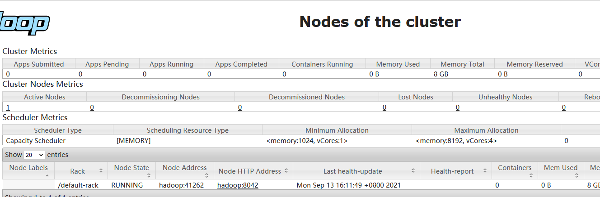

# 上周回顾

```
1. Linux
1.1 虚拟机Vmware
1.2 安装了Centos7
1.3 虚拟机克隆
1.4 快照
1.5 Linux命令
1.6 免密登陆
1.7 安装各种：二进制、rpm、yum、源码安装
1.8 定时器：crontab
1.9 shell脚本
```

# 一 Hadoop：第一代分析工具

## 1 什么是大数据？

> 对海量数据进行数据挖掘。
>
> 电商平台推荐系统
>
> 精准广告投放系统

## 2 学习大数据的什么？

> - 存储
>
> HDFS/HBase/Kafka/Clickhouse
>
> - 计算
>
> Mapreduce/Spark/Flink/Storm/Tez
>
> - 辅助工具
>
> Flume/Sqoop/Datax/Canal
>
> - 数据仓库
>
> Hive/Pig/...

# 二 Hadoop快速入门

## 1 什么是Hadoop

### 1.1 hadoop模块——狭义

> - **Hadoop Common**: hadoop底层API模块，它为其他的模块提供了API。
> - **Hadoop Distributed File System (HDFS™)**: 分布式文件系统，可以帮助我们分布式的存储、读取数据集。
> - **Hadoop YARN**: 分布式的资源管理、作业调度的框架
> - **Hadoop MapReduce**: 基于yarn的分布式并行的计算框架

### 1.2 hadoop生态——广义

- hadoop1.0


- hadoop2.0


### 1.3 作用

## 2 Hadoop的安装


### 2.1 单机

#### 2.1.1 安装

```sh
##1. 解压
[root@hadoop software]# tar -zxvf hadoop-2.8.1.tar.gz -C /opt/apps/

##2. 配置环境变量
export JAVA_HOME=/opt/apps/jdk1.8.0_45
export TOMCAT_HOME=/opt/apps/tomcat-7.0.47
export HADOOP_HOME=/opt/apps/hadoop-2.8.1
export CLASS_PATH=.:$JAVA_HOME/lib
export PATH=$PATH:$JAVA_HOME/bin:$TOMCAT_HOME/bin:$HADOOP_HOME/bin:$HADOOP_HOME/sbin

[root@hadoop hadoop-2.8.1]# hadoop version
Hadoop 2.8.1
Subversion https://git-wip-us.apache.org/repos/asf/hadoop.git -r 20fe5304904fc2f5a18053c389e43cd26f7a70fe
Compiled by vinodkv on 2017-06-02T06:14Z
Compiled with protoc 2.5.0
From source with checksum 60125541c2b3e266cbf3becc5bda666
This command was run using /opt/apps/hadoop-2.8.1/share/hadoop/common/hadoop-common-2.8.1.jar

##3. hadoop-env.sh : 这个文件在hadoop启动的时候会自动的加载
[root@hadoop hadoop-2.8.1]# cd etc/hadoop/
[root@hadoop hadoop]# vi hadoop-env.sh
# The java implementation to use.
export JAVA_HOME=/opt/apps/jdk1.8.0_45

##4. /etc/hosts
10.206.0.4 hadoop

##5. /etc/hostname
hadoop
```

#### 2.1.2 测试_wordcount


```sh
## wordcount
/opt/apps/hadoop-2.8.1/bin/hadoop jar /opt/apps/hadoop-2.8.1/share/hadoop/mapreduce/hadoop-mapreduce-examples-2.8.1.jar wordcount /home/date.txt /home/output
```

#### 2.1.3 测试

- 数据

```
8 5 ? 3 9 ? ? ? ?
? ? 2 ? ? ? ? ? ?
? ? 6 ? 1 ? ? ? 2
? ? 4 ? ? 3 ? 5 9
? ? 8 9 ? 1 4 ? ?
3 2 ? 4 ? ? 8 ? ?
9 ? ? ? 8 ? 5 ? ?
? ? ? ? ? ? 2 ? ?
? ? ? ? 4 5 ? 7 8
```

- 测试

```sh
/opt/apps/hadoop-2.8.1/bin/hadoop jar /opt/apps/hadoop-2.8.1/share/hadoop/mapreduce/hadoop-mapreduce-examples-2.8.1.jar sudoku /home/sudo.txt

[root@hadoop home]# /opt/apps/hadoop-2.8.1/bin/hadoop jar /opt/apps/hadoop-2.8.1/share/hadoop/mapreduce/hadoop-mapreduce-examples-2.8.1.jar sudoku /home/sudo.txt
Solving /home/sudo.txt
8 5 1 3 9 2 6 4 7
4 3 2 6 7 8 1 9 5
7 9 6 5 1 4 3 8 2
6 1 4 8 2 3 7 5 9
5 7 8 9 6 1 4 2 3
3 2 9 4 5 7 8 1 6
9 4 7 2 8 6 5 3 1
1 8 5 7 3 9 2 6 4
2 6 3 1 4 5 9 7 8
```

### 2.2 伪分布式

#### 2.2.1 core-site.xml

```xml
[root@hadoop hadoop-2.8.1]# vi etc/hadoop/core-site.xml

<?xml version="1.0" encoding="UTF-8"?>
<?xml-stylesheet type="text/xsl" href="configuration.xsl"?>
<!--
  Licensed under the Apache License, Version 2.0 (the "License");
  you may not use this file except in compliance with the License.
  You may obtain a copy of the License at

    http://www.apache.org/licenses/LICENSE-2.0

  Unless required by applicable law or agreed to in writing, software
  distributed under the License is distributed on an "AS IS" BASIS,
  WITHOUT WARRANTIES OR CONDITIONS OF ANY KIND, either express or implied.
  See the License for the specific language governing permissions and
  limitations under the License. See accompanying LICENSE file.
-->

<!-- Put site-specific property overrides in this file. -->
<configuration>
    <property>
        <name>fs.defaultFS</name>
        <value>hdfs://10.206.0.4:9000</value> <!-- 其实就是hdfs的主节点的通信端口 -->
    </property>

    <property>
        <name>hadoop.tmp.dir</name>
        <value>/opt/apps/hadoop-2.8.1/hdpdata</value>
    </property>
</configuration>
```

#### 2.2.2 hdfs-site.xml

```xml
<?xml version="1.0" encoding="UTF-8"?>
<?xml-stylesheet type="text/xsl" href="configuration.xsl"?>
<!--
  Licensed under the Apache License, Version 2.0 (the "License");
  you may not use this file except in compliance with the License.
  You may obtain a copy of the License at

    http://www.apache.org/licenses/LICENSE-2.0

  Unless required by applicable law or agreed to in writing, software
  distributed under the License is distributed on an "AS IS" BASIS,
  WITHOUT WARRANTIES OR CONDITIONS OF ANY KIND, either express or implied.
  See the License for the specific language governing permissions and
  limitations under the License. See accompanying LICENSE file.
-->

<!-- Put site-specific property overrides in this file. -->

<configuration>
    <property>
        <name>dfs.replication</name>
        <value>1</value>
    </property>
</configuration>
```

#### 2.2.3 yarn-site.xml

```xml
<?xml version="1.0"?>
<!--
  Licensed under the Apache License, Version 2.0 (the "License");
  you may not use this file except in compliance with the License.
  You may obtain a copy of the License at

    http://www.apache.org/licenses/LICENSE-2.0

  Unless required by applicable law or agreed to in writing, software
  distributed under the License is distributed on an "AS IS" BASIS,
  WITHOUT WARRANTIES OR CONDITIONS OF ANY KIND, either express or implied.
  See the License for the specific language governing permissions and
  limitations under the License. See accompanying LICENSE file.
-->
<configuration>
    <property>
        <name>yarn.resourcemanager.hostname</name>
        <value>10.206.0.4</value>
    </property>

    <property>
        <name>yarn.nodemanager.aux-services</name>
        <value>mapreduce_shuffle</value>
    </property>
</configuration>
```

#### 2.2.4 mapred-site.xml

```xml
[root@hadoop hadoop-2.8.1]# mv etc/hadoop/mapred-site.xml.template etc/hadoop/mapred-site.xml
[root@hadoop hadoop-2.8.1]# vi etc/hadoop/mapred-site.xml

<?xml version="1.0"?>
<?xml-stylesheet type="text/xsl" href="configuration.xsl"?>
<!--
  Licensed under the Apache License, Version 2.0 (the "License");
  you may not use this file except in compliance with the License.
  You may obtain a copy of the License at

    http://www.apache.org/licenses/LICENSE-2.0

  Unless required by applicable law or agreed to in writing, software
  distributed under the License is distributed on an "AS IS" BASIS,
  WITHOUT WARRANTIES OR CONDITIONS OF ANY KIND, either express or implied.
  See the License for the specific language governing permissions and
  limitations under the License. See accompanying LICENSE file.
-->

<!-- Put site-specific property overrides in this file. -->

<configuration>
    <property>
        <name>mapreduce.framework.name</name>
        <value>yarn</value>
    </property>
</configuration>
```

#### 2.2.5 slaves

```sh
[root@hadoop hadoop-2.8.1]# vi etc/hadoop/slaves
hadoop
```

#### 2.2.6 免密登陆

```sh
ssh-keygen
ssh-copy-id
```

#### 2.2.7 格式化namenode（HDFS的主节点）

```sh
[root@hadoop hadoop-2.8.1]# hdfs namenode -format
##tip: 格式化必须一次性成功，如果格式化失败，必须将生成hdpdata目录删除之后重新格式化
```

#### 2.2.8 启动

```sh
##1. 启动hdfs
##1.1 启动
[root@hadoop hadoop-2.8.1]# start-dfs.sh
[root@hadoop hadoop-2.8.1]# jps
10432 DataNode
10707 SecondaryNameNode
10953 Jps
10301 NameNode

##1.2 关闭
[root@hadoop hadoop-2.8.1]# stop-dfs.sh

##1.3 确保完全没有问题
##1.3.1 查看日志
[root@hadoop hadoop-2.8.1]# cd logs/

##1.3.2 查看WebUI
http://146.56.208.76:50070/dfshealth.html#tab-overview
##2. 启动yarn
```


#### 2.2.9 测试Yarn

```sh
[root@hadoop logs]# start-yarn.sh
[root@hadoop logs]# stop-yarn.sh
## 查看WEBUI
http://146.56.208.76:8088/cluster/nodes
```



### 2.3 全分布式

#### 2.3.1 确定集群规模

| 节点名称 | 作用                                        |      |
| -------- | ------------------------------------------- | ---- |
| hadoop1  | namenode/resourcemanager/secondary namenode |      |
| hadoop2  | datanode/nodemanager                        |      |
| hadoop3  | datanode/nodemanager                        |      |

#### 2.3.2 现在一台机器上将所有配置配置完成

```sh
##1. core-site.xml -- 和伪分布式一模一样即可
##2. hdfs-site.xml -- 和伪分布式一模一样即可
##3. yarn-site.xml -- 和伪分布式一模一样即可
##4. mapred-site.xml -- 和伪分布式一模一样即可
##5. slaves :
hadoop2
hadoop3
##6. vi /etc/hosts
192.168.49.100 hadoop1
192.168.49.101 hadoop2
192.168.49.102 hadoop3
##7. 免密登陆做好 -- 和伪分布式一样
##8. 格式化 -- 和伪分布式一样

##9. 虚拟机克隆到hadoop2和hadoop3
##10. 启动/关闭
start-dfs.sh
```


### 2.4 高可用

