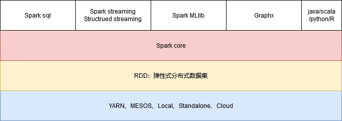
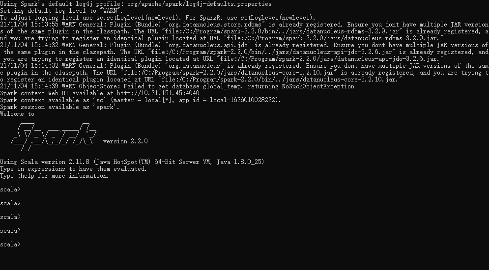

# Spark

# 一 大数据的技术

## 1 spark介绍



## 2 spark特点

### 2.1快

> 基于内存运算比mr快100倍以上，基于磁盘运算也比mr快10快左右

### 2.2 易用

> spark提供了超过80个高阶算子。

### 2.3 随处运行

> 可以支持运行spark的平台很多：yarn、mesos、local、standalone...

### 2.4 通用性

> 流批一体的框架。机能做批式计算（离线分析）又能做流式计算（实时分析）

## 3 RDD

> 弹性式分布式数据集

### 3.1 弹性

```
如果内存足够，就在内存中计算。内存不足，就溢出一部分在磁盘中做计算。
```

### 3.2 分布式

> 和之前的分布式概念一样。

### 3.3 数据集

> 数据的集合。RDD其实只是spark第一代数据模型。第二代数据模型：DataFrame。第三代：DataSet

### 3.4 DAG

> 有向无环图
>
> RDD之间相互存在依赖关系的。这种关系累计起来就叫做有向无环图，RDD之间成了一个串，我们叫lineage（血缘）

# 二 Spark安装

## 1 安装windows版的spark

```sh
##1. 安装scala
##2. 将spark解压到指定目录（没特殊符号，没有空格，没有中文...）
##3. 配置环境变量
##4. 运行：spark-shell2.cmd
```



```
sc.textFile("c://ftp/code.txt").flatMap(_.split("\\s+")).map((_,1)).reduceByKey(_+_).foreach(println)
```

## 2 安装Linux版的spark

```sh
##1. 安装scala并配置环境变量
##2. 解压
[root@hadoop software]# tar -zxvf spark-2.2.0-bin-hadoop2.7.tgz -C /opt/apps/
[root@hadoop apps]# mv spark-2.2.0-bin-hadoop2.7/ spark-2.2.0

##3. 配置环境变量
[root@hadoop spark-2.2.0]# vi /etc/profile

## MY PROFILE
export JAVA_HOME=/opt/apps/jdk1.8.0_45
export HADOOP_HOME=/opt/apps/hadoop-2.8.1
export HIVE_HOME=/opt/apps/hive-1.2.1
export HIVE_CONF_DIR=$HIVE_HOME/conf
export HBASE_HOME=/opt/apps/hbase-1.2.1
export FLUME_HOME=/opt/apps/flume-1.6.0
export SQOOP_HOME=/opt/apps/sqoop-1.4.7
export SPARK_HOME=/opt/apps/spark-2.2.0

export CLASS_PATH=.:$JAVA_HOME/lib
export PATH=$PATH:$JAVA_HOME/bin:$HADOOP_HOME/bin:$HADOOP_HOME/sbin:$HIVE_HOME/bin:$HBASE_HOME/bin:$FLUME_HOME/bin
export PATH=$PATH:$SQOOP_HOME/bin:$SPARK_HOME/bin:$SPARK_HOME/sbin


##4. 配置spark配置文件
[root@hadoop conf]# mv spark-env.sh.template spark-env.sh

export JAVA_HOME=/opt/apps/jdk1.8.0_45
export SCALA_HOME=/opt/apps/scala-2.11.8
export SPARK_MASTER_HOST=hadoop
export SPARK_MASTER_PORT=7077
export SPARK_WORKER_CORES=2
export SPARK_WORKER_MEMORY=1g
export HADOOP_CONF_DIR=/opt/apps/hadoop-2.8.1/etc/hadoop

[root@hadoop conf]# mv slaves.template slaves
hadoop

##5. 启动测试
[root@hadoop sbin]# mv start-all.sh start-all-spark.sh
[root@hadoop sbin]# mv stop-all.sh stop-all-spark.sh
[root@hadoop sbin]# sh start-all-spark.sh

##6. 查看webui检查： hadoop:8080
```

# 三 Spark Core的快速入门

## 1 导入依赖

```xml
<?xml version="1.0" encoding="UTF-8"?>
<project xmlns="http://maven.apache.org/POM/4.0.0"
         xmlns:xsi="http://www.w3.org/2001/XMLSchema-instance"
         xsi:schemaLocation="http://maven.apache.org/POM/4.0.0 http://maven.apache.org/xsd/maven-4.0.0.xsd">
    <modelVersion>4.0.0</modelVersion>

    <groupId>com.qf.bigdata</groupId>
    <artifactId>spark</artifactId>
    <version>1.0</version>

    <properties>
        <maven.compiler.source>1.8</maven.compiler.source>
        <maven.compiler.target>1.8</maven.compiler.target>
    </properties>

    <dependencies>
        <dependency>
            <groupId>org.apache.spark</groupId>
            <artifactId>spark-core_2.11</artifactId>
            <version>2.2.0</version>
        </dependency>
    </dependencies>
</project>
```

## 2 Java版的WordCount

```java
package com.qf.bigdata.spark.day1;

import org.apache.spark.SparkConf;
import org.apache.spark.api.java.JavaPairRDD;
import org.apache.spark.api.java.JavaRDD;
import org.apache.spark.api.java.JavaSparkContext;
import org.apache.spark.api.java.function.FlatMapFunction;
import org.apache.spark.api.java.function.Function2;
import org.apache.spark.api.java.function.PairFunction;
import org.apache.spark.api.java.function.VoidFunction;
import scala.Tuple2;

import java.util.Arrays;
import java.util.Iterator;

public class Demo1_WordCount {
    public static void main(String[] args) {
        //1. 核心对象——SparkContext
        SparkConf sparkConf = new SparkConf();
        sparkConf.setMaster("local[*]");
        sparkConf.setAppName("demo1_wc");

        JavaSparkContext sc = new JavaSparkContext(sparkConf);

        //2. 加载文件
        JavaRDD<String> lineRDD = sc.textFile("C:\\ftp\\code.txt");

        lineRDD.foreach(new VoidFunction<String>() {
            @Override
            public void call(String line) throws Exception {
                System.out.println(line);
            }
        });

        System.out.println("-----------------------------");

        //3. 处理： sc.textfile.flatMap.map.reduceByKey
        JavaRDD<String> wordsRDD = lineRDD.flatMap(new FlatMapFunction<String, String>() {
            @Override
            public Iterator<String> call(String line) throws Exception {
                return Arrays.asList(line.split("\\s+")).iterator();
            }
        });

        wordsRDD.foreach(new VoidFunction<String>() {
            @Override
            public void call(String line) throws Exception {
                System.out.println(line);

            }
        });

        System.out.println("-----------------------------");

        //4. 处理 map
        JavaPairRDD<String, Integer> mapRDD = wordsRDD.mapToPair(new PairFunction<String, String, Integer>() {
            @Override
            public Tuple2<String, Integer> call(String word) throws Exception {
                return new Tuple2<String, Integer>(word, 1);
            }
        });

        System.out.println("-----------------------------");
        mapRDD.foreach(new VoidFunction<Tuple2<String, Integer>>() {
            @Override
            public void call(Tuple2<String, Integer> t) throws Exception {
                System.out.println("(" + t._1 + "," + t._2 + ")");
            }
        });
        System.out.println("-----------------------------");

        JavaPairRDD<String, Integer> resRDD = mapRDD.reduceByKey(new Function2<Integer, Integer, Integer>() {
            @Override
            public Integer call(Integer v1, Integer v2) throws Exception {
                return v1 + v2;
            }
        });

        resRDD.foreach(new VoidFunction<Tuple2<String, Integer>>() {
            @Override
            public void call(Tuple2<String, Integer> t) throws Exception {
                System.out.println("(" + t._1 + "," + t._2 + ")");
            }
        });

    }
}

```

## 3 Lambda表达式

```java
package com.qf.bigdata.spark.day1;

import org.apache.spark.SparkConf;
import org.apache.spark.api.java.JavaPairRDD;
import org.apache.spark.api.java.JavaRDD;
import org.apache.spark.api.java.JavaSparkContext;
import org.apache.spark.api.java.function.Function2;
import org.apache.spark.api.java.function.PairFunction;
import org.apache.spark.api.java.function.VoidFunction;
import scala.Tuple2;

import java.util.Arrays;

public class Demo2_Lambda_WordCount {
    public static void main(String[] args) {
        //1. 核心对象——SparkContext
        SparkConf sparkConf = new SparkConf();
        sparkConf.setMaster("local[*]");
        sparkConf.setAppName("demo2_wc");

        JavaSparkContext sc = new JavaSparkContext(sparkConf);

        //2. 加载文件
        JavaRDD<String> lineRDD = sc.textFile("C:\\ftp\\code.txt");

        JavaRDD<String> wordsRDD = lineRDD.flatMap(line -> Arrays.asList(line.split("\\s+")).iterator());
        wordsRDD.foreach(line -> System.out.println(line));
        System.out.println("-----------------------------");
        JavaPairRDD<String, Integer> mapRDD = wordsRDD.mapToPair(word -> new Tuple2<String, Integer>(word, 1));
        mapRDD.foreach(line -> System.out.println(line));
        System.out.println("-----------------------------");
        JavaPairRDD<String, Integer> resRDD = mapRDD.reduceByKey((v1, v2) -> v1 + v2);
        resRDD.foreach(t -> System.out.println(t._1 + "," + t._2));
    }
}
```

## 4 scala版

```scala
package com.qf.bigdata.spark.day1

import org.apache.spark.{SparkConf, SparkContext}

object Demo1_WordCount_Scala {
    def main(args: Array[String]): Unit = {
        //1. 获取对象
        val sc = new SparkContext(
            new SparkConf().setMaster("local[*]").setAppName("demo1")
        )
        sc.textFile("C:\\ftp\\code.txt").flatMap(_.split("\\s+"))
            .map((_,1)).reduceByKey(_+_).foreach(println)
    }
}
```

