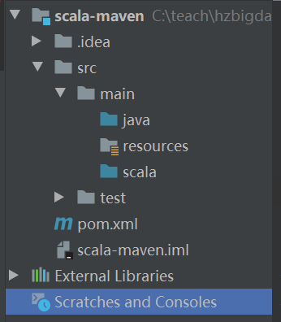

```
1. mybatis : dao ， 核心于映射配置文件， mapper代理对象
2. spring : ioc和aop ： 将创建对象的过程交给了spring管理。注解或xml
3. spring mvc ： web ： 不用多个servlet， 注解， 响应json
4. jquery ： 支持在jsp上对html元素进行处理， 在页面对页面元素进行处理
5. ajax ： 像服务器发送异步的请求
6. echarts ： 页面渲染

7. scala
```

# Scala

# 1 Scala快速入门

## 1.1 scala的介绍

> ​	scala一个多范式的编程语言。它是集面向对象和面向函数式的编程语言；scala本身是运行在java虚拟机之上的，说白了就是兼容现有的java程序；scala的源代码会被编译成java的字节码文件，所以它运行在JVM之上并且可以直接调用现有的Java库。
>
> ​	像Spark/Flink等都是采用scala开发的，所以学习好大数据，scala必须要学好。

## 1.2 scala的安装——window

> tip：
>
> 1. 点开之后一直下一步
> 2. 配置环境变量
> 3. 不要使用空格等特殊符号成为你的安装目录
> 4. 通过cmd窗口输入命令：scala -version

## 1.3 测试程序

### 1.3.1 HelloWorld.scala

```scala
object HelloWorld {
	def main(args:Array[String]):Unit = {
		println("HelloWorld")
	}
}
```

### 1.3.2 运行


> tip:
>
> scalac HelloWorld.scala的时候产生了两个class文件：
>
> `HelloWorld$.class` : 带`$`的的class就是scala文件编译之后的文件
>
> `HelloWorld.class` : 他是jvm和scala文件的运行的纽带

- HelloWorld$.class

```scala
import scala.Predef;

public class HelloWorld$ {
    public static final MODULES$;
    static {
        new ();
    }
    public void main(String[] args) {
        Predef..MODULES$.println("HelloWorld");
    }
    private HelloWorld$() {
        MODULES$ = this;
    }
}
```

- HelloWorld.class

```scala
@ScalaSignature(bytes=....)
public final class HelloWorld {
    public static void main(String args[]) {
        HelloWorld.MODULES$.main(args)
    }
}
```

## 1.4 idea整合scala工程

> 默认的idea是不支持创建scala工程的，我们需要额外的通过idea导入scala的插件

### 1.4.1 在线导入

> setting --》 plugin --》 scala---》install --》重启idea即可

### 1.4.2 离线导入

```sh
##1. 下载离线的插件
https://plugins.jetbrains.com/plugin/1347-scala/versions

##2. 在idea的插件市场中选择离线安装,直接选中zip的压缩包即可
##3. 重启idea
##4. 重启完毕之后，选择创建新工程就可以看到scala的工程
##5. 根据提示导入jdk和scala的sdk工具
```


## 1.5 idea整合scala的maven工程

```sh
##1. 创建一个空的maven工程
##2. ctrl+alt+shift+s
##3. 取分scala和java目录，方便以后维护代码
```




# 2 Scala编程语法介绍

## 2.1 scala编程命名规范

> 1.几乎跟java一样。
>
> 文件命名:
>
> 1. 首字母大写
> 2. 驼峰式命名
>
>  ...
>
> 编码：UTF-8
>
> 2. 修改编码风格
>
> Setting --> code style ---> scala (4,4,4)
>
> 3. 标识符的取名规则
> 4. 注释和java一样

## 2.2 变量的定义

> scala中定义变量有两种方式：
>
> var: 变量
>
> val : 常量
>
> e.g.
>
> var/val param_name[:type] = value

```scala
package com.qf.bigdata.scala.day1

object Demo2 {
    def main(args: Array[String]): Unit = {
        var a = 1 // 变量 // 类型推断
        a = 2
        println(a)
        val b = 1 // 常量， 好比java： final int b = 1
//        b = 2 //报错： Reassigement val

        val c:Int = 1 // 完整的表达式
    }
}
```

## 2.3 数据类型

| 数据类型 | 描述                                                     |
| -------- | -------------------------------------------------------- |
| Byte     | 8bit，根java一样                                         |
| Short    | 16bit，根java一样                                        |
| Int      | 32bit，根java一样                                        |
| Long     | 64bit，根java一样                                        |
| Float    | 根java一样                                               |
| Double   | 根java一样                                               |
| Char     | 根java一样                                               |
| Boolean  | 根java一样                                               |
| String   | 字符串                                                   |
| Unit     | 表示无值，相当于java中的void。但是它实际是一个空元组：() |
| Null     | 表示空引用                                               |
| Nothing  | 所有其他类型的子类型，表示就是没有值                     |
| Any      | 所有的类型的父类，任何的实例都属于Any                    |
| AnyRef   | 所有引用类型的父类                                       |

> tip:
>
> 几乎保留了java中的所有数据类型，并新增了一些scala专属。
>
> val p:Any = new Person();

## 2.4 运算符

> 和java完全一样，除了++和--这种

## 2.5 流程控制

### 2.5.1 选择分支

#### 2.5.1.1 if

> 几乎和java一样。唯一的区别就是scala中的if是包含返回值的。
>
> tip:if的返回中不要写return返回，return是专门给函数提供的返回。

```scala
package com.qf.bigdata.scala.day1

object Demo3_IF {
    def main(args: Array[String]): Unit = {
        val num = 10
        val n = if(num != 10) {
            println(num)
            0
        }else {
            println("num == 10")
            10
        }
        println(n)

        println(if(num == 10) {true} else {false}) // 模拟三目运算符
    }
}
```

### 2.5.2 循环

#### 2.5.2.1 while

> 没有++、--

```scala
package com.qf.bigdata.scala.day2

object Demo1_Loop {
    def main(args: Array[String]): Unit = {
        /**
         * 1..10
         * int sum = 0;
         * int n = 1;
         * while(n <= 10) {
         *  sum += n;
         *  n++;
         * }
         */
        var sum = 0
        var n = 1
        while(n <= 10) {
            sum += n
            n += 1
        }
        println(sum)
    }
}

```

#### 2.5.2.2 do...while

##### 2.5.2.2.1 案例

```scala
package com.qf.bigdata.scala.day2

object Demo1_Loop {
    def main(args: Array[String]): Unit = {
        var sum = 0
        var n = 1
        do {
            sum += n
            n += 1
        }while(n <= 10)
        println(sum)
    }
}

```

##### 2.5.2.2.2 案例 ： 登陆，三次机会

```scala
package com.qf.bigdata.scala.day2

import scala.io.StdIn
import scala.util.control.Breaks._

object Demo2_Loop {
    def main(args: Array[String]): Unit = {
        println("*"*10)
        println("welcome")
        println("*"*10)
        var count = 3

        breakable {
            while (count > 0) {
                count -= 1
                // 输入用户名和密码
                val username = StdIn.readLine("请输入用户名称：") // 键盘录入
                val password = StdIn.readLine("请输入用户密码：")

                if (username == "admin" && password == "123") {
                    println("欢迎")
                    break // 跳出，breakable包裹的代码块
                }else {
                    println("有误，重新输入, 还有" + count + "次机会" )
                }
            }
        }
    }
}

```

#### 2.5.2.3 for 

- 语法

> for (变量 <- 集合)

- 举例

```java
package com.qf.bigdata.scala.day2

object Demo3_Loop {
    def main(args: Array[String]): Unit = {
        //1. 定义一个集合
        /*
         * to : 包含
         * until : 不包含
         */

        for(i <- 1.to(10)) { // 1~10
            println("i = " + i)
        }

        for(j <- 1 until 10) { // 1~9
            println(s"j = ${j}") // 字符串格式化语法
        }

        for(k <- 1 until 10 reverse) { // 1~9
            println(s"k = ${k}") // 字符串格式化语法
        }
    }
}
```

- 循环嵌套

```scala
package com.qf.bigdata.scala.day2

object Demo4_Loop {
    def main(args: Array[String]): Unit = {
        //1. 第一种方式
        for (i <- 1 to 3) {
            for(j <- 1 to 5) {
                print("* ")
            }
            println
        }

        println("----")

        //2. 第二种方式
        for (i <- 1 to 3; j <- 1 to 5) { // 花括号写的代码，都是在j这个循环中
            print("* ")
            if (j == 5) println
        }
    }
}

```

## 2.6 异常控制

### 2.6.1 scala的异常

> scala中的异常沿用了java的异常体系，所以几乎根java一样。
>
> 但是，scala的异常处理方式更加的简便：
>
> 1. 所有异常的抛出，都是由scala自己帮我们完成，我们完全不用担心自己申明异常了。
> 2. 所以，我们在scala中几乎只需要自己捕获异常即可。捕获异常使用try...catch

### 2.6.2 try

```scala
package com.qf.bigdata.scala.day2

object Demo5_Exception {
    def main(args: Array[String]): Unit = {

        try {
            var sum = 1 / 0
        }catch {
            case e:ArithmeticException => println("数学异常")
            case e2:Exception => println("异常它老子")
        }

    }
}
```

## 2.7 函数

### 2.7.1 语法

> 在scala中所有的静态变量、方法都写在了object中。而非静态的都写在class中。

```
def welcome(name:String):String = {"sayHello to" + name}
```


### 2.7.2 案例

```scala
package com.qf.bigdata.scala.day2

object Demo6_Function {
    def main(args: Array[String]): Unit = {
        val t = show
        println(t) // 函数虽然没有返回值，但是Unit会返回空元组
    }

    def show() = { // 我定义的这个函数并没有申明范围值类型，但是scala会自动进行类型匹配
        println("hello")
    }

    def sayHi(name:String) = {
        s"say hi ${name}"
    }
}
```

### 2.7.3 特殊函数

#### 2.7.3.1 单行函数

> 如果你的函数体中只有一行代码，那么这个函数的花括号是可以去掉的

```scala
def show() = println("hello")
```

#### 2.7.3.2 无参函数

> ​	无参函数在定义的时候，函数的小括号可以省略。但是如果定义的时候省略了小括号，那么在调用的时候也不能写小扩招。如果定义的时候写了小括号，那么在调用的时候写不写皆可。

```scala
def show = println("hello")
```

#### 2.7.3.3 默认参数的函数

> 在函数中，给了默认参数值的函数，在调用中的时候，这个参数可以不用传递

```scala
def main(args: Array[String]): Unit = {
    showAddr("lixi", "cq")
}

def showAddr(name:String, address:String, phone:Long=155L):Unit = {
    println(s"${name} 他的家庭住址是 ${address} 它的电话是 ${phone}")
}
```

#### 2.7.3.4 带参数名的函数

```scala
showAddr(phone = 133L, name = "lixi", address = "cq")
```

#### 2.7.3.5 可变参数

```scala
val arr = Array(3,4,5)
var sum = add(arr:_*)
//var sum = add(1,2,3,4,5)

def add(arr:Int*) = {
    var sum = 0
    for(a <- arr) {
        sum += a
    }
    sum
}
```

## 2.8 Scala数组

> 数组的可变不可变，指的是数组长度

### 2.8.1 不可变数组

```scala
package com.qf.bigdata.scala.day2

object Demo7_Array {
    def main(args: Array[String]): Unit = {
        /**
         * int[] arr = {}; // 静态初始化
         * int[] arr = new int[123]; // 动态初始化
         *
         * List<Intger> list = new ArrayList<>();
         *
         * 1. scala中数组的定义
         */
        val array = new Array[Int](5) // 表示创建一个长度为5，并且数组都是int元素, 动态初始化
        val arr = Array(1, 2, 3) // 创建长度为3，数组元素都是整数类型，静态初始化

        //2. 获取数组中的元素：数组名(index)
        println(arr(1)) // arr[1]

        //3. 数组的遍历
        for (i <- arr) {
            println(i)
        }

        //4. 数据的长度
        println(arr.length)
        println(arr.size)

        //5. 判断一个元素是否在一个数组中
        println(arr.contains(-1))
        println("-"*100)
        //6. 数组元素的拼接：mkString
        println(arr.mkString(","))
        println(arr.mkString("[", ",", "]"))

    }
}
```

### 2.8.2 可变数组

> ArrayBuffer, 你就可以把他理解ArrayList

```scala
package com.qf.bigdata.scala.day2

import scala.collection.mutable.ArrayBuffer

object Demo8_ArrayBuffer {
    def main(args: Array[String]): Unit = {
        //1. 数组的创建
        val arraybuffer = new ArrayBuffer[Int](10)
        val arraybuffer2 = ArrayBuffer[String]("a", "b", "c")

        //3. curd
        prints(arraybuffer2)
        //3.1 增
        arraybuffer2.append("d")
        prints(arraybuffer2)
        arraybuffer2.append("e", "f", "g")
        prints(arraybuffer2)

        //3.2 查询
        println(arraybuffer2(1))
        println(arraybuffer2.length + "," + arraybuffer2.size)

        //3.3 修改
        arraybuffer2(0) = "lixi"
        prints(arraybuffer2)

        //3.4 删除》remove
        arraybuffer2.remove(1) // 删除指定索引处的元素
        prints(arraybuffer2)
        arraybuffer2.remove(1, 2) // 删除指定索引处的元素,删除cnt个
        prints(arraybuffer2)

        //3.5 删除》drop》删除并返回副本
        val arrayBuffer3: ArrayBuffer[String] = arraybuffer2.drop(2)
        prints(arrayBuffer3)

        val arrayBuffer4: ArrayBuffer[String] = arraybuffer2.dropRight(2)
        prints(arrayBuffer4)
    }

    def prints(arr:ArrayBuffer[String]) = println(arr.mkString("[", ",", "]"))
}
```

### 2.8.3 通用方法

- arr.contains（element） ：判断element是否在arr中
- 数组求和

```scala
var ab = ArrayBuffer[Int](1, 2, 3)
println(ab.sum)
```

- max和min

```scala
println(ab.max)
println(ab.min)
```

- Array和ArrayBuffer之间可以相互转换

```scala
array --> arraybuffer
val buffer: mutable.Buffer[Int] = arr.toBuffer
buffer.append(10)
println(buffer.size)

arraybuffer --> array
val array: Array[Int] = ab.toArray
array(3) = 1
```

## 2.9 常见的集合

### 2.9.1 Map —— 映射（对偶）

> map的不可变指的是value一旦申明将不可变化。

#### 2.9.1.1 不可变map

```scala
package com.qf.bigdata.scala.day2

object Demo9_Map {
    def main(args: Array[String]): Unit = {
        //1. 定义
        var map = Map[String, String](
            ("China" -> "北京"),
            "Japan" -> "东京"
        )
        prints(map)

        //2. crud
        //2.1 增
        map += ("south korea" -> "首尔")
        prints(map)

        //2.2 查
        println(map("south korea")) // value
        println(map.get("south korea")) // Some(首尔)
        println(map.get("south korea").get) // Some(首尔)
                                            // --> Option(有值/没值)
        println(map.get("usa")) // None
//        println(map.get("usa").get) // java.util.NoSuchElementException: None.get

        // --> 建议大家他们二者的合体功能
        val value: String = map.getOrElse("china", "中国")
        println(value)

        println(map.size)
        println(map.contains("China"))

        // 严重可变不可变到底
        // map("China") = "中国"， 说明我们的不可变值的是value一旦申明将不可变化

        //2.3 删除
        val map2: Map[String, String] = map.drop(1)
        prints(map2)
    }

    def prints(map:Map[String, String]) = println(map.mkString("[", ",", "]"))
}
```

#### 2.9.1.2 不可变map

```scala
package com.qf.bigdata.scala.day2

import scala.collection.mutable

object Demo10_Map {
    def main(args: Array[String]): Unit = {
        //1. 定义
        var map = mutable.Map[String, String](
            ("China" -> "北京"),
            "Japan" -> "东京"
        )
        prints(map.toMap) // mutable.map --> immutable.map

        map += ("usa" -> "华盛顿")
        prints(map.toMap) // mutable.map --> immutable.map

        map("Japan") = "福岛"
        prints(map.toMap) // mutable.map --> immutable.map

        //2. map的遍历
        for((k, v) <- map) {
            println(s"$k , $v")
        }

        for(kv <- map) {
            println(s"${kv._1} -> ${kv._2}")
        }

        map.foreach(println)
    }

    def prints(map:Map[String, String]) = println(map.mkString("[", ",", "]"))
}
```

### 2.9.2 Tuple —— 元组

> 其实元组也是一个对偶。元组：（1，2，3，“abc”, 1.0）。在函数式编程中一般使用元组来传输数据。
>
> 元组的长度和值都不可变，所以scala内部给提供了固定长度的元组。最长是22维。

```scala
package com.qf.bigdata.scala.day2

object Demo11_Tuple {
    def main(args: Array[String]): Unit = {
        //1. 初始化
        var t1 = new Tuple1[Double](1.0) // 一维元组
        var t2 = new Tuple2[Int, String](
            1, "abc"
        ) // 创建了二维元组

        //2. 获取元组元素
        println(t1._1) // 获取元组的第一个元素
        println(t2._2) // 获取元组的第二个元素

        //3.
//        t1._1 = 1// 使用报错，因为元组的值和长度不能修改

        //4. 遍历 : 不能直接遍历，需要先获取到元组的迭代器
        for (e <- t2.productIterator) {
            println(e)
        }

        println("-"*100)
        //5. 另一种初始化元组的方式
        val season = ("Spring", "Summer", "Autumn", "Winter")
        println(season._1)

        //6. 另两种初始化方式
        val (spring, summer, autumn, winter) = ("Spring", "Summer", "Autumn", "Winter")
        println(spring)
        println(summer)
        println(autumn)

    }
}
```

### 2.9.3 zip构建拉链操作

```scala
package com.qf.bigdata.scala.day2

object Demo12_Zip {
    def main(args: Array[String]): Unit = {
        //1. 构建数组
        val province = Array("重庆", "四川", "杭州")
        val capital = Array("解放碑", "成都", "西湖")
        //2. 拉链
        val tuples: Array[(String, String)] = province.zip(capital)
        //3. 遍历
        for (cp <- tuples) {
            println(s"${cp._1}->${cp._2}")
        }
    }
}
```

#  3 Scala的面向对象语法

## 3.1 类的定义

> @BeanProperty修改的属性，将会自动生成get/set方法。但是注意这个注解不能修改private的属性

### 3.1.1 Person

```scala
package com.qf.bigdata.scala.day3

import scala.beans.BeanProperty

/**
 * Person类
 */
class Person {
    @BeanProperty var age:Int = _
    @BeanProperty var name:String = _
}
```

### 3.1.2 Demo1

```scala
package com.qf.bigdata.scala.day3

object Demo1 {
    def main(args:Array[String]):Unit = {
        // 创建Person实例
        val p = new Person
        p.setAge(11)
        p.setName("lixi")
        println(p.getAge())
        println(p.getName)
    }
}
```

## 3.2 构造方法

### 3.2.1 介绍

> scala中有两种构造器：主构造器和辅助构造器

### 3.2.2 构造方式的创建

```scala
package com.qf.bigdata.scala.day3

import scala.beans.BeanProperty

/**
 * Person类
 */
class Person { // 主构造在这里定义
    @BeanProperty var age:Int = _
    @BeanProperty var name:String = _

    println("------------- 主构造在这里 ------------------")

    /**
     * 这不是构造函数，只是普通函数
     */
    def Person():Unit = {
        println("Person() ----------- 不是构造器 ----------")
    }

    /*
     * 自定义构造函数:scala中的构造函数，第一句话必须调用其他构造函数
     * 辅助构造函数
     */
    def this(name:String, age:Int) {
        this // 调用了主构造函数
        this.name = name
        this.age = age
    }

    def this(name:String) {
        this(name, 0)
    }
}

```

## 3.3 内部类

### 3.3.1 Java中的内部类取值

```java
package cn.qf.bigdata.java;

public class Out {
    public static void main(String[] args) {
        //1. 创建内部类的对象
        Outer outer = new Outer();
        Outer.Inner inner = outer.new Inner();
        inner.show();
    }
}

class Outer {
    int x = 5;

    class Inner {
        int x = 6;

        public void show() {
            int x = 7;
            System.out.println("x = " + x);
            System.out.println("inner class x = " + this.x);
            System.out.println("outer class x = " + Outer.this.x);
        }
    }
}

```

### 3.3.2 Scala中的内部类取值

```scala
package com.qf.bigdata.scala.day3

object Demo2_InnerClass {
    def main(args: Array[String]): Unit = {
        val outer = new Outer()
        val inner = new outer.Inner()
        inner.show()
    }
}


class Outer { ooo => // 给Outer取别名叫做ooo
    val x = 5

    class Inner { iii =>
        val x = 6;

        def show():Unit = {
            val x = 7;
            println("x = " + x);
            println("inner class x = " + iii.x);
            println("outer class x = " + ooo.x);
        }
    }
}
```

## 3.4 object对象

### 3.4.1 介绍

> ​	scala中除了class之外还有两个和class平级的结构——object和trait（相当于java中的interface）
>
> ​	这是因为java中的class既可以有静态的变量和方法，又可以有非晶态的变量和方法。但是scala中的class只存在非静态的成员和方法，所以为了让scala中也包含静态的程序和方法，所以就有了object。换言之，scala中的object只包含静态的成员和方法。

### 3.4.2 单例

- 饿汉

```scala
package com.qf.bigdata.scala.day3

object Demo3_Singleton {
    def main(args: Array[String]): Unit = {
        val singleton1: Singleton = Singleton.getInstance()
        val singleton2: Singleton = Singleton.getInstance()
        println(singleton1 == singleton2)
    }
}

// 饿汉式的单例
/**
 * 在scala中如果一个class和object的名称相同：
 * 以class为参照物，那么这个object就是这个class的伴生对象
 * 以object为参照物，那么这个class就是这个object的伴生类
 *
 * 也就是如果是半生类和半生对象，那么定义在其中的属性或方法他们是通用的
 */
class Singleton private() { // 私有的构造函数

}

object Singleton {
    // 私有的静态的为本身类型的成员
    private val instance:Singleton = new Singleton()

    // 共有的静态的返回成员的方法
    def getInstance() : Singleton = instance
}

```

- 懒汉

```scala
package com.qf.bigdata.scala.day3

object Demo3_Singleton {
    def main(args: Array[String]): Unit = {
        val singleton1: Singleton = Singleton.getInstance()
        val singleton2: Singleton = Singleton.getInstance()
        println(singleton1 == singleton2)
    }
}

// 饿汉式的单例
/**
 * 在scala中如果一个class和object的名称相同：
 * 以class为参照物，那么这个object就是这个class的伴生对象
 * 以object为参照物，那么这个class就是这个object的伴生类
 *
 * 也就是如果是半生类和半生对象，那么定义在其中的属性或方法他们是通用的
 */
class Singleton private() { // 私有的构造函数

}

object Singleton {
    // 私有的静态的为本身类型的成员
    private var instance:Singleton = _

    // 共有的静态的返回成员的方法
    def getInstance() : Singleton = {
        if (instance == null) instance = new Singleton()
        instance
    }
}

```

### 3.4.3 伴生对象

> 使用伴生对象也能创建对象的实例，但是不需要使用new关键字
>
> object中得声明一个apply的方法

```scala
package com.qf.bigdata.scala.day3

object Demo4_Object {
    def main(args: Array[String]): Unit = {
        //1. 使用class来创建对象
        val tea1 = new Teacher("lixi", 34, "bigdata")
        tea1.show()

        //2. 使用伴生对象创建对象
        val tea2 = Teacher("lixi", 34, "bigdata")
        tea2.show()

        val tea3 = Teacher()
        tea3.show()
    }
}

class Teacher(name:String, age:Int, course:String) {
    private val xxx = "shit"

    def this() {
        this(null, 0, null)
    }

    def show():Unit = println(s"我叫${name}, 我今年${age}岁，我选修了${course}")
}

object Teacher {
    def apply(name: String, age: Int, course: String): Teacher = new Teacher(name, age, course)
    def apply(): Teacher = new Teacher()
}
```

## 3.5 scala中的继承体系

> extends翻译继承。这个关键字其实直译过来叫做扩展。

```scala
package com.qf.bigdata.scala.day3

object Demo5_Extends {
    def main(args: Array[String]): Unit = {
        val dog = new Dog()
        dog.show()
    }
}

class Animal {
    protected var name:String = _
    var age:Int = _

    def show():Unit = println(s"${name} is ${age}")

    def this(name:String, age:Int) { // 构造函数不能继承
        this
        this.name = name
        this.age = age
    }
}

class Dog extends Animal {

    def run():Unit = println(s"${name} is running") // 说明protected修饰的可以继承

    /**
     * 重写父类方法
     */
    override def show(): Unit = {
        super.show()
        println("dog show")
    }
}
```

## 3.6 类型检查和类型转换

### 3.6.1 Java

```java
package cn.qf.bigdata.java;

public class Demo {
    public static void main(String[] args) {
        Person p1 = new Person("lixi", 34);
        Person p2 = new Person("lixi", 34);
        System.out.println(p1 == p2);
        System.out.println(p1.equals(p2));
    }
}

class Person {
    protected String name;
    private int age;

    public Person(String name, int age) {
        this.name = name;
        this.age = age;
    }

    @Override
    public boolean equals(Object obj) {
        if (!(obj instanceof Person)) return false; // 类型检查
        Person that = (Person) obj; // 类型转换
        return this.name.equals(that.name) && this.age == that.age;
    }
}

```

### 3.6.2 scala

```scala
package com.qf.bigdata.scala.day3

object Demo6_Cast {
    def main(args: Array[String]): Unit = {
        val stu1 = new Student("lixi", 34)
        val stu2 = new Student("lixi", 34)
        println(stu1 == stu2)
        println(stu1.equals(stu2))
    }
}

class Student {
    protected var name:String = _
    private var age:Int = _
    def this(name:String, age:Int) {
        this
        this.name = name
        this.age = age
    }

    // 第一种方式
//    override def equals(obj: Any): Boolean = {
//        if(!obj.isInstanceOf[Student]) false // 类型检查
//        val that = obj.asInstanceOf[Student] // 类型转换
//        this.name.eq(that.name) && this.age == that.age
//    }

    // 第二种方式：利用scala的匹配模式
    override def equals(obj: Any): Boolean = {
        obj match {
            case that:Student => this.name.eq(that.name) && this.age == that.age
            case _ => false
        }
    }
}
```

## 3.7 超类的构造

### 3.7.1 super关键字

> ​	在java中，super关键字可以调用父类的属性、方法、构造方法。but在scala中不能调用父类构造的、可以调用父类的方法、也可以调用父类的属性，但是调用属性会包运行时异常（不行）

### 3.7.2 覆盖属性

> ​	当父类有一个val定义的常量的时候，子类继承父类，可以有一次机会在继承这个属性的时候修改这个属性的值，以下就是修改的方式：这种方式我们叫做属性覆盖。

```scala
override val sex:String = "nv"
```

### 3.7.3 匿名子类

```scala
object Demo6_Cast {
    def main(args: Array[String]): Unit = {
        new Student("gongxudong", 18) {
            override def show: Unit = println("******")
        }
    }
}
```

### 3.7.4 抽象类

```scala
package com.qf.bigdata.scala.day3

object Demo7_Abstract {
    def main(args: Array[String]): Unit = {

    }
}

/**
 * 抽象类
 */
abstract class Human {
    var color:String = _
    def sleep() // 抽象方法
    def dead() = println("死啦死啦")
}

class Chinese extends Human {
    override def sleep(): Unit = println("床上睡")
}

class Japanese extends Human {
    override def sleep(): Unit = println("地上睡")
}

```

### 3.7.5 Trait

> ​	特质类似于Java中Interface。不同的是，scala的trait可以拥有非抽象的方法，子类通过extends继承trait，多个特质之间使用with关键字链接

```scala
package com.qf.bigdata.scala.day3

object Demo8_Trait {
    def main(args: Array[String]): Unit = {
        val clog = new ConsoleLog
        clog.log("冬天来了，春天也不远了")

        val slog = new SocketLog()
        slog.log("sdfskdfljsdjf")
    }
}

trait Log {
    def log(msg:String) // 抽象方法
    def show() = println("trait的非抽象方法")
}

trait Security {
    def log(msg:String) = println("Security ---> " + msg)
    def validate() = println("安全你我他，快乐靠大家")
}

class ConsoleLog extends Log {
    override def log(msg: String): Unit = println("Console ---> " + msg)
}

class FileLog extends Log {
    override def log(msg: String): Unit = println("File ---> " + msg)
}

class SocketLog extends Log with Security {

}
```

# 4 Scala的函数式编程

> ​	将函数与类、对象放在同等的级别上了。也就是说scala中函数可以独立存在，不用依赖于类。scala中函数也属于头等公民

## 4.1 作为值的函数

> 可以将函数作为一个值赋值给一个 变量.
>
> 在scala中有一个约定，如果要函数直接赋值给变量的时候，必须在函数名之后空格+下划线

```scala
package com.qf.bigdata.scala.day3

object Demo9_FOP {
    def main(args: Array[String]): Unit = {
        fun()
    }

    def fun() = {
        //1. 在函数式编程，函数中可以创建函数
        def sayGoodbye(name:String) = println(s"say bye bye to $name")

        //2. 将上面的函数作为一个值赋值给变量
        val bye = sayGoodbye _

        //3. 调用
        sayGoodbye("lixi")
        bye("gongxudong")

        val sbb = bye // 也可以将变量直接赋值给变量
        sbb("gjh")
    }
}
```

## 4.2 匿名函数

> 没有名字的函数
>
> 语法：
>
> 参数列表 ：返回类型 => 函数体

```scala
/**
 * 匿名函数
 */
def fun2() = {
    var lixi = (name:String) => println(name) // 将匿名函数作为值赋值给了lixi变量
    lixi("lixi")
}
```

## 4.3 带函数参数的函数——将函数作为一个参数传递给另一个函数

### 4.3.1 无返回

```scala
def fun3() = {
    def sayHi(name:String, func:(String) => Unit):Unit = func(name)

    sayHi("令狐冲", (name:String) => {
        println(s"$name 学会了独孤九剑")
        println(s"$name 学会了吸星大法")
        println(s"$name 学会了易筋经")
    })
}
```

### 4.3.2 有返回

```scala
def fun4(): Unit = {
    def sayHi(name:String, func:(String) => String):Unit = println(func(name))
    sayHi("令狐冲", (name:String) => name)
}
```

## 4.4 参数的类型推断

```scala
package com.qf.bigdata.scala.day3

object Demo9_FOP {
    def main(args: Array[String]): Unit = {
        fun5()
    }

    def fun5() = {
        val money = (x:Double) => 100 * x
//        println(money(10:Double))
//        println(money(10)) // 类型推断和类型转换

        val list = Array(1, 2, 3, 4, 5)
        list.foreach((x:Int) => print(x+"\t"))
        println("-"*100)
        list.foreach((x) => print(x+"\t"))
        println("-"*100)
        list.foreach(x => print(x+"\t"))
        println("-"*100)
        list.foreach(print(_))
        println("-"*100)
        list.foreach(print)
    }

    def fun4(): Unit = {
        def sayHi(name:String, func:(String) => String):Unit = println(func(name))
        sayHi("令狐冲", (name:String) => name)
    }

    def fun3() = {
        def sayHi(name:String, func:(String) => Unit):Unit = func(name)

        sayHi("令狐冲", (name:String) => {
            println(s"$name 学会了独孤九剑")
            println(s"$name 学会了吸星大法")
            println(s"$name 学会了易筋经")
        })
    }

    /**
     * 匿名函数
     */
    def fun2() = {
       var lixi = (name:String) => println(name) // 将匿名函数作为值赋值给了lixi变量
        lixi("lixi")
    }


    /**
     * 作为值传递的函数
     */
    def fun() = {
        //1. 在函数式编程，函数中可以创建函数
        def sayGoodbye(name:String) = println(s"say bye bye to $name")

        //2. 将上面的函数作为一个值赋值给变量
        val bye = sayGoodbye _

        //3. 调用
        sayGoodbye("lixi")
        bye("gongxudong")

        val sbb = bye // 也可以将变量直接赋值给变量
        sbb("gjh")
    }
}
```

## 4.5 高阶函数

### 4.5.1 filter

> 作用：帮助我们过滤集合中的元素,保留返回值为true的元素
>
> def filter(p:A => Boolean):集合

```scala
package com.qf.bigdata.scala.day3

object Demo10_HighLevel {
    def main(args: Array[String]): Unit = {
        fun_filter()
    }

    def fun_filter(): Unit = {
        val array = Array(1, 2, 3, 4, 5)
        val arr1: Array[Int] = array.filter((num:Int) => num % 2 != 0)
        arr1.foreach(println)
        val arr2: Array[Int] = array.filter(_ % 2 != 0)
        arr2.foreach(println)

        def func(num:Int) = num % 2 != 0
        val arr3: Array[Int] = array.filter(func)
        arr3.foreach(println)

        val fun = func _
        val arr4: Array[Int] = array.filter(fun)
        arr4.foreach(println)
    }
}
```

### 4.5.2 map

> 作用：对一个集合中的元素进行映射，一对一的映射
>
> 语法：
>
> f: A => B

```java
def fun_map(): Unit = {
    val array = Array(1, 2, 3, 4, 5)
        val arr1: Array[Int] = array.map(_ * 10)// num:Int => num * 10
            arr1.foreach(println)
}
```

### 4.5.3 flatMap

> 作用：对一个集合中的元素进行映射，一对多的映射
>
> 语法：
>
> f: A => Collection[B]

```scala
def fun_flatMap(): Unit = {
    val array = Array("I Love Gongxudong", "I Love Gongxudong2")
    val arr1: Array[String] = array.flatMap(_.split("\\s+"))
    arr1.foreach(println)
}
```

### 4.5.4 foreach

### 4.5.5 reduce

> 聚合。行数的两个参数v1和v2进行聚合处理。其中v1表示的是临时变量，v2是每次新增的变量
>
> 语法：
>
> op: (v1:A1,v2: A1) => A1

```scala
def fun_reduce(): Unit = {
    val list = 1 to 10
    println("reduce操作")
    val sum: Int = list.reduce((v1, v2) => {
        println(s"v1 = $v1, v2 = $v2")
        v1 + v2
    })
    println(sum)
}
```

### 4.5.6 使用现有学习的函数，做一个wordcount

### 4.5.7 dropWhile

> 作用：对集合中的元素进行依次删除，直到条件不满足的情况，结束真个删除过程
>
> 语法：
>
> def dropWhile(p:A => Boolean)

```scala
def fun_dropwhile(): Unit = {
    val array = Array(1, 2, 3, 4, 5)
    val arr1: Array[Int] = array.dropWhile(_ != 3)
    arr1.foreach(println) // 3,4,5
}
```

### 4.5.8 sortWith

> 作用：对集合进行排序
>
> def sortWith(lt:(A, A) => Boolean)

```scala
def fun_sortWith(): Unit = {
    val array = Array(3, 8, 3, 8, 4, 3, 8)
    val arr1: Array[Int] = array.sortWith(_ > _) // 降序
    val arr2: Array[Int] = array.sortWith(_ <= _) // 升序

    println(arr1.mkString("[", ",", "]"))
    println(arr2.mkString("[", ",", "]"))
}
```

### 4.5.9 groupby

> 作用：按照指定的key进行分组。返回的map类型
>
> 语法：
>
> `def groupBy[K](f:A => K):immutable.Map[K, 集合]`

```scala
def fun_groupBy(): Unit = {
        //1. 申明一个数组
        val array = Array("I Love You", "I Love Gongxudong")
//        //2. 切分
//        val fields: Array[String] = array.flatMap(_.split("\\s+"))
//        println(fields.mkString("[", ",", "]"))
//        //3. 分组
//        val w2c: Map[String, Array[String]] = fields.groupBy(word => word) // {"I":[I,I], "Love":[Love,Love], "You":[You]}
//        println(w2c.mkString("[", ",", "]"))
//
//        //4. 映射
//        val wordcount: Map[String, Int] = w2c.map(t => (t._1, t._2.length))
//        println(wordcount.mkString("[", ",", "]"))

        array.flatMap(_.split("\\s+")).groupBy(word => word).map(t => (t._1, t._2.length)).foreach(println)
    }
```

### 4.5.10 partition

> 作用：分区，将集合按照指定的条件进行分区，分成2个部分

```scala
def fun_partition(): Unit = {
    val array = Array(3, 8, -3, 8, -4, 3, -8)
    val (left, right): (Array[Int], Array[Int]) = array.partition(_ < 0)
    println(left.mkString("[", ",", "]"))
    println(right.mkString("[", ",", "]"))
}
```

## 4.6 闭包——closure      

> ​	闭包就是能够读取其他函数内部变量的函数。只有函数内部的子函数才能读取局部变量，所以闭包可以理解为定义在一个函数内部的函数。本质上闭包是一个将函数内部和函数外部链接的一个桥梁。

```scala
package com.qf.bigdata.scala.day4

object Demo2_Closure {
    def main(args: Array[String]): Unit = {
        val triple = mulBy(3) // function1
        println(triple)
        val half = mulBy(0.5) // function1
        println(half)

        println(triple(14) + "---->" + half(14))
    }

    // 闭包
    def mulBy(factor:Double) = (x:Double) => factor * x
    
}
```

## 4.7 柯里化 —— Curring

> 在计算机科学中，将接收多个参数的函数变换为接收单一参数的函数。

```scala
package com.qf.bigdata.scala.day4

object Demo3_Curring {
    def main(args: Array[String]): Unit = {
        totalSum(3, 2)
        println(totalSumCurring(3)) // fucntion1
        totalSumCurring(3)(2)

        totalCurring(3)(2)(1)
    }

    def totalSum(x:Int, y:Int) = println(x + y)
    def totalSumCurring(x:Int) = (y:Int) => println(x + y)

    def total(x:Int, y:Int, z:Int) = println(x + y + z)
    def totalCurring(x:Int) = (y:Int) => (z:Int) => println(x + y + z)
}
```

# 5 Scala的集合体系

## 5.1 介绍

> Iterable、Seq、Set、Map
>
> Iterable是scala中所有的集合的trait。seq、Set、Map是子trait
>
> scala中的集合几乎都分为可变和不可变（scala.collection.mutable/scala.collection.immutable）

### 5.1.1 Seq 序列

> 有先后次序的集合。数组、列表等都是Seq。IndexSeq

### 5.1.2 Set 集合

> 没有先后次序的集合。如果想要有序：SortedSet

### 5.1.3 Map 对偶

> 以key/value储存数据的集合。

## 5.2 List

```scala
package com.qf.bigdata.scala.day4

object Demo4_List {
    def main(args: Array[String]): Unit = {
        val list1 = Nil // 空列表
        val list2 = List[Int](1, 2, 3, 4, 5)
        println(list1.isEmpty)
        println(list2.isEmpty)

        println(list2.head) // 取出列表中的第一个元素
        println(list2.tail) // 获取到列表中的除了第一个元素之外的都是tail

        val sum: Int = recursiveList(list2)
        println(sum)

        val left = List[Int](1, 2, 3, 4, 5)
        val right = List[Int](6, 7, 8, 9, 10)

        println("增")
        //1. 添加元素
        val ret1: List[Int] = left.+:(0) // 从头增加
        val ret2: List[Int] = ret1.::(-1) // 从头增加
        println(ret1.mkString("[", ",", "]"))
        println(ret2.mkString("[", ",", "]"))
        val ret3: List[Int] = ret2.:+(11) // 从屁股追加
        println(ret3.mkString("[", ",", "]"))

        //2. 添加集合
        val ret4: List[Int] = left.++:(right) // 从头添加
        val ret5: List[Int] = left.:::(right) // 从头添加
        println(ret5.mkString("[", ",", "]"))
        val ret6: List[Int] = left.++(right) // 从尾巴添加
        println(ret6.mkString("[", ",", "]"))

        //3. 删除
//        left.dropWhile()

        //4. 修改：list是不可变的，所以不能修改

        //5. 查询
        val i: Int = left(3)
        println(i)
        println(left.length + left.size)
        println(left.contains(3))
        left.foreach(println)
        println(left.distinct) // 去重
        println(left.reverse)

        //5.1 take
        println("-"*100)
        left.take(3).foreach(println) // 取当前集合中的元素的前三个

        // ListBuffer : 这个是List的可变版
    }

    /**
     * 利用head和tail方法递归求和
     */
    def recursiveList(list:List[Int]): Int = {
        if (list.isEmpty) return 0
        else list.head + recursiveList(list.tail)
    }
}
```

## 5.3 Set

```scala
package com.qf.bigdata.scala.day4

import scala.beans.BeanProperty
import scala.collection.SortedSet

object Demo5_Set {
    def main(args: Array[String]): Unit = {
        //1. 无序不重复
        val set: Set[Int] = Set[Int](2, 3, 4, 5) ++ Set[Int](2, 6)
        println(set.mkString("[", ",", "]"))

        //2. 有序的set
        val sset: SortedSet[String] = SortedSet[String]("ab", "bc", "ed", "abc")
        println(sset.mkString("[", ",", "]"))

        //3. 有序的set，存放的对象(需求：我想要根据他们的年龄排序降序排序,如果他们的年龄相同就按照名称的字典顺序排序)
        //3.1 第一种修改set集合的排序方式
        val pset: SortedSet[Person] = SortedSet[Person](
            new Person("lixi", 34),
            new Person("gongxudong", 18),
            new Person("gaojiahui", 19),
            new Person("fuwei", 21),
            new Person("yangqiang", 21)
        )(new Ordering[Person](){ // p1比较p2就是升序， 反之就是降序
            override def compare(p1: Person, p2: Person): Int = {
                var res: Int = p2.age.compareTo(p1.age)
                if (res == 0) {
                    res = p2.name.compareTo(p1.name)
                }
                res
            }
        })

        println(pset.mkString("[", ",", "]"))
        println("-"*100)

        //3.2 第二种修改set集合的排序方式
        val uset: SortedSet[User] = SortedSet[User](
            new User("lixi", 34),
            new User("gongxudong", 18),
            new User("gaojiahui", 19),
            new User("fuwei", 21),
            new User("yangqiang", 21)
        )
        println(uset.mkString("[", ",", "]"))

    }
}

class Person {
    @BeanProperty var name:String = _
    @BeanProperty var age:Int = _
    def this(name:String, age:Int) {
        this
        this.name = name
        this.age = age
    }
    override def toString: String = s"${name} --> ${age}"
}

class User extends Comparable[User] {
    @BeanProperty var name:String = _
    @BeanProperty var age:Int = _
    def this(name:String, age:Int) {
        this
        this.name = name
        this.age = age
    }
    override def toString: String = s"${name} --> ${age}"

    override def compareTo(that: User): Int = {
        var res: Int = this.age.compareTo(that.age)
        if (res == 0) {
            res = this.name.compareTo(that.name)
        }
        res
    }
}
```

## 5.4 Map——参考之前的代码

# 6 匹配模式

> 他是scala中比较强大的功能，类似于java的switch
>
> 匹配模式不仅能够匹配值，还能匹配类型，更能匹配集合元素

## 6.1 语法

> 变量 match {
>
> ​	case 可能性1 => 操作1
>
> ​	...
>
> ​	case 可能性N => 操作N
>
> ​	case _ => 默认操作
>
> }

## 6.2 值/类型/元素匹配

```scala
package com.qf.bigdata.scala.day4

object Demo6_Match {
    def main(args: Array[String]): Unit = {
//        fun_value_match()
//        fun_type_match()
        fun_element_match()
    }
	
    /**
     * 集合元素匹配
     */
    def fun_element_match(): Unit = {

        // 数组元素匹配
        var arr = Array(0, 3, -1,1)

        arr match {
            case Array(x, y) => println(s"${x}, ${y}")
            case Array(x, y, z) => println(s"${x}, ${y}, ${z}")
            case Array(0, _*) => println(s"0....无穷")
            case _ => println("xxxxxxxxxxxxx")
        }

        // 元组元素匹配
        val t = (1, 2, 3)
        t match {
            case (f:Int, y:Int, j:Int) => println(s"${f}, ${y}, ${j}")
            case _ => println("xxxxxx")
        }
    }

    /**
     * 匹配类型
     */
    def fun_type_match() = {
        class Person(name:String){}
        class Worker(name:String, age:Int) extends Person(name:String) {
            def work() = println(s"工人同志${name},年龄为${age}岁，正在热火朝天的搬砖")
        }
        class Student(name:String, age:Int) extends Person(name:String) {
            def study() = println(s"学生宝宝${name}, 年龄为${age}岁，正在如火如荼的打游戏")
        }

        def doSth(p:Person) = {
            p match {
                case w:Worker => w.work()
                case s:Student => s.study()
                case _ => println("啥也不是")
            }
        }
        doSth(new Worker("龚旭东", 18))
    }

    /**
     * 值匹配
     */
    def fun_value_match(): Unit = {
        var ch = "/"

        var sign = ch match {
            case "+" => 0
            case "-" => -1
            case "%" => 100
            case _ => Int.MaxValue
        }
        println(sign)
    }
}
```

# 7 类型参数——泛型

## 7.1 泛型类

```scala
package com.qf.bigdata.scala.day4

object Demo7_Generic {
    def main(args: Array[String]): Unit = {

    }
}

class Dao[T] {
    def insert(t:T) = {

    }
}

trait Service[T] {
    def save(t:T):Unit
}

class UserServiceImpl extends Service[User] {
    override def save(t: User): Unit = {

    }
}

class Human(name:String){}
```

## 7.2 受限泛型

```scala
package com.qf.bigdata.scala.day4

import scala.beans.BeanProperty
import scala.collection.SortedSet

object Demo8_Generic {
    def main(args: Array[String]): Unit = {
        val arr = Array[Integer](3, -1, 0, 5, -5, 7, 6)
        println(s"排序之前${arr.mkString("[",",","]")}")
        insertSort(arr)
        println(s"排序之后${arr.mkString("[",",","]")}")

        val arr2: Array[Stu] = Array[Stu](
            new Stu("lixi", 34),
            new Stu("gongxudong", 18),
            new Stu("gaojiahui", 19),
            new Stu("fuwei", 21),
            new Stu("yangqiang", 21)
        )

        println(s"排序之前${arr2.mkString("[",",","]")}")
        insertSort(arr2)
        println(s"排序之后${arr2.mkString("[",",","]")}")

    }

    /**
     * [T <: 类型]
     * <T extends 类型>
     */
    def insertSort[T <: Comparable[T]](array:Array[T]):Unit = {
        // 模拟普通for循环
        for(x <- 1 until array.length) {
            for (y <- 1 to x reverse) {
                if (array(y).compareTo(array(y - 1)) < 0) {
                    swap(array, y, y - 1)
                }
            }
        }
    }

    private def swap[T](arr:Array[T], y:Int, x:Int): Unit = {
        val temp = arr(y)
        arr(y) = arr(x)
        arr(x) = temp
    }

    class Stu extends Comparable[Stu] {
        @BeanProperty var name:String = _
        @BeanProperty var age:Int = _
        def this(name:String, age:Int) {
            this
            this.name = name
            this.age = age
        }
        override def toString: String = s"${name} --> ${age}"

        override def compareTo(that: Stu): Int = {
            var res: Int = this.age.compareTo(that.age)
            if (res == 0) {
                res = this.name.compareTo(that.name)
            }
            res
        }
    }
}
```

# 8 样例类——case class

> 类似于JavaBean，scala中的case class是专门用于传递数据的类。
>
> 基本和java中的javabean作用一样，不过样例类自动创建了伴生对象。

```scala
package com.qf.bigdata.scala.day4

object Demo9_CaseClass {
    def main(args: Array[String]): Unit = {
        case_class()
    }

    def case_class(): Unit = {
        abstract class Expr // 表达式

        case class Var(var name:String) extends Expr // 变量的样例类
        case class UnOp(expr:Expr, operator:String) extends Expr
        case class Number(num:Double) extends Expr
        case class BinOp(left:Expr, operator:String, right:Expr) extends Expr

        def test(expr:Expr): Unit = {
            expr match {
                case Var(name) => println(s"Var = ${name}")
                case Number(num) => println(s"Number = ${num}")
                case UnOp(Var(name), "+") => println(s"UnOp = ${name} +")
                case BinOp(Number(num1), "+", Number(num2)) => println(s"BinOp = ${num1 + num2}")
                case BinOp(Number(num1), "-", Number(num2)) => println(s"BinOp = ${num1 - num2}")
            }
        }

        test(BinOp(Number(3), "+", Number(2)))
        test(BinOp(Number(3), "-", Number(2)))
        test(Var("lixi"))

        var v = Var("1")
        v.name = ""
    }
}
```

# 9 枚举

## 9.1 第一种方式

```scala
package com.qf.bigdata.scala.day4

object Demo10_Enmu {
    def main(args: Array[String]): Unit = {
        def accrossRoad(light:TrafficLight.Value): Unit = {
            light match {
                case TrafficLight.GREEN => println("绿灯行")
                case TrafficLight.RED => println("行车不规范，情人两行泪")
                case TrafficLight.YELLOW => println("hurry up")
            }
        }

        accrossRoad(TrafficLight.GREEN)
    }
}

/**
 * 自定义的枚举类型
 */
object TrafficLight extends Enumeration {
    val GREEN, YELLOW, RED = Value
}

```

## 9.2 使用密封类模拟枚举

```scala
//2. 模拟me枚举效果
sealed abstract class TrafficLight2(color:String) // 密封的抽象类
case class RED(red:String) extends TrafficLight2(red)
case class YELLOW(yellow:String) extends TrafficLight2(yellow)
case class GREEN(green:String) extends TrafficLight2(green)

def accrossRoad2(light:TrafficLight2): Unit = {
    light match {
        case GREEN(green)=> println(green)
        case RED(red) => println(red)
        case YELLOW(yellow) => println(yellow)
    }
}

accrossRoad2(RED("行车不规范，情人两行泪"))
```

# 10 隐式转换——implicit

> ​	scala提供了一种类型根据需要，自动转换为其他类型的操作方式。能够使原有的类型具备他原来并不没有的功能，丰富现有的API，而不污染源代码。

## 10.1 隐式转换

> ​	我们在执行代码的时候，var x:Int = 3.5在语法上是不成立的。那么一旦 语法不成立，为了让表达式成立，自动的取寻找当前类中的函数、变量（必须是被lmplicit关键字修饰）看有没有匹配的函数或变量促成此表达式成立，如果有这么一个函数或者变量，那么表达式就不再报错。

```scala
package com.qf.bigdata.scala.day5

object Demo1_Implicit {
    def main(args: Array[String]): Unit = {
        var x:Int = 3.5
        println(x)
    }

    /**
     * 隐式转换函数
     */
    implicit def doube2int(d:Double):Int = d.toInt
}

```

- 如果隐式转换函数不在当前类中，可以导入

```scala
package com.qf.bigdata.scala.day5

object Utils {
    /**
     * 隐式转换函数
     */
    implicit def doube2int(d:Double):Int = d.toInt
}

package com.qf.bigdata.scala.day5
import com.qf.bigdata.scala.day5.Utils._ // 导入隐式转换函数所在的类

object Demo1_Implicit {
    def main(args: Array[String]): Unit = {
        var x:Int = 3.5
        println(x)
    }
}
```

## 10.2 利用隐式转换丰富现有的类库

```scala
package com.qf.bigdata.scala.day5

import java.io.File

import scala.io.Source

object Utils {
    /**
     * 隐式转换函数
     */
    implicit def doube2int(d:Double):Int = d.toInt
    implicit def file2RichFile(file:File):RichFile = new RichFile(file)
}

class RichFile(file:File) {
    def read() = Source.fromFile(file).getLines()
}


package com.qf.bigdata.scala.day5

import java.io.File
import com.qf.bigdata.scala.day5.Utils._

object Demo2_File {
    def main(args: Array[String]): Unit = {
        val file = new File("src/main/resources/qf.txt")
        println(file.read().mkString("[",",","]"))
    }
}
```

## 10.3 隐式参数

```scala
package com.qf.bigdata.scala.day5

import java.io.File

import scala.io.Source

object Utils {
    /**
     * 隐式转换函数
     */
    implicit def doube2int(d:Double):Int = d.toInt
    implicit def file2RichFile(file:File):RichFile = new RichFile(file)
    implicit val ord = new Ordering[Int](){
        override def compare(x: Int, y: Int): Int = y.compareTo(x)
    }
}

class RichFile(file:File) {
    def read() = Source.fromFile(file).getLines()
}

package com.qf.bigdata.scala.day5

object Demo3_Implicit {
    def main(args: Array[String]): Unit = {
        val list = List(3, -3, 0, -8, 45, 5)
        list.foreach(println)
        println("------默认调用-------")
        list.sorted.foreach(println)
        println("----- 修改为降序 ------")
        import com.qf.bigdata.scala.day5.Utils._
        list.sorted.foreach(println)
    }
}
```

> tip:想要隐式转换生效必须满足条件:
>
> 1. 隐式转换最好声明在前面，越前面越好
> 2. 如果隐式转换参数等声明在其他类中，应该在其他类中引用改类（import）

# 11 字符串插值

> - s
> - f
> - raw

## 11.1 s插值器

```scala
object Demo4_String {
    def main(args: Array[String]): Unit = {
        val name = "lixi"
        println(s"name is ${name}")
    }
}
```

## 11.2 f插值器 —— printf

```scala
package com.qf.bigdata.scala.day5

object Demo4_String {
    def main(args: Array[String]): Unit = {
        val name = "lixi"
        val height = 2.03111
        println(f"$name%s is $height%4.2f")
    }
}
```

## 11.3 raw插值器

> 插值器的本质和s插值器是一样的。但是不对字符串做转换

```scala
package com.qf.bigdata.scala.day5

object Demo4_String {
    def main(args: Array[String]): Unit = {
//        println(s"a\nb")
        println(raw"a\nb")
    }
}
```

## 11.4 StripMargin

```scala
package com.qf.bigdata.scala.day5

object Demo4_String {
    def main(args: Array[String]): Unit = {
        if(args == null || args.length != 3) {
            println(
                """
                  |usage: <url> <username> <password>
                  |url : 访问地址
                  |username : 用户名称
                  |password : 用户密码
                  |""".stripMargin)
            System.exit(-1)
        }
        val Array(url, username, password) = args
        println(s"$url, $username, $password")
    }
}
```

# 12 正则表达式

## 12.1 介绍

> scala.util.matching.Regex专门为scala提供的正则表达式

## 12.2 案例

```scala
package com.qf.bigdata.scala.day5

object Demo5_Regex {
    def main(args: Array[String]): Unit = {
        val regex = "(S|s)cala".r // 这就是一个正则表达式
        val str = "Scala is scalable and cool"

        println(regex.findFirstIn(str))
        println(regex findFirstIn str) // 1 to 10 1.to(10)
        println((regex findAllIn str).mkString(","))
    }
}
```

# 13 Source ： scala.io.Source

## 13.1 读取数据

```scala
package com.qf.bigdata.scala.day5

import scala.io.{BufferedSource, Source}

object Demo6_Source {
    def main(args: Array[String]): Unit = {
//        readline
//        readChar
        readSocket
    }

    def readSocket = {
        val source: BufferedSource = Source.fromURL("http://www.baidu.com", "utf-8")
        //2. 获取到的内容
        val iterator: Iterator[String] = source.getLines()
        iterator.foreach(println)
    }

    def readChar = {
        //1. 读取到数据
        val source: BufferedSource = Source.fromFile("src/main/resources/qf.txt")
        source.foreach(println)
    }

    /**
     * 读取文件数据，按行
     */
    def readline: Unit = {
        //1. 读取到数据
        val source: BufferedSource = Source.fromFile("src/main/resources/qf.txt")
        //2. 获取到的内容
        val iterator: Iterator[String] = source.getLines()
        iterator.foreach(println)
    }
}

```

