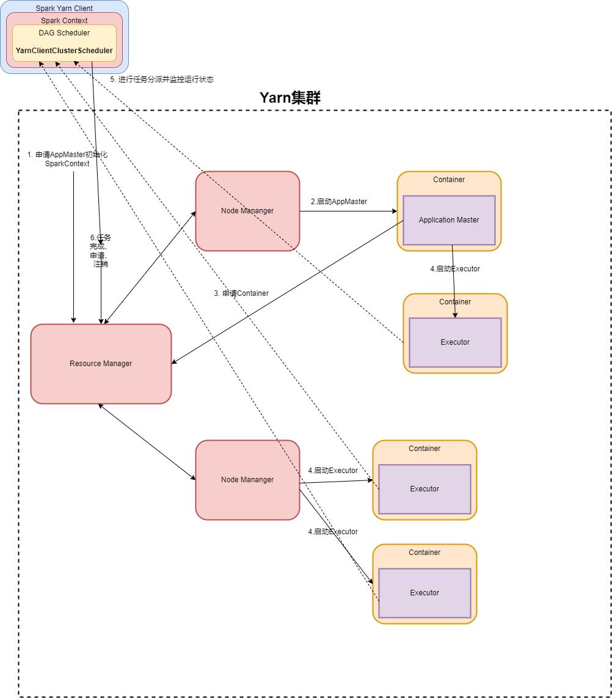
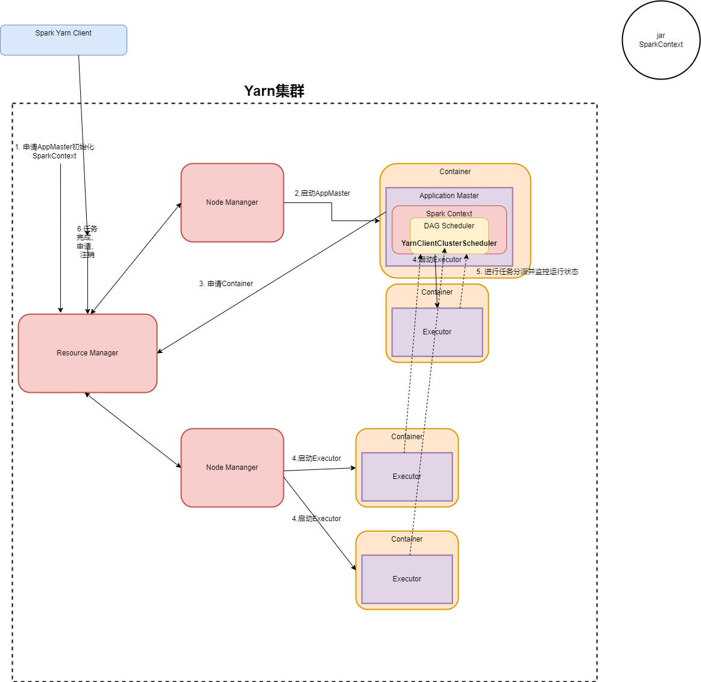
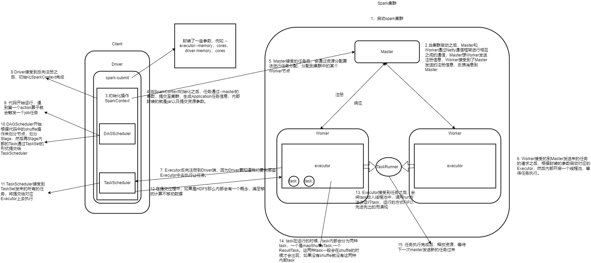

## Spark编程初体验

### 创建spark的maven工程

```xml
##1. 使用idea创建一个普通的maven工程，一直下一步即可
##2. 导入spark的依赖：pom.xml

<?xml version="1.0" encoding="UTF-8"?>
<project xmlns="http://maven.apache.org/POM/4.0.0"
         xmlns:xsi="http://www.w3.org/2001/XMLSchema-instance"
         xsi:schemaLocation="http://maven.apache.org/POM/4.0.0 http://maven.apache.org/xsd/maven-4.0.0.xsd">
    <modelVersion>4.0.0</modelVersion>

    <groupId>com.qf.bigdata</groupId>
    <artifactId>spark</artifactId>
    <version>1.0</version>

    <properties>
        <spark-version>3.1.2</spark-version>

        <!-- 配置maven的编译器版本 -->
        <maven.compiler.source>1.8</maven.compiler.source>
        <maven.compiler.target>1.8</maven.compiler.target>
    </properties>

    <dependencies>
        <!-- spark core -->
        <dependency>
            <groupId>org.apache.spark</groupId>
            <artifactId>spark-core_2.12</artifactId>
            <version>${spark-version}</version>
        </dependency>

        <!-- spark sql -->
        <dependency>
            <groupId>org.apache.spark</groupId>
            <artifactId>spark-sql_2.12</artifactId>
            <version>${spark-version}</version>
        </dependency>

        <!-- spark streaming -->
        <dependency>
            <groupId>org.apache.spark</groupId>
            <artifactId>spark-streaming_2.12</artifactId>
            <version>${spark-version}</version>
        </dependency>
    </dependencies>
</project>
``` 
创建scala目录并设置scala目录为编码目录
*CTRL + Shift + Alt + S*
*Modules -> 选中scala目录 -> Sources。保存即可*


###Java ： WordCount

```java
package com.qf.bigdata.spark.core.day1;

import org.apache.spark.SparkConf;
import org.apache.spark.api.java.JavaPairRDD;
import org.apache.spark.api.java.JavaRDD;
import org.apache.spark.api.java.JavaSparkContext;
import org.apache.spark.api.java.function.FlatMapFunction;
import org.apache.spark.api.java.function.Function2;
import org.apache.spark.api.java.function.PairFunction;
import org.apache.spark.api.java.function.VoidFunction;
import scala.Tuple2;

import java.util.Arrays;
import java.util.Iterator;

/**
* 第一个Spark Core的WordCount程序
*/
public class Demo1_WordCount {
    public static void main(String[] args) {
        //1. 创建Spark的编程入口
        //1.1 Spark的配置对象，主要作用是用于配置spark相关的配置信息
        SparkConf conf = new SparkConf();
        //1.2 使用本地的硬件配置信息配置spark
        conf.setMaster("local[*]");
        //1.3 配置本次spark的程序的程序名称
        conf.setAppName(Demo1_WordCount.class.getSimpleName());
        //1.4 通过配置对象获取到Spark Core的核心对象
        JavaSparkContext sc = new JavaSparkContext(conf);
        
        //2. 加载外部数据
        JavaRDD<String> linesRDD = sc.textFile("H:/wc.txt");
        //2.1 遍历读取文件的内容
        linesRDD.foreach(new VoidFunction<String>() {
            public void call(String line) throws Exception {
                System.out.println(line);
            }
        });
        
        //3. flatmap
        JavaRDD<String> wordsRDD = linesRDD.flatMap(new FlatMapFunction<String, String>() {
            public Iterator<String> call(String line) throws Exception {
                return Arrays.asList(line.split("\\s+")).iterator();
            }
        });
        //3.1 遍历读取文件的内容
        wordsRDD.foreach(new VoidFunction<String>() {
            public void call(String line) throws Exception {
                System.out.println(line);
            }
        });
        
        //4. map
        JavaPairRDD<String, Integer> pairRDD = wordsRDD.mapToPair(new PairFunction<String, String, Integer>() {
            public Tuple2<String, Integer> call(String word) throws Exception {
                return new Tuple2<String, Integer>(word, 1);
            }
        });
        
        //4.1 遍历读取文件的内容
        pairRDD.foreach(new VoidFunction<Tuple2<String, Integer>>() {
            public void call(Tuple2<String, Integer> t) throws Exception {
                System.out.println(t._1 + "-->" + t._2);
            }
        });
        
        //5. reducebykey
        JavaPairRDD<String, Integer> resRDD = pairRDD.reduceByKey(new Function2<Integer, Integer, Integer>() {
            public Integer call(Integer v1, Integer v2) throws Exception {
                return v1 + v2;
            }
        });
        
        resRDD.foreach(new VoidFunction<Tuple2<String, Integer>>() {
            public void call(Tuple2<String, Integer> t) throws Exception {
                System.out.println(t._1 + "-->" + t._2);
            }
        });
    }
}
```

###Java Lambda : WordCount

```java
package com.qf.bigdata.spark.core.day1;

import org.apache.spark.SparkConf;
import org.apache.spark.api.java.JavaPairRDD;
import org.apache.spark.api.java.JavaRDD;
import org.apache.spark.api.java.JavaSparkContext;
import scala.Tuple2;

import java.util.Arrays;

/**
 * Java Lambda
 */
public class Demo2_Lambda {
    public static void main(String[] args) {
        //1. 创建Spark的编程入口
        //1.1 Spark的配置对象，主要作用是用于配置spark相关的配置信息
        SparkConf conf = new SparkConf();
        //1.2 使用本地的硬件配置信息配置spark
        conf.setMaster("local[*]");
        //1.3 配置本次spark的程序的程序名称
        conf.setAppName(Demo1_WordCount.class.getSimpleName());
        //1.4 通过配置对象获取到Spark Core的核心对象
        JavaSparkContext sc = new JavaSparkContext(conf);

        //2. 加载外部数据
        JavaRDD<String> linesRDD = sc.textFile("H:/wc.txt");
        //2.1 遍历读取文件的内容
        linesRDD.foreach(line -> System.out.println(line));

        //3. flatmap
        JavaRDD<String> wordsRDD = linesRDD.flatMap(line -> Arrays.asList(line.split("\\s+")).iterator());
        wordsRDD.foreach(line -> System.out.println(line));

        //4. map
        JavaPairRDD<String, Integer> pairRDD = wordsRDD.mapToPair(word -> new Tuple2<String, Integer>(word, 1));
        pairRDD.foreach(t -> System.out.println(t._1 + "-->" +t._2));

        //5. reducebykey
        JavaPairRDD<String, Integer> resRDD = pairRDD.reduceByKey((v1, v2) -> v1 + v2);
        resRDD.foreach(t -> System.out.println(t._1 + "-->" +t._2));

        //6. 释放资源
        sc.close();
    }
}
```

###Scala : WordCount

```scala
package com.qf.bigdata.spark.core.day1

import org.apache.spark.rdd.RDD
import org.apache.spark.{SparkConf, SparkContext}

object Demo1_Scala_Spark_WordCount {
  def main(args: Array[String]):Unit = {
    //1. 创建SparkContext对象
    val conf = new SparkConf().setMaster("local[*]").setAppName("scala_wordcount")
    val sc = new SparkContext(conf)
    
    //2. 读取数据
    val lineRDD:RDD[String] = sc.textFile("H:/wc.txt")
    //3. 切割
    val wordRDD:RDD[String] = lineRDD.flatMap(_.split("\\s+"))
    //4. map将数组中的元素转换成一个一个的元组
    val pairRDD:RDD[(String, Int)] = wordRDD.map((_, 1))
    //5. 汇总
    val res = pairRDD.reduceByKey((v1, v2) => v1 + v2)
    //6. 打印
    res.foreach(println)
    //7. 释放资源
    sc.stop()
  }
}
```

###进一步简化的scala程序

```scala
package com.qf.bigdata.spark.core.day1

import org.apache.spark.{SparkConf, SparkContext}

object Demo1_Scala_Spark_WordCount {
  def main(args: Array[String]):Unit = {
    //1. 创建SparkContext对象
    val sc = new SparkContext(new SparkConf().setMaster("local[*]").setAppName("scala_wordcount"))
    //2. 读取数据
    sc.textFile("H:/wc.txt").flatMap(_.split("\\s+"))
      .map((_, 1)).reduceByKey((v1, v2) => v1 + v2).reduceByKey((v1, v2) => v1 + v2).foreach(println)
    //7. 释放资源
    sc.stop()
  }
}
```

### 将spark程序打包存放到服务器中执行

####修改依赖配置文件：pom.xml

```xml
<!-- 第三方jar包的打包插件 -->
    <build>
        <sourceDirectory>src/main/scala</sourceDirectory>
        <plugins>
            <!-- 第三方jar包的打包插件:如果你这里爆红，是因为之前没有下载过依赖，请你先下载再使用 -->
            <plugin>
                <artifactId>maven-assembly-plugin</artifactId>
                <configuration>
                    <descriptorRefs>
                        <descriptorRef>jar-with-dependencies</descriptorRef>
                    </descriptorRefs>
                </configuration>
                <executions>
                    <execution>
                        <id>make-assembly</id>
                        <phase>package</phase>
                        <goals>
                            <goal>single</goal>
                        </goals>
                    </execution>
                </executions>
            </plugin>

            <!-- scala打包插件 -->
            <plugin>
                <groupId>org.scala-tools</groupId>
                <artifactId>maven-scala-plugin</artifactId>
                <version>2.15.2</version>
                <executions>
                    <execution>
                        <goals>
                            <goal>compile</goal>
                        </goals>
                    </execution>
                </executions>
            </plugin>
        </plugins>
    </build>
```

#### 操作步骤

```sh
##1. 在HDFS中创建目录：/input
##2. 将wc.txt上传到/input目录中
##3. 将我们的程序打包并上传到linux：/data/jar
##tip:
## 修改代码的路径：sc.textFile("/wc.txt")
##4. 使用spark提交spark的程序：local模式
spark-submit \
--class com.qf.bigdata.spark.core.day1.Demo1_Scala_Spark_WordCount \
--master local \
/data/jars/spark-1.0-jar-with-dependencies.jar

```

###关于Spark的部署模式

####部署模式说明

```sh
##1. Local : 本地模式，一般用于测试，比如eclipse、idea写程序测试的时候
##2. standalone ： 是spark自带的资源调度框架，如果使用此模式，你需要先自行的安装spark的分布式集群
##3. yarn（国内） : hadoop自带的资源调度框架，spark也可以将自己的job提交给yarn进行计算
##4. mesos（欧美） ：资源调度框架，类似yarn

## tip:
我们在执行spark程序的时候需要设置master，从而来设置spark的部署模式，
那么设置部署模式一共有3种途径：
1. 在代码中设置(最高的)
2. 在配置文件中设置(其次)
3. 脚本/命令中设置(最低的)
```

####standalone模式

```sh
##1. 修改代码，将setMaster的代码注释
##2. 重新打包
##3. 提交脚本
spark-submit \
--class com.qf.bigdata.spark.core.day1.Demo1_Scala_Spark_WordCount \
--master spark://10.206.0.4:7077 \
/data/jars/spark-1.0-jar-with-dependencies.jar
```


```sh
##1. 检查结果路径：
$SPARK_HOME/work/job#id/partitionId/结果日志
```

####yarn模式

#####使用步骤

```sh
##1. 开启yarn的集群
##2. 提交脚本
spark-submit \
--class com.qf.bigdata.spark.core.day1.Demo1_Scala_Spark_WordCount \
--master yarn \
--deploy-mode cluster \
--driver-memory 600M \
--executor-memory 800M \
/data/jars/spark-1.0-jar-with-dependencies.jar

tip:
client : 用于测试,一般jar包在哪里提交，就在那里运行
cluster : 用于生产,将jar包提交给rm，由rm负责分配给集群中的nm执行
```


```sh
##1. 查看结果：在hadoop的日志中查看
$HADOOP_HOME/logs/userlogs/#applicationid/#containerid/日志
```

##### 3.7.3.2 Yarn Client的工作



> 1. Spark Yarn Client向Yarn的ResourceManager申请启动ApplicationMaster。同时在SparkContext初始化将DAGSecheduler和TaskScheduler等组件，由于我们选择yarn-client模式，程序回选择YarnClientClustserSchelder和YarnClientSchedulerBackend。
> 2. ResourceManager收到请求之后，在集群中选择某一个NodeManager作为该应用程序分配第一个Contaier，要求在这个Container启动一个ApplicationMaster。**与Yarn-cluser模式区别是在ApplicationMaster中不运行SparkContext**，只与SparkContext进行联系进行资源分配。
> 3. Client中的SparkContext在初始化完毕之后，与ApplicationMaster只建立通讯。向ResurceManager注册，根据任务信息向ResourceManager申请资源。
> 4. 一旦在ApplicationMaster中申请到了资源，便与对应NodeManager通信，要求它在活得的Container中启动CoarseGrainedExecutorBackend，这个组件在启动后向Client中的SparkContext注册并申请Task。
> 5. client中的SparkContext分配Task给CoarseGrainedExecutorBackend执行并且向Driver汇报运行的状态和进度。
> 6. 当整个应用程序完成之后，client的SparkContext向ResourceManager申请注销并关闭自己

##### 3.7.3.3 Yarn Cluster



##### 3.7.3.4 小结：cluster和client模式的区别

> ​	首先你要清楚一个概念：ApplicationMaster。在Yarn总，每个Application实例（Flink Application、Spark Application、Mapreduce Application...)都有ApplicationMaster进程，它是Application启动的时候产生的第一个容器。它负责和ResaurceManager打交道并请求资源，获取资源之后告诉NodeManager为其启动Container。从深层次将yarn-cluser和yarn-client模式的区别其实就是ApplicationMaster进程的区别。
>
> ​	Yarn-cluster模式下，Driver运行在ApplicationMaster中，它负责向Yarn申请资源，并监督job运行状况。用户提交job之后，client就可以关掉了，但是job会继续在yarn上运行。
>
> ​	yarn-client模式，ApplicationMaster仅仅向yarn请求executor，client会和请求的container通信来调度他们的工作，所以说client会不会关掉？答案肯定是不能。
>
> 得出一个结论：
>
> ​	- driver会和executor进行通信，所以yarn-cluster在提交app之后可以关闭client，但是yarn-client不可以
>
> ​	- yarn-cluster适合生产环境中使用，yarn-client适合在测试的交互环境中使用

#### 3.7.4 Spark Job提交原理



> Client ： 客户端进程，负责提交作业到Master。在这里指的就是spark-submit
>
> Master ： Standalone模式中的主节点（在Yarn模式中就是ResourceManager）,负责接受Client提交的job，管理Worker并命令Worker启动Driver和Executor。
>
> Worker ： Standalone模式中的从节点（在Yarn模式中就是NodeManager），负责管理本节点的资源，定期向Master汇报心跳，接受Master的命令，启动Executor
>
> Driver ： 一个Spark Job运行时包含一个Driver的进程，也是job的主进程，负责job的解析、生成Stage并调度Task到Executor上。包含了：DAGScheduler、TaskScheduler。
>
> Executor：真正执行"spark job"的地方（spark job中的task），一个集群中包含了多个Executor，每个executor接受Driver的Launch Task，一个executor可以执行多个task。
>
> stage ： 一个spark job一般会包含1到多个stage
>
> task ： 一个stage包含了1到多个task，通过多个task实行并行运算的功能
>
> DAGScheduler : 实现将Spark job分解成1到多个Stage的组件，每个Stage根据RDD的Partition个数决定Task的个数，然后生成相应的Taskset，放到TaskScheduler。
>
> TaskScheduler ：实现Task分配到Executor执行的组件

