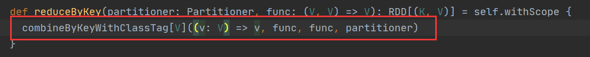
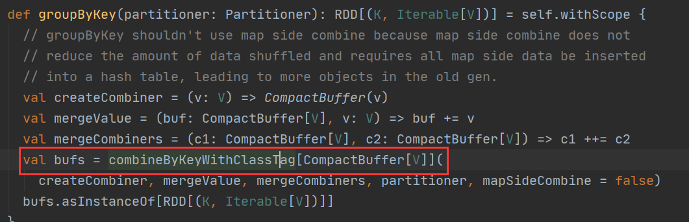

[toc]
# Spark 算子
## 什么是算子？
> 算子是数学中的一个概念。表示一个函数空间到另一个函数空间的映射：
> X -> Y。广义上讲算子可以推广到任何空间，比如内积空间。
> 
> **对任何函数进行某一操作都可以认为是一个算子**。对a函数进行b操作，那么这个b就是算子
> 在spark中算子分为两类：
> * Transformation：转换算子
> * Action：行动算子


## 转换算子
### 介绍
>map的作用几乎跟scala学习到的map高阶函数一毛一样
> 
> 作用： 就是对RDD中的数据进行一对一的处理的。在spark中的所有的转换算子都只会产生一个数据处理之后的**副本**
> 
>def map`[`U: ClassTag`]`(f: T => U): RDD`[`U`]`

```scala
package com.qf.bigdata.spark.core.day3

import org.apache.spark.rdd.RDD
import org.apache.spark.{SparkConf, SparkContext}

object Demo1_Map {
  def main(args: Array[String]): Unit = {
    //1. 获取到Spark的入口，SparkContext
    val sc = new SparkContext("local[*]", "demo_map", new SparkConf())

    //2. 集合
    val list: Range.Inclusive = 1 to 7

    //3. 加载内存中的数据
    val listRDD: RDD[Int] = sc.parallelize(list)

    //4. map
    val mapRDD: RDD[Double] = listRDD.map(num => num * 10.0)

    //5. foreach : action算子
    mapRDD.foreach(println)
  }
}
```
###flatMap
``
def flatMap[U: ClassTag](f: T => TraversableOnce[U]): RDD[U]
``
```scala
package com.qf.bigdata.spark.core.day3

import org.apache.spark.rdd.RDD
import org.apache.spark.{SparkConf, SparkContext}

object Demo2_FlatMap {
  def main(args: Array[String]): Unit = {
    //1. 获取到Spark的入口，SparkContext
    val sc = new SparkContext("local[*]", "demo_map", new SparkConf())

    //2.
    val lineRDD: RDD[String] = sc.parallelize(List(
      "hello hello me"
    ))

    //3.
    val mapRDD: RDD[String] = lineRDD.flatMap(line => line.split("\\s+"))

    mapRDD.foreach(println)
  }
}

```
### filter
`def filter(f: T => Boolean): RDD[T]`
```scala
package com.qf.bigdata.spark.core.day3

import org.apache.spark.rdd.RDD
import org.apache.spark.{SparkConf, SparkContext}

object Demo2_FlatMap {
  def main(args: Array[String]): Unit = {
    //1. 获取到Spark的入口，SparkContext
    val sc = new SparkContext("local[*]", "demo_map", new SparkConf())

    //2.
    val lineRDD: RDD[String] = sc.parallelize(List(
      "hello hello me"
    ))

    //3.
    val mapRDD: RDD[String] = lineRDD.flatMap(line => line.split("\\s+"))

    mapRDD.filter(line => line.equals("hello")).foreach(println)
  }
}
```
### sample

> 类似于Hive中的TableSample。
>
> 作用：抽样查询。
>
> ```scala
> def sample(
>     withReplacement: Boolean, // 抽样方式，true返回抽样，false不反回抽样
>     fraction: Double, // 抽样比例，取值0~1（不准确）
>     seed: Long = Utils.random.nextLong) // 抽样的种子
> : RDD[T]
> ```

```scala
package com.qf.bigdata.spark.core.day3

import org.apache.spark.SparkContext
import org.apache.spark.rdd.RDD

object Demo3_Sample {
  def main(args: Array[String]): Unit = {
    //1. 获取到本地sparkContext对象
    val sc: SparkContext = SparkUtils.getLocalSparkContext()
    //2. 加载数据
    val listRDD: RDD[Int] = sc.parallelize(1 to 10000)
    //3. 抽样
    var sampleRDD: RDD[Int] = listRDD.sample(true, 0.001)
    Thread.sleep(100)
    println("抽样空间 ：" + sampleRDD.count())
    sampleRDD.foreach(println)
    println("-" * 100)
    sampleRDD = listRDD.sample(true, 0.001)
    Thread.sleep(100)
    println("抽样空间 ：" + sampleRDD.count())
    sampleRDD.foreach(println)
    // 释放资源
    SparkUtils.close(sc)
  }
}
```
### union

> ```scala
> def union(other: RDD[T]): RDD[T] // 将两个RDD进行合并的方法
> ```

```scala
package com.qf.bigdata.spark.core.day3

import org.apache.spark.SparkContext
import org.apache.spark.rdd.RDD

object Demo4_Union {
  def main(args: Array[String]): Unit = {
    val sc: SparkContext = SparkUtils.getLocalSparkContext()
    //1. 加载数据
    val list1RDD: RDD[Int] = sc.parallelize(List(
      1, 2, 3, 4, 5
    ))

    val list2RDD: RDD[Int] = sc.parallelize(List(
      1, 2, 4, 6, 5
    ))

    //2. union : 将连个rdd进行聚合
    val unionRDD: RDD[Int] = list1RDD.union(list2RDD)

    //3. 打印
    unionRDD.foreach(println)


    SparkUtils.close(sc)
  }
}

```
### distinct

> 去重
>
> ```scala
> def distinct(): RDD[T]
> ```

```scala
package com.qf.bigdata.spark.core.day3

import org.apache.spark.rdd.RDD

object Demo5_Distinct {
  def main(args: Array[String]): Unit = {
    val sc = SparkUtils.getLocalSparkContext()

    val listRDD: RDD[Int] = sc.parallelize(List(
      1, 2, 2, 3, 3, 4, 5, 6
    ))

    val disRDD: RDD[Int] = listRDD.distinct()

    disRDD.foreach(println)

    SparkUtils.close(sc)
  }
}
```
### join

>join算子就是和sql的join查询一样的功能。但是这里如果想要 使用join算子，有一个前提：
>
>你RDD中的元素必须得是一个二维元祖。
>
>一 、回忆sql中的join
>
>1. 交叉查询
>
>select * from A a accross Join B b; 因为产生笛卡儿积，所以一般都不用
>
>2. 内连接 ： Inner Join
>
>select * from A a [inner] Join B b [where|on a.xx = b.xx]
>
>3. 外连接
>
>3.1 左外连接  ： 以左表为主体，不管where条件是否成立，左边的表的数据都会显示
>
>select * from A a left [outer] Join B b [where|on a.xx = b.xx]
>
>3.2 右外连接 ： 以右表为主体，不管where条件是否成立，右边的表的数据都会显示
>
>select * from A a right [outer] Join B b [where|on a.xx = b.xx]
>
>3.3 全外连接 ： 以两边表为主体，不管where条件是否成立，两边边的表的数据都会显示
>
>select * from A a full[outer] Join B b [where|on a.xx = b.xx]
>
>3.4 左半连接
>
>select * from A a left semi Join B b [where|on a.xx = b.xx]
>
>二、 Spark中的Join
>
>e.g.RDD[(K,V)] : K表示SQL中的on后面字段名称的值
>
>RDD1[(K,V)], RDD2[(K,W)]
>
>1. 内链接
>
>val rdd:RDD[(K, (V,W))] = rdd1.join(rdd2)
>
>2. 左连接
>
>val rdd:RDD[(K, (V,Option[W]))] = rdd1.leftOuterJoin(rdd2)
>
>3. 右连接
>
>val rdd:RDD[(K, (Option[V],W))] = rdd1.rightOuterJoin(rdd2)
>
>4. 全外
>
>val rdd:RDD[(K, (Option[V],Option[W]))] = rdd1.fullOuterJoin(rdd2)

```scala
package com.qf.bigdata.spark.core.day3

import org.apache.spark.SparkContext
import org.apache.spark.rdd.RDD

object Demo6_Join {
  def main(args: Array[String]): Unit = {
    val sc: SparkContext = SparkUtils.getLocalSparkContext()
    //1. 准备数据
    //1.1 学生
    val stuRDD: RDD[String] = sc.parallelize(List(
      "1 刘诗诗 女 18",
      "2 范冰冰 女 34",
      "3 高圆圆 女 30",
      "4 欧阳娜娜 女 19",
      "5 李冰冰 女 40"
    ))

    //1.2 成绩
    val scoreRDD: RDD[String] = sc.parallelize(List(
      "1 语文 59",
      "2 数学 49",
      "3 英语 39",
      "4 体育 100",
      "6 化学 0"
    ))

    //2. 改造数据
    val stuTupleRDD: RDD[(Int, String)] = stuRDD.map(line => {
      val sid = line.substring(0, line.indexOf(" ")).toInt
      val info = line.substring(line.indexOf(" ") + 1)
      (sid, info)
    })

    val scoreTupleRDD: RDD[(Int, String)] = scoreRDD.map(line => {
      val sid = line.substring(0, line.indexOf(" ")).toInt
      val info = line.substring(line.indexOf(" ") + 1)
      (sid, info)
    })

    println(stuTupleRDD.take(10).mkString(","))
    println(scoreTupleRDD.take(10).mkString(","))

    //3. join
    //3.1 查询有成绩的学生
    val stuInnerScoreRDD: RDD[(Int, (String, String))] = stuTupleRDD.join(scoreTupleRDD)
    println(stuInnerScoreRDD.take(10).mkString(","))

    //3.2 left
    val stuLeftScoreRDD: RDD[(Int, (String, Option[String]))] = stuTupleRDD.leftOuterJoin(scoreTupleRDD)
    println(stuLeftScoreRDD.take(10).mkString(","))

    //3.3 right
    val stuRightScoreRDD: RDD[(Int, (Option[String], String))] = stuTupleRDD.rightOuterJoin(scoreTupleRDD)
    println(stuRightScoreRDD.take(10).mkString(","))

    //3.4 full
    val stuFullScoreRDD: RDD[(Int, (Option[String], Option[String]))] = stuTupleRDD.fullOuterJoin(scoreTupleRDD)
    println(stuFullScoreRDD.take(10).mkString(","))

    SparkUtils.close(sc)
  }
}
```
##  groupByKey

> groupBy —— 分组，由自己去指定字段分组
>
> groupByKey —— 分组，他的分组字段就是这个key。所以要求RDD的元素必须得是一个二维的元组RDD[（K,V）]
>
> 这个算子在实际生产中使用不多，他不会进行局部聚合，就会导致分布式环境下这个算子性能不足
>
> ```scala
> def groupByKey(): RDD[(K, Iterable[V])]
> ```

```scala
package com.qf.bigdata.spark.core.day3

import org.apache.spark.rdd.RDD

object Demo7 {
  def main(args: Array[String]): Unit = {
    val sc = SparkUtils.getLocalSparkContext()

    //1. 加载数据
    val stuRDD: RDD[String] = sc.parallelize(List(
      "1,杨过,1,22,zzbigdata-2201",
      "2,郭靖,1,42,zzbigdata-2202",
      "3,张无忌,1,2,zzbigdata-2203",
      "4,黄蓉,2,452,zzbigdata-2202",
      "5,周芷若,2,12,zzbigdata-2203"
    ))

    //2. 改造数据
    val stuClassRDD: RDD[(String, String)] = stuRDD.map(line => {
      val index: Int = line.lastIndexOf(",")
      val className = line.substring(index + 1)
      val info = line.substring(0, index)
      (className, info)
    })

    //3. 分组:[(zzbigdata-2202, [(2,郭靖,1,42), (4,黄蓉,2,452)]), (...)]
    val gbkRDD: RDD[(String, Iterable[String])] = stuClassRDD.groupByKey()

    //4. 打印结果
    println(gbkRDD.take(10).mkString(","))

    SparkUtils.close(sc)
  }
}
```
### groupBy

```scala
def groupBy[K](f: T => K)(implicit kt: ClassTag[K]): RDD[(K, Iterable[T])]
e.g.
package com.qf.bigdata.spark.core.day3

import org.apache.spark.rdd.RDD

object Demo7 {
  def main(args: Array[String]): Unit = {
    val sc = SparkUtils.getLocalSparkContext()

    //1. 加载数据
    val stuRDD: RDD[String] = sc.parallelize(List(
      "1,杨过,1,22,zzbigdata-2201",
      "2,郭靖,1,42,zzbigdata-2202",
      "3,张无忌,1,2,zzbigdata-2203",
      "4,黄蓉,2,452,zzbigdata-2202",
      "5,周芷若,2,12,zzbigdata-2203"
    ))

    //3. 分组:[(zzbigdata-2202, [(2,郭靖,1,42), (4,黄蓉,2,452)]), (...)]
    val classRDD: RDD[(String, Iterable[String])] = stuRDD.groupBy(line => {
      val index: Int = line.lastIndexOf(",")
      val className = line.substring(index + 1)
      className
    })

    //4. 打印结果
    println(classRDD.take(10).mkString(","))

    SparkUtils.close(sc)
  }
}

```
### reduceByKey

> 和GroupByKey一样，需要先将这个RDD中的元素造成一个二维元祖。
>
> 作用：作用和GroupByKey类似，也是先通过Key来进行分组。不同之处，reduceByKey会再获取到每次的前一个元素和后一个元素。分组聚合求和的场景使用得比较多。
>
> ```scala
> def reduceByKey(func: (V, V) => V): RDD[(K, V)]
> e.g.
> val sum = 0
> for(i <- 1 to 10) {
>     sum = sum + i
> }
>
> 第一个V ： sum
> 第二个V ： i
> ```

```scala
package com.qf.bigdata.spark.core.day3

import org.apache.spark.SparkContext
import org.apache.spark.rdd.RDD

object Demo8_ReduceByKey {
  def main(args: Array[String]): Unit = {
    val sc: SparkContext = SparkUtils.getLocalSparkContext()

    val lineRDD: RDD[String] = sc.textFile("C:\\ftp\\pom.xml")

    //wordcount
    val resRDD: RDD[(String, Int)] = lineRDD.flatMap(_.split(",")).map((_, 1)).reduceByKey(_ + _)

    println(resRDD.take(10).mkString(","))

    SparkUtils.close(sc)
  }
}

```

> Spark中也有reduce算子，但是它不是转换算子，他是action算子

`scala
 def reduce(f: (T, T) => T): T
`

### sortByKey

> RDD中的元素必须是二维元祖。无论是sortBy还是sortByKey也好，他们都只能保证**分区内有序**。

```scala
package com.qf.bigdata.spark.core.day3

import org.apache.spark.SparkContext
import org.apache.spark.rdd.RDD

object Demo9_SortByKey {
  def main(args: Array[String]): Unit = {
    val sc: SparkContext = SparkUtils.getLocalSparkContext()

    //1. 准备数据
    //1.1 学生
    val stuRDD: RDD[String] = sc.parallelize(List(
      "1 刘诗诗 女 18",
      "2 范冰冰 女 34",
      "3 高圆圆 女 30",
      "4 欧阳娜娜 女 19",
      "5 李冰冰 女 40"
    ),3)

    //1.2 成绩
    val scoreRDD: RDD[String] = sc.parallelize(List(
      "1 语文 59",
      "2 数学 49",
      "3 英语 39",
      "4 体育 100",
      "6 化学 0"
    ),3)

    //2. 改造数据
    val stuTupleRDD: RDD[(Int, String)] = stuRDD.map(line => {
      val sid = line.substring(0, line.indexOf(" ")).toInt
      val info = line.substring(line.indexOf(" ") + 1)
      (sid, info)
    })

    val scoreTupleRDD: RDD[(Int, String)] = scoreRDD.map(line => {
      val sid = line.substring(0, line.indexOf(" ")).toInt
      val info = line.substring(line.indexOf(" ") + 1)
      (sid, info)
    })

    // 默认升序，设置为降序
//    println(stuTupleRDD.sortByKey(false).take(10).mkString(","))
    stuTupleRDD.sortByKey(false).foreach(println)

    SparkUtils.close(sc)
  }
}
```
### mapPartitions

> map算子的升级版。map算子的批处理版。此算子，一个分区作为一个批次来进行数据处理。
>
> ```scala
> def mapPartitions[U: ClassTag](
>     f: Iterator[T] => Iterator[U],
>     preservesPartitioning: Boolean = false): RDD[U
> ```
>
### mapPartitionsWithIndex

> 是mapPartitions的升级版，他比前者多一个index（分区的索引）
>
> ```scala
> def mapPartitionsWithIndex[U: ClassTag](
>     f: (Int, Iterator[T]) => Iterator[U],
>     preservesPartitioning: Boolean = false): RDD[U]
> ```

```scala
package com.qf.bigdata.spark.core.day3

import org.apache.spark.SparkContext
import org.apache.spark.rdd.RDD

object Demo10_MapPartitions {
  def main(args: Array[String]): Unit = {
    val sc: SparkContext = SparkUtils.getLocalSparkContext()

    val listRDD: RDD[Int] = sc.parallelize(1 to 10, 3)

    listRDD.map(num => num * 10).foreach(println)
    println("-" * 10)
    listRDD.mapPartitions(partitions => partitions.map(_ * 10)).foreach(println)
    println("-" * 10)
    listRDD.mapPartitionsWithIndex {
      case (index, partitions) => {
        println(s"partition's id is ${index}, partitions 's data is ${partitions.mkString(",")}")
        partitions.map(_ * 10)
      }
    }.foreach(println)
    SparkUtils.close(sc)
  }
}
```
### repatition和coalesce

> ​	重分区。其实repatition是coalesce实现的。coalesce默认使用的是窄依赖，repatition是宽依赖的。一般使用的时候对于分区的情况我们都用coalesce；分区增加使用的是repatition。
>
> - coalesce&repatition
>
> ```scala
> def coalesce(numPartitions: Int, shuffle: Boolean = false,
>              partitionCoalescer: Option[PartitionCoalescer] = Option.empty)
>             (implicit ord: Ordering[T] = null)
>     : RDD[T]
> ```

> ```scala
> def repartition(numPartitions: Int)(implicit ord: Ordering[T] = null): RDD[T]
> ```

```scala
package com.qf.bigdata.spark.core.day3

import org.apache.spark.SparkContext
import org.apache.spark.rdd.RDD

object Demo11_Repatition {
  def main(args: Array[String]): Unit = {
    val sc: SparkContext = SparkUtils.getLocalSparkContext()

    val listRDD: RDD[Int] = sc.parallelize(1 to 10000)
    println(listRDD.getNumPartitions)

    //重分区
    val colRDD: RDD[Int] = listRDD.coalesce(10, true)
    println(colRDD.getNumPartitions)
    val reRDD: RDD[Int] = listRDD.repartition(10)

    val colRDD2: RDD[Int] = reRDD.coalesce(1)
    println(colRDD2.getNumPartitions)
    
    SparkUtils.close(sc)
  }
}

```
### CombineByKey

> ​	通过观察底层(ReduceByKey、GroupByKey)源码，发现他们的底层源码都是通过CombineByKeyWithClassTag这个函数来实现的。
>
> ​	CombineByKey其实就是CombineByKeyWithClassTag的简化版。
>
> ​	CombineByKey是Spark底层的聚合算子之一，按照key进行聚合，spark提供的很多的高阶算子都是基于这个算子实现的。
>
> ​	一般使用spark用不到这个算子，但是一旦你发现spark自带的算子不够用的，你需要自定义聚合算子的时候，就需要利用这个算子来自定义聚合算子。
>
> ```
> def combineByKey[C](
>     createCombiner: V => C, // 初始化方法，每个key第一次出现的自动的调用这个方法
>     mergeValue: (C, V) => C, // 分区内聚合的方法，相同的key，对用了不同的value，在相同的区中的时候会调用此方法
>     mergeCombiners: (C, C) => C, // 全局聚合方法，所有的相同key的分区的数据会调用此方法进行聚合
> ): RDD[(K, C)]
> ```


#### 重写GroupByKey

```scala
package com.qf.bigdata.spark.core.day3

import org.apache.spark.SparkContext
import org.apache.spark.rdd.RDD

import scala.collection.mutable.ArrayBuffer

object Demo12_CombineByKey_GBK {
  def main(args: Array[String]): Unit = {
    val sc: SparkContext = SparkUtils.getLocalSparkContext()

    //1. 加载数据
    val stuRDD: RDD[String] = sc.parallelize(List(
      "王东阳,zzbigdata2201",
      "徐明伟,zzbigdata2201",
      "毕帆,zzbigdata2201",
      "徐娟娟,hzbigdata2102",
      "乌力吉,hzbigdata2102"
    ), 3)

    //2. 查看哪些数据在哪些区
    val class2InfoRDD: RDD[(String, String)] = stuRDD.mapPartitionsWithIndex {
      case (partitionId, partitions) => {
//        println(s"${partitionId} : ${partitions.mkString(",")}")
        partitions.map(line => {
          val index = line.lastIndexOf(",")
          val className = line.substring(index + 1)
          val info = line.substring(0, index)
          (className, info)
        }).toIterator
      }
    }

    println("gbk ================================================")
    val gbkRDD: RDD[(String, Iterable[String])] = class2InfoRDD.groupByKey()
    gbkRDD.foreach(println)

    println("combineByKey ---> GBK ================================================")
    val cbk2GBK: RDD[(String, ArrayBuffer[String])] = class2InfoRDD.combineByKey(createCombiner, mergeValue, mergeCombiners)
    cbk2GBK.foreach(println)

    SparkUtils.close(sc)
  }

  /**
   * 在同一个分区中，出现第一次key的时候调用一次
   * 0 : 王东阳,zzbigdata2201
   * 1 : 徐明伟,zzbigdata2201,毕帆,zzbigdata2201
   * 2 : 徐娟娟,hzbigdata2102,乌力吉,hzbigdata2102
   *
   * 调用3次
   */
  def createCombiner(stu:String):ArrayBuffer[String] = {
    println(s"==============createCombiner<${stu}>===============================")
    val ab: ArrayBuffer[String] = ArrayBuffer[String]()
    ab.append(stu)
    ab
  }

  /**
   * 分区内的局部聚合（相同的key会调用一次此函数）
   * 0 : 王东阳,zzbigdata2201
   * 1 : 徐明伟,zzbigdata2201,毕帆,zzbigdata2201
   * 2 : 徐娟娟,hzbigdata2102,乌力吉,hzbigdata2102
   *
   * 调用2次
   */
  def mergeValue(ab:ArrayBuffer[String], stu:String):ArrayBuffer[String] = {
    println(s"==============mergeValue局部聚合<${ab}>, 被聚合：${stu} ===============================")
    ab.append(stu)
    ab
  }

  /**
   * 所有的分区中的相同的key的数据都回调用此方法进行全局聚合
   * 0 : 王东阳,zzbigdata2201
   * 1 : 徐明伟,zzbigdata2201,毕帆,zzbigdata220
   * 2 : 徐娟娟,hzbigdata2102,乌力吉,hzbigdata2102
   *
   * 调用1次
   *
   * sum += i
   */
  def mergeCombiners(sum:ArrayBuffer[String], i:ArrayBuffer[String]):ArrayBuffer[String] = {
    println(s"==============mergeCombiners全局聚合<${sum}>, 被聚合：${i} ===============================")
    sum .++:(i)
  }
}

```
#### 重写ReduceByKey

```scala
package com.qf.bigdata.spark.core.day3

import org.apache.spark.SparkContext
import org.apache.spark.rdd.RDD

object Demo13_CombineByKey {
  def main(args: Array[String]): Unit = {
    val sc: SparkContext = SparkUtils.getLocalSparkContext()

    val lineRDD: RDD[String] = sc.parallelize(List(
      "hello hello hello",
      "me you him"
    ))

    val mapRDD: RDD[(String, Int)] = lineRDD.flatMap(_.split("\\s+")).map((_, 1))

    // reduceByKey
    println("reduceByKey===============================")
    mapRDD.reduceByKey(_+_).foreach(println)

    println("combineByKey ========================= reduceByKey ==================================")
    mapRDD.combineByKey[Int](
      (num:Int) => num,
      (sum:Int, num:Int) => sum + num,
      (total:Int, sum:Int) => total + sum).foreach(println)

    SparkUtils.close(sc)
  }
}

```
### aggregateByKey

> 他的底层也是通过CombineByKeyWithClassTag实现的。他也是自定义算子，用来模拟其他算子的。
>
> ```scala
> aggregateByKey[U: ClassTag]
> 	(zeroValue: U) // 初始化值
> 	(seqOp: (U, V) => U, // 局部聚合
>      combOp: (U, U) => U) // 全局聚合
> : RDD[(K, U)]
> ```

##### 2.2.16.1 重写GroupByKey

```scala
package com.qf.bigdata.spark.core.day4

import com.qf.bigdata.spark.core.day3.SparkUtils
import org.apache.spark.SparkContext
import org.apache.spark.rdd.RDD

import scala.collection.mutable.ArrayBuffer

object Demo1_AggregateByKey_GBK {
  def main(args: Array[String]): Unit = {
    val sc: SparkContext = SparkUtils.getLocalSparkContext()

    //1. 加载数据
    val stuRDD: RDD[String] = sc.parallelize(List(
      "王东阳,zzbigdata2201",
      "徐明伟,zzbigdata2201",
      "毕帆,zzbigdata2201",
      "徐娟娟,hzbigdata2102",
      "乌力吉,hzbigdata2102"
    ), 3)

    //2. 查看哪些数据在哪些区
    val class2InfoRDD: RDD[(String, String)] = stuRDD.mapPartitionsWithIndex {
      case (partitionId, partitions) => {
//        println(s"${partitionId} : ${partitions.mkString(",")}")
        partitions.map(line => {
          val index = line.lastIndexOf(",")
          val className = line.substring(index + 1)
          val info = line.substring(0, index)
          (className, info)
        }).toIterator
      }
    }

    println("gbk ================================================")
    val gbkRDD: RDD[(String, Iterable[String])] = class2InfoRDD.groupByKey()
    gbkRDD.foreach(println)

    println("aggregateByKey ---> GBK ================================================")
    val abkGBK: RDD[(String, ArrayBuffer[String])] = class2InfoRDD.aggregateByKey(ArrayBuffer[String]())(
      seqOp, combOp
    )
    abkGBK.foreach(println)


    SparkUtils.close(sc)
  }

  /**
   * 局部聚合
   */
  def seqOp(ab:ArrayBuffer[String], stu:String):ArrayBuffer[String] = {
    ab.append(stu)
    ab
  }

  /**
   * 全局聚合
   * @param ab1 : sum
   * @param ab2 : i
   */
  def combOp(ab1:ArrayBuffer[String], ab2:ArrayBuffer[String]):ArrayBuffer[String] = ab1.++:(ab2)
}
```

##### 2.2.16.2 重写ReduceByKey

```scala
package com.qf.bigdata.spark.core.day4

import com.qf.bigdata.spark.core.day3.SparkUtils
import org.apache.spark.SparkContext
import org.apache.spark.rdd.RDD

object Demo2_AggregateByKey_RBK {
  def main(args: Array[String]): Unit = {
    val sc: SparkContext = SparkUtils.getLocalSparkContext()

    val lineRDD: RDD[String] = sc.parallelize(List(
      "hello hello hello",
      "me you him"
    ))

    val mapRDD: RDD[(String, Int)] = lineRDD.flatMap(_.split("\\s+")).map((_, 1))

    // reduceByKey
    println("reduceByKey===============================")
    mapRDD.reduceByKey(_+_).foreach(println)

    println("aggregateByKey ========================= reduceByKey ==================================")

    mapRDD.aggregateByKey(0)(_+_, _+_).foreach(println)
    
    SparkUtils.close(sc)
  }
}
```

### 3 Action算子

#### 3.1 介绍

> ​	action算子的作用是用来驱动转换算子的，说白了就是，转换算子是延迟加载，没有action算子的驱动，转换算子是不执行的！！！所以一个spark程序中至少得有一个action算子。
>
> ​	如果RDD中有多个分区，所有的算子都是在RDD上的分区中执行的，而不是在本地Driver中执行

#### 3.2 操作

##### 3.2.1 foreach

##### 3.2.2 count

> 作用：统计RDD中的元素的个数
>
> ```scala
> def count(): Long
> ```

```scala
package com.qf.bigdata.spark.core.day4

import com.qf.bigdata.spark.core.day3.SparkUtils
import org.apache.spark.SparkContext
import org.apache.spark.rdd.RDD

object Demo3_Count {
  def main(args: Array[String]): Unit = {
    val sc: SparkContext = SparkUtils.getLocalSparkContext()
    val listRDD: RDD[Int] = sc.parallelize(1 to 100)
    println(listRDD.count())
    SparkUtils.close(sc)
  }
}
```

##### 3.2.3 take(n)

> 作用：返回RDD中的前n个元素。多用于求去topn的业务
>
> ```scala
> def take(num: Int): Array[T]
> ```

```scala
package com.qf.bigdata.spark.core.day4

import com.qf.bigdata.spark.core.day3.SparkUtils
import org.apache.spark.SparkContext
import org.apache.spark.rdd.RDD

object Demo3_Take {
  def main(args: Array[String]): Unit = {
    val sc: SparkContext = SparkUtils.getLocalSparkContext()
    val listRDD: RDD[Int] = sc.parallelize(1 to 100)
    println(listRDD.take(3).mkString(","))
    SparkUtils.close(sc)
  }
}
```

##### 3.2.4 first

> 取RDD中的第一个元素

```scala
package com.qf.bigdata.spark.core.day4

import com.qf.bigdata.spark.core.day3.SparkUtils
import org.apache.spark.SparkContext
import org.apache.spark.rdd.RDD

object Demo3_First {
  def main(args: Array[String]): Unit = {
    val sc: SparkContext = SparkUtils.getLocalSparkContext()
    val listRDD: RDD[Int] = sc.parallelize(1 to 100)
    val first: Int = listRDD.first()
    println(first)
    SparkUtils.close(sc)
  }
}
```

##### 3.2.5 collect

> ​	字面解释，收集，这里表示拉取。这个算子的作用就是将不同分区的数据拉取到本地处理，但是这个算子有很大的风险，第一，他会导致driver所在的服务器的内存压力大；第二，在网络中进行大规模的数据传入本身存在巨大的风险；第三，大规模在网络中的传输数据速度很慢。


##### 3.2.6 reduce

> 在spark中reduce是一个action算子。reduce不分组，只是对RDD专用的所有的元素进行聚合
>
> ```scala
> def reduce(f: (T, T) => T): T
> ```

```scala
package com.qf.bigdata.spark.core.day4

import com.qf.bigdata.spark.core.day3.SparkUtils
import org.apache.spark.SparkContext
import org.apache.spark.rdd.RDD

object Demo4_Reduce {
  def main(args: Array[String]): Unit = {
    val sc: SparkContext = SparkUtils.getLocalSparkContext()

    val userRDD: RDD[(String, String)] = sc.parallelize(List(
      ("name", "lixi"),
      ("age", "36"),
      ("gender", "male")
    ))

    //1. 匿名函数
    /*
     * ((String, String), (String, String)) => (String, String)
     */
//    val res1: (String, String) = userRDD.reduce(kv:Tuple2[String, String] => kv._1 + "_" + kv._2)
//    println(res1)
    println("----")

    //2. 匹配模式
    val res2: (String, String) = userRDD.reduce {
      case ((k1, v1), (k2, v2)) => (k1 + "_" + k2, v1 + "_" + v2)
    }
    println(res2)

    SparkUtils.close(sc)
  }
}
```

##### 3.2.7 countByKey

> 长得比较像转换算子，但是其实他是action算子。
>
> 作用：统计key的次数

```scala
package com.qf.bigdata.spark.core.day4

import com.qf.bigdata.spark.core.day3.SparkUtils
import org.apache.spark.SparkContext
import org.apache.spark.rdd.RDD

object Demo5_CountByKey {
  def main(args: Array[String]): Unit = {
    val sc: SparkContext = SparkUtils.getLocalSparkContext()

    val userRDD: RDD[(String, String)] = sc.parallelize(List(
      ("name", "lixi"),
      ("age", "36"),
      ("gender", "male"),
      ("name", "rocklee")
    ))

    val map: collection.Map[String, Long] = userRDD.countByKey()
    println(map)

    SparkUtils.close(sc)
  }
}
```

##### 3.2.8 saveAsTextFile

> 作用：以文本文件的形式保存数据（本地文件系统、HDFS）
>
> ```scala
> def saveAsTextFile(path: String): Unit
> ```

```scala
package com.qf.bigdata.spark.core.day4

import com.qf.bigdata.spark.core.day3.SparkUtils
import org.apache.spark.SparkContext
import org.apache.spark.rdd.RDD

object Demo5_CountByKey {
  def main(args: Array[String]): Unit = {
    val sc: SparkContext = SparkUtils.getLocalSparkContext()

    val userRDD: RDD[(String, String)] = sc.parallelize(List(
      ("name", "lixi"),
      ("age", "36"),
      ("gender", "male"),
      ("name", "rocklee")
    ))

    userRDD.saveAsTextFile("src/main/resources/1")

    SparkUtils.close(sc)
  }
}
```


