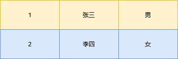
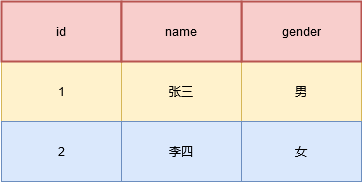
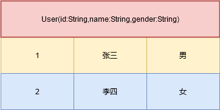

# Spark SQL

# 一 Spark SQL介绍

## 1 简介

> ​	Spark SQL顾名思义他就是spark体系中构建spark core基础之上的基于SQL计算的模块。
>
> 它的前身叫做Shark，最开始为了优化spark core底层代码，同时它也是为了整合hive使用。但是随着发展Shark的速度已经比Hive更快了。说白了就是hive的发展已经制约了shark的发展了。所以在2015年的时候，shark项目负责人就将shark终止了，然后独立了一个新项目出来：Spark SQL。又随着SPark SQL的发展，慢慢形成了两条相互独立的业务：SparkSQL和Hive-On-Spark。

## 2 编程模型

> ​	Spark SQL中提供了Spark的第二代和第三代编程模型，分别是:DataFrame和Dataset。除此之外，还支持直接使用SQL来完成Spark编程。

### 2.0 RDD

> 弹性式分布式数据及。具体见Spark Core笔记



### 2.1 DataFrame

> ​	DataFrame你可以就把它理解为RDD，RDD是一个数据集，DataFrame相较于RDD基础之上多了一个schema(表头)



### 2.2 DataSet

> spark1.6版本开始才有的模型。



## 3 SparkSQL快速入门

### 3.1 导入依赖

```xml
<dependency>
    <groupId>org.apache.spark</groupId>
    <artifactId>spark-sql_2.12</artifactId>
    <version>${spark-version}</version>
</dependency>

<dependency>
    <groupId>org.apache.spark</groupId>
    <artifactId>spark-hive_2.12</artifactId>
    <version>${spark-version}</version>
</dependency>
```

### 3.2 编程

#### 3.2.1 初始化SparkSession

```scala
val spark: SparkSession = SparkSession.builder()
.appName("demo1")
.master("local[*]")
//      .enableHiveSupport() // 开启hive支持
.getOrCreate()
```

#### 3.2.2 封装到SparkUtils

```scala
package com.qf.bigdata.spark.core.day3

import org.apache.spark.sql.SparkSession
import org.apache.spark.{SparkConf, SparkContext}

/**
 * 自定义Spark工具类
 */
object SparkUtils {

  /**
   * 获取到本地的SparkContext对象
   */
  def getLocalSparkContext():SparkContext = getLocalSparkContext("default_app")

  /**
   * 获取到本地的SparkContext对象
   */
  def getLocalSparkContext(appName:String):SparkContext = getSparkContext("local[*]", appName)

  /**
   * 获取到SparkContext对象
   */
  def getSparkContext(master:String, appName:String):SparkContext = new SparkContext(master, appName, new SparkConf())

  def getLocalSparkSession():SparkSession = getLocalSparkSession("default_app", false)

  def getLocalSparkSession(appName:String, isSupportedHive:Boolean = false):SparkSession = getSparkSession("s", appName, isSupportedHive)

  def getSparkSession(master:String, appName:String, isSupportedHive:Boolean = false):SparkSession = {
    if (isSupportedHive) SparkSession.builder().appName(appName).master(master).enableHiveSupport().getOrCreate()
    else SparkSession.builder().appName(appName).master(master).getOrCreate()
  }


  /**
   * 释放资源
   */
  def close(sc:SparkContext):Unit = if (sc != null && !sc.isStopped) sc.stop()
  def close(spark:SparkSession):Unit = if (spark != null && !spark.sparkContext.isStopped) spark.stop()

}

```

#### 3.2.3 Demo1_QUICK_START

```scala
package com.qf.bigdata.spark.sql.day1

import com.qf.bigdata.spark.core.day3.SparkUtils
import com.qf.bigdata.spark.core.day5.LoggerTrait
import org.apache.spark.sql.{DataFrame, SparkSession}

object Demo1 extends LoggerTrait{
  def main(args: Array[String]): Unit = {
    //1. SparkSession
    val spark: SparkSession = SparkUtils.getLocalSparkSession()

    //2. 加载数据 : DataFrame/DataSet API
    val df: DataFrame = spark.read.json("C:\\ftp\\person.json")

    //2.1 打印表结构
    df.printSchema()

    //2.2 查询表内容
    df.show()

    //2.3 按字段查询：name,gender
    df.select("name", "gender").show()

    //2.4  age + 1
    import spark.implicits._ // 导入隐式转换函数
    df.select($"name", $"age" + 1).show()

    //2.5 别名
    df.select($"name", ($"age" + 1).as("age")).show()

    //2.6 聚合 : select count(age) as count from xxx group by age
    df.select($"age" ).groupBy($"age").count().as("count").show()

    //2.7 条件查询
    df.select($"name", $"gender", $"age").where($"age" > 30).show()

    //3. SQL
    //3.1 建立虚拟表
    /**
     *
     * createOrReplaceTempView
     * createOrReplaceGlobalTempView
     * createTempView
     * createGlobalTempView
     *
     * 1. 从范围讲
     * 带global的范围更大，表示在整个sparkapplication中可用，不带global只能在当前的sparksession中管用
     *
     * 2. 从创建角度说
     * 带Replace的表示如果这个名称的表已经存在的化就替换这个表，没有的话就创建这个表
     * 不带Replace的表示这个表就创建，有这个表就报错！！！
     */
    df.createOrReplaceTempView("user") // 临时表
    //3.2 使用sql查询
    spark.sql(
      s"""
         |select name,gender,age from user where age > 30
         |""".stripMargin).show()

    // 释放资源
    SparkUtils.close(spark)
  }
}
```


ag
