# 昨日回顾

```
1. nginx的反响代理和负载均衡：nginx.conf
2. HttpClient发请求
3. Flume ： 安装、spool directory
```

# 昨日回顾

```
1. MVC -> Java Web三层结构：
Model View Controller
web.servlet
service:业务
dao/mapper：链接数据

2. spring
ioc ： 将创建对象的过程交给了spring的ioc容器
aop ： 不修改源码的情况下添加新功能
applictionContext.xml

new ClasspathXmlApplicationContext

3. mybatis
对jdbc的一种封装
mybatis-config.xml
xxx-mapper.xml

new SqlsessionFactoryBuilder.build.openSession.getMapper
```


# 上周回顾

```
1. HBase：
HBase是什么？
HBase shell
HBase API
HBase Filter
HBase与Hive整合
布隆过滤器

2. 离线数仓
数据架构
```

# 大数据项目

## 1 大数据架构

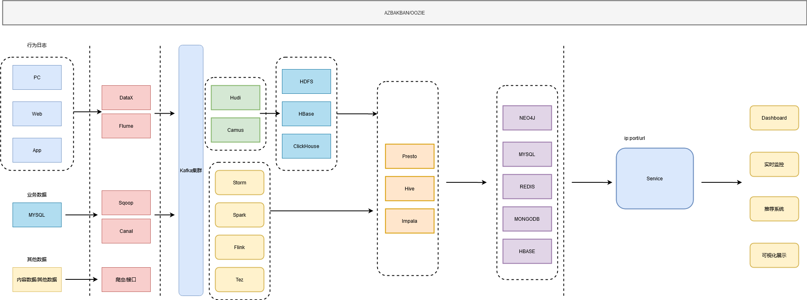

## 2 本次项目架构图

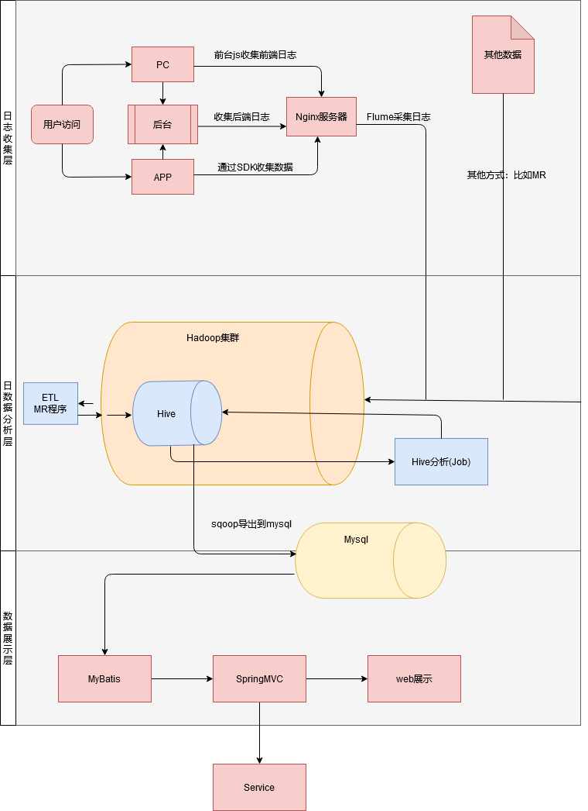

## 3 日志采集部分

### 3.1 日志采集的架构思想

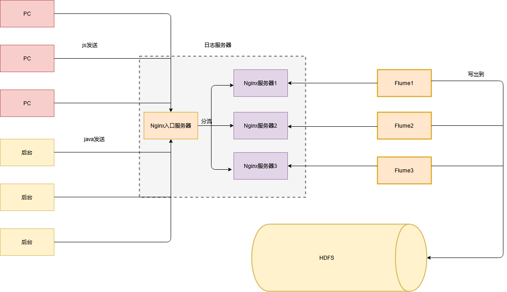


### 3.2 部署PC端的项目

#### 3.2.1 在idea中部署工程

> 1. 创建idea的新工程 --> Java Enterprise (如下图)

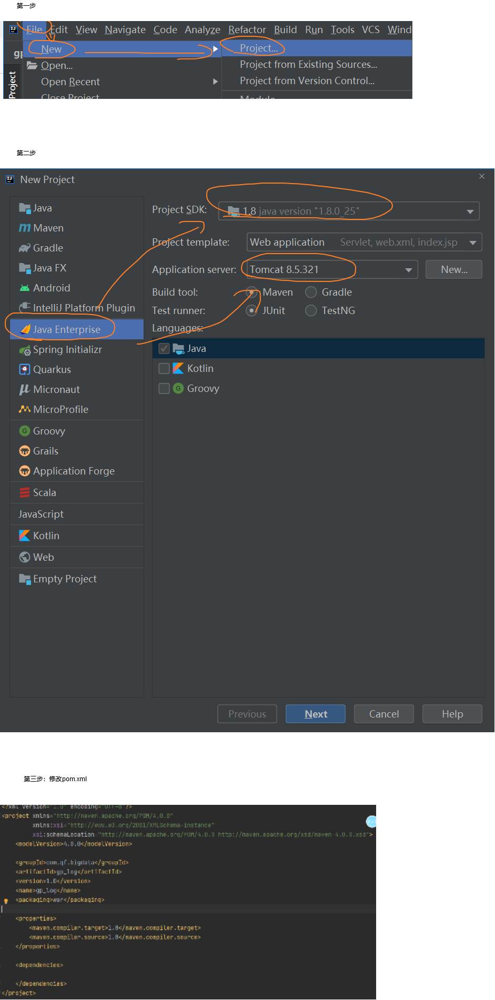

> 2. 将gp_log中的文件对应的拷贝到当前的工程下去（注意：gp_log资料中的web目录对应当前工程的webapp）

#### 3.2.2 安装Nginx服务器

##### 3.2.2.1 介绍

> nginx高性能web服务器，战斗民族伊戈尔发布。开源且免费，C语言开发。

##### 3.2.2.2 安装

```sh
##1. 解压
[root@hadoop ~]# tar -zxvf /opt/software/nginx-1.8.0.tar.gz -C /opt/apps/

##2. 安装依赖
yum -y install gcc-c++
yum install -y pcre pcre-devel
yum install -y zlib zlib-devel
yum install -y openssl openssl-devel

##3. 安装本体
##3.1 配置nginx的安装目录
[root@hadoop nginx-1.8.0]# mkdir tmp
[root@hadoop nginx-1.8.0]# mkdir logs

./configure \
--prefix=/opt/apps/nginx-1.8.0 \
--pid-path=/opt/apps/nginx-1.8.0/tmp/nginx.pid \
--lock-path=/opt/apps/nginx-1.8.0/tmp/nginx.lock \
--error-log-path=/opt/apps/nginx-1.8.0/logs/error.log \
--http-log-path=/opt/apps/nginx-1.8.0/logs/access.log \
--without-http_gzip_module \
--http-client-body-temp-path=/opt/apps/nginx-1.8.0/tmp/client \
--http-proxy-temp-path=/opt/apps/nginx-1.8.0/tmp/proxy \
--http-fastcgi-temp-path=/opt/apps/nginx-1.8.0/tmp/fastcgi \
--http-uwsgi-temp-path=/opt/apps/nginx-1.8.0/tmp/uwsgi \
--http-scgi-temp-path=/opt/apps/nginx-1.8.0/tmp/scgi

##3.2 编译
[root@hadoop nginx-1.8.0]# make

##4. 启动/ 	
##4.1 启动
./nginx
##4.2 重启/关闭
./nginx -s reload/stop

##5. 访问webui
访问nginx的ip
```

##### 3.2.2.3 nginx的作用

> - web服务器
> - 负载均衡服务器
> - 反向代理服务器

- 反向代理

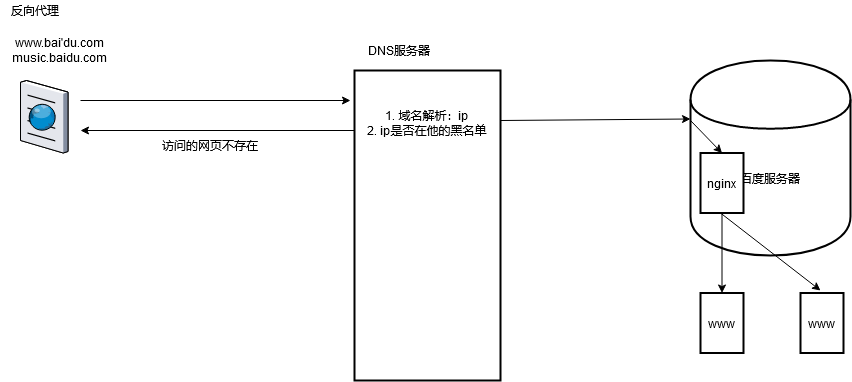

- 负载均衡

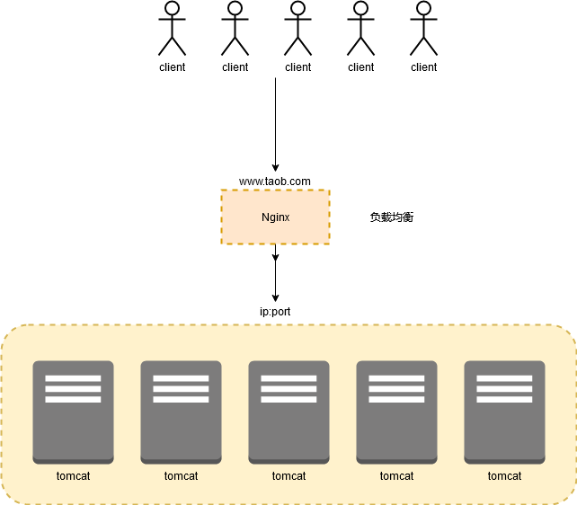

##### 3.2.2.4 虚拟机功能

```sh
##1. 配置本地linux的ip
IPADDR1=ip1

ping ip1
ping ip

##2. 修改nginx的配置文件
nginx-1.8.0/conf/nginx.conf

server {
    listen 80;
    server_name 10.206.0.4;
    location / {
        root html;
        index index.html index.htm;
    }
}

server {
    listen 80;
    server_name 10.206.0.5;
    location / {
        root html;
        index index2.html index.htm;
    }
}

##3. 重启nginx
nginx -s reload
```

##### 3.2.2.5 反向代理

```sh
##1. 安装tomcat
##1.1 解压tomcat并复制3份作为副本
##1.2 修改tomcat安装目录下的conf/server.xml,将其中的每一个端口号+1（第一台不变，第二台+1，第三台+2）
##1.3 分别启动tomcat测试：ip:8080,8081,8082
##1.4 修改tomcat安装目录下的/webapps/ROOT/index.jsp，

##2. 配置nginx：nginx.conf
 server {
        listen       80;
        server_name  www.baidu.com;
	    location / {
            proxy_pass http://tomcat1;
            index index.html index.htm;
        }
        location = /50x.html {
            root   html;
        }
 }
 
  server {
        listen       80;
        server_name  baike.baidu.com;
	    location / {
            proxy_pass http://tomcat2;
            index index.html index.htm;
        }
        location = /50x.html {
            root   html;
        }
 }
 
  server {
        listen       80;
        server_name  tieba.baidu.com;
	    location / {
            proxy_pass http://tomcat3;
            index index.html index.htm;
        }
        location = /50x.html {
            root   html;
        }
 }
 
 upstream tomcat1 {
     server 10.206.0.4:8080;
 }
 
 upstream tomcat2 {
     server 10.206.0.4:8081;
 }
 
 upstream tomcat3 {
     server 10.206.0.4:8082;
 }
 
 
##3. 配置linux的hosts
10.206.0.4 hadoop www.baidu.com baike.baidu.com tieba.baidu.com

##4. 配置windows的hosts
146.56.208.76 hadoop www.baidu.com baike.baidu.com tieba.baidu.com
```

##### 3.2.2.6 负载均衡

```sh
##1. nginx.conf
server {
        listen       80;
        server_name  10.206.0.4;

        location / {
            proxy_pass http://tomcat;
            index  index.html index.htm;
        }

        error_page   500 502 503 504  /50x.html;
        location = /50x.html {
            root   html;
        }

    }
    
 upstream tomcat {
     server 10.206.0.4:8080;
     server 10.206.0.4:8081;
     server 10.206.0.4:8082;
 }

##2. 重启nginx
##3. 配置权重：nginx.conf
##3.1 
down : 当前的服务器不参与负载
weight : 权重，越大表示该服务器参与负载的参与度就越高
backup ： 当所有其他的非backup的集群忙或者down的时候，这种backup的机器就会参与负载


upstream tomcat {
     server 10.206.0.4:8080;
     server 10.206.0.4:8081 weight=8;
     server 10.206.0.4:8082;
 }
```

#### 3.2.3 修改gp_log工程中的前的js文件

- 修改analiytcs.js

```properties
serverUrl: "http://146.56.208.76/index.html",
```

- 重启tomcat


```properties
操作页面发出请求，就可以查看到nginx的access.log中包含了日志数据：
115.227.165.180 - - [14/Oct/2021:11:31:34 +0800] "GET /index.html?en=e_pv&p_url=http%3A%2F%2Flocalhost%3A8080%2Fgp_log_war%2Fdemo2.jsp&p_ref=http%3A%2F%2Flocalhost%3A8080%2Fgp_log_war%2Fdemo.jsp&tt=%E6%B5%8B%E8%AF%95%E9%A1%B5%E9%9D%A22&ver=1&pl=website&sdk=js&u_ud=DF245681-EEC9-4546-862F-08CA51C4F9D8&u_mid=aidon&u_sd=5A903533-FB60-4101-8FA8-AE3F1C286050&c_time=1634182294025&l=zh-CN&b_iev=Mozilla%2F5.0%20(Windows%20NT%2010.0%3B%20Win64%3B%20x64%3B%20rv%3A93.0)%20Gecko%2F20100101%20Firefox%2F93.0&b_rst=1920*1080 HTTP/1.1" 200 612 "http://localhost:8080/" "Mozilla/5.0 (Windows NT 10.0; Win64; x64; rv:93.0) Gecko/20100101 Firefox/93.0"
```

- nginx.conf

```
log_format my_log_fmt '$remote_addr^A$msec^A$request_uri';
server {
        listen       80;
        server_name  10.206.0.4;
        access_log logs/access.log my_log_fmt;
        location / {
            root html;
            index  index.html index.htm;
        }

        error_page   500 502 503 504  /50x.html;
        location = /50x.html {
            root   html;
        }
    }
```

- 检测日志

```properties
115.227.165.180^A1634183171.944^A/index.html?en=e_pv&p_url=http%3A%2F%2Flocalhost%3A8080%2Fgp_log_war%2Fdemo3.jsp&p_ref=http%3A%2F%2Flocalhost%3A8080%2Fgp_log_war%2Fdemo4.jsp&tt=%E6%B5%8B%E8%AF%95%E9%A1%B5%E9%9D%A23&ver=1&pl=website&sdk=js&u_ud=DF245681-EEC9-4546-862F-08CA51C4F9D8&u_mid=aidon&u_sd=3CAB1570-7E97-4D0C-8D8C-D991F2664077&c_time=1634183171816&l=zh-CN&b_iev=Mozilla%2F5.0%20(Windows%20NT%2010.0%3B%20Win64%3B%20x64%3B%20rv%3A93.0)%20Gecko%2F20100101%20Firefox%2F93.0&b_rst=1920*1080
```

####   3.2.4 通过Java SDK发出请求给Nginx

- HttpClient如何向服务端发出请求

```sh
##1. 导入依赖
<dependency>
    <groupId>commons-httpclient</groupId>
    <artifactId>commons-httpclient</artifactId>
    <version>3.1</version>
</dependency>

##2. get/post请求区别
get : 请求参数使由浏览器的地址栏，get请求的参数长度有限制的。get请求不安全
post ： 请求参数使通过请求体传递的，参数长度几乎可以认为是无极限。

##3. 发出请求的测试代码
package com.qf.bigdata.sdk;

import org.apache.commons.httpclient.HttpClient;
import org.apache.commons.httpclient.NameValuePair;
import org.apache.commons.httpclient.methods.GetMethod;
import org.apache.commons.httpclient.methods.PostMethod;
import org.junit.Test;

import java.io.BufferedReader;
import java.io.IOException;
import java.io.InputStreamReader;

public class Demo1 {
	
	// 发get请求
    @Test
    public void send1() throws IOException {
        //1. 创建httpclient
        HttpClient httpClient = new HttpClient();
        //2. 发出什么类型的请求：Get/Post， Delete/Put/...
        GetMethod getMethod = new GetMethod("http://www.baidu.com?username=lixi");
        //2.1 设置参数
        //3. 提交请求
        int code = httpClient.executeMethod(getMethod);
        //4. 打印
        System.out.println(code);
    }
    
	// 发post请求
    @Test
    public void send2() throws IOException {
        //1. 创建httpclient
        HttpClient httpClient = new HttpClient();
        //2. 发出什么类型的请求：Get/Post， Delete/Put/...
        PostMethod postMethod = new PostMethod("http://www.baidu.com");
        //2.1 设置参数
        NameValuePair[] nvp = {
                new NameValuePair("username", "lixi"),
                new NameValuePair("sex", "man")
        };
        //2.2 给方法赋值参数
        postMethod.setQueryString(nvp);
        //3. 提交请求
        int code = httpClient.executeMethod(postMethod);
        //4. 打印
        System.out.println(code);
    }
	
	// 发post请求并获取到服务端的响应
    @Test
     public void send3() throws IOException {
        //1. 创建httpclient
        HttpClient httpClient = new HttpClient();
        //2. 发出什么类型的请求：Get/Post， Delete/Put/...
        PostMethod postMethod = new PostMethod("http://www.baidu.com");
        //2.1 设置参数
        NameValuePair[] nvp = {
                new NameValuePair("username", "lixi"),
                new NameValuePair("sex", "man")
        };
        //2.2 给方法赋值参数
        postMethod.setQueryString(nvp);
        //3. 提交请求
        int code = httpClient.executeMethod(postMethod);
        //4. 打印
        System.out.println(code);

        //5. 获取到服务器端给我返回的响应
        BufferedReader br = new BufferedReader(new InputStreamReader(postMethod.getResponseBodyAsStream()));
        String line = null;
        while((line = br.readLine()) != null) {
            System.out.println(line);
        }
        br.close();
     }
}
```

- 发出给Nginx

```java
package com.qf.bigdata.sdk;

import org.apache.commons.httpclient.HttpClient;
import org.apache.commons.httpclient.NameValuePair;
import org.apache.commons.httpclient.methods.PostMethod;
import org.junit.Test;

import java.io.IOException;
import java.util.Date;
import java.util.UUID;

public class Demo2_Send_Nginx {

    @Test
    public void send() throws IOException {
        //1. 创建httpclient
        HttpClient httpClient = new HttpClient();
        //2. 发出什么类型的请求：Get/Post， Delete/Put/...
        PostMethod postMethod = new PostMethod("http://146.56.208.76/index.html");
        //2.1 设置参数
        String uuid = UUID.randomUUID().toString().replace("-", "").toUpperCase();
        NameValuePair[] nvp = {
                new NameValuePair("u_mid", "lixi"),
                new NameValuePair("c_time", new Date().getTime() + ""),
                new NameValuePair("oid", uuid),
                new NameValuePair("ver", "1.0"),
                new NameValuePair("en", "e_cs"),
                new NameValuePair("pl", "jdk"),
                new NameValuePair("sdk", "java")
        };
        //2.2 给方法赋值参数
        postMethod.setQueryString(nvp);
        //3. 提交请求
        int code = httpClient.executeMethod(postMethod);
        //4. 打印
        System.out.println(code);
    }
}
```

### 3.3 Flume —— 日志采集工具

#### 3.3.1 介绍

> 分布式的日志采集工具，他是一个java开源工具。
>
> 可以采集日志，socket数据包，文件，文件夹，kafka等各种形式的数据的采集，又可以将数据sink到HDFS/HBase/HDFS/Hive/Kafka的目标。

#### 3.3.2 底层

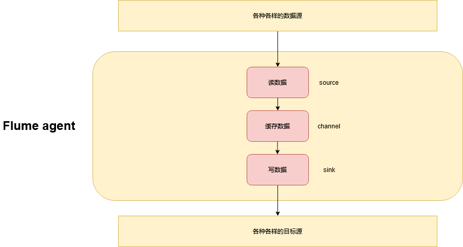

#### 3.3.3 安装Flume

```sh
##1. 解压并配置环境变量
[root@hadoop software]# tar -zxvf apache-flume-1.6.0-bin.tar.gz -C /opt/apps/
[root@hadoop apps]# mv apache-flume-1.6.0-bin/ flume-1.6.0

##2. 配置flume-env.sh
export JAVA_HOME=/opt/apps/jdk1.8.0_45
[root@hadoop conf]# mv flume-env.sh.template flume-env.sh

##3. 测试
[root@hadoop conf]# flume-ng version
Flume 1.6.0
Source code repository: https://git-wip-us.apache.org/repos/asf/flume.git
Revision: 2561a23240a71ba20bf288c7c2cda88f443c2080
Compiled by hshreedharan on Mon May 11 11:15:44 PDT 2015
From source with checksum b29e416802ce9ece3269d34233baf43f
```

#### 3.3.4 Flume——spool dir源

- flume-spool.conf

```properties
a1.channels = channel1
a1.sources = source1
a1.sinks = sink1

## source: a1表示的是flume的agent的名称
a1.sources.source1.type = spooldir
a1.sources.source1.spoolDir = /data/tmp
a1.sources.source1.fileHeader = true

## channel
a1.channels.channel1.type = memory
a1.channels.channel1.capacity = 500000
a1.channels.channel1.transactionCapacity  = 500

## sink
a1.sinks.sink1.type = hdfs
a1.sinks.sink1.hdfs.path = hdfs://hadoop:9000/gp_log/%Y/%m/%d
a1.sinks.sink1.hdfs.filePrefix = app_log
a1.sinks.sink1.hdfs.fileSuffix = .log
a1.sinks.sink1.hdfs.hdfs.batchSize = 1000
a1.sinks.sink1.hdfs.fileType = DataStream
a1.sinks.sink1.hdfs.writeFormat = Writable

## 每60秒就切割一次hdfs的文件
## 你的hdfs的文件达到512kb的时候也切割一次
## 安装文件内容的行数来切，达到1000行切一次
a1.sinks.sink1.hdfs.rollInterval = 60
a1.sinks.sink1.hdfs.rollSize = 512000
a1.sinks.sink1.hdfs.rollCount = 1000

## 创建目录的配置
a1.sinks.sink1.hdfs.round = true
a1.sinks.sink1.hdfs.roundValue = 10
a1.sinks.sink1.hdfs.roundUnit = minute 

a1.sinks.sink1.hdfs.useLocalTimeStamp = true

a1.sources.source1.channels = channel1
a1.sinks.sink1.channel = channel1
```

- 执行测试：启动flume

```sh
## 前台启动
flume-ng agent -n a1 -c /opt/apps/flume-1.6.0/conf -f /opt/apps/flume-1.6.0/conf/flume-spool.conf -Dflume.root.logger=INFO,console

## 后台启动
nohup flume-ng agent -n a1 -c /opt/apps/flume-1.6.0/conf -f /opt/apps/flume-1.6.0/conf/flume-spool.conf 1>/dev/null 2>&1 &
```

#### 3.3.5 Flume——exec源

- flume-exec.conf

```properties
a1.channels = channel1
a1.sources = source1
a1.sinks = sink1

## source: a1表示的是flume的agent的名称
a1.sources.source1.type = exec
a1.sources.source1.command = tail -F /opt/apps/nginx-1.8.0/logs/access.log

## channel
a1.channels.channel1.type = memory
a1.channels.channel1.capacity = 500000
a1.channels.channel1.transactionCapacity  = 500

## sink
a1.sinks.sink1.type = hdfs
a1.sinks.sink1.hdfs.path = hdfs://hadoop:9000/gp_log/%Y/%m/%d
a1.sinks.sink1.hdfs.filePrefix = app_log
a1.sinks.sink1.hdfs.fileSuffix = .log
a1.sinks.sink1.hdfs.hdfs.batchSize = 1000
a1.sinks.sink1.hdfs.fileType = DataStream
a1.sinks.sink1.hdfs.writeFormat = Writable

## 每60秒就切割一次hdfs的文件
## 你的hdfs的文件达到512kb的时候也切割一次
## 安装文件内容的行数来切，达到1000行切一次
a1.sinks.sink1.hdfs.rollInterval = 60
a1.sinks.sink1.hdfs.rollSize = 512000
a1.sinks.sink1.hdfs.rollCount = 1000

## 创建目录的配置
a1.sinks.sink1.hdfs.round = true
a1.sinks.sink1.hdfs.roundValue = 10
a1.sinks.sink1.hdfs.roundUnit = minute 

a1.sinks.sink1.hdfs.useLocalTimeStamp = true

a1.sources.source1.channels = channel1
a1.sinks.sink1.channel = channel1
```

- 启动flume

```sh
## 后台启动
nohup flume-ng agent -n a1 -c /opt/apps/flume-1.6.0/conf -f /opt/apps/flume-1.6.0/conf/flume-exec.conf 1>/dev/null 2>&1 &
```

## 4 ETL —— Extract Transaction Load

### 4.1 目前的日志数据

```properties
115.227.165.1431634262533.933/index.html?en=e_e&ca=event%E7%9A%84category%E5%90%8D%E7%A7%B0&ac=event%E7%9A%84action%E5%90%8D%E7%A7%B0&ver=1&pl=website&sdk=js&u_ud=DF245681-EEC9-4546-862F-08CA51C4F9D8&u_mid=aidon&u_sd=E68048D7-935A-4F74-A610-2B5B13746883&c_time=1634262532411&l=zh-CN&b_iev=Mozilla%2F5.0%20(Windows%20NT%2010.0%3B%20Win64%3B%20x64%3B%20rv%3A93.0)%20Gecko%2F20100101%20Firefox%2F93.0&b_rst=1920*1080
```

### 4.2 导入依赖

```xml
<?xml version="1.0" encoding="UTF-8"?>
<project xmlns="http://maven.apache.org/POM/4.0.0"
         xmlns:xsi="http://www.w3.org/2001/XMLSchema-instance"
         xsi:schemaLocation="http://maven.apache.org/POM/4.0.0 http://maven.apache.org/xsd/maven-4.0.0.xsd">
    <modelVersion>4.0.0</modelVersion>

    <groupId>com.qf.bigdata</groupId>
    <artifactId>etl</artifactId>
    <version>1.0</version>

    <properties>
        <maven.compiler.source>8</maven.compiler.source>
        <maven.compiler.target>8</maven.compiler.target>
        <hadoop-version>2.8.1</hadoop-version>
        <fastjson-version>1.2.17</fastjson-version>
        <uaparser-version>0.6.2</uaparser-version>
        <mysql-version>5.1.47</mysql-version>
        <httpclient-version>3.1</httpclient-version>
        <hive-version>1.2.1</hive-version>
    </properties>

    <dependencies>
        <dependency>
            <groupId>org.apache.hadoop</groupId>
            <artifactId>hadoop-client</artifactId>
            <version>${hadoop-version}</version>
        </dependency>

        <dependency>
            <groupId>org.apache.hadoop</groupId>
            <artifactId>hadoop-yarn-common</artifactId>
            <version>${hadoop-version}</version>
        </dependency>

        <dependency>
            <groupId>org.apache.hive</groupId>
            <artifactId>hive-exec</artifactId>
            <version>${hive-version}</version>
        </dependency>

        <dependency>
            <groupId>com.alibaba</groupId>
            <artifactId>fastjson</artifactId>
            <version>${fastjson-version}</version>
        </dependency>

        <dependency>
            <groupId>cz.mallat.uasparser</groupId>
            <artifactId>uasparser</artifactId>
            <version>${uaparser-version}</version>
        </dependency>

        <dependency>
            <groupId>mysql</groupId>
            <artifactId>mysql-connector-java</artifactId>
            <version>${mysql-version}</version>
        </dependency>

        <dependency>
            <groupId>commons-httpclient</groupId>
            <artifactId>commons-httpclient</artifactId>
            <version>${httpclient-version}</version>
        </dependency>
    </dependencies>

    <build>
        <plugins>
            <plugin>
                <groupId>org.apache.maven.plugins</groupId>
                <artifactId>maven-compiler-plugin</artifactId>
                <version>3.7.0</version>
                <configuration>
                    <source>1.8</source>
                    <target>1.8</target>
                    <encoding>UTF-8</encoding>
                </configuration>
            </plugin>
        </plugins>
    </build>
</project>
```

### 4.3 ip转换地址

#### 4.3.1 高德开放平台

```
https://lbs.amap.com/
1. 注册账号
2. 控制台--》我的应用--》添加应用--》添加--》web服务--》将key的保存下来
7a9c2df23df110d6d53b299abcf19c9f

e.g. 发送IP转换定制的实例：
http://restapi.amap.com/v3/ip?key=7a9c2df23df110d6d53b299abcf19c9f&ip=125.81.70.42
```

#### 4.3.2 实现ip转换地址功能

- HttpClientUtils

```java
package com.qf.bigdata.etl.utils;

import org.apache.commons.httpclient.HttpClient;
import org.apache.commons.httpclient.NameValuePair;
import org.apache.commons.httpclient.methods.GetMethod;
import org.junit.Test;

import java.io.IOException;
import java.util.HashMap;
import java.util.Map;

/**
 * HttpClient的工具类
 */
public class HttpClientUtils {

    private static HttpClient httpClient;

    static {
        httpClient = new HttpClient();
    }

    /**
     * 发送get请求的方法
     */
    public static Map<String, String> sendGet(String uri, String ... params) {
        //1. 创建map对象存放结果
        Map<String, String> map = new HashMap<>();
        map.put("code", "500");
        map.put("body", "");

        //2. 创建参数
        NameValuePair[] nvps = new NameValuePair[params.length];
        //2.1 遍历赋值
        for (int i = 0;i < nvps.length; i++) {
            String param = params[i]; // 获取到传入参数
            if (!param.contains("=")) return map; // 如果参数有问题，就直接范围500
            String[] args = param.split("=");
            NameValuePair nvp = new NameValuePair(args[0], args[1]);
            nvps[i] = nvp;
        }
        //3. 创建getmethod
        GetMethod getMethod = new GetMethod(uri);
        getMethod.setQueryString(nvps);

        //4. 执行getmethod
        int code = 500;
        try {
            code = httpClient.executeMethod(getMethod);
        } catch (IOException e) {
            e.printStackTrace();
            return map;
        }

        //5. 获取到响应数据
        byte[] responseBody = null;
        try {
            responseBody = getMethod.getResponseBody();
        } catch (IOException e) {
            e.printStackTrace();
            return map;
        }

        //6. 结果封装到map
        map.put("code", code + "");
        map.put("body", new String(responseBody));

        return map;
    }

    @Test
    public void test() {
        Map<String, String> map = sendGet("http://restapi.amap.com/v3/ip", "key=7a9c2df23df110d6d53b299abcf19c9f", "ip=115.227.165.143");
        System.out.println(map);
    }
}
```

- IPUtils

```java
package com.qf.bigdata.etl.utils;

import com.alibaba.fastjson.JSONObject;

import java.util.HashMap;
import java.util.Map;

/**
 * IP工具类：将ip转换为地址
 */
public class IPUtils {

    private static final String URI = "http://restapi.amap.com/v3/ip";
    private static final String KEY = "key=7a9c2df23df110d6d53b299abcf19c9f";
    private static final String IP = "ip=";
    private static final String RESPONSE_BODY = "body";
    private static final String CODE = "code";

    public static final String COUNTRY = "country";
    public static final String PROVINCE = "province";
    public static final String CITY = "city";


    /**
     * ip转换物理的地址
     */
    public static Map<String, String> ip2Addr(String ip) {
        //1. 向高德发送请求获取到结果
        Map<String, String> map = HttpClientUtils.sendGet(URI, KEY, IP+ip);
        //2. 如果状态码为500，表示请求的时候报错，那么我们的ip就获取不到地址
        if (map.get(CODE).equals("500")) return null;
        //3. 获取到请求体
        String json = map.get(RESPONSE_BODY);
        //4. 将json字符串转换为json对象
        JSONObject jsonObject = JSONObject.parseObject(json);
        //5. 通过json对象获取到省市
        String province = jsonObject.getString("province");
        String city = jsonObject.getString("city");
        String country = "中国";

        if (province.substring(0,2).equals("[]")) country = "国外";

        //6. 封装结果到一个结果集
        Map<String, String> addr = new HashMap<>();
        addr.put(COUNTRY, country);
        addr.put(PROVINCE, province);
        addr.put(CITY, city);

        return addr;
    }
}
```

#### 4.3.3 实现ip转换地址功能的第二种写法（推荐）

- RegionInfo

```java
package com.qf.bigdata.etl.pojo;

public class RegionInfo {
    private String country;
    private String province;
    private String city;

    public RegionInfo() {
    }

    public RegionInfo(String country, String province, String city) {
        this.country = country;
        this.province = province;
        this.city = city;
    }

    public String getCountry() {
        return country;
    }

    public void setCountry(String country) {
        this.country = country;
    }

    public String getProvince() {
        return province;
    }

    public void setProvince(String province) {
        this.province = province;
    }

    public String getCity() {
        return city;
    }

    public void setCity(String city) {
        this.city = city;
    }

    @Override
    public String toString() {
        return country + ' ' + province + ' ' + city;
    }
}
```

- ip.properties

```properties
URI=http://restapi.amap.com/v3/ip
KEY=key=7a9c2df23df110d6d53b299abcf19c9f
IP=ip=
RESPONSE_BODY=body
CODE=code
COUNTRY=country
PROVINCE=province
CITY=city
```

- IPUtils

```java
package com.qf.bigdata.etl.utils;

import com.alibaba.fastjson.JSONObject;
import com.qf.bigdata.etl.pojo.RegionInfo;

import java.io.IOException;
import java.util.HashMap;
import java.util.Map;
import java.util.Properties;

/**
 * IP工具类：将ip转换为地址
 */
public class IPUtils {

    private static Properties properties = new Properties();

    static {
        try {
            properties.load(IPUtils.class.getClassLoader().getResourceAsStream("ip.properties"));
        } catch (IOException e) {
            e.printStackTrace();
        }
    }

    private static final String URI = properties.getProperty("URI");
    private static final String KEY = properties.getProperty("KEY");
    private static final String IP = properties.getProperty("IP");
    private static final String RESPONSE_BODY = properties.getProperty("RESPONSE_BODY");
    private static final String CODE = properties.getProperty("CODE");

    public static final String COUNTRY = properties.getProperty("COUNTRY");
    public static final String PROVINCE = properties.getProperty("PROVINCE");
    public static final String CITY = properties.getProperty("CITY");


    /**
     * ip转换物理的地址
     */
    public static Map<String, String> ip2Addr(String ip) {
        //1. 向高德发送请求获取到结果
        Map<String, String> map = HttpClientUtils.sendGet(URI, KEY, IP+ip);
        //2. 如果状态码为500，表示请求的时候报错，那么我们的ip就获取不到地址
        if (map.get(CODE).equals("500")) return null;
        //3. 获取到请求体
        String json = map.get(RESPONSE_BODY);
        //4. 将json字符串转换为json对象
        JSONObject jsonObject = JSONObject.parseObject(json);
        //5. 通过json对象获取到省市
        String province = jsonObject.getString("province");
        String city = jsonObject.getString("city");
        String country = "中国";

        if (province.substring(0,2).equals("[]")) country = "国外";

        //6. 封装结果到一个结果集
        Map<String, String> addr = new HashMap<>();
        addr.put(COUNTRY, country);
        addr.put(PROVINCE, province);
        addr.put(CITY, city);

        return addr;
    }

    /**
     * ip转换物理的地址
     */
    public static RegionInfo ip2Address(String ip) {
        //1. 调用以上方法，获取到地址
        Map<String, String> map = ip2Addr(ip);
        //2. 将map的数据封装到regioninfo对象
        RegionInfo regionInfo = new RegionInfo(map.get(COUNTRY), map.get(PROVINCE), map.get(CITY));
        return regionInfo;
    }
}

```

### 4.4 时间戳转化为日期格式

> 1634262533.933

- TimeUtils

```java
package com.qf.bigdata.etl.utils;

import org.junit.Test;

import java.text.SimpleDateFormat;
import java.util.Calendar;
import java.util.Date;

/**
 * 时间工具类
 */
public class TimeUtils {

    private final static String ERROR_TIME = "1970-01-01 00:00:00";
    private final static String DEFAULT_DATE_FORMAT = "yyyy-MM-dd HH:mm:ss";
    private final static SimpleDateFormat fmt = new SimpleDateFormat(DEFAULT_DATE_FORMAT);

    public static String parseTimestamp(long timestamp) {
        //1. 创建指定时间戳值的日类对象
        Calendar calendar = Calendar.getInstance();
        calendar.setTimeInMillis(timestamp);
        //2. 转换为日期格式
        Date date = calendar.getTime();
        //3. 转换
        String time = fmt.format(date);
        return time;
    }

    /**
     * 1634262533.933 -> 1634262533933
     */
    public static String parseTimestamp(String timestamp) {
        //1. 检测为空
        if (null == timestamp || timestamp.trim().isEmpty()) return ERROR_TIME;
        //2. 去掉点
        String replace = timestamp.replace(".", "");
        //3. 判断是否全数字
        if (!replace.matches("\\d*")) return ERROR_TIME;
        //4.转换为long
        long ts = Long.parseLong(replace);
        return parseTimestamp(ts);
    }

    @Test
    public void test() {
        String time = parseTimestamp("1634262533.933");
        System.out.println(time);
    }
}
```

### 4.5 解析UserAgent

#### 4.5.1 数据

> Mozilla%2F5.0%20(Windows%20NT%2010.0%3B%20Win64%3B%20x64%3B%20rv%3A93.0)%20Gecko%2F20100101%20Firefox%2F93.0&b_rst=1920*1080

#### 4.5.2 UserAgentInfo

```java
package com.qf.bigdata.etl.pojo;

/**
 * bean对象
 */
public class UserAgentInfo {
    private String osName;
    private String osVersion;
    private String browserName;
    private String browserVersion;

    public UserAgentInfo() {
    }

    public UserAgentInfo(String osName, String osVersion, String browserName, String browserVersion) {
        this.osName = osName;
        this.osVersion = osVersion;
        this.browserName = browserName;
        this.browserVersion = browserVersion;
    }

    public String getOsName() {
        return osName;
    }

    public void setOsName(String osName) {
        this.osName = osName;
    }

    public String getOsVersion() {
        return osVersion;
    }

    public void setOsVersion(String osVersion) {
        this.osVersion = osVersion;
    }

    public String getBrowserName() {
        return browserName;
    }

    public void setBrowserName(String browserName) {
        this.browserName = browserName;
    }

    public String getBrowserVersion() {
        return browserVersion;
    }

    public void setBrowserVersion(String browserVersion) {
        this.browserVersion = browserVersion;
    }

    @Override
    public String toString() {
        return osName + ' ' + osVersion + ' ' + browserName + ' ' + browserVersion;
    }
}
```

#### 4.5.3 UserAgentUtils

```java
package com.qf.bigdata.etl.utils;

import com.qf.bigdata.etl.pojo.UserAgentInfo;
import cz.mallat.uasparser.OnlineUpdater;
import cz.mallat.uasparser.UASparser;
import org.junit.Test;

import java.io.IOException;
import java.io.UnsupportedEncodingException;
import java.net.URLDecoder;

/**
 * 解析UserAgent的工具类
 */
public class UserAgentUtils {

    /**
     * Mozilla%2F5.0%20(Windows%20NT%2010.0%3B%20Win64%3B%20x64%3B%20rv%3A93.0)%20Gecko%2F20100101%20Firefox%2F93.0
     * 解析useragent的工具类
     */
    public static UserAgentInfo parseUserAgent(String useragent) {
        try {
            //1. 创建对象
            UASparser uaSparser = new UASparser(OnlineUpdater.getVendoredInputStream());
            //2. 解析
            cz.mallat.uasparser.UserAgentInfo info = uaSparser.parse(useragent);
            //3. 封装
            UserAgentInfo userAgentInfo = new UserAgentInfo();
            userAgentInfo.setOsName(info.getOsName());
            userAgentInfo.setOsVersion(info.getOsCompany());
            userAgentInfo.setBrowserName(info.getUaName());
            userAgentInfo.setBrowserVersion(info.getBrowserVersionInfo());

            return userAgentInfo;
        } catch (IOException e) {
            e.printStackTrace();
            return null;
        }
    }

    /**
     * 将url编码过后的字符串进行解码
     */
    public static String decode(String urlEncode) {
        String decode = null;
        try {
            decode = URLDecoder.decode(urlEncode, "UTF-8");
        } catch (UnsupportedEncodingException e) {
            e.printStackTrace();
        }
        return decode;
    }

    @Test
    public void test() {
        String decode = decode("Mozilla%2F5.0%20(Windows%20NT%2010.0%3B%20Win64%3B%20x64%3B%20rv%3A93.0)%20Gecko%2F20100101%20Firefox%2F93.0");
        System.out.println(decode);
        UserAgentInfo userAgentInfo = parseUserAgent(decode);
        System.out.println(userAgentInfo);
    }
}
```

### 4.6 解析日志

#### 4.6.1 LogInfo

```java
package com.qf.bigdata.etl.pojo;

import com.qf.bigdata.etl.constant.GlobalConstant;

/**
 * 一个对象封装的一行日志
 */
public class LogInfo {
    private String country = GlobalConstant.DEFAULT_VALUE;
    private String province = GlobalConstant.DEFAULT_VALUE;
    private String city = GlobalConstant.DEFAULT_VALUE;

    private String osName = GlobalConstant.DEFAULT_VALUE;
    private String osVersion = GlobalConstant.DEFAULT_VALUE;
    private String browserName = GlobalConstant.DEFAULT_VALUE;
    private String borwserVersion = GlobalConstant.DEFAULT_VALUE;

    private String clientIp = GlobalConstant.DEFAULT_VALUE;
    private String clientTime = GlobalConstant.DEFAULT_VALUE;

    private String en = GlobalConstant.DEFAULT_VALUE;
    private String ca = GlobalConstant.DEFAULT_VALUE;
    private String ac = GlobalConstant.DEFAULT_VALUE;
    private String ver = GlobalConstant.DEFAULT_VALUE;
    private String pl = GlobalConstant.DEFAULT_VALUE;
    private String sdk = GlobalConstant.DEFAULT_VALUE;
    private String u_ud = GlobalConstant.DEFAULT_VALUE;
    private String u_mid = GlobalConstant.DEFAULT_VALUE;
    private String u_sd = GlobalConstant.DEFAULT_VALUE;
    private String c_time = GlobalConstant.DEFAULT_VALUE;
    private String l = GlobalConstant.DEFAULT_VALUE;
    private String b_iev = GlobalConstant.DEFAULT_VALUE;
    private String b_rst = GlobalConstant.DEFAULT_VALUE;
    private String p_url = GlobalConstant.DEFAULT_VALUE;
    private String p_ref = GlobalConstant.DEFAULT_VALUE;
    private String tt = GlobalConstant.DEFAULT_VALUE;
    private String du = GlobalConstant.DEFAULT_VALUE;
    private String oid = GlobalConstant.DEFAULT_VALUE;
    private String on = GlobalConstant.DEFAULT_VALUE;
    private String cua = GlobalConstant.DEFAULT_VALUE;
    private String cut = GlobalConstant.DEFAULT_VALUE;
    private String pt = GlobalConstant.DEFAULT_VALUE;
    private String kv_key1 = GlobalConstant.DEFAULT_VALUE;
    private String kv_key2 = GlobalConstant.DEFAULT_VALUE;

    private int code;

    public int getCode() {
        return code;
    }

    public void setCode(int code) {
        this.code = code;
    }

    public String getCountry() {
        return country;
    }

    public void setCountry(String country) {
        this.country = country;
    }

    public String getProvince() {
        return province;
    }

    public void setProvince(String province) {
        this.province = province;
    }

    public String getCity() {
        return city;
    }

    public void setCity(String city) {
        this.city = city;
    }

    public String getOsName() {
        return osName;
    }

    public void setOsName(String osName) {
        this.osName = osName;
    }

    public String getOsVersion() {
        return osVersion;
    }

    public void setOsVersion(String osVersion) {
        this.osVersion = osVersion;
    }

    public String getBrowserName() {
        return browserName;
    }

    public void setBrowserName(String browserName) {
        this.browserName = browserName;
    }

    public String getBorwserVersion() {
        return borwserVersion;
    }

    public void setBorwserVersion(String borwserVersion) {
        this.borwserVersion = borwserVersion;
    }

    public String getClientIp() {
        return clientIp;
    }

    public void setClientIp(String clientIp) {
        this.clientIp = clientIp;
    }

    public String getClientTime() {
        return clientTime;
    }

    public void setClientTime(String clientTime) {
        this.clientTime = clientTime;
    }

    public String getEn() {
        return en;
    }

    public void setEn(String en) {
        this.en = en;
    }

    public String getCa() {
        return ca;
    }

    public void setCa(String ca) {
        this.ca = ca;
    }

    public String getAc() {
        return ac;
    }

    public void setAc(String ac) {
        this.ac = ac;
    }

    public String getVer() {
        return ver;
    }

    public void setVer(String ver) {
        this.ver = ver;
    }

    public String getPl() {
        return pl;
    }

    public void setPl(String pl) {
        this.pl = pl;
    }

    public String getSdk() {
        return sdk;
    }

    public void setSdk(String sdk) {
        this.sdk = sdk;
    }

    public String getU_ud() {
        return u_ud;
    }

    public void setU_ud(String u_ud) {
        this.u_ud = u_ud;
    }

    public String getU_mid() {
        return u_mid;
    }

    public void setU_mid(String u_mid) {
        this.u_mid = u_mid;
    }

    public String getU_sd() {
        return u_sd;
    }

    public void setU_sd(String u_sd) {
        this.u_sd = u_sd;
    }

    public String getC_time() {
        return c_time;
    }

    public void setC_time(String c_time) {
        this.c_time = c_time;
    }

    public String getL() {
        return l;
    }

    public void setL(String l) {
        this.l = l;
    }

    public String getB_iev() {
        return b_iev;
    }

    public void setB_iev(String b_iev) {
        this.b_iev = b_iev;
    }

    public String getB_rst() {
        return b_rst;
    }

    public void setB_rst(String b_rst) {
        this.b_rst = b_rst;
    }

    public String getP_url() {
        return p_url;
    }

    public void setP_url(String p_url) {
        this.p_url = p_url;
    }

    public String getP_ref() {
        return p_ref;
    }

    public void setP_ref(String p_ref) {
        this.p_ref = p_ref;
    }

    public String getTt() {
        return tt;
    }

    public void setTt(String tt) {
        this.tt = tt;
    }

    public String getDu() {
        return du;
    }

    public void setDu(String du) {
        this.du = du;
    }

    public String getOid() {
        return oid;
    }

    public void setOid(String oid) {
        this.oid = oid;
    }

    public String getOn() {
        return on;
    }

    public void setOn(String on) {
        this.on = on;
    }

    public String getCua() {
        return cua;
    }

    public void setCua(String cua) {
        this.cua = cua;
    }

    public String getCut() {
        return cut;
    }

    public void setCut(String cut) {
        this.cut = cut;
    }

    public String getPt() {
        return pt;
    }

    public void setPt(String pt) {
        this.pt = pt;
    }

    public String getKv_key1() {
        return kv_key1;
    }

    public void setKv_key1(String kv_key1) {
        this.kv_key1 = kv_key1;
    }

    public String getKv_key2() {
        return kv_key2;
    }

    public void setKv_key2(String kv_key2) {
        this.kv_key2 = kv_key2;
    }

    @Override
    public String toString() {
        return country + '\001' + province + '\001' + city + '\001' + osName + '\001' + osVersion + '\001' + browserName + '\001' +
                borwserVersion + '\001' + clientIp + '\001' + clientTime + '\001' + en + '\001' + ca + '\001' + ac + '\001' +
                ver + '\001' + pl + '\001' + sdk + '\001' + u_ud + '\001' + u_mid + '\001' + u_sd + '\001' + c_time + '\001' +
                l + '\001' + b_iev + '\001' + b_rst + '\001' + p_url + '\001' + p_ref + '\001' + tt + '\001' + du + '\001' +
                oid + '\001' + on + '\001' + cua + '\001' + cut + '\001' + pt + '\001' + kv_key1 + '\001' + kv_key2;
    }
}
```

#### 4.6.2 GlobalConstant

```java
package com.qf.bigdata.etl.constant;

/**
 * 全局常量对象
 */
public class GlobalConstant {
    public static final String DEFAULT_VALUE = "";
}
```

#### 4.6.3 LogUtil

```java
package com.qf.bigdata.etl.utils;

import com.qf.bigdata.etl.pojo.LogInfo;
import com.qf.bigdata.etl.pojo.RegionInfo;
import com.qf.bigdata.etl.pojo.UserAgentInfo;
import org.junit.Test;

import java.io.UnsupportedEncodingException;
import java.lang.reflect.Field;
import java.net.URLDecoder;

/**
 * 日志工具类
 * 115.227.165.1431634262533.933/index.html?en=e_e&ca=event%E7%9A%84category%E5%90%8D%E7%A7%B0&ac=event%E7%9A%84action%E5%90%8D%E7%A7%B0&ver=1&pl=website&sdk=js&u_ud=DF245681-EEC9-4546-862F-08CA51C4F9D8&u_mid=aidon&u_sd=E68048D7-935A-4F74-A610-2B5B13746883&c_time=1634262532411&l=zh-CN&b_iev=Mozilla%2F5.0%20(Windows%20NT%2010.0%3B%20Win64%3B%20x64%3B%20rv%3A93.0)%20Gecko%2F20100101%20Firefox%2F93.0&b_rst=1920*1080
 */
public class LogUtils {

    private static LogInfo ERROR_INFO = new LogInfo();

    /**
     * 将url编码过后的字符串进行解码
     */
    public static String decode(String urlEncode) {
        String decode = null;
        try {
            decode = URLDecoder.decode(urlEncode, "UTF-8");
        } catch (UnsupportedEncodingException e) {
            e.printStackTrace();
        }
        return decode;
    }

    /**
     * 解析日志
     */
    public static LogInfo parseLog(String log) {
        try {
            //1. 创建对象
            LogInfo logInfo = new LogInfo();
            //2. 解码
            String decode = decode(log);
            //3. 切割
            String[] split = decode.split(",");
            //4. 封装进对象
            //4.1 ip和时间传递进去
            String clientIp = split[0];
            String clientTime = TimeUtils.parseTimestamp(split[1]);
            logInfo.setClientIp(clientIp);
            logInfo.setClientTime(clientTime);

            //4.2 处理url
            String[] datas = split[2].split("\\?");
            if (datas.length != 2) return ERROR_INFO;
            String data = datas[1];
            String[] fields = data.split("&");

            //4.3 封装data部分数据
            //4.3.1 获取到封装对象（loginfo）的class
            Class<LogInfo> clazz = (Class<LogInfo>) logInfo.getClass();
            //4.3.2 遍历数据
            for (String field : fields) {
                //4.3.3 获取到数据的kv
                String[] kv = field.split("=");
                String name = kv[0];
                String value = kv[1];
                //4.3.4 获取到clazz类的指定名称的私有的属性
                Field declaredField = clazz.getDeclaredField(name);
                declaredField.setAccessible(true);
                //4.3.5 给对象赋值
                declaredField.set(logInfo, value);
            }

            //4.4 解析ip
            RegionInfo regionInfo = IPUtils.ip2Address(clientIp);
            logInfo.setCountry(regionInfo.getCountry());
            logInfo.setProvince(regionInfo.getProvince());
            logInfo.setCity(regionInfo.getCity());

            //4.5 useragent
            UserAgentInfo userAgentInfo = UserAgentUtils.parseUserAgent(logInfo.getB_iev());
            logInfo.setOsName(userAgentInfo.getOsName());
            logInfo.setOsVersion(userAgentInfo.getOsVersion());
            logInfo.setBrowserName(userAgentInfo.getBrowserName());
            logInfo.setBorwserVersion(userAgentInfo.getBrowserVersion());

            logInfo.setCode(1); // 1表示正确返回，非1表示错误返回
            return logInfo;
        }catch (Exception e) {
            e.printStackTrace();
            return ERROR_INFO;
        }
    }

    @Test
    public void test() {
        LogInfo logInfo = LogUtils.parseLog("115.227.165.143,1634262533.933,/index.html?en=e_e&ca=event%E7%9A%84category%E5%90%8D%E7%A7%B0&ac=event%E7%9A%84action%E5%90%8D%E7%A7%B0&ver=1&pl=website&sdk=js&u_ud=DF245681-EEC9-4546-862F-08CA51C4F9D8&u_mid=aidon&u_sd=E68048D7-935A-4F74-A610-2B5B13746883&c_time=1634262532411&l=zh-CN&b_iev=Mozilla%2F5.0%20(Windows%20NT%2010.0%3B%20Win64%3B%20x64%3B%20rv%3A93.0)%20Gecko%2F20100101%20Firefox%2F93.0&b_rst=1920*1080");
        System.out.println(logInfo.getCode());
    }
}
```

### 4.7 建立初始表

#### 4.7.1 建表

```sql
--1. 建表建库(任务)
create database etl_ods;
create external table if not exists t1(
    line string，
    year string,
    month string
    day string
)
row format delimited fields terminated by ','
location '/gp_log/';

--2. 修改分区
alter table add patition(year=2021)

--3. t2表才是真正的使用的表
create table if not exists t2(
	en
    ac
    ca
    u_ud
    u_mid
    ...
)

--4. 导入
insert into t2
select udf(line) from t1 where year = xxx and month=xx and day = xxx and code = 1
```

#### 4.7.2 UDF函数

- 修改依赖

```xml
<?xml version="1.0" encoding="UTF-8"?>
<project xmlns="http://maven.apache.org/POM/4.0.0"
         xmlns:xsi="http://www.w3.org/2001/XMLSchema-instance"
         xsi:schemaLocation="http://maven.apache.org/POM/4.0.0 http://maven.apache.org/xsd/maven-4.0.0.xsd">
    <modelVersion>4.0.0</modelVersion>

    <groupId>com.qf.bigdata</groupId>
    <artifactId>etl</artifactId>
    <version>1.0</version>

    <properties>
        <maven.compiler.source>8</maven.compiler.source>
        <maven.compiler.target>8</maven.compiler.target>
        <hadoop-version>2.8.1</hadoop-version>
        <fastjson-version>1.2.17</fastjson-version>
        <uaparser-version>0.6.2</uaparser-version>
        <mysql-version>5.1.47</mysql-version>
        <httpclient-version>3.1</httpclient-version>
        <hive-version>1.2.1</hive-version>
    </properties>

    <dependencies>
        <dependency>
            <groupId>org.apache.hadoop</groupId>
            <artifactId>hadoop-client</artifactId>
            <version>${hadoop-version}</version>
        </dependency>

        <dependency>
            <groupId>org.apache.hadoop</groupId>
            <artifactId>hadoop-yarn-common</artifactId>
            <version>${hadoop-version}</version>
        </dependency>

        <dependency>
            <groupId>org.apache.hive</groupId>
            <artifactId>hive-exec</artifactId>
            <version>${hive-version}</version>
        </dependency>

        <dependency>
            <groupId>com.alibaba</groupId>
            <artifactId>fastjson</artifactId>
            <version>${fastjson-version}</version>
        </dependency>

        <dependency>
            <groupId>cz.mallat.uasparser</groupId>
            <artifactId>uasparser</artifactId>
            <version>${uaparser-version}</version>
        </dependency>

        <dependency>
            <groupId>mysql</groupId>
            <artifactId>mysql-connector-java</artifactId>
            <version>${mysql-version}</version>
        </dependency>

        <dependency>
            <groupId>commons-httpclient</groupId>
            <artifactId>commons-httpclient</artifactId>
            <version>${httpclient-version}</version>
        </dependency>
        <dependency>
            <groupId>junit</groupId>
            <artifactId>junit</artifactId>
            <version>4.12</version>
            <scope>compile</scope>
        </dependency>

    </dependencies>

    <build>
        <plugins>
            <plugin>
                <groupId>org.apache.maven.plugins</groupId>
                <artifactId>maven-compiler-plugin</artifactId>
                <version>3.7.0</version>
                <configuration>
                    <source>1.8</source>
                    <target>1.8</target>
                    <encoding>UTF-8</encoding>
                </configuration>
            </plugin>

            <!--
                打包的时候将第三方的jar包一起打包到新的包中
             -->
            <plugin>
                <groupId>org.apache.maven.plugins</groupId>
                <artifactId>maven-assembly-plugin</artifactId>
                <version>3.2.0</version>
                <configuration>
                    <descriptorRefs>
                        <descriptorRef>jar-with-dependencies</descriptorRef>
                    </descriptorRefs>
                </configuration>
                <executions>
                    <execution>
                        <id>make-assembly</id>
                        <phase>package</phase>
                        <goals>
                            <goal>single</goal>
                        </goals>
                    </execution>
                </executions>
            </plugin>
        </plugins>
    </build>
</project>
```

- 打包上传

```sh
##1. 开启hive
[root@hadoop /]# hive --service metastore &
[root@hadoop /]# hive --service hiveserver2 &

##2. 添加jar
add jar /data/jars/etl.jar;
create temporary function `mylog` as 'com.qf.bigdata.etl.udf.LogUDF';
```

## 5 建立数据仓库

### 5.1 建表插入数据

- MYSQL建表+插入客户和产品数据

```sql
/*==============================================================*/
/* DBMS name:      MySQL 5.0                                    */
/* Created on:     2018/11/23 1:09:10                           */
/*==============================================================*/

CREATE DATABASE IF NOT EXISTS sales_source DEFAULT CHARSET utf8 COLLATE utf8_general_ci; 

USE sales_source;

DROP TABLE IF EXISTS customer;

DROP TABLE IF EXISTS product;

DROP TABLE IF EXISTS sales_order;

/*==============================================================*/
/* Table: customer                                              */
/*==============================================================*/
CREATE TABLE customer
(
   customer_number      INT(11) NOT NULL AUTO_INCREMENT,
   customer_name        VARCHAR(128) NOT NULL,
   customer_street_address VARCHAR(256) NOT NULL,
   customer_zip_code    INT(11) NOT NULL,
   customer_city        VARCHAR(32) NOT NULL,
   customer_state       VARCHAR(32) NOT NULL,
   PRIMARY KEY (customer_number)
);

/*==============================================================*/
/* Table: product                                               */
/*==============================================================*/
CREATE TABLE product
(
   product_code         INT(11) NOT NULL AUTO_INCREMENT,
   product_name         VARCHAR(128) NOT NULL,
   product_category     VARCHAR(256) NOT NULL,
   PRIMARY KEY (product_code)
);

/*==============================================================*/
/* Table: sales_order                                           */
/*==============================================================*/
CREATE TABLE sales_order
(
   order_number         INT(11) NOT NULL AUTO_INCREMENT,
   customer_number      INT(11) NOT NULL,
   product_code         INT(11) NOT NULL,
   order_date           DATETIME NOT NULL,
   entry_date           DATETIME NOT NULL,
   order_amount         DECIMAL(18,2) NOT NULL,
   PRIMARY KEY (order_number)
);

/*==============================================================*/
/* insert data                                        */
/*==============================================================*/

INSERT INTO customer
( customer_name
, customer_street_address
, customer_zip_code
, customer_city
, customer_state
 )
VALUES
  ('Big Customers', '7500 Louise Dr.', '17050',
       'Mechanicsburg', 'PA')
, ( 'Small Stores', '2500 Woodland St.', '17055',
       'Pittsburgh', 'PA')
, ('Medium Retailers', '1111 Ritter Rd.', '17055',
       'Pittsburgh', 'PA'
)
,  ('Good Companies', '9500 Scott St.', '17050',
       'Mechanicsburg', 'PA')
, ('Wonderful Shops', '3333 Rossmoyne Rd.', '17050',
      'Mechanicsburg', 'PA')
, ('Loyal Clients', '7070 Ritter Rd.', '17055',
       'Pittsburgh', 'PA');
	   
	   
INSERT INTO product(product_name,product_category) VALUES
('Hard Disk','Storage'),
('Floppy Drive','Storage'),
('lcd panel','monitor');
```

- 插入订单数据

```sql
DROP PROCEDURE  IF EXISTS usp_generate_order_data;
DELIMITER //
CREATE PROCEDURE usp_generate_order_data()
BEGIN

	DROP TABLE IF EXISTS tmp_sales_order;
	CREATE TABLE tmp_sales_order AS SELECT * FROM sales_order WHERE 1=0;
	SET @start_date := UNIX_TIMESTAMP('2020-11-17');
	SET @end_date := UNIX_TIMESTAMP('2020-11-21');
	SET @i := 1;
	WHILE @i<=100000 DO
		SET @customer_number := FLOOR(1+RAND()*6);
		SET @product_code := FLOOR(1+RAND()* 3);
		SET @order_date := FROM_UNIXTIME(@start_date+RAND()*(@end_date-@start_date));
		SET @amount := FLOOR(1000+RAND()*9000);
		INSERT INTO tmp_sales_order VALUES (@i,@customer_number,@product_code,@order_date,@order_date,@amount);
		SET @i := @i +1;
	END WHILE;
	TRUNCATE TABLE sales_order;
	INSERT INTO sales_order
	SELECT NULL,customer_number,product_code,order_date,entry_date,order_amount
	FROM tmp_sales_order;
	COMMIT;
	DROP TABLE tmp_sales_order;
END //
```

### 5.2 SQOOP —— 数据迁移工具

#### 5.2.1 SQOOP认识

> sqoop是apache旗下的一款基于hadoop和RDBMS之间进行数据传递的工具。
>
> - 导入数据 ： MYSQL/ORACLE数据导入到HADOOP系统
> - 导出数据： 从HADOOP文件系统中将数据导出RDBMS

#### 5.2.2 SQOOP工作机制

> 将导出/导入的命令转换MR程序，底层修改了MR的INPUTFORMAT和OUTPUTFORMAT

#### 5.2.3 安装sqoop

```sh
##1. 解压安装
[root@hadoop software]# tar -zxvf sqoop-1.4.7.bin__hadoop-2.6.0.tar.gz -C /opt/apps/
[root@hadoop apps]# mv sqoop-1.4.7.bin__hadoop-2.6.0/ sqoop-1.4.7

##2. 配置环境变量
## MY PROFILE
export JAVA_HOME=/opt/apps/jdk1.8.0_45
export HADOOP_HOME=/opt/apps/hadoop-2.8.1
export HIVE_HOME=/opt/apps/hive-1.2.1
export HBASE_HOME=/opt/apps/hbase-1.2.1
export FLUME_HOME=/opt/apps/flume-1.6.0
export SQOOP_HOME=/opt/apps/sqoop-1.4.7

export CLASS_PATH=.:$JAVA_HOME/lib
export PATH=$PATH:$JAVA_HOME/bin:$HADOOP_HOME/bin:$HADOOP_HOME/sbin:$HIVE_HOME/bin:$HBASE_HOME/bin:$FLUME_HOME/bin
export PATH=$PATH:$SQOOP_HOME/bin

##3. 配置sqoop
[root@hadoop conf]# mv sqoop-env-template.sh sqoop-env.sh
[root@hadoop conf]# vi sqoop-env.sh

# Licensed to the Apache Software Foundation (ASF) under one or more
# contributor license agreements.  See the NOTICE file distributed with
# this work for additional information regarding copyright ownership.
# The ASF licenses this file to You under the Apache License, Version 2.0
# (the "License"); you may not use this file except in compliance with
# the License.  You may obtain a copy of the License at
#
#     http://www.apache.org/licenses/LICENSE-2.0
#
# Unless required by applicable law or agreed to in writing, software
# distributed under the License is distributed on an "AS IS" BASIS,
# WITHOUT WARRANTIES OR CONDITIONS OF ANY KIND, either express or implied.
# See the License for the specific language governing permissions and
# limitations under the License.

# included in all the hadoop scripts with source command
# should not be executable directly
# also should not be passed any arguments, since we need original $*

# Set Hadoop-specific environment variables here.

#Set path to where bin/hadoop is available
export HADOOP_COMMON_HOME=/opt/apps/hadoop-2.8.1

#Set path to where hadoop-*-core.jar is available
export HADOOP_MAPRED_HOME=/opt/apps/hadoop-2.8.1

#set the path to where bin/hbase is available
export HBASE_HOME=/opt/apps/hbase-1.2.1

#Set the path to where bin/hive is available
export HIVE_HOME=/opt/apps/hive-1.2.1

#Set the path for where zookeper config dir is
#export ZOOCFGDIR=

##4. 导入mysql的jdbc驱动到sqoop的lib目录
[root@hadoop conf]# cp /opt/apps/hive-1.2.1/lib/mysql-connector-java-5.1.47-bin.jar /opt/apps/sqoop-1.4.7/lib/

##5. 测试
##5.1 使用这两个命令测试sqoop-list-databases：列举对应的mysql中所有的数据库名；sqoop-list-tables：列举处mysql中的对应的库中的所有的表名

-rwxr-xr-x 1 1000 1000 3067 Dec 19  2017 sqoop-list-databases
-rwxr-xr-x 1 1000 1000 3064 Dec 19  2017 sqoop-list-tables

##5.2 sqoop-list-databases
[root@hadoop bin]# ./sqoop-list-databases --help

语法: sqoop-list-databases [GENERIC-ARGS] [TOOL-ARGS]

Common arguments:
   --connect <jdbc-uri>                                       指定链接到RDBMS的URL
   --connection-manager <class-name>                          指定链接管理器的雷鸣
   --connection-param-file <properties-file>                  指定链接参数的配置文件
   --driver <class-name>                                      指定驱动名称
   --hadoop-home <hdir>                                       指定HADOOP_HOME路径
   --hadoop-mapred-home <dir>                                 同上
   --help                                                     打印命令的使用说明
   --metadata-transaction-isolation-level <isolationlevel>    设置管理元数据的事务隔离级别
   --oracle-escaping-disabled <boolean>                       Disable the
                                                              escaping
                                                              mechanism of
                                                              the
                                                              Oracle/OraOo
                                                              p connection
                                                              managers
-P                                                            Read
                                                              password
                                                              from console
   --password <password>                                      设置链接JDBC的密码
   --password-alias <password-alias>                          Credential
                                                              provider
                                                              password
                                                              alias
   --password-file <password-file>                            指定密码文件
   --relaxed-isolation                                        Use
                                                              read-uncommi
                                                              tted
                                                              isolation
                                                              for imports
   --skip-dist-cache                                          Skip copying
                                                              jars to
                                                              distributed
                                                              cache
   --temporary-rootdir <rootdir>                              Defines the
                                                              temporary
                                                              root
                                                              directory
                                                              for the
                                                              import
   --throw-on-error                                           Rethrow a
                                                              RuntimeExcep
                                                              tion on
                                                              error
                                                              occurred
                                                              during the
                                                              job
   --username <username>                                      链接JDBC的用户名称
   --verbose                                                  Print more
                                                              information
                                                              while
                                                              working


e.g.
./sqoop-list-databases \
--connect jdbc:mysql://hadoop:3308 \
--username root \
--password 123456

## 5.3 sqoop-list-tables
./sqoop-list-tables \
--connect jdbc:mysql://hadoop:3308/hive \
--username root \
--password 123456
```

#### 5.2.4 数据导入

##### 5.2.4.1 将MySql的数据全量的导入到HDFS

> sqoop import
>
> sqoop-import
>
> 以上二者命令都是做数据导入的，完全相同。

```sh
./sqoop import \
--connect jdbc:mysql://hadoop:3308/sales_source \
--username root \
--password 123456 \
--table customer \
--target-dir /tmp/customer \
--as-textfile \
--fields-terminated-by ',' \
--split-by customer_number \
--num-mappers 2
```

##### 5.2.4.2 将Mysql的数据全量的导入到Hive

```sh
##0.1 配置环境变量，添加
export HIVE_CONF_DIR=$HIVE_HOME/conf
##0.2 将HiveConf这个类的jar导入到sqoop的lib中
[root@hadoop conf]# cp /opt/apps/hive-1.2.1/lib/hive-common-1.2.1.jar /opt/apps/sqoop-1.4.7/lib/
[root@hadoop conf]# cp /opt/apps/hive-1.2.1/lib/hive-shims-*.jar /opt/apps/sqoop-1.4.7/lib/


##1. 建立hive表
CREATE TABLE `customer` (
  `customer_number` int,
  `customer_name` string,
  `customer_street_address` string,
  `customer_zip_code` int,
  `customer_city` string,
  `customer_state` string
);


##2. 将mysql的customer数据导入到hive的customer
./sqoop import \
--connect jdbc:mysql://hadoop:3308/sales_source \
--username root \
--password 123456 \
--table customer \
--hive-import \
--hive-table customer \
--split-by customer_number \
--num-mappers 2
```

#####   5.2.4.3 将Mysql的数据增量导入到Hive

- 方式一：where子句

```sh
--where <where clause> 	WHERE clause to use during import 

e.g.
./sqoop import \
--connect jdbc:mysql://hadoop:3308/sales_source \
--username root \
--password 123456 \
--table customer \
--where "customer_number > 6" \
--hive-import \
--hive-table customer \
--split-by customer_number \
--num-mappers 2
```

- 方式二：query子句(不支持导入到hive的)

```sh
-e,--query <statement> 	Import the results of statement. 
--target-dir <dir> 	HDFS destination dir 

e.g.
./sqoop import \
--connect jdbc:mysql://hadoop:3308/sales_source \
--username root \
--password 123456 \
--query 'select customer_number, customer_name, customer_street_address, customer_zip_code, customer_city, customer_state from customer where customer_number > 7 and $CONDITIONS' \
--delete-target-dir \
--target-dir /user/hive/warehouse/customer \
--split-by customer_number \
--fields-terminated-by '\001' \
--num-mappers 2
```

- 方式三：sqoop提供的专门的增量导入命令

```sh
--check-column (col) 	指定你要校验的列名
--incremental (mode) 	指定增量插入的模式：append（追加模式） | lastmodified（最后修改时间）
--last-value (value) 	你要要出入check-column的最大值

e.g. append
./sqoop import \
--connect jdbc:mysql://hadoop:3308/sales_source \
--username root \
--password 123456 \
--table customer \
--target-dir /user/hive/warehouse/customer \
--fields-terminated-by '\001' \
--split-by customer_number \
--num-mappers 2 \
--check-column customer_number \
--incremental append \
--last-value 8
```

#### 5.2.5 数据导出

##### 5.2.5.1 将HDFS数据全量导出到MySql

```sh
--input-fields-terminated-by 'char' : 指定读取到hdfs文件的分隔符
--export-dir hdfs://hadoop:9000/tmp/customer  ： 指定HDFS的文件的路径

e.g.
./sqoop export \
--connect jdbc:mysql://hadoop:3308/sales_source \
--username root \
--password 123456 \
--table cus \
--input-fields-terminated-by ',' \
--export-dir hdfs://hadoop:9000/tmp/customer 
```

##### 5.2.5.2 将HDFS数据增量导出到MySql

- updateonly : 只支持修改，不支持插入（mysql中的customer_number一定得设置为主键）

```sh
./sqoop export \
--connect jdbc:mysql://hadoop:3308/sales_source \
--username root \
--password 123456 \
--input-fields-terminated-by ',' \
--export-dir hdfs://hadoop:9000/tmp/customer \
--update-key customer_number \
--update-mode updateonly \
--table cus \
--num-mappers 1
```

- allowinsert ： 既支持修改又支持新增

```sh
./sqoop export \
--connect jdbc:mysql://hadoop:3308/sales_source \
--username root \
--password 123456 \
--input-fields-terminated-by ',' \
--export-dir hdfs://hadoop:9000/tmp/customer \
--update-key customer_number \
--update-mode allowinsert \
--table cus \
--num-mappers 1
```

### 5.3 数据仓库的分层

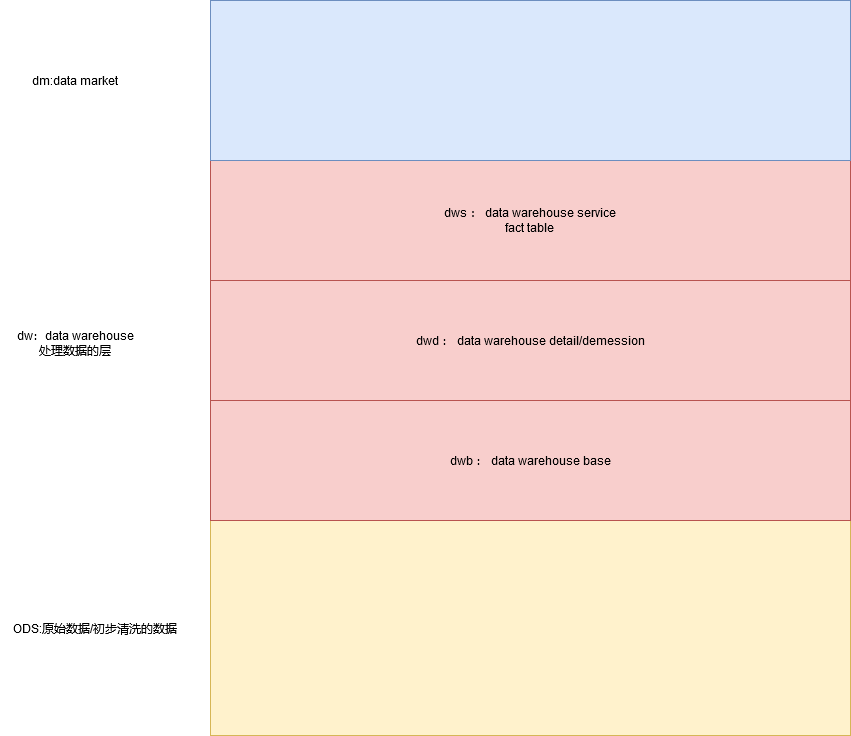

### 5.4 导入Mysql的数据到Hive

#### 5.4.1 在Hive建表建库

- 创建目录——专门存放根sale_order相关的脚本

```sh
[root@hadoop apps]# mkdir sales_order_apps
[root@hadoop apps]# pwd
/opt/apps
[root@hadoop sales_order_apps]# mkdir sql
[root@hadoop sales_order_apps]# mkdir shell
```

- init_sales_order_ods.hql

```sql
-- 创建ods层：sales_order
CREATE DATABASE IF NOT EXISTS `sales_order_ods`;
USE `sales_order_ods`;

-- 建表
-- 客户表
CREATE TABLE `sales_order_ods`.`customer` (
  `customer_number` int,
  `customer_name` string,
  `customer_street_address` string,
  `customer_zip_code` int,
  `customer_city` string,
  `customer_state` string
)
ROW FORMAT DELIMITED FIELDS TERMINATED BY ',';

-- 产品表
CREATE TABLE `sales_order_ods`.`product` (
  `product_code` int,
  `product_name` string,
  `product_category` string
)
ROW FORMAT DELIMITED FIELDS TERMINATED BY ',';

-- 销售订单表
CREATE TABLE `sales_order_ods`.`sales_order` (
  `order_number` int,
  `customer_number` int,
  `product_code` int,
  `order_date` string,
  `entry_date` string,
  `order_amount` decimal(18,2)
) 
ROW FORMAT DELIMITED FIELDS TERMINATED BY ',';
```

- 测试1

```sh
##1. 测试hql文件是否可用
[root@hadoop sql]# hive -f init_sales_order_ods.hql
##2. 测试结果是否正确
[root@hadoop sql]# hive -e "desc sales_order_ods.product"
```

#### 5.4.2 导入数据到ods层

- init_sales_order_data.sh

```sh
#!/bin/bash

echo "init_sales_order_data.sh is running ..........................................."

HIVE_HOME=/opt/apps/hive-1.2.1
SQOOP_HOME=/opt/apps/sqoop-1.4.7
JDBC_URL=jdbc:mysql://hadoop:3308/sales_source
USERNAME=root
PASSWORD=123456
TBL_CUSTOMER=customer
TBL_PRODUCT=product
TBL_ORDER=sales_order
ODS_HQL=/opt/apps/sales_order_apps/sql/init_sales_order_ods.hql


echo "create table is running ......................................................."
$HIVE_HOME/bin/hive -f $ODS_HQL


echo "import data is running ........................................................"
## import customer
$SQOOP_HOME/bin/sqoop import \
--connect $JDBC_URL \
--username $USERNAME \
--password $PASSWORD \
--table $TBL_CUSTOMER \
--hive-import \
--hive-table sales_order_ods.$TBL_CUSTOMER \
--delete-target-dir \
--split-by customer_number \
--fields-terminated-by ',' \
--num-mappers 1 \
--as-textfile

echo "customer import is succssfully ..........................................."

## import product
$SQOOP_HOME/bin/sqoop import \
--connect $JDBC_URL \
--username $USERNAME \
--password $PASSWORD \
--table $TBL_PRODUCT \
--hive-import \
--hive-table sales_order_ods.$TBL_PRODUCT \
--delete-target-dir \
--split-by product_code \
--fields-terminated-by ',' \
--num-mappers 1 \
--as-textfile

echo "product import is succssfully ..........................................."


## import sales_order
$SQOOP_HOME/bin/sqoop import \
--connect $JDBC_URL \
--username $USERNAME \
--password $PASSWORD \
--table $TBL_ORDER \
--hive-import \
--hive-table sales_order_ods.$TBL_ORDER \
--delete-target-dir \
--split-by order_number \
--fields-terminated-by ',' \
--num-mappers 1 \
--as-textfile

echo "all data import is succssfully ..........................................."

```

- 测试2

```sh
[root@hadoop shell]# sh init_sales_order_data.sh
```

#### 5.4.3 ods --> dwd-->dws

##### 5.4.3.1 需求

> 每天、每个客户、当天的订单数、当天的订单金额、近两天订单数、近两天的订单金额

##### 5.4.3.2 建立星型模型

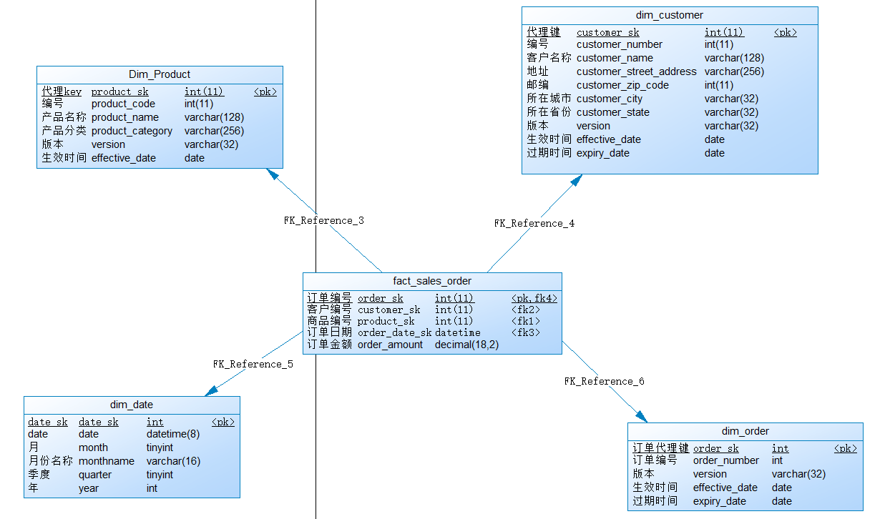

##### 5.4.3.3 构建dwd层的表

- gernate_date.sh

```sh
#!/bin/bash
date1="$1"
tempdate=`date -d "$date1" +%F`
min=1
max=10000
while [ $min -le $max ]
do
month=`date -d "$tempdate" +%m`
month_name=`date -d "$tempdate" +%B`
quarter=`echo $month | awk '{print int(($0-1)/3 +1) }'`
year=`date -d "$tempdate" +%Y`
echo "${min}","${tempdate}","${month}","${month_name}","${quarter}","${year}" >> /opt/apps/sales_order_apps/csv/dim_date.csv
tempdate=`date -d "+$min day $date1" +%F`
min=`expr $min + 1`
done
```

- init_sales_order_dwd.hql

```sql
-- 创建dwd层
CREATE DATABASE IF NOT EXISTS `sales_order_dwd`;
USE `sales_order_dwd`;

-- 创建客户维度
CREATE TABLE `sales_order_dwd`.`dim_customer` (
  `customer_sk` int,
  `customer_number` int,
  `customer_name` string,
  `customer_street_address` string,
  `customer_zip_code` int,
  `customer_city` string,
  `customer_state` string,
  `version` string,
  `effective_date` string,
  `expiry_date` string
)
CLUSTERED BY(customer_sk) INTO 8 BUCKETS
ROW FORMAT DELIMITED 
FIELDS TERMINATED BY '\001'
STORED AS ORC;

-- 创建产品维度
CREATE TABLE `sales_order_dwd`.`dim_product` (
  `product_sk` int,
  `product_code` int,
  `product_name` string,
  `product_category` string,
  `version` string,
  `effective_date` string,
  `expiry_date` string
)
CLUSTERED BY(product_sk) INTO 8 BUCKETS
ROW FORMAT DELIMITED 
FIELDS TERMINATED BY '\001'
STORED AS ORC;

-- 创建订单维度
CREATE TABLE `sales_order_dwd`.`dim_order` (
  `order_sk` int,
  `order_number` int,
  `version` string,
  `effective_date` string,
  `expiry_date` string
) 
CLUSTERED BY(order_sk) INTO 8 BUCKETS
ROW FORMAT DELIMITED 
FIELDS TERMINATED BY '\001'
STORED AS ORC;

-- 时间维度表
CREATE TABLE `sales_order_dwd`.`dim_date` (
  `date_sk` int,
  `date` string,
  `month` int,
  `monthname` string,
  `quarter` int,
  `year` int
) 
CLUSTERED BY(date_sk) INTO 8 BUCKETS
ROW FORMAT DELIMITED 
FIELDS TERMINATED BY ','
STORED AS TEXTFILE;

-- 导入数据
-- ods的customer导入到dwd的dim_customer
INSERT OVERWRITE TABLE `sales_order_dwd`.`dim_customer`
SELECT
row_number() over(order by c.`customer_number`) as customer_sk,
customer_number,
customer_name,
customer_street_address,
customer_zip_code,
customer_city,
customer_state,
'1',
'2021-10-20',
'9999-12-31'
FROM
`sales_order_ods`.`customer` c;

-- product
INSERT OVERWRITE TABLE `sales_order_dwd`.`dim_product`
SELECT
row_number() over(order by p.`product_code`) as product_sk,
product_code,
product_name,
product_category,
'1',
'2021-10-20',
'9999-12-31'
FROM
`sales_order_ods`.`product` p;

-- order
INSERT OVERWRITE TABLE `sales_order_dwd`.`dim_order`
SELECT
row_number() over(order by o.`order_number`) as order_sk,
order_number,
'1',
'2021-10-20',
'9999-12-31'
FROM
`sales_order_ods`.`sales_order` o;

-- date
LOAD DATA LOCAL INPATH '/opt/apps/sales_order_apps/csv/dim_date.csv' INTO TABLE `sales_order_dwd`.`dim_date`;
```

- init_sales_order_data_dwd.sh

```sh
#!/bin/bash

echo "init_sales_order_data.sh is running ..........................................."

HIVE_HOME=/opt/apps/hive-1.2.1
DWD_HQL=/opt/apps/sales_order_apps/sql/init_sales_order_dwd.hql

echo "import data is running ........................................................"
$HIVE_HOME/bin/hive -f $DWD_HQL
```

##### 5.4.3.4 构建dws层的表

- init_sales_order_dws.hql

```sql
-- 创建主题层
CREATE DATABASE IF NOT EXISTS `sales_order_dws`;
USE `sales_order_dws`;

-- 创建表
CREATE TABLE IF NOT EXISTS `sales_order_dws`.`fact_sales_order`(
    `order_sk` int,
    `customer_sk` int,
    `product_sk` int,
    `date_sk` int,
    `order_amount` decimal(18, 2)
)
CLUSTERED BY(order_sk) INTO 8 BUCKETS
ROW FORMAT DELIMITED FIELDS TERMINATED BY '\001' STORED AS ORC;

-- 导入数据
INSERT OVERWRITE TABLE `sales_order_dws`.`fact_sales_order`
SELECT
do.`order_sk`,
dc.`customer_sk`,
dp.`product_sk`,
`date_sk`,
so.`order_amount`
FROM `sales_order_ods`.`sales_order` so
JOIN
`sales_order_dwd`.`dim_order` do
ON
so.`order_number` = do.`order_number`
JOIN
`sales_order_dwd`.`dim_customer` dc
ON
so.`customer_number` = dc.`customer_number`
JOIN
`sales_order_dwd`.`dim_product` dp
ON
so.`product_code` = dp.`product_code`
JOIN
`sales_order_dwd`.`dim_date` dd
ON
to_date(so.`order_date`) = dd.`date`;
```

- init_sales_order_dws.sh

```sh
#!/bin/bash

echo "init_sales_order_dws.sh is running ..........................................."

HIVE_HOME=/opt/apps/hive-1.2.1
DWS_HQL=/opt/apps/sales_order_apps/sql/init_sales_order_dws.hql

echo "import data is running ........................................................"
$HIVE_HOME/bin/hive -f $DWS_HQL
```

#### 5.4.4 将需求结果导入到dm层

##### 5.4.4.1 init_sales_order_dm.hql

```sql
-- 创建主题层
CREATE DATABASE IF NOT EXISTS `sales_order_dm`;
USE `sales_order_dm`;

-- 创建表
CREATE TABLE IF NOT EXISTS `sales_order_dm`.`sales_order_cnt`(
    `date` string,
    `customer_number` int,
    `customer_name` string,
    `order_cnt1` int,
    `order_amount1` decimal(18, 2),
    `order_cnt2` int,
    `order_amount2` decimal(18, 2)
)
CLUSTERED BY(customer_number) INTO 8 BUCKETS
ROW FORMAT DELIMITED FIELDS TERMINATED BY '\001' STORED AS TEXTFILE;

-- 导入数据
FROM(
    SELECT
    dd.`date` `date`,
    dc.`customer_number` `customer_number`,
    dc.`customer_name` `customer_name`,
    SUM(CASE WHEN datediff(current_date(), dd.`date`) = 0 THEN 1 ELSE 0 END) order_cnt1,
    SUM(CASE WHEN datediff(current_date(), dd.`date`) = 0 THEN `order_amount` ELSE 0 END)
    order_amount1,
    SUM(CASE WHEN datediff(current_date(), dd.`date`) IN (0,1) THEN 1 ELSE 0 END) order_cnt2,
    SUM(CASE WHEN datediff(current_date(), dd.`date`) IN (0,1) THEN `order_amount` ELSE 0 END)
    order_amount2
    --COUNT(1),
    --SUM(order_amount)
    FROM
    `sales_order_dws`.`fact_sales_order` fso
    JOIN
    `sales_order_dwd`.`dim_date` dd
    ON
    fso.`date_sk` = dd.`date_sk`
    JOIN
    `sales_order_dwd`.`dim_customer` dc
    ON
    fso.`customer_sk` = dc.`customer_sk`
    GROUP BY `date`, `customer_number`, `customer_name`
) tmp
INSERT OVERWRITE TABLE `sales_order_dm`.`sales_order_cnt`
SELECT *
;
```

##### 5.4.4.2 init_sales_order_dm.sh

```sh
#!/bin/bash

echo "init_sales_order_dm.sh is running ..........................................."

HIVE_HOME=/opt/apps/hive-1.2.1
DM_HQL=/opt/apps/sales_order_apps/sql/init_sales_order_dm.hql

echo "import data is running ........................................................"
$HIVE_HOME/bin/hive -f $DM_HQL
```

### 5.5 将结果导入到MySql中

#### 5.5.1 在MySql建表——init_sales_order_cnt_mysql.sql

```sql
-- 1. 建表
CREATE TABLE IF NOT EXISTS `sales_source`.`sales_order_cnt`(
    `date` date DEFAULT NULL,
    `customer_number` int(11) DEFAULT NULL,
    `customer_name` varchar(255) DEFAULT NULL,
    `order_cnt1` int(11) DEFAULT NULL,
    `order_amount1` decimal(18, 2) DEFAULT NULL,
    `order_cnt2` int(11) DEFAULT NULL,
    `order_amount2` decimal(18, 2) DEFAULT NULL
) ENGINE=INNODB DEFAULT CHARSET=UTF8;
```

>`mysql -h$HOST_NAME -P$JDBC_PORT -p$JDBC_PWD -u$JDBC_USER -D$JDBC_DB<sql file path`
>
>-h : mysql的ip地址
>
>-P : mysql的端口号
>
>-p ：mysql的链接的用户密码
>
>-u : mysql的链接的用户名称
>
>-D : 连接到哪个数据库， 如果在你的sql文件中，使用了use db的命令
>
><指定的sql的路径

#### 5.5.2 export_dm_sales_order_data_mysql.sh

```sh
#!/bin/bash

##1. 在mysql中建表
HOST_NAME=hadoop
JDBC_USER=root
JDBC_PWD=123456
JDBC_PORT=3308
JDBC_DB=sales_source
SQOOP_HOME=/opt/apps/sqoop-1.4.7
JDBC_URL=jdbc:mysql://$HOST_NAME:$JDBC_PORT/$JDBC_DB
JDBC_TBL=sales_order_cnt

echo "export data 2 mysql is running ..........................................................................."
mysql -h$HOST_NAME -P$JDBC_PORT -p$JDBC_PWD -u$JDBC_USER -D$JDBC_DB</opt/apps/sales_order_apps/sql/init_sales_order_cnt_mysql.sql

echo "export data 2 mysql is finish ..........................................................................."

##2. 向mysql中导入数据

echo "sqoop export data 2 mysql is running ..........................................................................."

$SQOOP_HOME/bin/sqoop export \
--connect $JDBC_URL \
--username $JDBC_USER \
--password $JDBC_PWD \
--table $JDBC_TBL \
--input-fields-terminated-by '\001' \
--export-dir hdfs://$HOST_NAME:9000/user/hive/warehouse/sales_order_dm.db/sales_order_cnt \
--num-mappers 1

echo "sqoop export data 2 mysql is successfully ..........................................................................."
```

## 6 工作流工具——azkaban

### 6.1 工作流（workflow）是什么？

> 工作流表示工作流程。

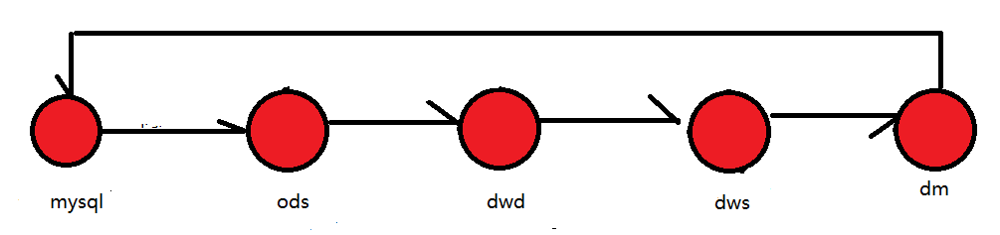

### 6.2 安装azkaban

```sh
##1. 解压安装
[root@hadoop software]# tar -zxvf azkaban-solo-server-0.1.0-SNAPSHOT.tar.gz -C /opt/apps/
[root@hadoop apps]# mv azkaban-solo-server-0.1.0-SNAPSHOT/ azkaban-solo-server

##2. 配置
[root@hadoop conf]# vi azkaban-users.xml
<azkaban-users>
  <user groups="azkaban" password="azkaban" roles="admin" username="azkaban"/>
  <user password="metrics" roles="metrics" username="metrics"/>
  <user password="admin" roles="admin,metrics" username="admin"/>
  <role name="admin" permissions="ADMIN"/>
  <role name="metrics" permissions="METRICS"/>
</azkaban-users>

##3. 启动
[root@hadoop azkaban-solo-server]# ./bin/start-solo.sh

##4. webui
146.56.208.76:8081
```

### 6.3 azkaban案例

#### 6.3.1 第一例

- hello.job

```sh
type=command
command=echo 'hello_azkaban'
```

- 将hello.job打成压缩包（压缩包的格式只能为zip）
- 通过azkaban的web ui将这个zip的包上传到webui中执行

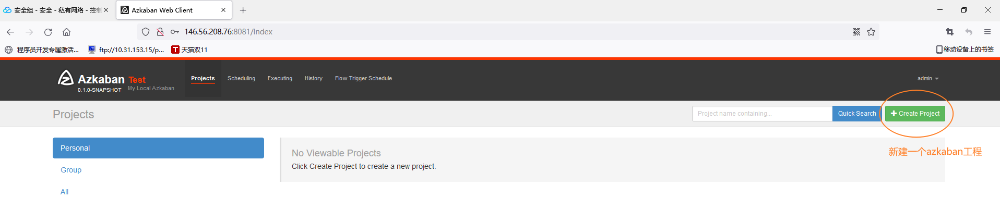

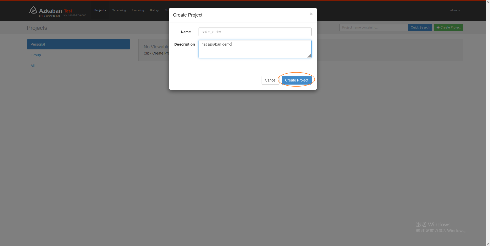

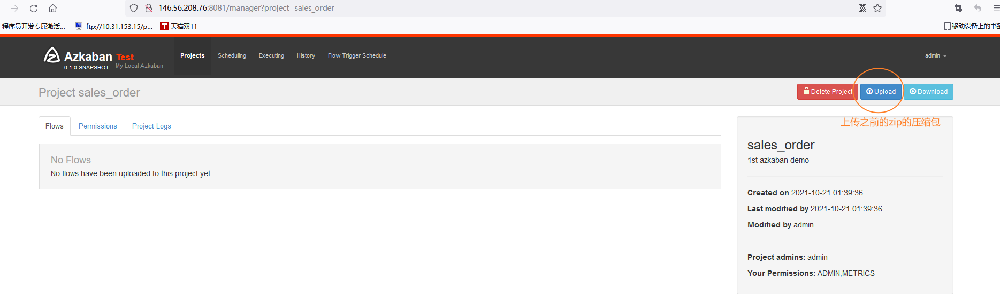

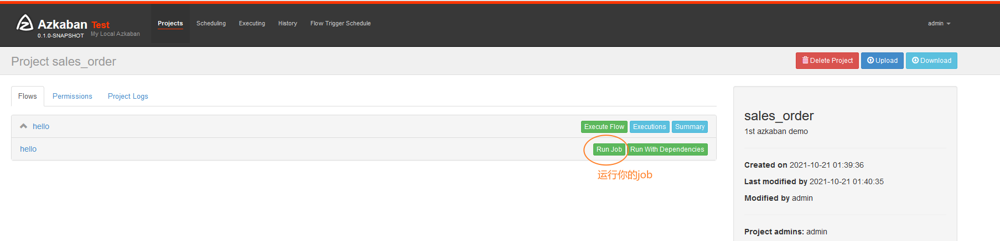

#### 6.3.2 第二例 : azkaban调度shell脚本

- demo2.sh

```sh
#!/bin/bash
echo "gongxudong" >> /home/gongxudong.txt
```

- demo2.job

```sh
type=command
command=/bin/bash demo2.sh
```

#### 6.3.3 第三例：azkaben调度mr

- demo3.job

```sh
type=command
command=/opt/apps/hadoop-2.8.1/bin/yarn jar hadoop-mapreduce-examples-2.8.1.jar wordcount /tmp/customer/part-m-00000 /output
```

#### 6.3.4 第四例  ： 连续调度

- 编写脚本

```sh
vi a.sh
#!/bin/bash

echo "aaaaa" >> /home/a.txt
sleep 10s

vi b.sh
#!/bin/bash
echo "bbbbb" >> /home/b.txt
```

- 编写job

```sh
vi jobA.job
type=command
command=/bin/bash a.sh

vi jobB.job
type=command
dependencies=jobA
command=/bin/bash b.sh
```

#### 6.3.5 第五例 ： 定时执行

- crontshell.sh

```sh
#!/bin/bash
echo "hello gongxudong" >> /home/gongxudong.txt
```

- demo5.job

```sh
type=command
command=/bin/bash crontshell.sh
```

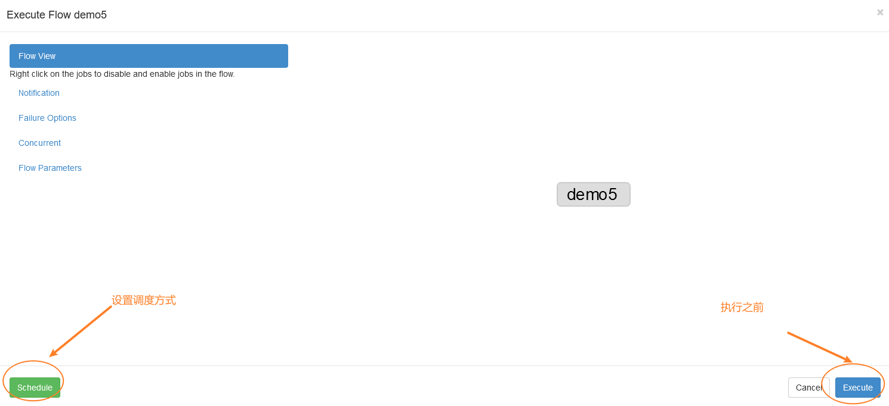

### 6.4 mysql --> ods --> dwd --> dws --> dm --> mysql

#### 6.4.1 sales_order.flow

> 里面不能使用制表符`\t`

```yaml
# 此flow文件是将mysql的数据导入到ods层->dwd层->dws层->dm层->mysql

config:
    param.script.prefix: /opt/apps/sales_order_apps

nodes:
    - name: START
      type: noop
    
    - name: INIT_SALES_ORDER_DATA_ODS
      type: command
      dependsOn:
         - START
      config:
         command: sh "${param.script.prefix}"/shell/init_sales_order_data.sh
         
    - name: INIT_SALES_ORDER_DATA_DWD
      type: command
      dependsOn:
         - INIT_SALES_ORDER_DATA_ODS
      config:
         command: sh "${param.script.prefix}"/shell/init_sales_order_data_dwd.sh
         
    - name: INIT_SALES_ORDER_DATA_DWS
      type: command
      dependsOn:
         - INIT_SALES_ORDER_DATA_DWD
      config:
         command: sh "${param.script.prefix}"/shell/init_sales_order_dws.sh
         
    - name: INIT_SALES_ORDER_DATA_DM
      type: command
      dependsOn:
         - INIT_SALES_ORDER_DATA_DWS
      config:
         command: sh "${param.script.prefix}"/shell/init_sales_order_dm.sh
         
    - name: EXPORT_DM_SALES_ORDER_DATA_MYSQL
      type: command
      dependsOn:
         - INIT_SALES_ORDER_DATA_DM
      config:
         command: sh "${param.script.prefix}"/shell/export_dm_sales_order_data_mysql.sh
         
    - name: END
      type: noop
      dependsOn:
         - EXPORT_DM_SALES_ORDER_DATA_MYSQL
```

#### 6.4.2 sales_order.project

```
# filename : sales_order.project
azkaban-flow-version: 2.0
```

#### 6.4.3 查看结果

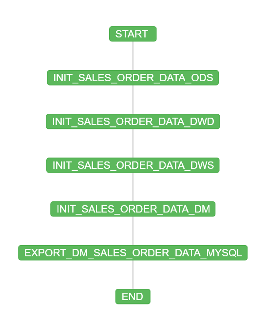


## 7 大数据可视化展示

### 7.1 搭建web工程

#### 7.1.1 创建工程

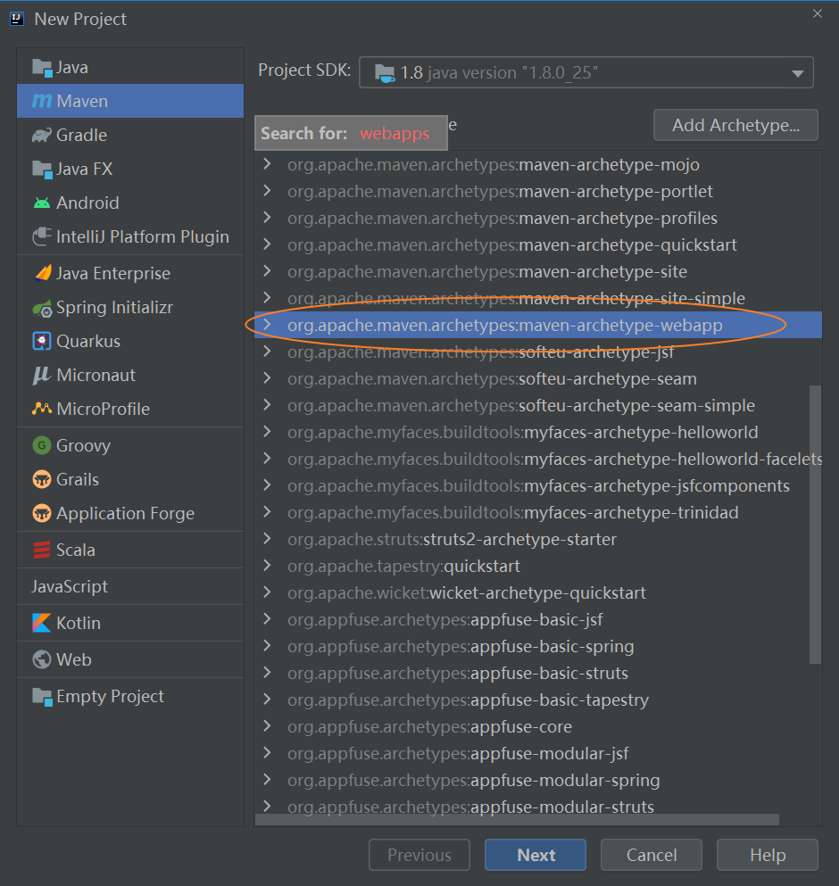

#### 7.1.2 导入依赖

```xml
<?xml version="1.0" encoding="UTF-8"?>

<project xmlns="http://maven.apache.org/POM/4.0.0" xmlns:xsi="http://www.w3.org/2001/XMLSchema-instance"
  xsi:schemaLocation="http://maven.apache.org/POM/4.0.0 http://maven.apache.org/xsd/maven-4.0.0.xsd">
  <modelVersion>4.0.0</modelVersion>

  <groupId>com.qf.bigdata</groupId>
  <artifactId>dataShowUI</artifactId>
  <version>1.0</version>
  <packaging>war</packaging>

  <name>dataShowUI Maven Webapp</name>

  <properties>
    <project.build.sourceEncoding>UTF-8</project.build.sourceEncoding>
    <maven.compiler.source>1.8</maven.compiler.source>
    <maven.compiler.target>1.8</maven.compiler.target>
  </properties>

  <dependencies>
    <!-- jsp -->
    <dependency>
      <groupId>jstl</groupId>
      <artifactId>jstl</artifactId>
      <version>1.2</version>
    </dependency>

    <dependency>
      <groupId>javax.servlet</groupId>
      <artifactId>servlet-api</artifactId>
      <version>2.5</version>
      <scope>provided</scope>
    </dependency>

    <dependency>
      <groupId>javax.servlet</groupId>
      <artifactId>jsp-api</artifactId>
      <version>2.0</version>
      <scope>provided</scope>
    </dependency>

    <!-- apache 工具包 -->
    <dependency>
      <groupId>org.apache.commons</groupId>
      <artifactId>commons-lang3</artifactId>
      <version>3.3.2</version>
    </dependency>

    <dependency>
      <groupId>org.apache.commons</groupId>
      <artifactId>commons-io</artifactId>
      <version>1.3.2</version>
    </dependency>

    <dependency>
      <groupId>commons-net</groupId>
      <artifactId>commons-net</artifactId>
      <version>3.3</version>
    </dependency>

    <dependency>
      <groupId>commons-fileupload</groupId>
      <artifactId>commons-fileupload</artifactId>
      <version>1.3.1</version>
    </dependency>

    <!-- 时间组件 -->
    <dependency>
      <groupId>joda-time</groupId>
      <artifactId>joda-time</artifactId>
      <version>2.5</version>
    </dependency>

    <!-- 日志组件 -->
    <dependency>
      <groupId>org.slf4j</groupId>
      <artifactId>slf4j-log4j12</artifactId>
      <version>1.6.4</version>
    </dependency>
  </dependencies>

  <!-- 插件 -->
  <build>
    <plugins>
      <!-- tomcat插件 -->
      <plugin>
        <groupId>org.apache.tomcat.maven</groupId>
        <artifactId>tomcat7-maven-plugin</artifactId>
        <version>2.2</version>
        <configuration>
          <port>8080</port>
          <path>/</path>
        </configuration>
      </plugin>

      <!-- maven编译器插件 -->
      <plugin>
        <groupId>org.apache.maven.plugins</groupId>
        <artifactId>maven-compiler-plugin</artifactId>
        <version>3.2</version>
        <configuration>
          <source>1.8</source>
          <target>1.8</target>
          <encoding>UTF-8</encoding>
        </configuration>
      </plugin>

      <!-- 资源拷贝插件 -->
      <plugin>
        <groupId>org.apache.maven.plugins</groupId>
        <artifactId>maven-resources-plugin</artifactId>
        <version>2.7</version>
        <configuration>
          <encoding>UTF-8</encoding>
        </configuration>
      </plugin>
    </plugins>

    <!-- 指定资源拷贝目录 -->
    <resources>
      <resource>
        <directory>src/main/java</directory>
        <includes>
          <include>**/*.properties</include>
          <include>**/*.xml</include>
        </includes>
        <filtering>false</filtering>
      </resource>
      <resource>
        <directory>src/main/resources</directory>
        <includes>
          <include>**/*.properties</include>
          <include>**/*.xml</include>
        </includes>
        <filtering>false</filtering>
      </resource>
    </resources>
  </build>
</project>
```

#### 7.1.3 工程配置

> ctrl + shift + alt + s

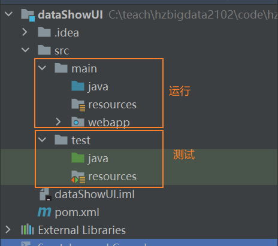

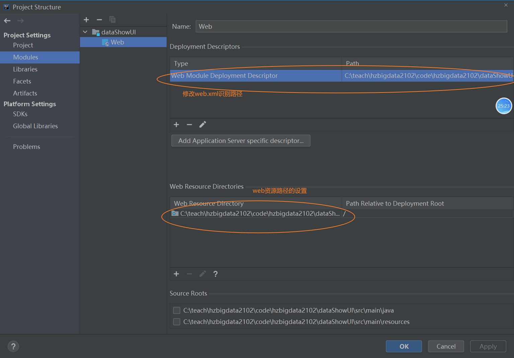

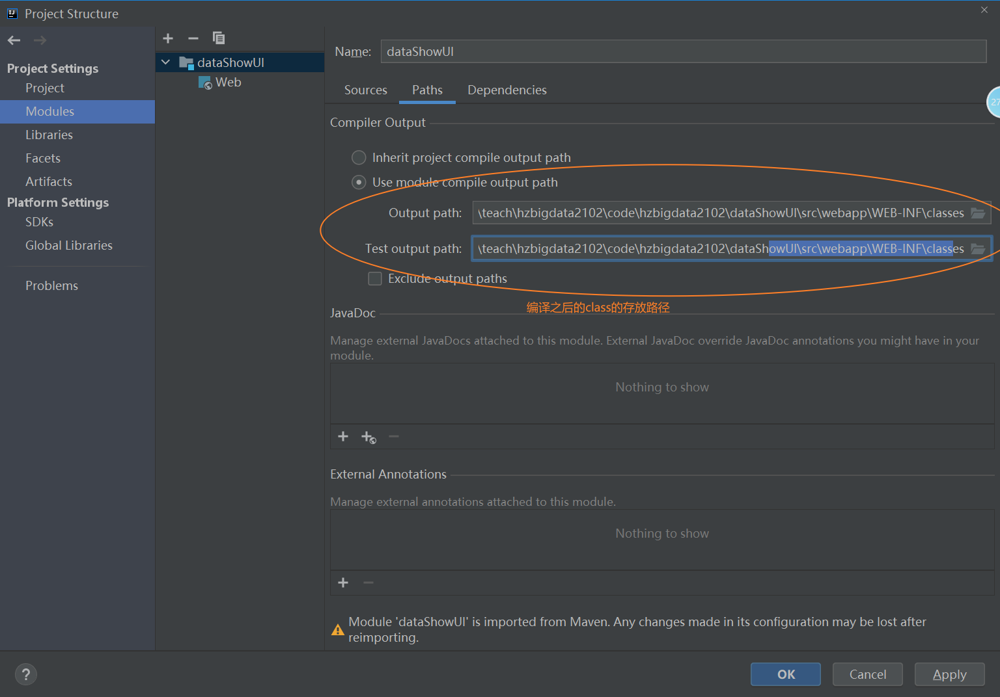

### 7.2 web工程介绍

#### 7.2.1 web工程的目录结构

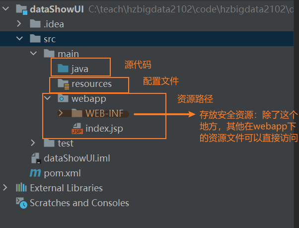

#### 7.2.2 动态资源和静态资源

> - 动态资源：可以写服务端代码的资源一般都统称为动态资源——Servlet、Jsp
> - 静态资源：除了动态资源都是静态资源

#### 7.2.3 html标签

- 表单标签

> 提交数据

```html
<%@ page contentType="text/html;charset=UTF-8" language="java" %>
<html>
    <body>
        <%--
         action : 请求路径
         method : 请求方式：post和get。表单的请求一般都是post
         --%>
        <form action="table.jsp" method="post">
            <%--
                type = text : 表示这个input项是一个文本框
                name : 给这个input项取一个名称
                <br> : 页面换行
             --%>
           用户名称: <input type="text" name="username" /><br>
           <%-- 密码框 --%>
           用户密码 : <input type="password" name="password" /><br>

           <%-- 多选框 --%>
           擅长运动： <br>
           篮球：<input type="checkbox" name="sport" value="basketball"/>&nbsp&nbsp
           足球：<input type="checkbox" name="sport" value="football"/>&nbsp&nbsp
           乒乓球：<input type="checkbox" name="sport" value="pingpong"/>&nbsp&nbsp<br>

           兴趣爱好： <br>
           吃饭：<input type="checkbox" name="love" value="eat"/>&nbsp&nbsp
           睡觉：<input type="checkbox" name="love" value="sleep"/>&nbsp&nbsp
           打代码：<input type="checkbox" name="love" value="code"/>&nbsp&nbsp<br>

            <%-- 单选框 --%>
            男：<input type="radio" name="gender" value="man"/>&nbsp&nbsp
            女：<input type="radio" name="gender" value="woman" checked />&nbsp&nbsp<br>

            <%-- 下拉列表 --%>
            生日：<select name="date">
                <option value="1999" >1999</option>
                <option value="2000" selected>2000</option>
            </select><br>

            <%-- 列表 --%>
            技能：<select name="skill" multiple>
                <option value="sing" >唱歌</option>
                <option value="dance" >跳舞</option>
            </select><br>

            <%-- 文本域 --%>
            个人介绍：<br>
            <textarea cols="25" rows="10">

            </textarea><br>

            <%-- 文件上传框 --%>
            文件上传：<input type="file" name="file" /><br>

            <%-- 隐藏框 --%>
            <input type="hidden" name="sb" value="123 2b" />

            <%-- 普通按钮 --%>
           <input type="button" value="我很普通" /><br>
           <%-- 重制按钮 --%>
           <input type="reset" /><br>
           <%-- 表单提交按钮 --%>
           <input type="submit" value="登陆" /><br>

            <%-- 图片提交 --%>
            <input type="image" src="button.png" /><br>
        </form>
    </body>
</html>
```

- 表格标签


> 数据展示

```html
<%@ page contentType="text/html;charset=UTF-8" language="java" %>
<html>
    <body>
        <%-- 表格标签的根目录 --%>
        <table border="1" bgcolor="red">
            <%--
                <tr> : 一行
                <td> : 一个单元格
             --%>
            <tr>
                <th>编号</th>
                <th>姓名</th>
            </tr>
            <tr>
                <td>1</td>
                <td>李熙</td>
            </tr>
        </table>
    </body>
</html>
```

#### 7.2.4 Servlet

##### 7.2.4.1 介绍

> 理解为是一个控制器，控制接收页面传递的参数，负责页面跳转

##### 7.2.4.2 servlet的创建以及调用

- LoginServlet

```java
package com.qf.bigdata.web.servlet;

import javax.servlet.*;
import javax.servlet.http.*;
import java.io.IOException;

public class LoginServlet extends HttpServlet {

    /**
     * 如果你的请求方式是get请求，就自动的调用这个方法
     */
    @Override
    protected void doGet(HttpServletRequest request, HttpServletResponse response) throws ServletException, IOException {
        System.out.println("get");
    }

    /**
     * 如果你的请求方式是post请求，就自动的调用这个方法
     */
    @Override
    protected void doPost(HttpServletRequest request, HttpServletResponse response) throws ServletException, IOException {
        System.out.println("post");
    }
}

```

- web.xml

```xml
<!-- servlet对象是由tomcat创建,单例 -->
<servlet>
    <servlet-name>LoginServlet</servlet-name>
    <servlet-class>com.qf.bigdata.web.servlet.LoginServlet</servlet-class>
</servlet>

<servlet-mapping>
    <servlet-name>LoginServlet</servlet-name>
    <url-pattern>/loginServlet</url-pattern>
</servlet-mapping>
```

##### 7.2.4.3 登陆案例

- login.jsp

```jsp
<%--
  Created by IntelliJ IDEA.
  User: lixi
  Date: 2021/10/22
  Time: 15:58
  To change this template use File | Settings | File Templates.
--%>
<%@ page contentType="text/html;charset=UTF-8" language="java" %>
<html>
<head>
    <title>登陆页面</title>
</head>
<body>
    <form action="/loginServlet" method="post">
        <%--
            type = text : 表示这个input项是一个文本框
            name : 给这个input项取一个名称
            <br> : 页面换行
         --%>
        用户名称: <input type="text" name="username" /><br>
        <%-- 密码框 --%>
        用户密码 : <input type="password" name="password" /><br>
        <%-- 图片提交 --%>
        <input type="image" src="button.png" /><br>
    </form>
</body>
</html>

```

- success.jsp and error.jsp

```jsp
<%@ page contentType="text/html;charset=UTF-8" language="java" %>
<html>
    <head>
        <title>成功</title>
    </head>
    <body>
        <h1>欢迎，欢迎，热烈欢迎</h1>
    </body>
</html>

<%@ page contentType="text/html;charset=UTF-8" language="java" %>
<html>
    <head>
        <title>error</title>
    </head>
    <body>
        <h1 style="color:red">
            你很失败
        </h1>
    </body>
</html>
```

- LoginServlet

```java
package com.qf.bigdata.web.servlet;

import javax.servlet.*;
import javax.servlet.http.*;
import java.io.IOException;

public class LoginServlet extends HttpServlet {

    /**
     * 如果你的请求方式是get请求，就自动的调用这个方法
     */
    @Override
    protected void doGet(HttpServletRequest request, HttpServletResponse response) throws ServletException, IOException {
        System.out.println("get");
    }

    /**
     * 如果你的请求方式是post请求，就自动的调用这个方法
     * request ：请求对象，浏览器向服务器发送的请求
     * response ：响应对象，服务器对客户端的响应
     */
    @Override
    protected void doPost(HttpServletRequest request, HttpServletResponse response) throws ServletException, IOException {
        //1. 接受的到传递过来的用户名称和密码
        String username = request.getParameter("username");
        String password = request.getParameter("password");
        //System.out.println(username + "     " + password);

        //2. 校验
        boolean isLogin = false;
        if (username.trim().equals("admin") && password.trim().equals("123456")) {
            isLogin = true;
        }

        //3. 校验, 根据结果跳转到不同的页面
        /**
         * 1. 请求转发 ：1.只产生一次请求。跳转页面。2.地址栏不变。3. 基于客户端请求
         * 2. 重定向 ：1.会产生多次请求。跳转页面。2.地址栏会发生变化。3. 基于服务端响应
         */
        if (isLogin) {
            response.sendRedirect("/success.jsp"); // 重定向
        }else { // 失败:请求转发
            request.getRequestDispatcher("/error.jsp").forward(request, response); // 请求转发
        }
    }
}
```

##### 7.2.4.4 注册案例

- regist.jsp

```jsp
<%--
  Created by IntelliJ IDEA.
  User: lixi
  Date: 2021/10/22
  Time: 15:58
  To change this template use File | Settings | File Templates.
--%>
<%@ page contentType="text/html;charset=UTF-8" language="java" %>
<html>
<head>
    <title>注册页面</title>
</head>
<body>
    <form action="/" method="post">
        <%--
            type = text : 表示这个input项是一个文本框
            name : 给这个input项取一个名称
            <br> : 页面registServlet换行
         --%>
        用户名称: <input type="text" name="username" /><br>
        <%-- 密码框 --%>
        用户密码 : <input type="password" name="password" /><br>
        <%-- 图片提交 --%>
        <input type="image" src="button.png" /><br>
    </form>
</body>
</html>
```

- web.xml

```xml
<!DOCTYPE web-app PUBLIC
 "-//Sun Microsystems, Inc.//DTD Web Application 2.3//EN"
 "http://java.sun.com/dtd/web-app_2_3.dtd" >

<web-app>
  <display-name>Archetype Created Web Application</display-name>

    <!-- servlet对象是由tomcat创建 -->
    <servlet>
        <servlet-name>LoginServlet</servlet-name>
        <servlet-class>com.qf.bigdata.web.servlet.LoginServlet</servlet-class>
    </servlet>

    <servlet>
        <servlet-name>RegisterServlet</servlet-name>
        <servlet-class>com.qf.bigdata.web.servlet.RegisterServlet</servlet-class>
    </servlet>

    <servlet-mapping>
        <servlet-name>LoginServlet</servlet-name>
        <url-pattern>/loginServlet</url-pattern>
    </servlet-mapping>

    <servlet-mapping>
        <servlet-name>RegisterServlet</servlet-name>
        <url-pattern>/registerServlet</url-pattern>
    </servlet-mapping>

</web-app>

```

- User

```java
package com.qf.bigdata.pojo;

public class User {
    private String username;
    private String password;

    public User() {
    }

    public User(String username, String password) {
        this.username = username;
        this.password = password;
    }

    public String getUsername() {
        return username;
    }

    public void setUsername(String username) {
        this.username = username;
    }

    public String getPassword() {
        return password;
    }

    public void setPassword(String password) {
        this.password = password;
    }
}

```

- RegisterServlet

```java
package com.qf.bigdata.web.servlet;

import com.qf.bigdata.pojo.User;
import com.qf.bigdata.service.UserService;
import com.qf.bigdata.service.UserServiceImpl;

import javax.servlet.*;
import javax.servlet.http.*;
import java.io.IOException;

public class RegisterServlet extends HttpServlet {

    private UserService userService = new UserServiceImpl();

    @Override
    protected void doPost(HttpServletRequest request, HttpServletResponse response) throws ServletException, IOException {
        //1. 接收请求参数
        String username = request.getParameter("username");
        String password = request.getParameter("password");
        User user = new User(username, password);

        //2. 注册业务
        boolean isok = userService.register(user);

        //3. 跳转
        if (isok) {
            response.sendRedirect("/success.jsp"); // 重定向
        }else { // 失败:请求转发
            request.getRequestDispatcher("/error.jsp").forward(request, response); // 请求转发
        }
    }
}

```

- UserService

```java
package com.qf.bigdata.service;

import com.qf.bigdata.pojo.User;

public interface UserService {
    boolean register(User user);
}

```

- UserServiceImpl

```java
package com.qf.bigdata.service;

import com.qf.bigdata.dao.UserDao;
import com.qf.bigdata.dao.impl.UserDaoImpl;
import com.qf.bigdata.pojo.User;

public class UserServiceImpl implements UserService{

    private UserDao userDao = new UserDaoImpl();

    @Override
    public boolean register(User user) {
        int row = userDao.insert(user);
        return row == 1 ? true : false;
    }
}

```

- UserDaoImpl

```java
package com.qf.bigdata.dao.impl;

import com.qf.bigdata.JDBCUtils;
import com.qf.bigdata.dao.UserDao;
import com.qf.bigdata.pojo.User;

public class UserDaoImpl implements UserDao {

    @Override
    public int insert(User user) {
        String sql = "insert into t_user values(?, ?)";
        return JDBCUtils.update(sql, user);
    }
}

```

- JDBCUtils

```java
package com.qf.bigdata;

import com.qf.bigdata.pojo.User;

import java.sql.Connection;
import java.sql.DriverManager;
import java.sql.PreparedStatement;
import java.sql.SQLException;

public class JDBCUtils {

    private static String URL = "jdbc:mysql://146.56.208.76:3308/sales_source";
    private static String USER = "root";
    private static String PWD = "123456";

    static {
        try {
            Class.forName("com.mysql.jdbc.Driver");
        } catch (Exception e) {
            e.printStackTrace();
        }
    }

    public static Connection getConnection() {
        Connection connection = null;
        try {
            connection  = DriverManager.getConnection(URL, USER, PWD);
        } catch (SQLException e) {
            e.printStackTrace();
        }
        return connection;
    }

    public static int update(String sql, User user) {
        try {
            Connection connection = getConnection();
            PreparedStatement preparedStatement = connection.prepareStatement(sql);
            preparedStatement.setString(1, user.getUsername());
            preparedStatement.setString(2, user.getPassword());
            return preparedStatement.executeUpdate();
        }catch (Exception e) {
            e.printStackTrace();
        }
        return 0;
    }
}
```

- 导入依赖

```xml
<dependency>
    <groupId>mysql</groupId>
    <artifactId>mysql-connector-java</artifactId>
    <version>5.1.47</version>
</dependency>
```

#### 7.2.5 MVC —— JavaWeb的三层结构

##### 7.2.5.1 介绍，案例参考注册案例

```properties
M:Model
V:View
C:Controller

web : web相关的代码：servlet、filter、lisetner
service : 业务代码
dao ： 操作与数据库链接等操作
```

##### 7.2.5.2 ssm框架介绍

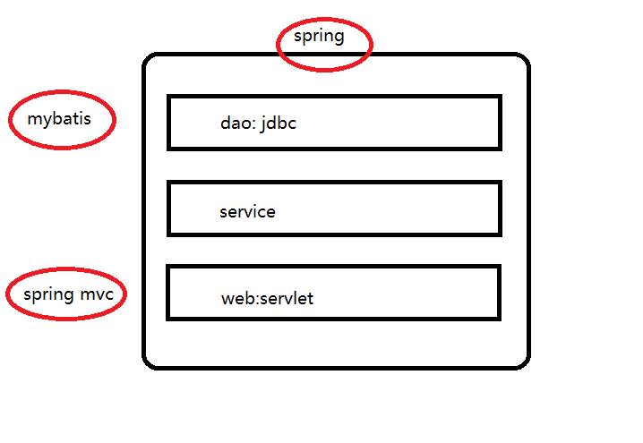

#### 7.2.6 Spring

##### 7.2.6.1 IOC : 控制反转

- 介绍

> 将创建对象的过程反转。
>
> 比如：Person p = new Person().这是之前的做法。
>
> 将创建对象的过程交给Spring的ioc容器。可以将你的子类对象隐藏。

- 快速入门

```sh
##1. 导入依赖
<dependency>
    <groupId>org.springframework</groupId>
    <artifactId>spring-context</artifactId>
    <version>4.2.4.RELEASE</version>
</dependency>

##2. applictionContext.xml
<?xml version="1.0" encoding="UTF-8"?>
<beans xmlns="http://www.springframework.org/schema/beans"
       xmlns:xsi="http://www.w3.org/2001/XMLSchema-instance"
       xsi:schemaLocation="http://www.springframework.org/schema/beans
        https://www.springframework.org/schema/beans/spring-beans.xsd">

    <!-- 配置你要创建的对象 -->
    <!--
     id : 表示你这个对象的唯一标志
     class : 你要创建的类的包名+类名
     -->
    <bean id="person" class="com.qf.test.Person" > <!-- ioc : 控制反转 -->
        <property name="name" value="lixi" /> <!-- di : 依赖注入 -->
    </bean>

</beans>

## 3. 测试类
package com.qf.test;

import org.junit.Test;
import org.springframework.context.ApplicationContext;
import org.springframework.context.support.ClassPathXmlApplicationContext;

public class Demo1_IOC {
    @Test
    public void test1() {
        //1. spring的核心对象
        ApplicationContext app = new ClassPathXmlApplicationContext("classpath:applicationContext.xml");
        //2. 获取person对象
        Person person = (Person) app.getBean("person");
        System.out.println(person);
    }
}

package com.qf.test;

public class Person {
    private String name;

    public String getName() {
        return name;
    }

    public void setName(String name) {
        this.name = name;
    }

    public Person() {
    }

    public Person(String name) {
        this.name = name;
    }

    @Override
    public String toString() {
        return "Person{" +
                "name='" + name + '\'' +
                '}';
    }
}

```

- 注解方式

```sh
##1. 配置applicationContext2.xml
<?xml version="1.0" encoding="UTF-8"?>
<beans xmlns="http://www.springframework.org/schema/beans"
       xmlns:xsi="http://www.w3.org/2001/XMLSchema-instance"
       xmlns:context="http://www.springframework.org/schema/context"
       xsi:schemaLocation="
       http://www.springframework.org/schema/beans
       https://www.springframework.org/schema/beans/spring-beans.xsd
       http://www.springframework.org/schema/context
       https://www.springframework.org/schema/context/spring-context.xsd
       ">

    <!-- 开启ioc的注解方式开发 -->
    <context:annotation-config />

    <!-- 开启注解扫描 -->
    <context:component-scan base-package="com.qf.test" />
</beans>

##2. Person
package com.qf.test;

import org.springframework.stereotype.Component;


//@Component、@Repository、@Service、@Controller
@Component
public class Person {
    private String name;

    public String getName() {
        return name;
    }

    public void setName(String name) {
        this.name = name;
    }

    public Person() {
    }

    public Person(String name) {
        this.name = name;
    }

    @Override
    public String toString() {
        return "Person{" +
                "name='" + name + '\'' +
                '}';
    }
}

##3. 测试
@Test
public void test2() {
    //1. spring的核心对象
    ApplicationContext app = new ClassPathXmlApplicationContext("classpath:applicationContext2.xml");
    //2. 获取person对象
    //        Person person = (Person) app.getBean("person");
    Person person = app.getBean(Person.class);
    System.out.println(person);
}
```

##### 7.2.6.2 AOP ： 面向切面/方面编程

- aop概念

```properties
JoinPoint : 连接点， 被拦截的点，我们的程序里面一般都是指方法。
PointCut : 切入点，对JoinPoint进行拦截的定义
Advice : 通知/增强，拦截到方法之后，你要做的事情
Target : 目标对象
Weaving ： 织入，把advice一个用到target的过程
proxy : 
aspect : 切面，PointCut和Advice的结合
```

- xml方式

```sh
##1. 添加依赖
<dependency>
    <groupId>org.springframework</groupId>
    <artifactId>spring-aspects</artifactId>
    <version>4.2.4.RELEASE</version>
</dependency>

<dependency>
    <groupId>org.aspectj</groupId>
    <artifactId>aspectjweaver</artifactId>
    <version>1.9.5</version>
</dependency>


##2. Student
package com.qf.test;

public class Student {
    public void study() {
        System.out.println("c");
    }
}

##3. StudentAdvice
package com.qf.test;

public class StudentAdvice {
    public void before() {
        System.out.println("before");
    }
    public void after() {
        System.out.println("after");
    }
}


##4. applicationContext3.xml
<?xml version="1.0" encoding="UTF-8"?>
<beans xmlns="http://www.springframework.org/schema/beans"
       xmlns:xsi="http://www.w3.org/2001/XMLSchema-instance"
       xmlns:context="http://www.springframework.org/schema/context"
       xmlns:aop="http://www.springframework.org/schema/aop"
       xsi:schemaLocation="
       http://www.springframework.org/schema/beans
       https://www.springframework.org/schema/beans/spring-beans.xsd
       http://www.springframework.org/schema/context
       https://www.springframework.org/schema/context/spring-context.xsd
       http://www.springframework.org/schema/aop
       https://www.springframework.org/schema/aop/spring-aop.xsd
       ">

        <!-- 1. target -->
        <bean id="student" class="com.qf.test.Student" />

        <!-- 2. advice -->
        <bean id="studentAdvice" class="com.qf.test.StudentAdvice" />

        <!-- 3. aop将student对象进行增强 -->
        <aop:config>
            <!-- 4. 配置切入点 -->
            <aop:pointcut id="stuCut" expression="execution(* com.qf.test.Student.study(..))"/>

            <!-- 5. aspect -->
            <aop:aspect ref="studentAdvice">
                <!-- 前置增强 -->
                <aop:before method="before" pointcut-ref="stuCut" />

                <!-- 后置增强 -->
                <aop:after method="after" pointcut-ref="stuCut" />
            </aop:aspect>
        </aop:config>
</beans>

##4. 测试
@Test
public void test3() {
    //1. spring的核心对象
    ApplicationContext app = new ClassPathXmlApplicationContext("classpath:applicationContext3.xml");
    Student student = (Student) app.getBean("student");
    student.study();
}
```

#### 7.2.7 Mybatis

##### 7.2.7.1 导入依赖

```xml
<dependency>
    <groupId>org.mybatis</groupId>
    <artifactId>mybatis</artifactId>
    <version>3.3.0</version>
</dependency>
```

##### 7.2.7.2 mybatis-config.xml

```xml
<?xml version="1.0" encoding="UTF-8" ?>
<!DOCTYPE configuration PUBLIC "-//mybatis.org//DTD Config 3.0//EN" "http://mybatis.org/dtd/mybatis-3-config.dtd">
<configuration>
    <environments default="development">
        <environment id="development">
            <transactionManager type="JDBC"/>
            <!-- jdbc的四大参数 -->
            <dataSource type="POOLED">
                <property name="driver" value="com.mysql.jdbc.Driver"/>
                <property name="url" value="jdbc:mysql://146.56.208.76:3308/sales_source"/>
                <property name="username" value="root"/>
                <property name="password" value="123456"/>
            </dataSource>
        </environment>
    </environments>
    <!-- 指定的映射配置文件的路径 -->
    <mappers>
        <mapper resource="com/qf/bigdata/dao/UserMapper.xml" />
    </mappers>
</configuration>
```

##### 7.2.7.3 InsertController

```java
package com.qf.bigdata.web.servlet;

import com.qf.bigdata.pojo.User;
import com.qf.bigdata.service.UserService;
import com.qf.bigdata.service.UserServiceImpl;
import org.junit.Test;

import java.util.List;

public class InsertController {

    private UserService userService = new UserServiceImpl();

    @Test
    public void insert() {
        User user = new User("gongxudong", "123456");
        userService.insert(user);
    }

    @Test
    public void select() {
        List<User> list = userService.select();
        System.out.println(list);
    }
}
```

##### 7.2.7.4 UserServiceImpl

```java
package com.qf.bigdata.service;

import com.qf.bigdata.MyBatisUtils;
import com.qf.bigdata.dao.UserDao;
import com.qf.bigdata.dao.UserMapper;
import com.qf.bigdata.dao.impl.UserDaoImpl;
import com.qf.bigdata.pojo.User;

import java.util.List;

public class UserServiceImpl implements UserService{

    private UserDao userDao = new UserDaoImpl();
    private UserMapper userMapper = MyBatisUtils.getMapper(UserMapper.class);

    @Override
    public boolean register(User user) {
        int row = userDao.insert(user);
        return row == 1 ? true : false;
    }

    @Override
    public void insert(User user) {
        userMapper.insert(user);
    }

    @Override
    public List<User> select() {
        List<User> ulist = userMapper.select();
        return ulist;
    }
}
```

##### 7.2.7.5 MyBatisUtils

```java
package com.qf.bigdata;

import org.apache.ibatis.io.Resources;
import org.apache.ibatis.session.SqlSession;
import org.apache.ibatis.session.SqlSessionFactory;
import org.apache.ibatis.session.SqlSessionFactoryBuilder;

import java.io.IOException;

public class MyBatisUtils {

    private static SqlSessionFactory sqlSessionFactory;

    //初始化sqlsesion工厂对象
    static {
        //1. 获取工厂对象
        try {
            sqlSessionFactory =
                    new SqlSessionFactoryBuilder().build(Resources.getResourceAsStream("mybatis-config.xml"));
        } catch (IOException e) {
            e.printStackTrace();
        }
    }

    // 获取到sqlsession对象
    public static SqlSession getSqlSession() {
        SqlSession sqlSession = null;
        try {
            sqlSession  = sqlSessionFactory.openSession(true);
        } catch (Exception e) {
            e.printStackTrace();
        }
        return sqlSession;
    }

    // 直接获取到代理对象
    public static <T> T getMapper(Class<T> clazz) {
        return getSqlSession().getMapper(clazz);
    }
}
```

##### 7.2.7.6 UserMapper

```java
package com.qf.bigdata.dao;

import com.qf.bigdata.pojo.User;

import java.util.List;

public interface UserMapper {
    void insert(User user);
    List<User> select();
}
```

##### 7.2.7.7 UserMapper.xml

```xml
<?xml version="1.0" encoding="UTF-8" ?>
<!DOCTYPE mapper PUBLIC "-//mybatis.org//DTD Mapper 3.0//EN" "http://mybatis.org/dtd/mybatis-3-mapper.dtd">
<mapper namespace="com.qf.bigdata.dao.UserMapper">

    <!-- 插入数据的方法 -->
    <insert id="insert" parameterType="com.qf.bigdata.pojo.User">
        insert into t_user values(#{username}, #{password})
    </insert>

    <!-- 查询 -->
    <select id="select" resultType="com.qf.bigdata.pojo.User">
        select * from t_user
    </select>
</mapper>
```

#### 7.2.8 Spring + Mybatis整合

##### 7.2.8.1 导入依赖

```xml
<dependency>
    <groupId>org.mybatis</groupId>
    <artifactId>mybatis-spring</artifactId>
    <version>1.2.2</version>
</dependency>

<dependency>
    <groupId>org.springframework</groupId>
    <artifactId>spring-jdbc</artifactId>
    <version>4.2.4.RELEASE</version>
</dependency>

<dependency>
    <groupId>com.alibaba</groupId>
    <artifactId>druid</artifactId>
    <version>1.2.8</version>
</dependency>
```

##### 7.2.8.2 UserMapper

```java
package com.qf.bigdata.dao;

import com.qf.bigdata.pojo.User;

import java.util.List;

public interface UserMapper {
    void insert(User user);
    List<User> select();
    User get(String username);
    void delete(User user);
}
```

##### 7.2.8.3 UserMapper.xml

```xml
<?xml version="1.0" encoding="UTF-8" ?>
<!DOCTYPE mapper PUBLIC "-//mybatis.org//DTD Mapper 3.0//EN" "http://mybatis.org/dtd/mybatis-3-mapper.dtd">
<mapper namespace="com.qf.bigdata.dao.UserMapper">

    <!-- 插入数据的方法 -->
    <insert id="insert" parameterType="com.qf.bigdata.pojo.User">
        insert into t_user values(#{username}, #{password})
    </insert>

    <!-- 查询 -->
    <select id="select" resultType="com.qf.bigdata.pojo.User">
        select * from t_user
    </select>

    <!--
        get
        这里的输入参数是一个string/int/double/short/...，所有sql中的参数名称可以随便
        除了bean对象之外，都可以随意给参数名。因为bean对象中包含了很多的属性。
     -->
    <select id="get" parameterType="java.lang.String" resultType="com.qf.bigdata.pojo.User">
        select * from t_user where username=#{username}
    </select>

    <delete id="delete" parameterType="com.qf.bigdata.pojo.User">
        delete * from t_user where username=#{username}
    </delete>
</mapper>
```

##### 7.2.8.4 UserServiceImpl

```java
package com.qf.bigdata.service;

import com.qf.bigdata.dao.UserDao;
import com.qf.bigdata.dao.UserMapper;
import com.qf.bigdata.dao.impl.UserDaoImpl;
import com.qf.bigdata.pojo.User;
import org.springframework.beans.factory.annotation.Autowired;
import org.springframework.stereotype.Service;

import java.util.List;
@Service
public class UserServiceImpl implements UserService{

    private UserDao userDao = new UserDaoImpl();

    @Autowired
    private UserMapper userMapper;

    @Override
    public boolean register(User user) {
        int row = userDao.insert(user);
        return row == 1 ? true : false;
    }

    @Override
    public void insert(User user) {
        userMapper.insert(user);
    }

    @Override
    public List<User> select() {
        List<User> ulist = userMapper.select();
        return ulist;
    }

    @Override
    public User get(String username) {
        return userMapper.get(username);
    }

    @Override
    public void delete(User user) {
        userMapper.delete(user);
    }
}
```

##### 7.2.8.5 InsertController

```java
package com.qf.bigdata.web.servlet;

import com.qf.bigdata.pojo.User;
import com.qf.bigdata.service.UserService;
import org.springframework.beans.factory.annotation.Autowired;
import org.springframework.stereotype.Controller;

import java.util.List;
@Controller
public class InsertController {

    @Autowired
    private UserService userService;

    public void insert() {
        User user = new User("gongxudong", "123456");
        userService.insert(user);
    }

    public void select() {
        List<User> list = userService.select();
        System.out.println(list);
    }

    public void get() {
        User lixi = userService.get("lixi");
        System.out.println(lixi);
    }

    public void delete() {
        userService.delete(new User("gongxudong", "111"));
    }
}
```

##### 7.2.8.6 TestDemo

```java
package com.qf.bigdata;

import com.qf.bigdata.web.servlet.InsertController;
import org.springframework.context.ApplicationContext;
import org.springframework.context.support.ClassPathXmlApplicationContext;

public class TestDemo {
    public static void main(String[] args) {
        //1. 获取spring的核心对象
        ApplicationContext applicationContext = new ClassPathXmlApplicationContext("classpath:applicationContext-*.xml");
        //2. 测试
        InsertController bean = applicationContext.getBean(InsertController.class);
        //3. 测试
        bean.get();
    }
}
```

##### 7.2.8.7 mybatis-config.xml

```xml
<?xml version="1.0" encoding="UTF-8" ?>
<!DOCTYPE configuration PUBLIC "-//mybatis.org//DTD Config 3.0//EN" "http://mybatis.org/dtd/mybatis-3-config.dtd">
<configuration>
    <mappers>
        <mapper resource="com/qf/bigdata/dao/UserMapper.xml" />
    </mappers>
</configuration>
```

##### 7.2.8.8 applicationContext-datasource.xml : 链接数据库

```xml
<?xml version="1.0" encoding="UTF-8"?>
<beans xmlns="http://www.springframework.org/schema/beans"
       xmlns:xsi="http://www.w3.org/2001/XMLSchema-instance"
       xsi:schemaLocation="
       http://www.springframework.org/schema/beans
       https://www.springframework.org/schema/beans/spring-beans.xsd">

    <!-- 数据源 -->
    <bean id="dataSource" class="com.alibaba.druid.pool.DruidDataSource">
        <property name="driverClassName" value="com.mysql.jdbc.Driver" />
        <property name="url" value="jdbc:mysql://146.56.208.76:3308/sales_source" />
        <property name="password" value="123456" />
        <property name="username" value="root" />
    </bean>

    <!-- sqlSessionFactory -->
    <bean id="sqlSessionFactory" class="org.mybatis.spring.SqlSessionFactoryBean">
        <property name="dataSource" ref="dataSource" />
        <property name="configLocation" value="classpath:mybatis-config.xml" />
    </bean>

    <!-- 配置mapper扫描 -->
    <bean class="org.mybatis.spring.mapper.MapperScannerConfigurer">
        <property name="basePackage" value="com.qf.bigdata.dao" />
        <property name="sqlSessionFactoryBeanName" value="sqlSessionFactory" />
    </bean>
</beans>
```

##### 7.2.8.9 applicationContext-tx.xml：业务层

```xml
<?xml version="1.0" encoding="UTF-8"?>
<beans xmlns="http://www.springframework.org/schema/beans"
       xmlns:xsi="http://www.w3.org/2001/XMLSchema-instance"
       xmlns:context="http://www.springframework.org/schema/context"
       xsi:schemaLocation="
       http://www.springframework.org/schema/beans
       https://www.springframework.org/schema/beans/spring-beans.xsd
       http://www.springframework.org/schema/context
       https://www.springframework.org/schema/context/spring-context.xsd">

    <!-- 开启spring的注解扫描 -->
    <context:annotation-config />
    <context:component-scan base-package="com.qf.bigdata.service.impl" />
</beans>
```

##### 7.2.8.10 applicationContext-mvc.xml : web层

```xml
<?xml version="1.0" encoding="UTF-8"?>
<beans xmlns="http://www.springframework.org/schema/beans"
       xmlns:xsi="http://www.w3.org/2001/XMLSchema-instance"
       xmlns:context="http://www.springframework.org/schema/context"
       xsi:schemaLocation="
       http://www.springframework.org/schema/beans
       https://www.springframework.org/schema/beans/spring-beans.xsd
       http://www.springframework.org/schema/context
       https://www.springframework.org/schema/context/spring-context.xsd">
    <!-- 开启spring的注解扫描 -->
    <context:annotation-config />
    <context:component-scan base-package="com.qf.bigdata.web.servlet" />
</beans>
```

#### 7.2.9 spring mvc

##### 7.2.9.1 导入依赖

```xml
<dependency>
    <groupId>org.springframework</groupId>
    <artifactId>spring-webmvc</artifactId>
    <version>4.2.4.RELEASE</version>
</dependency>
```

##### 7.2.9.2 web.xml

```xml
<!DOCTYPE web-app PUBLIC
 "-//Sun Microsystems, Inc.//DTD Web Application 2.3//EN"
 "http://java.sun.com/dtd/web-app_2_3.dtd" >

<web-app>
  <display-name>Archetype Created Web Application</display-name>
  <!-- 加载spring的所有的配置文件 -->
  <context-param>
    <param-name>contextConfigLocation</param-name>
    <param-value>classpath:applicationContext-*.xml</param-value>
  </context-param>

  <!-- 监听器：监听tomcat什么什么时候启动，什么时候关闭 -->
  <listener>
    <listener-class>org.springframework.web.context.ContextLoaderListener</listener-class>
  </listener>

  <!-- spring mvc : 前端控制器：disPatcherServlet -->
  <servlet>
    <servlet-name>springmvc</servlet-name>
    <servlet-class>org.springframework.web.servlet.DispatcherServlet</servlet-class>
    <!-- 加载springmvc的配置文件 -->
    <init-param>
      <param-name>contextConfigLocation</param-name>
      <param-value>classpath:applicationContext-mvc.xml</param-value>
    </init-param>
  </servlet>

  <servlet-mapping>
    <servlet-name>springmvc</servlet-name>
    <url-pattern>*.action</url-pattern>
  </servlet-mapping>
</web-app>
```

##### 7.2.9.3  UserController

```java
package com.qf.bigdata.web.servlet;

import com.qf.bigdata.pojo.User;
import com.qf.bigdata.service.UserService;
import org.springframework.beans.factory.annotation.Autowired;
import org.springframework.stereotype.Controller;
import org.springframework.web.bind.annotation.RequestMapping;

import java.util.List;

@Controller
@RequestMapping("/user")
public class UserController {

    @Autowired
    private UserService userService;

    @RequestMapping("/login")
    public String get(String username, String password) {
        boolean isok = userService.login(username, password);
        if (isok) return "redirect:/success.jsp";
        return "forward:/error.jsp";
    }
}
```

##### 7.2.9.4 UserService

```java
package com.qf.bigdata.service.impl;

import com.qf.bigdata.dao.UserMapper;
import com.qf.bigdata.pojo.User;
import com.qf.bigdata.service.UserService;
import org.springframework.beans.factory.annotation.Autowired;
import org.springframework.stereotype.Service;

import java.util.List;

@Service
public class UserServiceImpl implements UserService {

    @Autowired
    private UserMapper userMapper;

    @Override
    public User get(String username) {
        return userMapper.get(username);
    }
    
    @Override
    public boolean login(String username, String password) {
        //1. 从数据库查询：通过用户名查询是否又这个用户
        User user = get(username);
        //2. 没有就是null
        if (null != user) {
            if (user.getPassword().trim().equals(password.trim())) {
                return true;
            }
        }
        return false;
    }
}
```

#### 7.2.10 ssm综合案例

##### 7.2.10.1 注册

- UserServiceImpl

```java
package com.qf.bigdata.service.impl;

import com.qf.bigdata.dao.UserMapper;
import com.qf.bigdata.pojo.User;
import com.qf.bigdata.service.UserService;
import org.springframework.beans.factory.annotation.Autowired;
import org.springframework.stereotype.Service;

import java.util.List;

@Service
public class UserServiceImpl implements UserService {

    @Autowired
    private UserMapper userMapper;

    @Override
    public boolean register(User user) {
        boolean isok = true;
        try {
            userMapper.insert(user);
        }catch (Exception e) {
            e.printStackTrace();
            isok = false;
        }
        return isok;
    }
    
    @Override
    public User get(String username) {
        return userMapper.get(username);
    }

    @Override
    public boolean login(String username, String password) {
        //1. 从数据库查询：通过用户名查询是否又这个用户
        User user = get(username);
        //2. 没有就是null
        if (null != user) {
            if (user.getPassword().trim().equals(password.trim())) {
                return true;
            }
        }
        return false;
    }
}
```

- UserController

```java
package com.qf.bigdata.web.servlet;

import com.qf.bigdata.pojo.User;
import com.qf.bigdata.service.UserService;
import org.springframework.beans.factory.annotation.Autowired;
import org.springframework.stereotype.Controller;
import org.springframework.web.bind.annotation.RequestMapping;

import java.util.List;

@Controller
@RequestMapping("/user")
public class UserController {

    @Autowired
    private UserService userService;

    @RequestMapping("/register")
    public String insert(User user) {
        boolean isok = userService.register(user);
        if (isok) return "redirect:/success.jsp";
        return "forward:/error.jsp";
    }

    @RequestMapping("/login")
    public String get(String username, String password) {
        boolean isok = userService.login(username, password);
        if (isok) return "redirect:/success.jsp";
        return "forward:/error.jsp";
    }
}
```

##### 7.2.10.2 查询

- UserController

```java
/**
     * session能够将你得数据一直保存，直到你关闭了浏览器
     * @param session
     * @return
     */
@RequestMapping("/ulist")
public String list(HttpSession session) {
    //1. 所有用户信息
    List<User> ulist = userService.select();
    //2. 将结果保存在session作用域中
    session.setAttribute("ulist", ulist);

    if (!ulist.isEmpty()) return "redirect:/success.jsp";
    return "forward:/error.jsp";
}
```

- success.jsp

```jsp
<%@ page import="com.qf.bigdata.pojo.User" %>
<%@ page import="java.util.List" %><%--
  Created by IntelliJ IDEA.
  User: lixi
  Date: 2021/10/22
  Time: 16:04
  To change this template use File | Settings | File Templates.
--%>
<%@ page contentType="text/html;charset=UTF-8" language="java" %>
<html>
<head>
    <title>成功</title>
</head>
<body>
    <h1>欢迎，欢迎，热烈欢迎</h1>

    <%
        /**
         * jsp中有9大内置对象：
        * session, request, response, exception, page， ...
        */
        List<User> ulist = (List<User>) session.getAttribute("ulist");
    %>

    <table border="1">
        <tr>
            <th>用户名称</th>
            <th>用户密码</th>
        </tr>

        <%
            for (int i = 0; i < ulist.size();i++) {
        %>
            <tr>
                <td><%=ulist.get(i).getUsername() %></td>
                <td><%=ulist.get(i).getPassword()%></td>
            </tr><br>
        <%
            }
        %>
    </table>

</body>
</html>

```

##### 7.2.10.3 删除

- success.jsp

```jsp
<%@ page import="com.qf.bigdata.pojo.User" %>
<%@ page import="java.util.List" %><%--
  Created by IntelliJ IDEA.
  User: lixi
  Date: 2021/10/22
  Time: 16:04
  To change this template use File | Settings | File Templates.
--%>
<%@ page contentType="text/html;charset=UTF-8" language="java" %>
<html>
<head>
    <title>成功</title>
</head>
<body>
    <h1>欢迎，欢迎，热烈欢迎</h1>

    <%
        /**
         * jsp中有9大内置对象：
        * session, request, response, exception, page， ...
        */
        List<User> ulist = (List<User>) session.getAttribute("ulist");
    %>

    <table border="1">
        <tr>
            <th>用户名称</th>
            <th>用户密码</th>
            <th>编辑</th>
        </tr>

        <%
            for (int i = 0; i < ulist.size();i++) {
        %>
            <tr>
                <td><%=ulist.get(i).getUsername() %></td>
                <td><%=ulist.get(i).getPassword()%></td>
                <td>
                    <a href="/user/delete.action?username=<%=ulist.get(i).getUsername()%>">删&nbsp除</a>&nbsp
                    <a href="">修&nbsp改</a>
                </td>
            </tr><br>
        <%
            }
        %>
    </table>

</body>
</html>
```

- UserController

```java
@RequestMapping("/delete")
    public String delete(String username, Model model) {
        boolean isok = userService.delete(new User(username, null));
        if (isok) return "forward:/user/ulist.action";
        else {
            model.addAttribute("error", "删除失败");
            return "forward:/success.jsp";
        }
    }
```

- userService

```java
@Override
    public boolean delete(User user) {
        boolean isok = true;
        try {
            userMapper.delete(user);
        }catch (Exception e) {
            e.printStackTrace();
            isok = false;
        }
        return isok;
    }
```

##### 7.2.10.4 修改

- success.jsp

```jsp
<%@ page import="com.qf.bigdata.pojo.User" %>
<%@ page import="java.util.List" %><%--
  Created by IntelliJ IDEA.
  User: lixi
  Date: 2021/10/22
  Time: 16:04
  To change this template use File | Settings | File Templates.
--%>
<%@ page contentType="text/html;charset=UTF-8" language="java" %>
<html>
<head>
    <title>成功</title>
</head>
<body>
    <h1>欢迎，欢迎，热烈欢迎</h1>
    <h2 style="color: red">
        <%
            String error = (String) request.getAttribute("error");
            if(error != null) response.getWriter().println(error);
        %>
    </h2>
    <%
        /**
         * jsp中有9大内置对象：
        * session, request, response, exception, page， ...
        */
        List<User> ulist = (List<User>) session.getAttribute("ulist");
    %>

    <table border="1">
        <tr>
            <th>用户名称</th>
            <th>用户密码</th>
            <th>编辑</th>
        </tr>

        <%
            for (int i = 0; i < ulist.size();i++) {
        %>
            <tr>
                <td><%=ulist.get(i).getUsername() %></td>
                <td><%=ulist.get(i).getPassword()%></td>
                <td>
                    <a href="/user/delete.action?username=<%=ulist.get(i).getUsername()%>">删&nbsp除</a>&nbsp
                    <a href="/user/edit.action?username=<%=ulist.get(i).getUsername()%>">修&nbsp改</a>
                </td>
            </tr><br>
        <%
            }
        %>
    </table>

</body>
</html>
```

- UserController

```java
@RequestMapping("/edit")
public String edit(String username, Model model) {
    User user = userService.get(username);

    if (user != null) {
        model.addAttribute("user", user);
        return "forward:/edit.jsp";
    } else {
        model.addAttribute("error", "该用户名不存在");
        return "forward:/success.jsp";
    }
}
```

- editsjsp

```jsp
<%@ page import="com.qf.bigdata.pojo.User" %><%--
  Created by IntelliJ IDEA.
  User: lixi
  Date: 2021/10/22
  Time: 15:58
  To change this template use File | Settings | File Templates.
--%>
<%@ page contentType="text/html;charset=UTF-8" language="java" %>
<html>
<head>
    <title>修改页面</title>
</head>
<body>
    <form action="/user/update.action" method="post">
        <%--
            type = text : 表示这个input项是一个文本框
            name : 给这个input项取一个名称
            <br> : 页面registServlet换行
         --%>
        <%
            User user = (User) request.getAttribute("user");
        %>

        用户名称: <input type="hidden" name="username" value="<%=user.getUsername()%>"/><br>
        <%-- 密码框 --%>
        用户密码 : <input type="text" name="password" value="<%=user.getPassword()%>"/><br>
        <%-- 图片提交 --%>
        <input type="image" src="button.png" /><br>
    </form>
</body>
</html>

```

- UserController

```java
@RequestMapping("/update")
public String update(User user, Model model) {
    boolean isok = userService.update(user);

    if (isok) {
        return "redirect:/user/ulist.action";
    } else {
        model.addAttribute("error", "修改失败");
        return "forward:/success.jsp";
    }
}
```

- UserServiceImpl

```java
@Override
public boolean update(User user) {
    boolean isok = true;
    try {
        userMapper.update(user);
    }catch (Exception e) {
        e.printStackTrace();
        isok = false;
    }
    return isok;
}
```

- UserMapper.xml

```xml
<update id="update" parameterType="com.qf.bigdata.pojo.User" >
    update t_user set password=#{password} where username=#{username}
</update>
```

#### 7.2.11 ssm响应json

##### 7.2.11.1 导入依赖

```xml
<!-- jackson -->
<dependency>
    <groupId>com.fasterxml.jackson.core</groupId>
    <artifactId>jackson-databind</artifactId>
    <version>2.9.8</version>
</dependency>

<dependency>
    <groupId>com.fasterxml.jackson.core</groupId>
    <artifactId>jackson-core</artifactId>
    <version>2.9.8</version>
</dependency>

<dependency>
    <groupId>com.fasterxml.jackson.core</groupId>
    <artifactId>jackson-annotations</artifactId>
    <version>2.9.8</version>
</dependency>
```

##### 7.2.11.2 UserController

```java
@RequestMapping("/json")
@ResponseBody
public User jsonUser(String username) {
    User user = userService.get(username);
    return user;
}
```

##### 7.2.11.3 applicationContext-mvc.xml

```xml
<?xml version="1.0" encoding="UTF-8"?>
<beans xmlns="http://www.springframework.org/schema/beans"
       xmlns:xsi="http://www.w3.org/2001/XMLSchema-instance"
       xmlns:context="http://www.springframework.org/schema/context"
       xmlns:mvc="http://www.springframework.org/schema/mvc"
       xsi:schemaLocation="
       http://www.springframework.org/schema/beans
       https://www.springframework.org/schema/beans/spring-beans.xsd
       http://www.springframework.org/schema/context
       https://www.springframework.org/schema/context/spring-context.xsd
       http://www.springframework.org/schema/mvc
       https://www.springframework.org/schema/mvc/spring-mvc.xsd">

    <!-- 开启mvc的注解方式 -->
    <mvc:annotation-driven />

    <!-- 开启spring的注解扫描 -->
    <context:annotation-config />
    <context:component-scan base-package="com.qf.bigdata.web.servlet" />
</beans>
```

### 7.3 jQuery

#### 7.3.1 介绍

> 前端脚本语言。作用就是操作html页面

- selector(选择器)

> id选择器：#id 。 $("#_div1")
>
> class选择器： .class : 获取的值是一个数组。$("._div")
>
> 标签选择器 ： element : 获取的值是一个数组。$("div")

#### 7.3.2 使用

- jquery.jsp

```jsp
<%--
  Created by IntelliJ IDEA.
  User: lixi
  Date: 2021/10/27
  Time: 10:55
  To change this template use File | Settings | File Templates.
--%>
<%@ page contentType="text/html;charset=UTF-8" language="java" %>
<%-- 导入jquery的库文件 --%>
<script src="jquery/jquery-1.8.3.min.js"></script>
<script src="https://code.jquery.com/ui/1.13.0/jquery-ui.js"></script>

<html>
<head>
    <title>jquery</title>
</head>
<body>
    <div id="_div1" style="border:dashed; width:100px; height: 100px">123</div>
    <div id="_div2" style="border:dashed; width:100px; height: 100px">456</div>
</body>
<script>
    /* 当页面一加载的时候就会调用此函数 */
    $(function(){
        $("#_div1").draggable()
    })
</script>
</html>
```

- 举例2

```jsp
<%--
  Created by IntelliJ IDEA.
  User: lixi
  Date: 2021/10/27
  Time: 10:55
  To change this template use File | Settings | File Templates.
--%>
<%@ page contentType="text/html;charset=UTF-8" language="java" %>
<%-- 导入jquery的库文件 --%>
<script src="jquery/jquery-1.8.3.min.js"></script>
    <script src="https://code.jquery.com/ui/1.13.0/jquery-ui.js"></script>

    <html>
    <head>
        <title>jquery</title>
    </head>
    <body>
        <div id="_div1" style="border:dashed; width:100px; height: 100px" class="_div">123</div>
        <div id="_div2" style="border:dashed; width:100px; height: 100px" class="_div">456</div>

        <button id="_btn">click me</button>
    </body>
    <script>
        /* 当页面一加载的时候就会调用此函数 */
        $(function(){
            $("._div").draggable()

            $("#_btn").click(function () {
                $("#_div1").hide("slow");
            })
        })
    </script>
</html>
```

#### 7.3.3 jquery发送ajax的异步请求

```jsp
<%--
  Created by IntelliJ IDEA.
  User: lixi
  Date: 2021/10/27
  Time: 10:55
  To change this template use File | Settings | File Templates.
--%>
<%@ page contentType="text/html;charset=UTF-8" language="java" %>
<%-- 导入jquery的库文件 --%>
<script src="jquery/jquery-1.8.3.min.js"></script>
<script src="https://code.jquery.com/ui/1.13.0/jquery-ui.js"></script>

<html>
<head>
    <title>jquery</title>
</head>
<body>
    <div id="_div1" style="border:dashed; width:100px; height: 100px" class="_div">123</div>
    <div id="_div2" style="border:dashed; width:100px; height: 100px" class="_div">456</div>

    <button id="_btn">click me</button>
</body>
<script>
    /* 当页面一加载的时候就会调用此函数 */
    $(function(){
        $("#_btn").click(function () {
            // 发送ajax异步请求
            $.ajax({
                url:"http://localhost:8080/user/json.action?username=lixi",
                success: function (jsonObject) {
                    // json对象转换为json的字符串
                    var json = JSON.stringify(jsonObject)
                    // 将json字符串插入到_div1的这个元素的文本中
                    $("#_div1").text(json)
                }
            })
        })
    })
</script>
</html>
```

### 7.4 echarts

#### 7.4.1 echarts的静态渲染图——echarts.jsp

```jsp
<%--
  Created by IntelliJ IDEA.
  User: lixi
  Date: 2021/10/27
  Time: 14:32
  To change this template use File | Settings | File Templates.
--%>
<%@ page contentType="text/html;charset=UTF-8" language="java" %>
<script src="jquery/jquery-1.8.3.min.js"></script>
<script src="jquery/echarts.min.js"></script>

<html>
<head>
    <title>echarts</title>
</head>
<body>
    <div id="main" style="width: 600px; height: 400px; color:red"></div>
</body>
<script type="text/javascript">

    /* 使用javascript的方式获取到main的对象 */
    var dom = document.getElementById("main") // $("#main")
    /* 初始化一个echarts对象 */
    var myChart = echarts.init(dom);

    /* 我们静态渲染柱状图的数据 */
    var option = {
        xAxis: {
            type: 'category',
            data: ['Mon', 'Tue', 'Wed', 'Thu', 'Fri', 'Sat', 'Sun']
        },
        yAxis: {
            type: 'value'
        },
        series: [
            {
                data: [120, 200, 150, 80, 70, 110, 130],
                type: 'bar'
            }
        ]
    };

    /* 将数据设置echarts实例 */
    myChart.setOption(option)
</script>
</html>
```

### 7.5 实现动态渲染柱状图

#### 7.5.1 SalesOrderCnt

```java
package com.qf.bigdata.pojo;

public class SalesOrderCnt {
    private String customer_name;
    private Integer cnt;

    public SalesOrderCnt() {
    }

    public SalesOrderCnt(String customer_name, Integer cnt) {
        this.customer_name = customer_name;
        this.cnt = cnt;
    }

    public String getCustomer_name() {
        return customer_name;
    }

    public void setCustomer_name(String customer_name) {
        this.customer_name = customer_name;
    }

    public Integer getCnt() {
        return cnt;
    }

    public void setCnt(Integer cnt) {
        this.cnt = cnt;
    }

    @Override
    public String toString() {
        return "SalesOrderCnt{" +
                "customer_name='" + customer_name + '\'' +
                ", cnt='" + cnt + '\'' +
                '}';
    }
}

```

#### 7.5.2 SalesMapper

```java
package com.qf.bigdata.dao;

import com.qf.bigdata.pojo.SalesOrderCnt;

import java.util.List;

public interface SalesMapper {
    List<SalesOrderCnt> select();
}
```

#### 7.5.3 SalesMapper.xml

```xml
<?xml version="1.0" encoding="UTF-8" ?>
<!DOCTYPE mapper PUBLIC "-//mybatis.org//DTD Mapper 3.0//EN" "http://mybatis.org/dtd/mybatis-3-mapper.dtd">
<mapper namespace="com.qf.bigdata.dao.SalesMapper">

    <!-- 查询 -->
    <select id="select" resultType="com.qf.bigdata.pojo.SalesOrderCnt">
        select customer_name, sum(order_cnt1) cnt from sales_order_cnt GROUP BY customer_name
    </select>
</mapper>
```

#### 7.5.4 mybatis-config.xml

```xml
<?xml version="1.0" encoding="UTF-8" ?>
<!DOCTYPE configuration PUBLIC "-//mybatis.org//DTD Config 3.0//EN" "http://mybatis.org/dtd/mybatis-3-config.dtd">
<configuration>
    <mappers>
        <mapper resource="com/qf/bigdata/dao/UserMapper.xml" />
        <mapper resource="com/qf/bigdata/dao/SalesMapper.xml" />
    </mappers>
</configuration>
```

#### 7.5.5 SalesOrderCntVo

```java
package com.qf.bigdata.pojo;

import java.util.List;

public class SalesOrderCntVo {
    private List<String> customerName;
    private List<Integer> cnt;

    public List<String> getCustomerName() {
        return customerName;
    }

    public void setCustomerName(List<String> customerName) {
        this.customerName = customerName;
    }

    public List<Integer> getCnt() {
        return cnt;
    }

    public void setCnt(List<Integer> cnt) {
        this.cnt = cnt;
    }
}

```

#### 7.5.6 SalesService

```java
package com.qf.bigdata.service;

import com.qf.bigdata.pojo.SalesOrderCntVo;

public interface SalesService {
    public SalesOrderCntVo select();
}

```

#### 7.5.7 SalesServiceImpl

```java
package com.qf.bigdata.service.impl;

import com.qf.bigdata.dao.SalesMapper;
import com.qf.bigdata.pojo.SalesOrderCnt;
import com.qf.bigdata.pojo.SalesOrderCntVo;
import com.qf.bigdata.service.SalesService;
import org.springframework.beans.factory.annotation.Autowired;
import org.springframework.stereotype.Service;

import java.util.ArrayList;
import java.util.List;

@Service
public class SalesServiceImpl implements SalesService {

    @Autowired
    private SalesMapper salesMapper;

    @Override
    public SalesOrderCntVo select() {
        //1. 查询结果
        List<SalesOrderCnt> list = salesMapper.select();
        //2. 重新封装到结果到vo
        SalesOrderCntVo vo = new SalesOrderCntVo();
        List<String> customers = new ArrayList<>();
        List<Integer> cnts = new ArrayList<>();
        for (SalesOrderCnt salesOrderCnt : list) {
            customers.add(salesOrderCnt.getCustomer_name());
            cnts.add(salesOrderCnt.getCnt());
        }
        vo.setCustomerName(customers);
        vo.setCnt(cnts);
        return vo;
    }
}
```

#### 7.5.8 SalesController

```java
package com.qf.bigdata.web.servlet;

import com.qf.bigdata.pojo.SalesOrderCntVo;
import com.qf.bigdata.service.SalesService;
import org.springframework.beans.factory.annotation.Autowired;
import org.springframework.stereotype.Controller;
import org.springframework.web.bind.annotation.RequestMapping;
import org.springframework.web.bind.annotation.ResponseBody;

@Controller
@RequestMapping("/sales")
public class SalesController {

    @Autowired
    private SalesService salesService;

    @RequestMapping("/select")
    @ResponseBody
    public SalesOrderCntVo select() {
        return salesService.select();
    }
}

```

#### 7.5.9 echarts.jsp

```jsp
<%--
  Created by IntelliJ IDEA.
  User: lixi
  Date: 2021/10/27
  Time: 14:32
  To change this template use File | Settings | File Templates.
--%>
<%@ page contentType="text/html;charset=UTF-8" language="java" %>
<script src="jquery/jquery-1.8.3.min.js"></script>
<script src="jquery/echarts.min.js"></script>

<html>
<head>
    <title>echarts</title>
</head>
<body>
    <div id="main" style="width: 1200px; height: 800px; color:red"></div>
    <button id="_btn">click me</button>
</body>
<script type="text/javascript">
    /* 当页面一加载的时候就会调用此函数 */
    $(function(){
        $("#main").hide()
        /* 使用javascript的方式获取到main的对象 */
        var dom = document.getElementById("main") // $("#main")
        /* 初始化一个echarts对象 */
        var myChart = echarts.init(dom);
        $("#_btn").click(function () {
            // 发送ajax异步请求
            // 发送ajax异步请求
            $.ajax({
                url:"http://localhost:8080/sales/select.action",
                success: function (vo) {
                    /* 我们静态渲染柱状图的数据 */
                    var option = {
                        xAxis: {
                            type: 'category',
                            data: vo.customerName
                        },
                        yAxis: {
                            type: 'value'
                        },
                        series: [
                            {
                                data: vo.cnt,
                                type: 'bar'
                            }
                        ]
                    };
                    /* 将数据设置echarts实例 */
                    myChart.setOption(option)
                    $("#main").fadeIn("slow")
                }
            })
        })
    })
</script>
</html>
```

